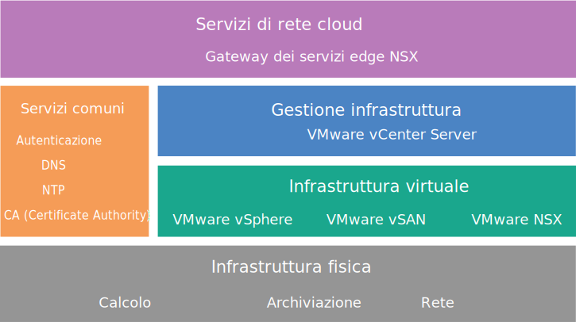

---

copyright:

  years:  2016, 2019

lastupdated: "2019-02-15"

---

{:tip: .tip}
{:note: .note}
{:important: .important}

# Progettazione del gateway dei servizi edge NSX
{: #nsx_design}

La soluzione Gateway dei servizi edge NSX su {{site.data.keyword.cloud}} fornisce la tecnologia VMware che viene distribuita all'interno dei {{site.data.keyword.CloudDataCents_notm}} in tutto il mondo. {{site.data.keyword.vmwaresolutions_short}} fornisce due architetture della soluzione correlate al gateway dei servizi edge NSX.

## Progettazione dell'architettura interna
{: #nsx_design-internal-archi}

L'architettura interna specifica la distribuzione dei componenti Edge NSX necessari in un pool di risorse all'interno di un cluster convergente di VMware Cloud Foundation o di un cluster VMware vCenter Server.

VMware vSAN è facoltativo nella seguente figura.
{:note}

Figura 1. Servizi di rete cloud su {{site.data.keyword.cloud_notm}}

## Progettazione dell'architettura dedicata
{: #nsx_design-dedicated-archi}

L'architettura dedicata distribuisce i componenti Edge NSX necessari in un cluster vSphere a due nodi separato dedicato all'uso dell'Edge NSX e fornisce un'interazione critica con l'infrastruttura della rete fisica. L'architettura dedicata presenta le seguenti caratteristiche e funzioni:

* Fornisce connettività on-ramp e off-ramp alle reti fisiche. Ad esempio, istradamento L3 nord-sud sui dispositivi virtuali edge NSX.
* Consente la comunicazione con i dispositivi fisici connessi alle VLAN nelle reti fisiche tramite il bridging L2 NSX e ospita la macchina virtuale (VM) di controllo per l'instradamento del DLR (Distributed Logical Router).
* Può avere servizi logici o fisici centralizzati. Ad esempio, un firewall, programmi di bilanciamento del carico, componenti di monitoraggio della VPN (Virtual Private Network) e VM di analisi dei log.
* I controller NSX possono essere ospitati in un cluster Edge quando viene utilizzato un vCenter dedicato per gestire le risorse edge e di calcolo.
* Le risorse del cluster Edge hanno un requisito di anti-affinità per proteggere la configurazione di standby attiva o per mantenere la disponibilità della larghezza di banda durante un errore.

## Intervalli di indirizzi IP di IBM Cloud Private e intervalli di indirizzi BYOIP (Bring Your Own IP)
{: #nsx_design-ip-addr-ranges}

L'intervallo di indirizzi IP privati RFC1918 riserva specificamente l'utilizzo di intervalli di rete per l'uso interno dell'organizzazione, mai per Internet. L'infrastruttura della rete fisica di {{site.data.keyword.cloud_notm}} utilizza uno specifico spazio di indirizzi privati RFC1918, 10.x.x.x/8, in tutte le sedi mondiali. Questi intervalli di indirizzi IP non si sovrappongono agli account dei clienti o all'interno di un account cliente {{site.data.keyword.cloud_notm}}. All'interno di un account cliente, qualsiasi spazio di indirizzi IP privati assegnato da {{site.data.keyword.cloud_notm}} può, con VLAN Spanning abilitato, indirizzare a qualsiasi altro intervallo di indirizzi IP privati {{site.data.keyword.cloud_notm}} in qualsiasi {{site.data.keyword.CloudDataCents_notm}}.

Anche se questo semplifica la configurazione di un'infrastruttura connessa a livello mondiale all'interno del tuo account, lo spazio di indirizzi IP fisso può essere problematico se vuoi estendere il tuo data center in {{site.data.keyword.cloud_notm}} attraverso l'instradamento quando stai utilizzando lo stesso spazio di indirizzi privati di {{site.data.keyword.cloud_notm}}. La soluzione consiste nell'utilizzare NSX per creare una topologia di sovrapposizione sull'infrastruttura Cloud Foundation o vCenter Server, isolando il tuo spazio di indirizzi BYOIP (Bring Your Own IP) dall'interazione con lo spazio di indirizzi IP privati assegnato da {{site.data.keyword.cloud_notm}}. NSX può fornire una VPN L2 per estendere lo spazio di indirizzi BYOIP interno nel tunnel attraverso spazi di indirizzi IP esterni e che magari si sovrappongono.

## Link correlati
{: #nsx_design-related}

* [Panoramica della soluzione](/docs/services/vmwaresolutions/archiref/solution?topic=vmware-solutions-solution_overview)
