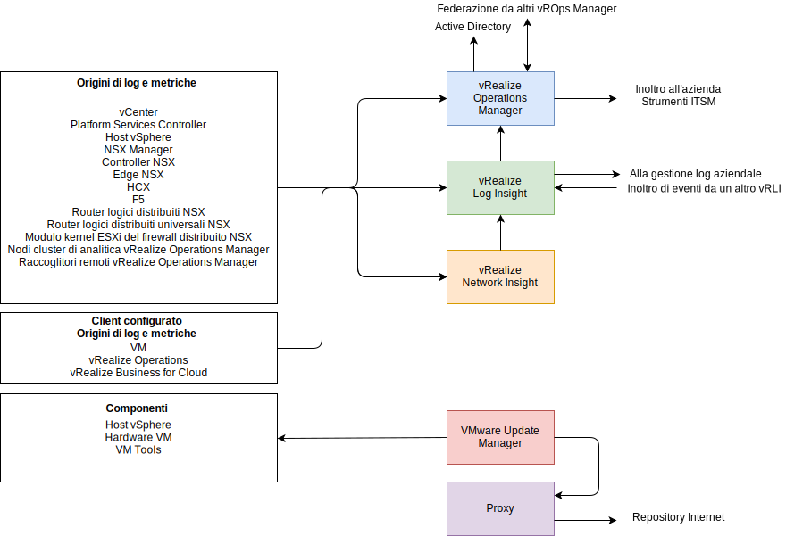

---

copyright:

  years:  2016, 2019

lastupdated: "2019-06-03"

---

# Panoramica dell'architettura di gestione delle operazioni
{: #opsmgmt-arch}
L'architettura dei prodotti nel livello di gestione delle operazioni fornisce il monitoraggio centralizzato con i dati di registrazione provenienti da {{site.data.keyword.vmwaresolutions_full}}. Il livello di gestione delle operazioni monitora in tempo reale l'infrastruttura fisica, l'infrastruttura virtuale e, facoltativamente, i carichi di lavoro di calcolo del client.

A un alto livello, vengono raccolte le seguenti informazioni:
* Dati di topologia, come oggetti di calcolo fisici, virtuali, di rete e di archiviazione.
* Dati di monitoraggio, come:
  * Metriche - dati strutturati, come prestazioni e capacità
  * Log - dati non strutturati, come eventi di sistema

## Flussi di gestione delle operazioni
{: #opsmgmt-arch-flows}

Il seguente diagramma mostra l'interazione e l'integrazione chiave degli strumenti di gestione delle operazioni.

La gestione delle operazioni di {{site.data.keyword.vmwaresolutions_short}} comprende i seguenti passi:
* Monitoraggio - vROps (vRealize Operations Manager) traccia e analizza il funzionamento di più oggetti nell'architettura di {{site.data.keyword.vmwaresolutions_short}} utilizzando algoritmi analitici. Questi algoritmi consentono a vROps di conoscere e prevedere il comportamento di questi oggetti. Gli amministratori di sistema accedono a queste informazioni utilizzando le viste, i report e i dashboard.

  Quando si verifica un problema nell'ambiente, vROps genera avvisi di tre tipi di impatto:
    * Avvisi di integrità - indicano problemi che influiscono sull'integrità dell'ambiente e richiedono attenzione immediata.
    * Avvisi di rischio - indicano problemi che non rappresentano minacce immediate ma che devono essere risolti presto.
    * Avvisi di efficienza - informazioni per migliorare le prestazioni o recuperare le risorse.

  Gli avvisi vROps sono eventi che si verificano sugli oggetti monitorati quando l'analisi dei dati indica deviazioni dai normali valori di metrica o quando si verifica un problema con uno dei componenti monitorati. Gli avvisi vROps vengono assegnati a una di queste categorie:
    * Critico - è necessario intervenire immediatamente.
    * Immediato - è necessario intervenire il più presto possibile.
    * Avvertenza - è necessario controllare quando il tempo lo consente.

* Registrazione - vRLI (vRealize Log Insight) fornisce la gestione e l'analisi dei log in tempo reale con il raggruppamento intelligente basato sul machine learning, la ricerca ad alte prestazioni e la risoluzione dei problemi tra gli oggetti fisici e virtuali nell'architettura {{site.data.keyword.vmwaresolutions_short}}. vRLI raccoglie i dati dagli host vSphere utilizzando il protocollo `syslog` . Raccoglie anche eventi, attività e dati di allarme per altri prodotti VMware, come il vCenter Server. Si integra con vRops per inviare eventi di notifica e abilitare l'avvio nel contesto. Altri oggetti nell'architettura di {{site.data.keyword.vmwaresolutions_short}} che possono inviare dati `syslog` vengono puntati a vRLI. Facoltativamente, il cliente può configurare qualsiasi sistema in grado di inviare dati syslog per inoltrare questi dati a vRLI.

* Integrità di rete - vRealize Network Insight è uno strumento di analisi focalizzato sull'abilitazione proattiva delle seguenti capacità:
  * Monitoraggio dell'integrità e delle prestazioni della rete.
  * Risoluzione dei problemi end-to-end.
  * Visibilità e analisi a 360°.
  * Gestione della conformità basata sulla micro-segmentazione.

* Applicazione di patch e upgrade - VUM (vSphere Update Manager) fornisce la gestione centralizzata e automatizzata delle patch e delle versioni per gli host VMware vSphere e le macchine virtuali (VM) (non per sistemi operativi e applicazioni).

## Rete di gestione delle operazioni
{: #opsmgmt-arch-network}

Il seguente diagramma mostra la panoramica della rete.

* Viene eseguito il provisioning di una sottorete privata portatile di strumenti per fornire lo spazio di indirizzi IP di {{site.data.keyword.cloud_notm}} utilizzato per il provisioning iniziale delle VM di strumenti. Dopo il provisioning, diventa responsabilità del cliente gestire lo spazio di indirizzi IP per il ridimensionamento incrementale degli strumenti. Le VM su questa sottorete richiedono l'accesso ai componenti ospitati nelle sottoreti di gestione e gestione interna.
* La sottorete VXLAN di strumenti viene utilizzata per fornire lo spazio di indirizzi IP BYOIP utilizzato per il provisioning iniziale delle VM di strumenti, ma poi diventa responsabilità del cliente gestire lo spazio di indirizzi IP per il ridimensionamento degli strumenti. Le VM su questa sottorete richiedono l'accesso ai componenti ospitati nelle sottoreti di sovrapposizione. L'ESG fornisce la NAT tra gli spazi di indirizzi di {{site.data.keyword.cloud_notm}} e BYOIP.
* I raccoglitori remoti vROps vengono distribuiti dal cliente se desidera sfruttare vROps per monitorare le proprie VM di calcolo.
* I forwarder vRLI ritrasmettono i messaggi di log dai componenti di sovrapposizione al cluster vRLI. Se necessario, il cliente può anche configurare le proprie VM di calcolo per utilizzare questi forwarder.
* VUM (VMware Update Manager) fornisce l'aggiornamento degli host vSphere e dell'hardware e degli strumenti VM. VUM utilizza il proxy per ottenere l'accesso ai repository Internet.

vROps raccoglie i dati dagli oggetti presenti nell'ambiente. Ogni parte dei dati raccolti è chiamata osservazione o valore di metrica. vROps utilizza l'adattatore vCenter per raccogliere le metriche non elaborate da vCenter. Oltre alle metriche che raccoglie, vROps calcola le metriche di capacità, le metriche dei badge e le metriche per monitorare l'integrità del tuo sistema. Le definizioni di avviso sono una combinazione di sintomi e suggerimenti che identificano le aree problematiche e generano avvisi sui quali intervieni per quelle aree.

## Componenti monitorati
{: #opsmgmt-arch-components}

### Monitoraggio di vCenter
{: #opsmgmt-arch-components-vcenter}

Il monitoraggio di vCenter viene eseguito con vROps e il VMware SDDC Health Management Pack. vRLI raccoglie i dati di log da vCenter e il pacchetto di contenuti per vSphere aggiunge una comprensione specifica ai log e, a sua volta, invia gli avvisi a vROPs.

Il VMware SDDC Health Management Pack monitora lo stack di gestione SDDC e fornisce badge per l'integrità e avvisi relativi alla configurazione e alla conformità dei componenti del prodotto SDDC, incluso vCenter.

### Monitoraggio degli host vSphere
{: #opsmgmt-arch-components-hosts}

Il monitoraggio degli host vSphere viene eseguito con vROps tramite vCenter e la raccolta dei log tramite vRLI.

### Monitoraggio di vSAN
{: #opsmgmt-arch-components-vsan}

Per monitorare vSAN, vengono utilizzati vROps e vRLI. In vCenter, è disponibile una serie supplementare di controlli dell'integrità vSAN che è possibile utilizzare. L'installazione del Management Pack per vSAN fornisce ulteriori dashboard per facilitare il monitoraggio di vSAN.

vROps genera un avviso se si verifica un problema nei componenti del prodotto SDDC nella SAN (Storage Area Network) monitorata dall'adattatore VMware vSAN. Un avviso relativo alla conformità della configurazione e all'integrità viene passato tramite il VMware SDDC Health Solution Management Pack da VMware vSAN Management Pack. vSAN viene monitorato con vROps vSAN Management Pack tramite il dispositivo vCentre utilizzando un adattatore vSAN. L'intervallo di raccolta predefinito è di cinque minuti e l'adattatore vSAN raccoglie anche le metriche del servizio di controllo dell'integrità e del servizio delle prestazioni dagli oggetti vSphere. L'intervallo del servizio di controllo dell'integrità è configurato nell'interfaccia vSphere ed è di 60 minuti per impostazione predefinita.

Per garantire che l'adattatore vSAN possa raccogliere tutti i dati sulle prestazioni, è necessario abilitare il servizio delle prestazioni vSAN in vSphere.

### Monitoraggio di NSX for vSphere
{: #opsmgmt-arch-components-nsxv}

Per monitorare NSX, vengono implementati i seguenti strumenti:
* vRealize Operations Manager (vROps)
* vRealize Log Insight (vRLI)
* vRealize Network Insight (vRNI)

Ciò consente agli amministratori di sistema di monitorare, gestire e risolvere i problemi di VMware NSX. Il vROps Management Pack per VMware NSX fornisce visibilità sulla topologia di rete. I dashboard NSX forniscono una rapida panoramica dell'ambiente NSX e dell'integrità dei suoi componenti. La correlazione tra gli oggetti NSX e gli oggetti vSphere consente una facile risoluzione dei problemi.

vROps utilizza il management pack per eseguire il polling di VMware NSX per recuperare i dati di configurazione, prestazioni e di supporto. Per conto di vROps, il Management Pack converte le richieste di polling in chiamate API REST per richiamare i dati richiesti da NSX Manager.

È necessario configurare i componenti NSX per inviare il syslog a vRLI.

* NSX Manager - [Specifica il server syslog](https://pubs.vmware.com/NSX-6/topic/com.vmware.nsx.admin.doc/GUID-EA70974C-07F8-469D-8A9D-0ED54F0C8F34.html#GUID-EA70974C-07F8-469D-8A9D-0ED54F0C8F34){:new_window}.
* Controller NSX - [Configura i controller NSX](https://kb.vmware.com/s/article/2092228){:new_window}.
* Edge NSX - [Configura i server syslog remoti](https://pubs.vmware.com/NSX-6/topic/com.vmware.nsx.admin.doc/GUID-9C25E097-E2CC-461A-9DA6-E8118D16EE62.html#GUID-9C25E097-E2CC-461A-9DA6-E8118D16EE62){:new_window}.
* Firewall - Devi configurare il server syslog remoto per ogni cluster in cui è abilitato il firewall. Il server syslog remoto è specificato nell'attributo `Syslog.global.logHost`.

Il monitoraggio del flusso NSX può essere utilizzato in NSX Manager per determinare quali flussi vengono approvati e quali vengono bloccati. Se necessario, è possibile configurare il mirroring delle porte per un vDS (vSphere Distributed Switch).

### Monitoraggio di NSX-T
{: #opsmgmt-arch-components-nsxt}

Per monitorare NSX-T, vengono implementati i seguenti strumenti:

* vRealize Operations Manager (vROps)
* vRealize Log Insight (vRLI)

VMware SDDC Health Management Pack monitora i seguenti componenti:
* Switch logici - Monitora lo stato di amministrazione degli switch logici.
* Cluster controller - Monitora il conteggio dei nodi cluster distribuiti per HA e mantiene il quorum.
* Nodi controller - Monitora la connettività del nodo con il cluster di controller e il nodo del gestore.
* Nodi edge - Monitora lo stato di esecuzione del nodo edge e la sua connettività con il cluster di controller e i nodi del gestore.
* Servizi di gestione NSX-T.
* Servizio router T0 - Monitora la rotta statica, NAT, BGP, BFD e i servizi di ridistribuzione di rotte.
* Servizio router T1 - Monitora la rotta statica, NAT e i servizi di annuncio di rotte.

### Monitoraggio di vRealize Operations Manager
{: #opsmgmt-arch-components-vrops}

Il VMware SDDC Health Management Pack ha delle definizioni di avviso per i seguenti eventi:
* Il dimensionamento corrente dei nodi vRealize Operations Manager non è sufficiente per il carico specificato.
* La configurazione del nodo cluster non segue la direttiva di dimensionamento di vRealize Operations Manager.
* Il dimensionamento corrente del raccoglitore remoto non è sufficiente per il carico specificato.
* La configurazione del raccoglitore remoto non segue la direttiva di dimensionamento di vRealize Operations Manager.
* Il cluster vRealize Operations ha superato il numero consigliato di nodi analitici.

### Monitoraggio di vRealize Log Insight
{: #opsmgmt-arch-components-vrli}

vRLI supporta gli avvisi che attivano notifiche relative alla sua integrità e genera le notifiche quando si verifica un evento di sistema importante, ad esempio, quando lo spazio su disco è quasi esaurito e vRealize Log Insight deve iniziare a eliminare o archiviare vecchi file di log.

## Requisiti di sistema
{: #opsmgmt-arch-requirements}

La progettazione utilizza la seguente quantità e dimensione di dispositivi:

Tabella 1. Requisiti di sistema del riepilogo di strumenti operativi

||vROps|vRLI|vRNI|Proxy|
|---|---|---|---|---|---|
|Qtà VM|4|4|1+1|1|
|vCPU|8|8|4 + 8|4|
|GB di RAM|32|16|12 + 32|0.5|
|GB disco|254|1042|158 + 1000|80|

## Versioni software
{: #opsmgmt-arch-versions}

Tabella 2. Versioni software degli strumenti operativi

|Nome prodotto|Versione|
|---|---|
|VMware vRealize Operations Manager Advanced o superiore|7.0|
|vRealize Operations Management Pack for NSX for vSphere|3.5.2|
|vRealize Operations Management Pack for Storage Devices|7.0.0|
|vRealize Operations Management Pack for Site Recovery Manager|8.1.1|
|VMware vRealize Log Insight|4.7|
|vRealize Log Insight Content Pack for NSX for vSphere|3.8|

## Link correlati
{: #opsmgmt-arch-components-related}

* [Panoramica di vCenter Server on {{site.data.keyword.cloud_notm}} with Hybridity Bundle](/docs/services/vmwaresolutions/archiref/vcs?topic=vmware-solutions-vcs-hybridity-intro)
