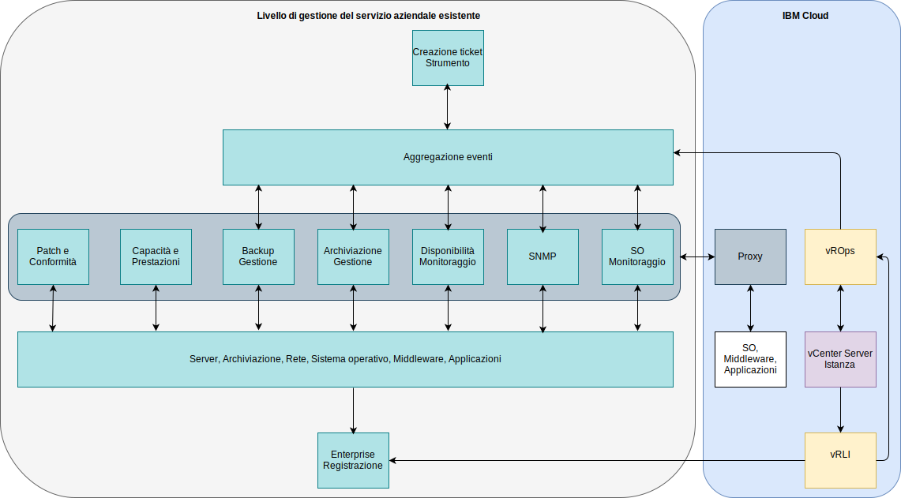

---

copyright:

  years:  2016, 2019

lastupdated: "2019-05-16"

---

# Integrazione
{: #opsmgmt-integration}

Questa documentazione è focalizzata sul livello di gestione operativa della progettazione, tuttavia, alcune aziende potrebbero voler integrare questo livello con il proprio livello di gestione del servizio. Questa sezione fornisce indicazioni su tale integrazione. In questa progettazione, vROps è il punto centrale in cui vengono segnalati tutti gli avvisi.

Sono possibili le seguenti categorie di integrazione:
* Direzione nord – Integrazione da vROps ad altri strumenti:
  * Notifica di avvisi al server SMTP o a strumenti come Slack o PagerDuty.
  * Integrazione dei ticket in uno strumento di service desk come ServiceNow.
  * Avvio dei flussi di lavoro di vRealize Orchestrator per risolvere un problema rilevato da vROps.
* Direzione sud – Integrazione dagli strumenti di gestione del servizio o di gestione cloud:
  * vRealize Automation configura il monitoraggio quando viene aggiunto un nuovo carico di lavoro.
  * Aggiorna gli oggetti vROps con l'arricchimento di eventi da origini esterne.

vROps fornisce i seguenti plugin di avviso in uscita:
* Azione automatizzata – abilitata per impostazione predefinita.
* Email standard - utilizza il protocollo SMTP (Simple Mail Transfer Protocol) per inviare notifiche di avviso di vRealize Operations Manager alle persone interessate.
* Trap SNMP – registra gli avvisi sul tuo server Trap SNMP.
* Notifica REST - invia avvisi vROps a un'altra applicazione abilitata a REST in cui hai creato un servizio web REST per accettare questi messaggi.
* File di log – consente a vROps di registrare gli avvisi in un file su ciascuno dei tuoi nodi vRealize Operations Manager. Se hai installato vRealize Operations Manager come cluster a più nodi, ogni nodo elabora e registra gli avvisi per gli oggetti che monitora. Ogni nodo registra gli avvisi per gli oggetti che elabora.
* Notifica Smarts SAM - invia notifiche di avviso a EMC Smarts Server Assurance Manager.
* Condivisione di rete - invia report a un'ubicazione condivisa, supporta SMB versione 2.0.

Le notifiche sono notifiche di avviso che soddisfano i criteri di filtro nelle regole di notifica prima di essere inviate in direzione nord verso i sistemi esterni. Le regole di notifica vengono configurate per gli avvisi in uscita richiesti in modo che possano essere filtrati prima di essere inviati al sistema esterno selezionato. L'elenco di notifiche viene utilizzato per gestire queste regole.

## Casi di utilizzo dell'integrazione
{: #opsmgmt-integration-usecase}

Questo caso di utilizzo di esempio si basa su un livello di gestione del servizio generico esistente utilizzato da un'azienda. Il cliente ha eseguito il provisioning di un'istanza vCenter Server con l'opzione Operations Management e desidera integrare questa piattaforma nella propria piattaforma di gestione del servizio. Utilizzano un sistema di aggregazione di eventi per integrare gli avvisi generati dagli strumenti di monitoraggio specifici per il dominio:

* Una serie di strumenti per monitorare il sistema operativo, il middleware e le applicazioni nei propri carichi di lavoro Unix, Linux e Windows, ma questo strumento non monitora i componenti dell'infrastruttura come VMware, dispositivi di rete o archiviazione.
* Un gestore SNMP per ricevere trap SNMP dalla propria infrastruttura di rete. Questo strumento raccoglie anche le metriche SNMP per abilitare avvisi relativi a prestazioni e capacità.
* Uno strumento di gestione dei backup per gestire i propri backup.
* Strumenti di gestione dell'archiviazione per gestire i propri array di archiviazione.
* Uno strumento di disponibilità che utilizza il ping per testare la raggiungibilità dei dispositivi.

Il loro livello di gestione del servizio è composto anche da:

* Uno strumento di capacità e prestazioni del server per raccogliere le metriche con le quali fornire i report.
* Un server di patch e conformità per aggiornare sistema operativo, middleware e applicazioni e misurare la conformità su queste piattaforme.
* Uno strumento di creazione ticket utilizzato per gestire i ticket relativi a incidenti, problemi e modifiche. Questo strumento è anche il database di gestione della configurazione (CMDB) dell'azienda. Lo strumento è in grado di inviare e-mail ai team delle operazioni così come i messaggi SMS.
* Un sistema di registrazione aziendale che cattura i log da tutti i sistemi ed è gestito dal team di sicurezza.

Ora che hanno vROps, integreranno questo strumento utilizzando la notifica in direzione nord con il plugin Trap SNMP. Per integrare vROps, i trap inviati da vROps devono essere analizzati in modo che l'ambiente di gestione eventi del cliente possa creare avvisi e arricchirli. Il team dello strumento di gestione ha scaricato i MIB VMware da VMware e li ha installati nel proprio ambiente di gestione eventi.

vRLI è configurato per inoltrare tutti gli eventi al sistema di registrazione aziendale in conformità con le politiche del cliente.

Il cliente desidera utilizzare i propri strumenti di monitoraggio di sistema operativo, middleware e applicazione esistenti per cui ha utilizzato i proxy in {{site.data.keyword.cloud}} per raccogliere e inoltrare le metriche e gli avvisi.

## Link correlati
{: #opsmgmt-integration-related}

* [Panoramica di vCenter Server on {{site.data.keyword.cloud_notm}} with Hybridity Bundle](/docs/services/vmwaresolutions/archiref/vcs?topic=vmware-solutions-vcs-hybridity-intro)
* [API RESTful di vRealize Operations](https://docs.vmware.com/en/vRealize-Operations-Manager/7.0/vrealize-operations-manager-70-api-guide.pdf){:new_window}
* [VMware Code API Explorer](https://code.vmware.com/apis?socv=1&numPerPage=164&sorter=pv){:new_window}
* [Postman Client Collection Tool for vRealize Operations](https://code.vmware.com/samples/4663/postman-client-collection-for-vrealize-operations-rest-apis){:new_window}
* [Blog VMware PowerCLI](https://blogs.vmware.com/PowerCLI/2016/05/getting-started-with-powercli-for-vrealize-operations-vr-ops.html){:new_window}
* [Webhook Shims](https://blogs.vmware.com/management/2017/01/vrealize-webhooks-infinite-integrations.html){:new_window}
