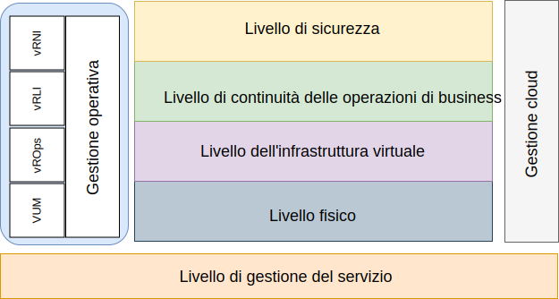

---

copyright:

  years:  2016, 2019

lastupdated: "2019-05-29"

---

# Introduzione
{: #opsmgmt-intro}

Questa architettura di riferimento intende guidare e vincolare le istanziazioni delle architetture {{site.data.keyword.vmwaresolutions_full}}.

Inoltre:
* Fornisce un linguaggio comune per le varie parti interessate.
* Fornisce coerenza nell'implementazione della tecnologia per risolvere i problemi.
* Supporta la convalida delle soluzioni rispetto all'architettura di riferimento comprovata.
* Incoraggia l'aderenza a standard, specifiche e modelli comuni.

 L'obiettivo principale di questa architettura di riferimento è documentare la capacità di Operations Management per fornire monitoraggio e avvisi dell'ambiente {{site.data.keyword.vmwaresolutions_short}} che viene distribuito per il cliente. Gli strumenti sono stati configurati con i parametri e le soglie di procedure consigliate per l'utilizzo da parte del team delle operazioni del cliente.

La progettazione consente al cliente di completare le seguenti attività:
* Eseguire un ridimensionamento incrementale o decrementale secondo necessità.
* Installare i propri strumenti di monitoraggio aziendale come richiesto dalle loro politiche operative.
* Integrare gli strumenti nella propria piattaforma ITSM (IT Service Management) aziendale.

## Gestione delle operazioni
{: #opsmgmt-intro-opsmgmt}

{{site.data.keyword.vmwaresolutions_short}} si basa sui seguenti livelli architetturali:

* Livello fisico - Il livello più basso dell'architettura è il livello fisico, costituito dai componenti di calcolo, rete e archiviazione utilizzati da {{site.data.keyword.cloud_notm}}:
  * {{site.data.keyword.baremetal_short}} che eseguono i carichi di lavoro di gestione, edge e calcolo.
  * Rete {{site.data.keyword.cloud_notm}} costituita da VLAN, sottoreti e FCR/BCR (Frontend e Backend Customer Router).
  * Archiviazione vSAN, che è un archivio dati consolidato dagli SSD nei {{site.data.keyword.baremetal_short}} o nell'archiviazione Endurance.

* Livello dell'infrastruttura virtuale - Il livello dell'infrastruttura virtuale viene eseguito sui componenti del livello fisico. Il livello dell'infrastruttura virtuale controlla l'accesso all'infrastruttura fisica sottostante e controlla e assegna le risorse ai carichi di lavoro di gestione e di calcolo. I carichi di lavoro di gestione sono costituiti dagli elementi presenti nel livello stesso dell'infrastruttura virtuale, insieme agli elementi nei livelli di gestione cloud, gestione del servizio, continuità delle operazioni di business e sicurezza.

* Livello di continuità delle operazioni di business – Questo livello contiene elementi per supportare la continuità delle operazioni di business fornendo backup dei dati, ripristino e ripristino di emergenza. Per ulteriori informazioni, vedi l'architettura di backup e ripristino {{site.data.keyword.vmwaresolutions_short}} e le architetture di riferimento Veeam, IBM Spectrum Protect Plus e ripristino di emergenza Zerto.

* Livello di sicurezza – Questo livello contiene gli elementi per ridurre il rischio e aumentare la conformità. Per ulteriori informazioni, vedi le architetture di riferimento Fortinet, F5, NSX, HyTrust e Caveonix.

Questo documento aggiunge il seguente livello all'architettura di {{site.data.keyword.vmwaresolutions_short}}:

* Livello di gestione delle operazioni - L'architettura del livello di gestione delle operazioni include componenti di gestione che forniscono supporto per i livelli fisici e virtuali e, facoltativamente, i carichi di lavoro di calcolo in tempo reale. Il livello di gestione delle operazioni comprende la topologia di {{site.data.keyword.vmwaresolutions_short}}: risorse fisiche, virtuali, di calcolo, di rete e di archiviazione. Il livello di gestione delle operazioni è costituito principalmente da funzioni di monitoraggio e registrazione.

  Le informazioni sono raccolte nelle seguenti forme:
    * Metriche - dati strutturati, come prestazioni e capacità
    * Log - dati non strutturati, come eventi di sistema

Il livello di gestione delle operazioni è costituito dai seguenti strumenti:

* vRealize Operations Manager (vROps) - vROps utilizza i dati raccolti dalle risorse di sistema (oggetti) per identificare i problemi nei componenti di sistema monitorati e, per molti problemi, suggerisce le azioni correttive da intraprendere. Per problemi più impegnativi, vROps offre strumenti analitici avanzati per rivelare problemi nascosti, analizzare problemi tecnici complessi, identificare tendenze o eseguire il drill-down per valutare l'integrità di un singolo oggetto.
* vRealize Log Insight (vRLI) - vRLI fornisce una gestione intelligente dei log per infrastrutture e applicazioni in qualsiasi ambiente. Questa soluzione di gestione dei log altamente scalabile offre dashboard intuitivi e utilizzabili, analisi sofisticate e un'ampia estensibilità di terze parti in ambienti fisici, virtuali e cloud.
* vRealize Network Insight (vRNI) - vRNI offre operazioni intelligenti per la SDN (software-defined networking) e la sicurezza. Consente la visibilità su reti virtuali e fisiche, fornisce viste operative per gestire e ridimensionare le distribuzioni NSX e accelera la pianificazione e la distribuzione della micro-segmentazione.
* VMware Update Manager (VUM) - VUM consente la gestione centralizzata e automatizzata delle patch e delle versioni per VMware vSphere e offre l'upgrade e l'applicazione di patch degli host vSphere, l'installazione e aggiornamento di software di terze parti sugli host e l'upgrade dell'hardware delle VM, dei VMware Tools e dei dispositivi virtuali.

Per un'architettura aziendale completa, potrebbero essere richiesti i seguenti livelli, ma sono esterni all'architettura di {{site.data.keyword.vmwaresolutions_short}}:

* Livello di gestione cloud - Il livello di gestione cloud è il livello superiore dell'architettura del cloud. Questo livello richiede delle risorse e orchestra i livelli inferiori da un'interfaccia utente o da un'API (Application Programming Interface). vRealize Automation abilita l'automazione del cloud su {{site.data.keyword.cloud_notm}}. Per ulteriori informazioni, vedi [Architettura di riferimento vRealize Automation (vRA)](https://www.ibm.com/cloud/garage/files/IBM_Cloud_for_VMware_Solutions_VRA_Architecture_v1.pdf){:new_window}.

Per ulteriori informazioni su come poter estendere questa architettura con l'integrazione di Chef, vedi [Architettura di riferimento per l'integrazione di vRA con Chef](https://www.ibm.com/cloud/garage/files/IBM_Cloud_for_VMware_Solutions_VRA_Chef_Integration_Architecture.pdf){:new_window}.

* Livello di gestione del servizio – Questo livello si concentra sull'intero ciclo di vita dell'ambiente IT e viene generalmente implementato a livello aziendale combinando gli input provenienti da tutti i silos delle operazioni e delle tecnologie IT. Questo livello è stato tradizionalmente architettato su framework ITSM (IT Service Management), quali ITIL (IT Infrastructure Library) e ISO/IEC 20000, che sono un framework delle procedure ottimali per la fornitura dei servizi IT attraverso i processi e le fasi del ciclo di vita del servizio IT. A livello di prodotto, ITSM è caratterizzato da un sistema di gestione del flusso di lavoro centralizzato per gestire incidenti, richieste di servizio, problemi, modifiche e conoscenze connesso a un database di gestione della configurazione.

## Link correlati
{: #opsmgmt-intro-related}

* [Panoramica di vCenter Server on {{site.data.keyword.cloud_notm}} with Hybridity Bundle](/docs/services/vmwaresolutions/archiref/vcs?topic=vmware-solutions-vcs-hybridity-intro)
