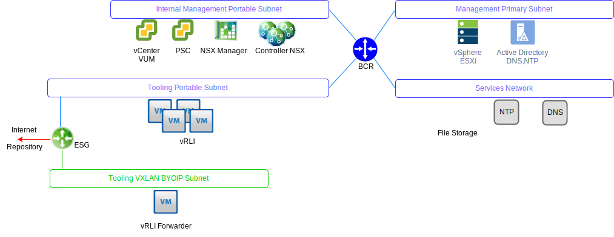
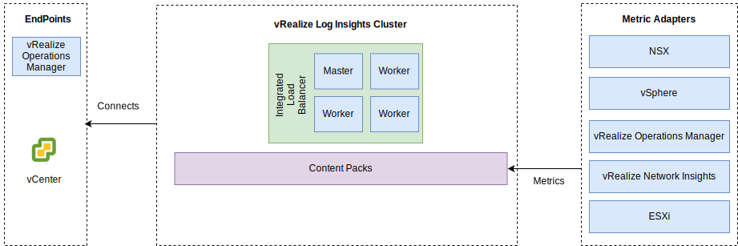

---

copyright:

  years:  2016, 2019

lastupdated: "2019-08-05"

---

# vRealize Log Insights
{: #opsmgmt-vrli}

L'ambiente vRealize Log Insight (vRLI) è costituito da quattro macchine virtuali (VM) con un programma di bilanciamento del carico integrato.

Questo modello supporta:
* 30.000 VM
* Inserimento di 75 Gb di log al giorno
* 5.000 eventi al secondo

vRealize Log Insight (vRLI) abilita la registrazione in tempo reale per i componenti presenti nell'ambiente {{site.data.keyword.vmwaresolutions_full}}. La progettazione distribuisce un cluster vRLI costituito da quattro nodi in ogni istanza. Questa configurazione fornisce una disponibilità continua e un aumento delle frequenze di inserimento dei log.

In questa progettazione, ogni ubicazione ha un cluster vRLI indipendente distribuito nel cluster di gestione. Il cluster vRLI viene distribuito nella sottorete degli strumenti utilizzando gli indirizzi IP portatili di {{site.data.keyword.cloud_notm}}. Ciò facilita la comunicazione verso tutti i componenti che vengono indirizzati al di fuori dello spazio di indirizzi RFC1918 di {{site.data.keyword.cloud_notm}}. I componenti includono: host vSphere, vCenter, PSC (Platform Services Controller), NSX Manager e controller NSX. Un cluster vRLI contiene un nodo master e almeno due nodi di lavoro con un programma di bilanciamento del carico integrato.

* Nodo master - Nodo iniziale richiesto nel cluster. Il nodo master è responsabile delle query e dell'inserimento dei log. L'IU web del nodo master è l'unico pannello di controllo per tale cluster di vRealize Log Insight. Tutte le query eseguite sui dati vengono indirizzate al master che, a sua volta, distribuisce il carico di lavoro ai nodi di lavoro.
* Nodo di lavoro - Sono necessari almeno tre nodi per formare un cluster con la possibilità di aggiungere più nodi di lavoro per il ridimensionamento incrementale. Un nodo di lavoro acquisisce i log e li archivia localmente.
* Programma di bilanciamento del carico integrato - Fornisce l'alta disponibilità utilizzando la configurazione di bilanciamento del carico proprietaria (non è richiesto alcun programma di bilanciamento del carico esterno).
* Forwarder Log Insight – Viene distribuito per ricevere i log dai componenti di sovrapposizione NSX. Inoltre, può essere utilizzato da un cliente se desidera inviare i log dalle VM di calcolo. Il Forwarder Log Insight è un singolo nodo master di vRealize Log Insight che viene utilizzato come aggregatore di syslog remoto per inoltrare gli avvisi al cluster vRLI. Poiché gli indirizzi supportati da VXLAN sono al di fuori dello spazio di indirizzi BYOIP, è necessario implementare delle regole NAT sull'ESG NSX.

Sono disponibili le seguenti dimensioni e viene selezionata quella appropriata:
* Small – 2.000 eventi al secondo
* Medium - 5.000 eventi al secondo
* Large - 15.000 eventi al secondo

vRLI raccoglie i log per fornire informazioni di monitoraggio sull'ambiente da un'ubicazione centrale.

vRLI raccoglie gli eventi di log dai seguenti componenti di infrastruttura virtuale e di gestione cloud (client di registrazione):
* vCenter
* Host ESXi
* NSX Manager
* Controller NSX
* Gateway dei servizi edge NSX
* Istanze del router logico distribuito NSX
* Router logici distribuiti universali NSX
* Modulo kernel ESXi del firewall distribuito NSX
* Nodi cluster di analitica e raccoglitori remoti di vRealize Operations Manager
* Istanza vRLI nelle altre istanze come risultato dell'inoltro di eventi

I seguenti client di registrazione sono supportati ma non integrati in questa progettazione:
* Realize Automation Appliance
* vRealize Orchestrator (incorporato in vRealize Automation Appliance)
* Server web IaaS vRealize
* Server di gestione IaaS vRealize
* DEM IaaS vRealize
* Agent proxy IaaS vRealize
* Server di business vRealize
* Raccoglitore dati di business vRealize

## Requisiti di sistema
{: #opsmgmt-vrli-requirements}

Per includere tutti i dati di log provenienti dalle origini log nell'ambiente, è necessario dimensionare correttamente i nodi vRLI. Questa progettazione si basa sul dispositivo di medie dimensioni:

Tabella 1. Impostazioni di sistema dei nodi master e di replica Log Insight

| Attributo                | Specifica                     |
| ------------------------ | --------------------------------- |
| vCPU                     | 8                                 |
| Memoria                   | 18 GB                             |
| Disco (con thick provisioning) | 530 GB (490 GB per l'archiviazione eventi) |

Ogni dispositivo virtuale vRLI ha tre dischi virtuali predefiniti e può utilizzare più dischi virtuali per l'archiviazione.
* Disco rigido 1 - 20 GB per il file system root
* Disco rigido 2 - 510 GB per la distribuzione di medie dimensioni e contiene due partizioni:
  * /storage/var - per i log di sistema
  * /storage/core storage - per i log raccolti (circa 475 GB di spazio disponibile su disco)

## Rete
{: #opsmgmt-vrli-network}

La distribuzione del dispositivo vRLI richiede tre indirizzi IP dalla sottorete portatile privata degli strumenti. vRLI richiede l'accesso a:
* Dispositivo vCenter
* Dispositivo vRealize Log Insight
* Dispositivi NSX-V/T
* XLAN di espansione degli strumenti
* Reti del cliente
* Server NTP (`time.services.softlayer.com`)
* {{site.data.keyword.vmwaresolutions_short}} Active Directory/DNS
* I raccoglitori remoti richiedono regole NAT sull'ESG NSX per abilitare la connettività al nodo master, alla replica del nodo master e ai nodi di dati

## Porte
{: #opsmgmt-vrli-ports}

Tabella 2. Porte di Log Insight

| Descrizione                                                   | Porta       | Protocollo |
| ------------------------------------------------------------- | ---------- | -------- |
| Traffico syslog in uscita configurato come destinazione forwarder | 514        | TCP, UDP |
| Dati syslog su SSL                                          | 1514, 6514 | TCP      |
| API di inserimento Log Insight                                     | 9000       | TCP      |
| API di inserimento Log Insight su SSL                            | 9543       | TCP      |
| Accesso SSH al dispositivo                                       | 22         | TCP      |
| Interfaccia utente                                                | 80, 443    | TCP      |
| NTP                                                           | 123        | UDP      |
| SMTP                                                          | 25         | TCP      |
| DNS                                                           | 53         | UDP      |
| LDAP/LDAPS                                                    | 389, 636   | TCP      |
| LDAP GC                                                       | 3268/3269  | TCP      |
| vCenter                                                       | 443        | TCP      |
| Dispositivo vRealize Operations Manager                         | 443        | TCP      |

## Autenticazione
{: #opsmgmt-vrli-auth}

La gestione utenti per vRLI richiede vIDM (VMware Identity Manager), che si integra con Active Directory. Gli account di servizio vengono utilizzati per la comunicazione tra applicazioni da vRealize Operations Manager ai seguenti adattatori con la serie minima di autorizzazioni richieste per la raccolta di metriche e la mappatura della topologia.
* NSX Manager
* vCenter
* vSAN

## Pacchetti di contenuti in vRealize Log Insight
{: #opsmgmt-vrli-content}

I pacchetti di contenuti forniscono un monitoraggio più granulare sull'infrastruttura virtuale e consentono di richiamare, estrarre e analizzare i log in un formato leggibile. In questo modo, vRLI salva query di log e avvisi e puoi utilizzare i dashboard per un monitoraggio efficiente.

I seguenti componenti sono installati per impostazione predefinita:
* Generale
* VMware vSphere
* VMware vSAN
* VMware vROps

Questa progettazione installa anche:
* VMware NSX for vSphere
* vRealize Network Insight

Altri pacchetti di contenuti possono essere ottenuti da [vRealize Log Insight Content Pack](https://marketplace.vmware.com/vsx/?contentType=2&listingStyle=table){:new_window}.

## Link correlati
{: #opsmgmt-vrli-related}

* [Dimensionamento del dispositivo virtuale vRealize Log Insight](https://docs.vmware.com/en/vRealize-Log-Insight/4.6/com.vmware.log-insight.getting-started.doc/GUID-284FC5F4-B832-47A7-912E-D407A760CAE4.html){:new_window}
* [vRealize Log Insight](https://docs.vmware.com/en/vRealize-Log-Insight/index.html){:new_window}
