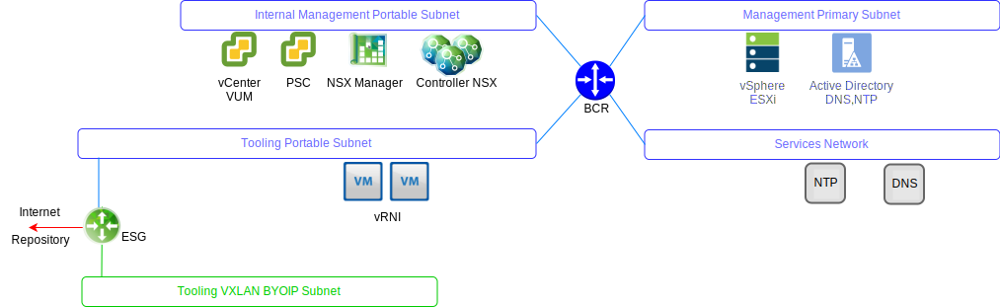
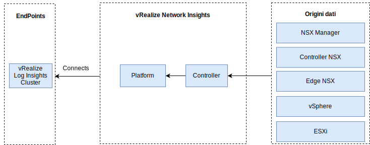

---

copyright:

  years:  2016, 2019

lastupdated: "2019-08-05"

---

# vRealize Network Insight
{: #opsmgmt-vrni}

L'ambiente vRealize Network Insight (vRNI) è costituito da due macchine virtuali (VM), una piattaforma (IU) e un nodo controller.

Il dispositivo della piattaforma vRNI fornisce l'analisi, l'interfaccia utente e la gestione dei dati e si connette al dispositivo controller che raccoglie dati dalle varie origini come edge NSX e vCenter. Tutti i componenti vRNI utilizzano gli indirizzi IP portatili privati di {{site.data.keyword.cloud}}. vRLI viene configurato come server syslog per vRNI.

## Requisiti di sistema
{: #opsmgmt-vrni-requirements}

Questa architettura supporta 3000 VM utilizzando una dimensione fisica media.

Tabella 1. Requisiti di sistema della piattaforma Network Insight

| Attributo | Specifica |
|---|---|
| vCPU | 8 |
| Memoria | 32 GB |
| Disco (con thin provisioning) | 1 TB |

Tabella 2. Requisiti di sistema del raccoglitore Network Insight

| Attributo | Specifica |
|---|---|
| vCPU | 4 |
| Memoria | 12 GB |
| Disco (con thin provisioning) | 200 GB |

## Rete
{: #opsmgmt-vrni-network}

La distribuzione del dispositivo vRNI richiede due indirizzi IP dalla sottorete portatile privata degli strumenti. La connettività di rete vRNI richiede l'accesso a:
* Dispositivo vCenter
* Dispositivo vRealize Log Insight
* Dispositivi NSX-V/T
* XLAN di espansione degli strumenti
* Reti del cliente
* Server NTP (`time.services.softlayer.com`)
* {{site.data.keyword.vmwaresolutions_short}} Active Directory/DNS

## Porte
{: #opsmgmt-vrni-ports}

Tabella 3. Porte di Network Insight

| Descrizione |Porta | Protocollo |
|---|---|---|
| Comunicazione tra le VM di vRealize Network Insight | 443 | HTTPS |
| Servizi che richiedono l'accesso a Internet svc.ni.vmware.com support2.ni.vmware.com reg.ni.vmware.com|443|HTTPS
| API di inserimento Log Insight | 9000 | TCP |
| API di inserimento Log Insight su SSL | 9543 | TCP |
| Interfaccia utente | 80,443 | TCP |
| NTP |123 | UDP |
| SMTP | 25 | TCP |
| DNS| 53 | UDP |
| LDAP/LDAPS | 389, 636 | TCP |
| ESXi | 2055 | TCP |
| VMware vSphere / NSX | 443 | TCP |

## Autenticazione
{: #opsmgmt-vrni-auth}

L'autenticazione utente vRNI avviene direttamente con un server Active Directory.

## Link correlati
{: #opsmgmt-vrni-links}

* [vRealize Network Insights](https://docs.vmware.com/en/VMware-vRealize-Network-Insight/index.html){:new_window}
