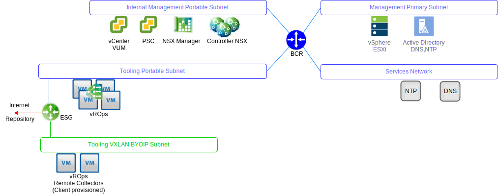
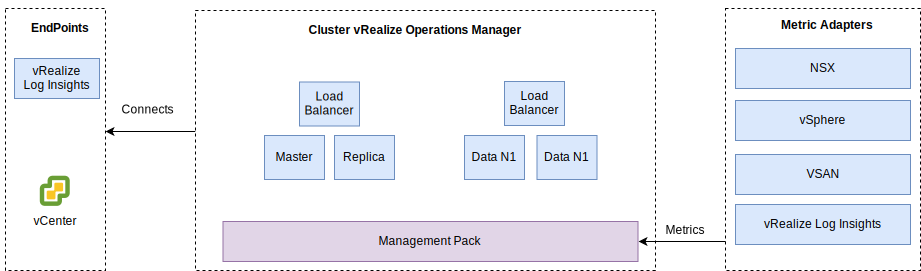

---

copyright:

  years:  2016, 2019

lastupdated: "2019-05-17"

---

# Progettazione di vRealize Operations Manager
{: #opsmgmt-vrops}

Il cluster di analitica vROps contiene i nodi che analizzano e archiviano i dati dei componenti monitorati e, in questa distribuzione, vengono distribuiti quattro nodi e due programmi di bilanciamento del carico NSX. Questa dimensione consente di monitorare fino a 30.000 VM e di raccogliere 9.000.000 di metriche.

Il cluster di analitica a 4 nodi comprende:
* Nodo master – Il nodo master è il nodo iniziale in un cluster vROps. In un ambiente di grandi dimensioni, questo nodo gestisce tutti gli altri nodi.
* Replica del nodo master – Questo nodo consente l'alta disponibilità del nodo master.
* Nodi di dati – Il nodo di dati consente il ridimensionamento incrementale di vROps in ambienti più grandi; in questa progettazione ne vengono distribuiti due.

Inoltre, la progettazione utilizza i nodi di raccoglitore remoto che fungono da server proxy/di inoltro per raccogliere solo i dati e inoltrare i dati raccolti ai nodi master/dati. I nodi di dati e i raccoglitori remoti possono essere aggiunti per l'ampliamento in base alla dimensione dell'ambiente. La collocazione dei componenti vROps sulle VLAN/VXLAN viene mostrata nel seguente diagramma.

* Il nodo master, la replica del nodo master e i nodi di dati vengono distribuiti sulla sottorete degli strumenti utilizzando gli indirizzi IP portatili di {{site.data.keyword.cloud_notm}} per facilitare la comunicazione verso tutti i componenti che vengono indirizzati al di fuori dello spazio di indirizzi RFC1918 di {{site.data.keyword.cloud_notm}}, tra cui gli host vSphere, vCenter, PSC (Platform Services Controller), NSX Manager e controller NSX. Viene utilizzato un programma di bilanciamento del carico NSX insieme a un VIP per l'alta disponibilità.
* Poiché i carichi di lavoro del cliente utilizzano l'indirizzamento IP dallo spazio di indirizzi BYOIP, questa progettazione utilizza i raccoglitori remoti ospitati in una VXLAN. Questi raccoglitori remoti non sono configurati come parte dell'automazione di {{site.data.keyword.vmwaresolutions_full}} e devono essere implementati manualmente dal cliente.

Il cluster di analitica vROps è accessibile utilizzando un'interfaccia utente di gestione o un'API e viene integrato nei seguenti componenti:
* vCenter
* vRealize Log Insight

Il cliente può integrarlo manualmente nei seguenti prodotti, se sono stati distribuiti:
* vRealize Automation
* vRealize Business

vROps raccoglie i dati da:
* vSphere - vCenter, PSC (Platform Services Controller), host vSphere
* NSX - NSX Manager, controller NSX ed edge NSX
* vRLI

Il cliente può configurare manualmente vROps per raccogliere i dati da vRealize Automation e da vRealize Business for Cloud.

## Requisiti di sistema
{: #opsmgmt-vrops-requirements}

Il cluster di analitica è costituito da un nodo master, un nodo replica del master e due nodi di dati per consentire il ridimensionamento incrementale e l'alta disponibilità. Ulteriori nodi di dati vengono aggiunti per l'ampliamento. Il cluster di analitica può ridimensionarsi fino a un massimo di 8 nodi di medie dimensioni.

Tabella 1. Impostazioni di sistema dei nodi master/replica di Operations Manager

| Attributo | Specifica |
|---|---|
| vCPU | 8 |
| Memoria | 32 GB |
| Disco (con thick provisioning) | 254 GB |

Tabella 2. Impostazioni di sistema del nodo di dati di Operations Manager

| Attributo | Specifica |
|---|---|
| vCPU | 8 |
| Memoria | 32 GB |
| Disco (con thick provisioning) | 254 GB |

Se è richiesto il monitoraggio delle VM di calcolo, il cliente deve installare due nodi di raccoglitore remoto su una VXLAN. La dimensione di un dispositivo virtuale di raccoglitore remoto standard è di 2 vCPU con 4 GB di RAM e la dimensione VMDK del dispositivo predefinita è sufficiente. I nodi di raccoglitore remoto vengono distribuiti con dischi con thin provisioning poiché i raccoglitori remoti non eseguono operazioni di analisi né archiviano i dati.

Tabella 3. Impostazioni del programma di bilanciamento del carico di Operations Manager

| Impostazione | Programma di bilanciamento del carico 1 | Programma di bilanciamento del carico 2|
|---|---|---|
| Nome | vrops-ui | vrops-data |
| Intervallo | 30 | 5 |
| Timeout | 5 | 15 |
| Numero massimo di tentativi | 3 | |
| Tipo | HTTPS | TCP |
| Metodo | Get | -- |
| URL | /suite-api/api/deployment/node/status | -- |
| Ricezione | ONLINE | -- |
| Algoritmo | ROUND-ROBIN | LEASTCONN |
| Pool | 4 nodi di vROPs | 4 nodi di vROPs |

Per ulteriori informazioni, vedi [vRealize Automation
Load Balancing (PDF)](https://docs.vmware.com/en/vRealize-Automation/7.5/vrealize-automation-load-balancing.pdf){:new_window}.

## Rete
{: #opsmgmt-vrops-network}

La distribuzione del dispositivo vROps richiede sei IP dalla sottorete portatile privata degli strumenti. La connettività di rete vROps richiede l'accesso a:
* Dispositivo vCenter
* Dispositivo vRealize Log Insight
* Dispositivi NSX-V/T
* XLAN di espansione degli strumenti
* Reti del cliente
* Server NTP (time.services.softlayer.com)
* {{site.data.keyword.vmwaresolutions_short}} Active Directory/DNS
* I raccoglitori remoti richiedono regole NAT sull'ESG NSX per abilitare la connettività al nodo master, alla replica del nodo master e ai nodi di dati

## Porte
{: #opsmgmt-vrops-ports}

Tabella 4. Porte di Operation Manager

| Componente | Protocollo | Porta |
|---|---|---|
| vCenter | TCP | 443 |
| DNS | TCP/UDP | 53 |
| LDAP/LDAPS | TCP | 389/636 |
| LDAP GC | TCP | 3268/3269 |
| NTP | UDP | 123 |
| SMTP | TCP | 25 |
| SNMP | UDP | 161 |

### Autenticazione
{: #opsmgmt-vrops-auth}

La gestione utenti per vROps richiede vIDM (VMware Identity Manager), che si integra con Active Directory. Gli account di servizio vengono utilizzati per la comunicazione tra applicazioni da vRealize Operations Manager ai seguenti adattatori con la serie minima di autorizzazioni richieste per la raccolta di metriche e la mappatura della topologia:

* NSX Manager
* vCenter
* vSAN

## Management Pack
{: #opsmgmt-vrops-management}

I Management Pack per vROps estendono le funzionalità di gestione operativa della piattaforma vROps per fornire avvisi e dashboard specifici per il prodotto.

I seguenti Management Pack sono installati in vROps per impostazione predefinita:
* Management Pack per VMware vCenter Server
* Management Pack per vRealize Log Insight
* Management Pack per vSAN
* Management Pack per vRealize Automation
* Management Pack per vRealize Business for Cloud

I seguenti componenti vengono installati da {{site.data.keyword.vmwaresolutions_short}}:
* VMware SDDC Health Management Pack
* Management Pack per NSX for vSphere
* vRealize Operations Federation Management Pack
* Management Pack per Hybrid Cloud Extension (HCX)

Gli altri management pack possono essere installati dal cliente. Per ulteriori informazioni, vedi [Management Packs at the VMware Exchange](https://marketplace.vmware.com/vsx/?contentType=1&listingStyle=table){:new_window}.

### Management Pack per VMware vCenter Server
{: #opsmgmt-vrops-management-vCenter}

Questo Management Pack predefinito estende la funzionalità di vROps a vCenter per abilitare la raccolta di oggetti, metriche e avvisi.

### Management Pack per vRealize Log Insight
{: #opsmgmt-vrops-management-vrli}

Questo Management Pack predefinito estende la funzionalità di vROps a vRLI per abilitare il monitoraggio dell'ambiente vRLI così come l'integrazione di eventi e avvisi da vRLI in vROps.

### Management Pack per vSAN
{: #opsmgmt-vrops-management-vsan}

vRealize Operations Management Pack per vSAN consente ai dashboard specifici vSAN di valutare, gestire e ottimizzare le prestazioni degli oggetti vSAN e degli oggetti abilitati a vSAN.

### VMware SDDC Health Management Pack
{: #opsmgmt-vrops-management-sddc}

Il VMware SDDC Health Management Pack per vROps monitora lo stack di gestione SDDC e fornisce metriche contraddistinte dal colore per l'integrità e l'efficienza dei diversi componenti presenti come parte dello stack di gestione SDDC. Con i dashboard di VMware SDDC Health Management Pack, puoi monitorare i seguenti componenti dell'istanza vCenter Server e degli strumenti di gestione:
* vRealize Operations Manager
* NSX per vSphere/VMware NSX-T
* VMware vSAN
* vRealize Log Insight
* vCenter Server

Inoltre, se il cliente li ha installati, è possibile monitorare i seguenti componenti:
* vRealize Automation
* vRealize Orchestrator
* vRealize Business for Cloud
* VMware Site Recovery Manager

Il VMware SDDC Health Management Pack fornisce i seguenti dashboard:
* Dashboard di panoramica dell'integrità di gestione SDDC - Puoi utilizzare il dashboard di panoramica dell'integrità di gestione SDDC per visualizzare e analizzare i problemi specifici dell'applicazione nei componenti SDDC.
* Dashboard di tendenza cronologica dell'integrità SDDC - Il VMware SDDC Health Management Pack è costituito dal dashboard di tendenza cronologica dell'integrità SDDC, che visualizza la tendenza dell'integrità per ogni componente nello stack SDDC.
* Dashboard di dimensionamento di vRealize Operations Manager SDDC - Il dashboard di dimensionamento di vRealize Operations Manager SDDC fornisce la capacità del cluster vRealize Operations Manager per elaborare oggetti e metriche.

I plugin di VMware SDDC Health Management Pack raccolgono le metriche per i tipi di oggetto contenuti nei plugin. Il Management Pack raccoglie le metriche di integrità per:
* vCenter Server
* Management Pack per NSX for vSphere
* vRealize Automation
* vRealize Operations Manager
* vRealize Business
* vRealize Log Insight
* VMware Site Recovery Manager
* vCenter HA
* vMware vSAN Health
* Servizi in vCenter Server Appliance
* Dimensionamento di vRealize Operations Manager
* vRealize Orchestrator

### Management Pack per NSX-T
{: #opsmgmt-vrops-management-nsxt}

Il Management Pack per NSX-T estende le funzionalità di analisi, correlazione, capacità predittiva e visualizzazione di base di vROps alle reti virtuali. Il pacchetto include quanto segue:
* Controllo di configurazione
* Integrità
* Prestazioni
* Capacità
* Risoluzione dei problemi per gli oggetti NSX-T

### Management Pack per NSX for vSphere
{: #opsmgmt-vrops-management-nsxv}

Il Management Pack per NSX for vSphere offre copertura per la gestione delle operazioni per le distribuzioni delle tecnologie di rete virtuale NSX di VMware. Questo Management Pack estende le funzionalità di analisi, correlazione, capacità predittiva e visualizzazione di base di vROps alle reti virtuali. La copertura include controllo di configurazione, integrità, prestazioni, capacità e risoluzione dei problemi per switch logici NSX, router logici, servizi edge, firewall distribuiti e programmi di bilanciamento del carico.

Il Management Pack per NSX for vSphere è strettamente integrato con vROps e i dati dell'host vSphere sono correlati con i servizi NSX in esecuzione su questi host. Con l'integrazione dei log tramite vRLI, le condizioni di errore e di interruzione, attivate tramite i messaggi di log, vengono segnalate all'interno dell'oggetto del management pack e nelle finestre dei problemi.

### vRealize Operations Federation Management Pack
{: #opsmgmt-vrops-management-federation}

vRealize Operations Federation Management Pack consente una distribuzione vROps multisito in un unico pannello di controllo. Consente una distribuzione di vROps con la capacità di ricevere le metriche chiave per gli oggetti specificati dalle distribuzioni vROps.

### Management Pack per Hybrid Cloud Extension (HCX)
{: #opsmgmt-vrops-management-hcx}

vRealize Operations Management Pack per HCX estende le capacità di Operations Management di vROps alle capacità ibride presentate da HCX. Con il Management Pack, puoi raccogliere metriche, eventi di modifica e informazioni sulla topologia delle risorse da HCX. Consente il monitoraggio, l'isolamento e la risoluzione dei colli di bottiglia delle prestazioni nelle interconnessioni HCX, nelle migrazioni o nei carichi di lavoro protetti.

## Link correlati
{: #opsmgmt-vrops-management-links}

* [Panoramica di vCenter Server on {{site.data.keyword.cloud_notm}} with Hybridity Bundle](/docs/services/vmwaresolutions/archiref/vcs?topic=vmware-solutions-vcs-hybridity-intro)
* [Linee guida sul dimensionamento di vRealize Operations Manager 7.0](https://kb.vmware.com/s/article/57903){:new_window}
* [Documentazione di vRealize Operations Manager](https://docs.vmware.com/en/vRealize-Operations-Manager/index.html){:new_window}
* [Management Pack per vSAN](https://marketplace.vmware.com/resources/vsx/product_files/31742/original/Management-Pack-for-vSAN-Guide6d2a8895b022a5f626a86e8e84b031b5.pdf){:new_window}
* [Istruzioni sull'aggiornamento del cluster vSAN](https://cloud.ibm.com/docs/services/vmwaresolutions/archiref/vum/vum-updating-vsan.html#updating-vsan-clusters){:new_window}
* [Management-Pack-for-vSAN-Guide](https://marketplace.vmware.com/resources/vsx/product_files/31742/original/Management-Pack-for-vSAN-Guide6d2a8895b022a5f626a86e8e84b031b5.pdf){:new_window}
* [Informazioni sul controllo dell'integrità vSAN](https://kb.vmware.com/s/article/2114803){:new_window}
* [Operationalizing VMware NSX](https://www.vmware.com/content/dam/digitalmarketing/vmware/en/pdf/products/nsx/vmware-operationalizing-nsx.pdf){:new_window}
* [NSX Operations Guide](https://communities.vmware.com/servlet/JiveServlet/previewBody/30079-102-2-40474/NSX-Operations-Guide-v6.1.pdf){:new_window}
