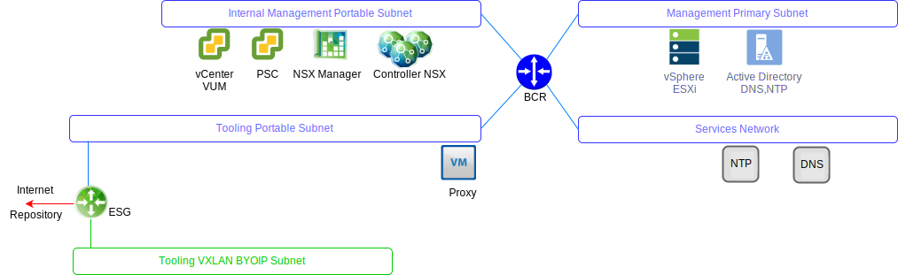

---

copyright:

  years:  2016, 2019

lastupdated: "2019-05-16"

---

# VMware Update Manager
{: #opsmgmt-vum}

VMware Update Manager (VUM) consente la gestione centralizzata e automatizzata di patch e versioni per VMware vSphere e ti consente di completare le seguenti attività nel tuo ambiente VMware vCenter Server on {{site.data.keyword.cloud}}:
* Eseguire l'upgrade e applicare le patch per gli host vSphere ESXi
* Installare e aggiornare software di terze parti sugli host
* Eseguire l'upgrade dell'hardware delle macchine virtuali (VM), dei VMware Tools e dei dispositivi virtuali

Per la progettazione dettagliata di VMware Update Manager, vedi [Introduzione a VMware Update Manager](https://cloud.ibm.com/docs/services/vmwaresolutions/archiref/vum/vum-intro.html#vmware-update-manager-introduction){:new_window}.

## Link correlati
{: #opsmgmt-vum-links}

* [Panoramica di vCenter Server on {{site.data.keyword.cloud_notm}} with Hybridity Bundle](/docs/services/vmwaresolutions/archiref/vcs?topic=vmware-solutions-vcs-hybridity-intro)
* [VMware Update Manager](https://docs.vmware.com/en/VMware-vSphere/6.5/com.vmware.vsphere.update_manager.doc/GUID-F7191592-048B-40C7-A610-CFEE6A790AB0.html){:new_window}
