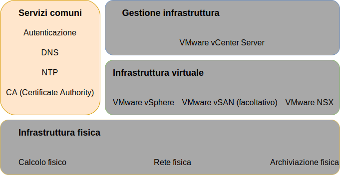
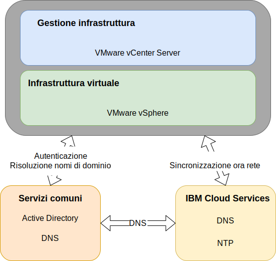

---

copyright:

  years:  2016, 2019

lastupdated: "2019-03-19"

subcollection: vmwaresolutions

---

{:tip: .tip}
{:note: .note}
{:important: .important}

# Progettazione di servizi comuni
{: #design_commonservice}

I servizi comuni forniscono i servizi che vengono utilizzati da altri servizi nella piattaforma di gestione cloud. I servizi comuni della soluzione includono servizi di identità e accesso, servizi DNS, servizi NTP, servizi SMTP e servizi di autorità di certificazione.

Figura 1. Servizi comuni 

## Servizi di identità e accesso
{: #design_commonservice-identity-access}

In questa progettazione, Microsoft Active Directory (MSAD) viene utilizzato per la gestione delle identità. La progettazione distribuisce una o due VM (Virtual Machine) Active Directory come parte dell'automazione della distribuzione di vCenter Server. vCenter viene configurato per utilizzare l'autenticazione MSAD.

### Microsoft Active Directory
{: #design_commonservice-msad}

Per impostazione predefinita, una singola VSI di Active Directory viene distribuita sull'infrastruttura {{site.data.keyword.cloud}}.

La progettazione offre inoltre la possibilità di distribuire due server MSAD altamente disponibili come VM di Windows Server dedicate nel cluster di gestione.

Se scegli l'opzione con due server MSAD altamente disponibili, sei responsabile di fornire licenze e attivazione Microsoft.
{:note}

Active Directory serve per autenticare gli accessi per gestire solo l'istanza VMware e non per ospitare gli utenti dei carichi di lavoro nelle istanze distribuite. Il nome di dominio root dell'insieme di strutture del server Active Directory corrisponde al nome di dominio DNS da te specificato. Questo nome di dominio è specificato solo per l'istanza primaria di vCenter Server se sono collegate più istanze. Per le istanze collegate, ciascuna istanza contiene un server Active Directory che si trova nell'anello di replica root dell'insieme di strutture. Anche i file di zona DNS vengono replicati sui server Active Directory.

### Dominio SSO vSphere
{: #design_commonservice-vsphere-sso}

Il dominio SSO (Single Sign On) vSphere viene utilizzato come meccanismo di autenticazione iniziale per una singola istanza o più istanze collegate. Il dominio SSO serve anche per connettere un'istanza VMware o più istanze collegate al server MSAD. Viene applicata la seguente configurazione SSO:  
* Viene utilizzato sempre il dominio SSO di `vsphere.local`
* Per le istanze VMware collegate a un'istanza esistente, il PSC integrato viene unito al dominio SSO dell'istanza esistente
* Il nome del sito SSO è uguale al nome dell'istanza

## DNS (Domain name Service)
{: #design_commonservice-dns}

Il DNS (Domain name Service) in questa progettazione è solo per i componenti di infrastruttura e gestione cloud.

### Istanza vCenter Server primaria
{: #design_commonservice-primary-vcs}

La distribuzione di vCenter Server utilizza le VSI AD distribuite come server DNS per l'istanza. Tutti i componenti
distribuiti (vCenter con PSC integrato, NSX, host ESXi) sono configurati in modo da puntare a AD come proprio server DNS predefinito. Puoi personalizzare
la configurazione della zona DNS se non interferisce con quella dei componenti distribuiti.
- Questa progettazione integra i servizi DNS sulle VSI AD nella seguente configurazione:
- La struttura del dominio viene specificata dall'utente. Il nome di dominio può essere un numero qualsiasi di livelli fino al massimo che tutti i componenti vCenter Server possono gestire, garantendo che il livello più basso sia il dominio secondario per l'istanza.
    - Il nome di dominio DNS che fornisci viene utilizzato come nome di dominio dell'insieme di strutture root AD distribuite a vCenter Server. Ad esempio, se il nome del dominio DNS è cloud.ibm.com, la root dell'insieme di strutture del dominio AD è cloud.ibm.com. Il nome di dominio DNS e il nome di dominio AD sono gli stessi in tutte le istanze federate di vCenter Server.
    - Seleziona un ulteriore nome come dominio secondario dell'istanza vCenter. Questo nome di dominio secondario deve essere univoco tra tutte le istanze vCenter Server collegate.
- I server DNS di AD sono configurati per essere autorevoli sia per lo spazio del dominio che del dominio secondario DNS.
- I server DNS di AD sono configurati per puntare ai server DNS di {{site.data.keyword.cloud_notm}} per tutte le altre zone.
- Qualsiasi regione cloud secondaria che viene integrata alla prima o alla regione cloud distribuita di destinazione deve utilizzare la stessa struttura di nomi DNS sopra il dominio secondario.
- Facoltativamente distribuisci server DNS ridondanti all'interno del cluster vCenter Server. Due server AD/DNS sono configurati senza licenza. È responsabilità dell'utente fornire le licenze per i sistemi operativi Windows per questi server.
- Se viene eseguito il provisioning di un solo sito con solo un server AD/DNS, tutti i componenti vCenter Server devono avere SOLO tale IP singolo come voce DNS.

### Istanze vCenter Server secondarie
{: #design_commonservice-secondary-vcs}

Per la ridondanza tra le istanze; quando viene aggiunta la prima istanza vCenter Server secondaria a un'istanza vCenter Server primaria o a un'istanza vCenter Server autonoma corrente, l'indirizzo IP del server AD DNS dell'istanza primaria viene utilizzato nell'istanza vCenter Server secondaria e in tutte le successive voci “secondary DNS” dell'istanza vCenter Server secondaria per tutti i componenti che richiedono una voce server DNS. Ad esempio, ESXi, vCenter e NSX Manager. Inclusi i componenti aggiuntivi come, HCX, Zerto e Veeam. La voce DNS secondaria del sito primario viene modificata con il primo indirizzo IP AD/DNS delle istanze vCenter Server secondarie.

## Servizi NTP
{: #design_commonservice-ntp}

Questa progettazione utilizza i server NTP dell'infrastruttura {{site.data.keyword.cloud_notm}}. Tutti i componenti distribuiti sono configurati per utilizzare questi server NTP. Per il corretto funzionamento dei certificati e dell'autenticazione di Active Directory, è fondamentale che tutti i componenti all'interno della progettazione utilizzino lo stesso server NTP.

Figura 2. Servizi NTP e DNS  

## Servizi CA (Certificate Authority)
{: #design_commonservice-cas}

Per impostazione predefinita, VMware vSphere utilizza i certificati TLS firmati da VMware Certificate Authority (VMCA), che risiede sul dispositivo VMware PSC (Platform Services Controller). Questi certificati non sono considerati attendibili dai dispositivi o dai browser dell'utente finale. È buona norma per la sicurezza sostituire i certificati rivolti all'utente con certificati firmati da un'autorità di certificazione (CA) di terze parti o di livello aziendale. I certificati per la comunicazione machine-to-machine possono rimanere come certificati firmati da VMCA, tuttavia, si consiglia di seguire le procedure ottimali per la tua organizzazione, che in genere implicano l'utilizzo di una CA aziendale identificata.

Puoi utilizzare i server Windows AD in questa progettazione per creare certificati firmati dall'istanza locale. Tuttavia, puoi anche scegliere di configurare i servizi CA, laddove necessario.

## Link correlati
{: #design_commonservice-related}

* [Progettazione dell'infrastruttura fisica](/docs/services/vmwaresolutions/archiref/solution?topic=vmware-solutions-design_physicalinfrastructure)
* [Progettazione dell'infrastruttura virtuale](/docs/services/vmwaresolutions/archiref/solution?topic=vmware-solutions-design_virtualinfrastructure)
* [Progettazione della gestione dell'infrastruttura](/docs/services/vmwaresolutions/archiref/solution?topic=vmware-solutions-design_infrastructuremgmt)
