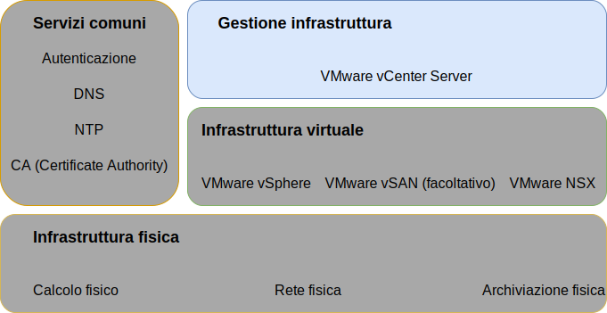

---

copyright:

  years:  2016, 2019

lastupdated: "2019-03-28"

subcollection: vmware-solutions

---

{:tip: .tip}
{:note: .note}
{:important: .important}

# Progettazione della gestione dell'infrastruttura
{: #design_infrastructuremgmt}

La gestione dell'infrastruttura si riferisce ai componenti che stanno gestendo l'infrastruttura VMware.
* vCenter Server con PSC (Platform Services Controller) integrato è la piattaforma centralizzata per la gestione degli ambienti vSphere ed è uno dei componenti fondamentali di questa soluzione.
* Il PSC viene utilizzato in questa soluzione per fornire una serie di servizi dell'infrastruttura tra cui VMware vCenter Single Sign On, il servizio di licenza, il servizio di ricerca e VMware certificate authority.

Questa progettazione utilizza una funzione PSC integrata in un'istanza di vCenter Server. Il PSC e vCenter Server sono ospitati all'interno della stessa macchina virtuale (VM).

Figura 1. Gestione dell'infrastruttura 

Al PSC che si trova nell'istanza primaria viene assegnato il dominio SSO predefinito `vsphere.local`.

## Progettazione di vCenter Server
{: #design_infrastructuremgmt-vcenter}

vCenter Server con un PSC integrato viene installato su una sottorete portatile nella VLAN privata associata alle VM di gestione. Il suo gateway predefinito è impostato sull'indirizzo IP assegnato sul BCR per quella particolare sottorete. Il dispositivo virtuale è configurato con le specifiche indicate nella seguente tabella.

Tabella 1. Specifiche di vCenter Server Appliance

| Attributo                    | Specifica                       |
|------------------------------|-------------------------------------|
| vCenter Server               | Dispositivo virtuale                   |
| Dimensione installazione del dispositivo  | Grande (fino a 1.000 host e 10.000 VM) |
| Platform Services Controller | Integrato                            |
| Numero di vCPU              | 16                                   |
| Memoria                       | 32 GB                               |
| Disco                         | 990 GB sull'archivio dati locale (distribuzione di dischi grandi) |
| Tipo di disco                    | Thin provisioned                    |

### Database vCenter Server
{: #design_infrastructuremgmt-vcenter-db}

La configurazione di vCenter Server utilizza un database PostgreSQL integrato e locale incluso nel dispositivo. Il database integrato viene utilizzato per rimuovere eventuali dipendenze da database e licenze esterni.

### Specifica del cluster vCenter Server
{: #design_infrastructuremgmt-vcenter-cluster}

Con questa progettazione, puoi raggruppare gli host vSphere ESXi forniti tramite la soluzione. Tuttavia, prima che i cluster possano essere creati viene creato un oggetto data center che indica l'ubicazione degli host vSphere ESXi nonché il pod all'interno del data center. Un cluster viene creato dopo la creazione dell'oggetto data center. Il cluster viene distribuito con VMware vSphere High Availability (HA) e VMware vSphere Distributed Resource Scheduler (DRS) abilitati.

### vSphere Distributed Resource Scheduler
{: #design_infrastructuremgmt-vsphere-drs}

Questa progettazione utilizza vSphere Distributed Resource Scheduling (DRS) nel cluster iniziale per posizionare le VM e utilizza DRS nei cluster aggiuntivi per migrare dinamicamente le VM per ottenere dei cluster bilanciati. Il livello di automazione è impostato sull'automazione completa in modo che le raccomandazioni di posizionamento e migrazione iniziali vengano eseguite automaticamente da vSphere. Inoltre, la soglia di migrazione è impostata su moderata in modo che vCenter applichi le raccomandazioni di priorità 1, 2, 3 per ottenere almeno un miglioramento decente nel bilanciamento del carico del cluster.

In questa progettazione non viene utilizzato il risparmio energia tramite la funzione **Distributed Power Management**.
{:note}

### vSphere High Availability
{: #design_infrastructuremgmt-vsphere-ha}

Questa progettazione utilizza vSphere High Availability (HA) nel cluster iniziale e nei cluster aggiuntivi per rilevare gli errori di calcolo e ripristinare le VM eseguite in un cluster. La funzione vSphere HA in questa progettazione è configurata con le opzioni **Host Monitoring** e **Admission Control** abilitate nel cluster. Inoltre, il cluster iniziale prenota le risorse di un nodo come capacità di riserva per la politica di controllo di ammissione.

Sei responsabile di regolare la politica di controllo di ammissione quando il cluster viene successivamente espanso o contratto.
{:note}

Per impostazione predefinita, l'opzione **VM restart priority** è impostata su medio e l'opzione **Host isolation response** è disabilitata. Inoltre, **VM monitoring** è disabilitata e la funzione **Datastore Heartbeating** è configurata per includere uno qualsiasi degli archivi dati del cluster. Questo approccio utilizza, se presenti, gli archivi dati NAS.

## EVC (Enhanced vMotion Compatibility)
{: #design_infrastructuremgmt-evc}

Per semplificare la compatibilità vMotion tra i nodi del cluster con funzionalità CPU potenzialmente differenti, la modalità EVC (Enhanced vMotion Compatibility) è abilitata al livello Skylake per garantire la compatibilità vMotion tra i nodi del cluster quando vengono inseriti dei processori più recenti nell'inventario {{site.data.keyword.cloud_notm}} e consente l'espansione del cluster futura se i server del processore Skylake non sono nell'inventario.

### IBM CloudDriver
{: #design_infrastructuremgmt-cloud-driver}

Il punto cardine di queste soluzioni è l'automazione. L'automazione riduce la complessità della distribuzione, riduce drasticamente i tempi di distribuzione e garantisce che l'istanza VMware sia distribuita in modo coerente.

IBM CloudBuilder è una VSI (Virtual Server Instance) della VM {{site.data.keyword.cloud_notm}} effimera
utilizzata per presentare una nuova istanza VMware ed eseguire le funzioni di gestione del ciclo di vita. Viene distribuito quando è richiesta la gestione dell'istanza vCenter Server generale ed eliminata in modo permanente quando viene completato il processo.

IBM CloudDriver è una VSI (Virtual Server Instance) della VM {{site.data.keyword.cloud_notm}} effimera distribuita in base alle esigenze per le operazioni day-2 come l'aggiunta di host, cluster o servizi aggiuntivi alla tua istanza VMware. 

CloudBuilder e CloudDriver vengono distribuiti solo sulla rete privata che si collega al piano di gestione IBM tramite una coda messaggi privata. Sono componenti sviluppati da IBM, non sono accessibili dall'utente e hanno i seguenti attributi e funzioni: 

- Distribuzione e configurazione dell'istanza vCenter Server all'interno dell'account utente.
- Aggiungere e rimuovere gli host dai cluster vCenter Server.
- Aggiungere e rimuovere i cluster dalle istanze vCenter Server.
- Aggiungere e rimuovere i servizi o le funzioni aggiuntivi per le istanze
vCenter Server.

### Flusso di automazione
{: #design_infrastructuremgmt-auto-flow}

La seguente procedura descrive l'ordine degli eventi quando utilizzi la console {{site.data.keyword.vmwaresolutions_short}} per ordinare un'istanza VMware:
1. Ordine di VLAN e sottoreti per la rete da {{site.data.keyword.cloud_notm}}.
2. Ordine di {{site.data.keyword.cloud_notm}} {{site.data.keyword.baremetal_short}} con vSphere Hypervisor installato.
3. Ordine della VSI di Microsoft Windows da utilizzare come controller di dominio Active Directory.
4. Distribuzione della VSI di Cloud Driver.
5. Convalida della rete e dell'hardware distribuito.
6. Se applicabile, la configurazione iniziale di vSAN a singolo nodo.
7. Distribuzione e configurazione di vCenter (con PSC integrato) e NSX.
8. Clustering dei nodi ESXi rimanenti, espansione di vSAN (se applicabile) e configurazione dei componenti NSX (VTEP).
9. Convalida dell'installazione e della configurazione dell'ambiente.
10. Distribuzione di servizi facoltativi, come il server di backup e l'archiviazione.
11. Rimozione della VSI di Cloud Driver.

## ID e password
{: #design_infrastructuremgmt-ids-pwd}

L'infrastruttura di gestione IC4V archivia tutti gli ID e le password crittografati contenuti in vCenter Server all'interno del piano di gestione {{site.data.keyword.cloud_notm}}. Tutte le modifiche a queste password apportate dall'utente possono interrompere le funzionalità di automazione in vCenter Server.

Puoi fornire le password modificate nel portale delle soluzioni IC4V in modo che l'automazione possa elaborare le funzioni senza interruzioni. Il portale delle soluzioni facoltativamente consente la verifica delle password immesse.

## Link correlati
{: #design_infrastructuremgmt-related}

* [Progettazione dell'infrastruttura fisica](/docs/services/vmwaresolutions/archiref/solution?topic=vmware-solutions-design_physicalinfrastructure)
* [Progettazione dell'infrastruttura virtuale](/docs/services/vmwaresolutions/archiref/solution?topic=vmware-solutions-design_virtualinfrastructure)
* [Progettazione di servizi comuni](/docs/services/vmwaresolutions/archiref/solution?topic=vmware-solutions-design_commonservice)
