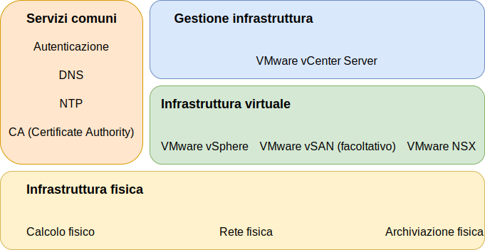

---

copyright:

  years:  2016, 2019

lastupdated: "2019-05-07"

subcollection: vmware-solutions

---
# Componenti di IBM Cloud for VMware Solutions
{: #design_overview}

{{site.data.keyword.vmwaresolutions_full}} fornisce l'automazione per distribuire i componenti con tecnologia VMware nei {{site.data.keyword.CloudDataCents_notm}} in tutto il mondo.

L'offerta in questo portfolio di soluzioni include i prodotti VMware vSphere all'interno di un cluster configurato e distribuito automaticamente: VMware vSphere ESXi, VMware vCenter Server Appliance con un PSC (Platform Services Controller) integrato, VMware NSX-V o NSX-T e facoltativamente, VMware vSAN.

L'architettura è costituita da una singola regione cloud e supporta la capacità di estendersi in più regioni cloud che si trovano in un'altra area geografia e in un altro pod di {{site.data.keyword.cloud_notm}} all'interno dello stesso data center. Una regione viene definita come un'istanza vCenter Server univoca. Questa progettazione consente inoltre l'espansione e la contrazione automatizzata della capacità virtuale all'interno di un'istanza vCenter Server.

## Link correlati
{: #design_overview-related}

* [Progettazione dell'infrastruttura fisica](/docs/services/vmwaresolutions/archiref/solution?topic=vmware-solutions-design_physicalinfrastructure)
* [Progettazione dell'infrastruttura virtuale](/docs/services/vmwaresolutions/archiref/solution?topic=vmware-solutions-design_virtualinfrastructure)
* [Progettazione di servizi comuni](/docs/services/vmwaresolutions/archiref/solution?topic=vmware-solutions-design_commonservice)
* [Progettazione della gestione dell'infrastruttura](/docs/services/vmwaresolutions/archiref/solution?topic=vmware-solutions-design_infrastructuremgmt)
