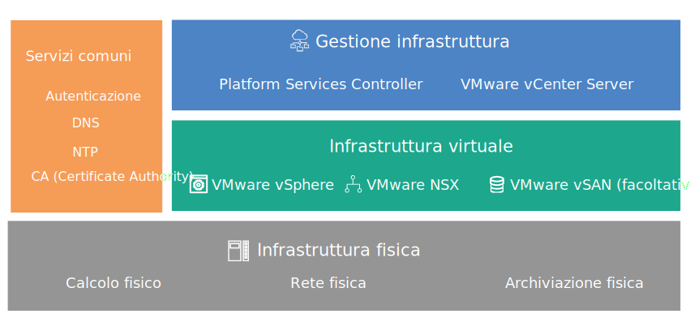

---

copyright:

  years:  2016, 2019

lastupdated: "2019-02-15"

---
# Panoramica della progettazione
{: #design_overview}

{{site.data.keyword.vmwaresolutions_full}} fornisce l'automazione per distribuire i componenti con tecnologia VMware nei {{site.data.keyword.CloudDataCents_notm}} in tutto il mondo.

## Offerte della soluzione
{: #design_overview-offerings}

Le offerte della soluzione includono i seguenti prodotti VMware vSphere all'interno di un cluster distribuito e configurato automaticamente:
* VMware Cloud Foundation: vSphere ESXi, PSC (Platform Services Controller), VMware vCenter Server Appliance, SDDC Manager, VMware NSX e VMware vSAN.
* VMware vCenter Server: vSphere ESXi, PSC (Platform Services Controller), vCenter Server Appliance, NSX e facoltativamente vSAN.

In questa progettazione, un'istanza viene distribuita in un singolo pod di un {{site.data.keyword.CloudDataCent_notm}} durante l'ordine iniziale. Dopo la distribuzione iniziale, puoi estendere il tuo ambiente virtuale in altri pod all'interno dello stesso data center o in data center diversi.

La progettazione consente inoltre l'espansione e la contrazione automatizzata della capacità virtuale all'interno di un'istanza Cloud Foundation o vCenter Server.

## Componenti di VMware on IBM Cloud
{: #design_overview-comp}

Figura 1. Componenti di VMware on {{site.data.keyword.cloud_notm}}

## Link correlati
{: #design_overview-related}

* [Progettazione dell'infrastruttura fisica](/docs/services/vmwaresolutions/archiref/solution?topic=vmware-solutions-design_physicalinfrastructure)
* [Progettazione dell'infrastruttura virtuale](/docs/services/vmwaresolutions/archiref/solution?topic=vmware-solutions-design_virtualinfrastructure)
* [Progettazione di servizi comuni](/docs/services/vmwaresolutions/archiref/solution?topic=vmware-solutions-design_commonservice)
* [Progettazione della gestione dell'infrastruttura](/docs/services/vmwaresolutions/archiref/solution?topic=vmware-solutions-design_infrastructuremgmt)
