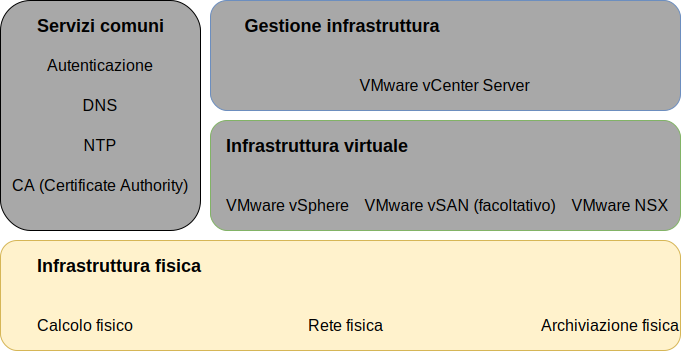
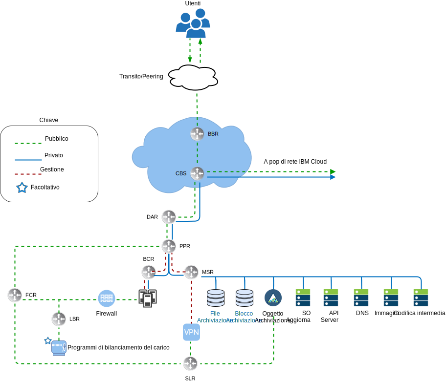
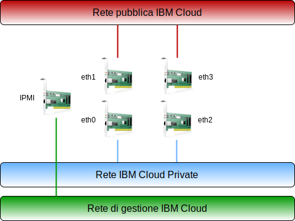
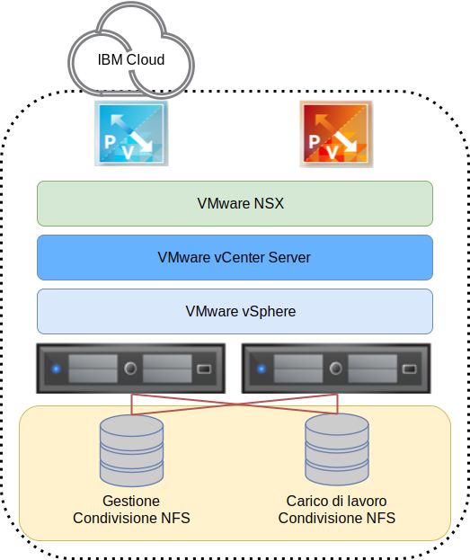
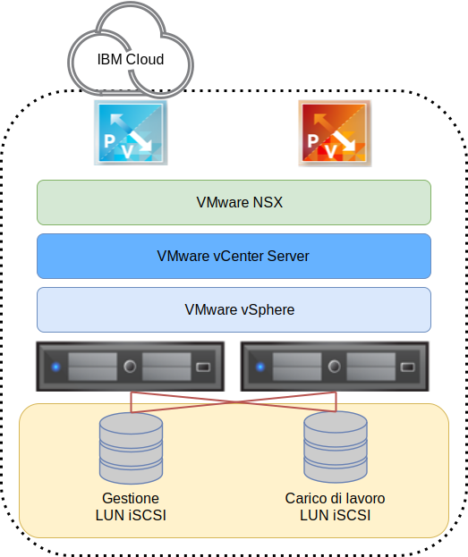

---

copyright:

  years:  2016, 2019

lastupdated: "2019-06-11"

subcollection: vmware-solutions

---

{:tip: .tip}
{:note: .note}
{:important: .important}

# Progettazione dell'infrastruttura fisica
{: #design_physicalinfrastructure}

L'infrastruttura fisica è formata dai seguenti componenti:

<dl class="dl">
  <dt class="dt dlterm">Calcolo fisico</dt>
  <dd class="dd">Il calcolo fisico fornisce l'elaborazione fisica e la memoria che viene utilizzata dall'infrastruttura di virtualizzazione. Per questa progettazione, i componenti di calcolo sono forniti da {{site.data.keyword.baremetal_long}} e sono elencati nella [Guida alla compatibilità hardware per VMware](https://www.vmware.com/resources/compatibility/search.php).</dd>
  <dt class="dt dlterm">Archiviazione fisica</dt>
  <dd class="dd">L'archiviazione fisica fornisce la capacità di archiviazione non elaborata utilizzata dall'infrastruttura di virtualizzazione. I componenti di archiviazione sono forniti da {{site.data.keyword.baremetal_short}} o tramite array NAS (Network Attached Storage) condiviso che utilizza NFS v3<!-- or iSCSI -->.</dd>
  <dt class="dt dlterm">Rete fisica</dt>
  <dd class="dd">La rete fisica fornisce la connettività di rete nell'ambiente che viene quindi utilizzato dalla virtualizzazione di rete. La rete è fornita dalla rete dei servizi {{site.data.keyword.cloud_notm}} e include servizi supplementari come DNS e NTP.</dd>
</dl>

Per ulteriori informazioni sui componenti fisici, vedi [Distinta base di vCenter Server](/docs/services/vmwaresolutions/vcenter?topic=vmware-solutions-vc_bom).

Per ulteriori informazioni sull'archiviazione, vedi [Architettura dell'archiviazione condivisa](/docs/services/vmwaresolutions/archiref/attached-storage?topic=vmware-solutions-storage-benefits#storage-benefits).

## Progettazione del calcolo fisico
{: #design_physicalinfrastructure-host-design}

Le configurazioni del server disponibili nella soluzione soddisfano o superano i requisiti minimi per installare, configurare e gestire vSphere ESXi. Sono disponibili varie configurazioni per soddisfare diversi requisiti. Per l'elenco dettagliato delle esatte specifiche utilizzate per la soluzione VMware on {{site.data.keyword.cloud_notm}}, vedi la distinta base per l'[istanza vCenter Server](/docs/services/vmwaresolutions/vcenter?topic=vmware-solutions-vc_bom).

I {{site.data.keyword.baremetal_short}} risiedono in {{site.data.keyword.cloud_notm}}.
{:note}

Ogni istanza vCenter Server inizia con una distribuzione a 3 o 4 host a seconda della scelta della soluzione di archiviazione.

L'host fisico utilizza due dischi collegati localmente assegnati all'hypervisor vSphere ESXi. Puoi assegnare altri dischi utilizzando vSAN come descritto nella sezione _Progettazione dell'archiviazione fisica_ o utilizzando NetApp ONTAP come descritto in [Architettura di NetApp ONTAP Select](https://www.ibm.com/cloud/garage/files/IBM_Cloud_for_VMware_Solutions_NetApp_Architecture.pdf). Ogni
host fisico ha connessioni di rete ridondanti da 10 Gbps per l'accesso alla rete pubblica e privata.

Il Bare Metal Server ha le seguenti specifiche:
* CPU: Dual o Quad Intel Xeon, configurazione core e velocità variabile
* Memoria: configurazione variabile, da 64 GB o superiore
* Rete: 4 x 10 Gbps
* Numero di unità: 2 o più

## Progettazione della rete fisica
{: #design_physicalinfrastructure-net-design}

La rete fisica è gestita da {{site.data.keyword.cloud_notm}}. Controlla le seguenti descrizioni della rete fisica fornita da IBM Cloud e le connessioni all'host fisico (VLAN, MTU) associate agli host fisici.

### Panoramica della rete di IBM Cloud
{: #design_physicalinfrastructure-ibm-cloud-network}

La rete fisica di {{site.data.keyword.cloud_notm}} è suddivisa in due reti distinte: pubblica e privata. La rete privata contiene anche il traffico IPMI (Intelligent Platform Management Interface) di gestione ai server fisici.

#### Rete pubblica
{: #design_physicalinfrastructure-public-net}

I {{site.data.keyword.CloudDataCents_notm}} e i PoP (point of presence) di rete dispongono di più connessioni da 1 Gbps o 10 Gbps ai vettori di rete di transito e peering di alto livello. Il traffico di rete proveniente da qualsiasi parte del mondo si collega al PoP di rete più vicino e viaggia direttamente attraverso la rete verso il suo data center, riducendo al minimo il numero di hop e handoff di rete tra i provider.

All'interno del data center, {{site.data.keyword.cloud_notm}} fornisce 1 Gbps o 10 Gbps di larghezza di banda di rete ai singoli server tramite una coppia di switch FCS (front-end customer switch) separati aggregati ai peer. Questi switch aggregati sono collegati a una coppia di router separati, FCR, per la rete L3.

Questa progettazione multilivello consente alla rete di ridimensionarsi tra rack, righe e pod all'interno di un {{site.data.keyword.CloudDataCent_notm}}.

#### Rete privata
{: #design_physicalinfrastructure-private-net}

Tutti i {{site.data.keyword.CloudDataCents_notm}} e i PoP sono connessi mediante il backbone di rete privata. Questa rete privata è separata dalla rete pubblica e abilita la connettività ai servizi nei {{site.data.keyword.CloudDataCents_notm}} in tutto il mondo. Lo spostamento dei dati tra i {{site.data.keyword.CloudDataCents_notm}} avviene tramite più connessioni da 10 Gbps o 40 Gbps alla rete privata.

Analogamente alla rete pubblica, la rete privata è multilivello in quanto i server e gli altri componenti dell'infrastruttura sono connessi a switch BCS (back-end customer switch) aggregati. Questi switch aggregati sono collegati a una coppia di router BCR (back-end customer router) separati per la rete L3. La rete privata supporta anche la possibilità di utilizzare i frame Jumbo (MTU 9000) per connessioni all'host fisico.

#### Rete di gestione
{: #design_physicalinfrastructure-mgmt-net}

Oltre alle reti pubbliche e private, ogni server {{site.data.keyword.cloud_notm}} è connesso per la gestione alla sottorete della rete primaria privata. Questa connessione consente l'accesso IPMI (Intelligent Platform Management Interface) al server indipendentemente dalla CPU, dal firmware e dal sistema operativo per scopi di manutenzione e amministrazione.

#### Blocchi di IP primari e portatili
{: #design_physicalinfrastructure-ip-blocks}

{{site.data.keyword.cloud_notm}} assegna due tipi di indirizzi IP da utilizzare all'interno dell'infrastruttura {{site.data.keyword.cloud_notm}}:
* Gli indirizzi IP primari sono assegnati a dispositivi, server virtuali e Bare Metal forniti da {{site.data.keyword.cloud_notm}}. Non assegnare alcun indirizzo IP in questi blocchi.
* Gli indirizzi IP portatili ti vengono forniti per l'assegnazione e la gestione in base alle esigenze. vCenter Server esegue il provisioning di diversi intervalli di IP portatili per il proprio utilizzo. Utilizza solo gli intervalli di IP portatili assegnati a componenti NSX-T o NSX-V selezionati specificati per l'utilizzo da parte del cliente. Ad esempio, **EDGE del cliente**.

Gli indirizzi IP primari o portatili possono essere resi instradabili a qualsiasi VLAN nel tuo account quando è configurato come un account **VRF (Virtual Routing and Forwarding)**.

#### VRF (Virtual Routing and Forwarding)
{: #design_physicalinfrastructure-vrf}

L'account {{site.data.keyword.slportal}} deve essere configurato come un account VRF (Virtual Routing and Forwarding), abilitando così l'instradamento globale automatico tra i blocchi di IP della sottorete. Tutti gli account con connessioni Direct-Link devono essere convertiti o creati come account VRF.

Poiché molte opzioni di connettività insieme a delle opzioni di instradamento di rete richiedono che l'account {{site.data.keyword.cloud_notm}} sia in modalità VRF, si consiglia che l'account sia nella modalità VRF prima di eseguire il provisioning di vCenter Server

#### Connessioni all'host fisico
{: #design_physicalinfrastructure-host-connect}

Ogni host fisico in questa progettazione ha due coppie ridondanti di connessioni Ethernet da 10 Gbps in ogni switch (pubblico e privato) ToR (Top of Rack) di {{site.data.keyword.cloud_notm}}. Gli adattatori sono configurati come connessioni individuali (non collegate) per un totale di 4 connessioni da 10 Gbps. Ciò consente alle connessioni della scheda dell'interfaccia di rete (NIC) di funzionare indipendentemente l'una dall'altra.

La rimozione della connettività di rete fisica dalla rete privata o pubblica per i server Bare Metal utilizzati nell'offerta vCenter Server non è possibile. Le porte fisiche sul NIC interno del bare metal possono essere disabilitate, ma non esiste supporto per lo scollegamento dei cavi.

#### VLAN e instradamento da quelle sottostanti a quelle di sovrapposizione
{: #design_physicalinfrastructure-vlans}

Le offerte {{site.data.keyword.vmwaresolutions_short}} sono progettate con 3 VLAN, una pubblica e due private, assegnate al momento della distribuzione. Come mostrato nella figura precedente, la VLAN pubblica è assegnata a `eth1` e `eth3` e le VLAN private sono assegnate a `eth0` e `eth2`.

La VLAN pubblica e la prima VLAN privata create e assegnate in questa progettazione sono prive di tag per impostazione predefinita all'interno di {{site.data.keyword.cloud_notm}}. Successivamente, la VLAN privata aggiuntiva viene collegata alle porte dello switch fisico e contrassegnata con tag all'interno dei gruppi di porte VMware che stanno utilizzando queste sottoreti.

In questa progettazione, la rete privata è composta da due VLAN. Alla prima di queste VLAN (indicata qui come VLAN privata A) sono assegnate tre sottoreti:
* La prima sottorete è un intervallo di sottoreti di IP privati primari che {{site.data.keyword.cloud_notm}} assegna agli host fisici.
* La seconda sottorete è utilizzata per le VM (Virtual Machine) di gestione come vCenter Server Appliance e Platform Services Controller
* La terza sottorete è utilizzata per i VTEP (VXLAN Tunnel Endpoint) della rete di sovrapposizione incapsulati assegnati a ciascun host tramite l'NSX Manager.

Oltre alla VLAN privata A, esiste una seconda VLAN privata (qui indicata come VLAN privata B) per supportare le funzioni di VMware, come vSAN, vMotion e NFS<!--, and iSCSI-->. Pertanto, la VLAN è divisa in due, tre o quattro sottoreti portatili:
* La prima sottorete viene assegnata a un gruppo di porte kernel per il traffico vMotion.
* Le restanti sottoreti vengono utilizzate per il traffico di archiviazione:
   * Se si utilizza vSAN, una sottorete viene assegnata ai gruppi di porte kernel utilizzati per il traffico vSAN.
   * Se si utilizza NFS collegato a NAS, una sottorete viene assegnata a un gruppo di porte dedicato al traffico NFS.
<!--* For iSCSI attachment, two port groups are created to allow multipathing active-active across both private NIC ports as only one NIC port can be active at a time per the VMware iSCSI documentation.-->

Tutte le sottoreti configurate come parte di una distribuzione automatizzata di vCenter Server utilizzano intervalli gestiti da {{site.data.keyword.cloud_notm}}. Ciò serve a garantire che qualsiasi indirizzo IP possa essere indirizzato a qualsiasi data center all'interno dell'account {{site.data.keyword.cloud_notm}} ogni volta che hai bisogno della connessione.

Rivedi la seguente tabella per un riepilogo

Tabella 1. Riepilogo VLAN e sottorete

| VLAN | Tipo | Descrizione |
|:---- |:---- |:----------- |
| Pubblica| Primaria  | Assegnata agli host fisici per l'accesso alla rete pubblica. Agli host viene assegnato un indirizzo IP pubblico ma questo indirizzo IP non è configurato sugli host, quindi non sono direttamente accessibili sulla rete pubblica. È previsto invece che la VLAN pubblica fornisca l'accesso a internet pubblico per altri componenti, come ad esempio gli NSX ESG (Edge Services Gateway). |
| Privata A | Primaria  | Sottorete singola assegnata agli host fisici assegnati da {{site.data.keyword.cloud_notm}}. Utilizzata dall'interfaccia di gestione per il traffico di gestione vSphere. |
| Privata A | Portatile | Sottorete singola assegnata alle VM (Virtual Machine) che funzionano come componenti di gestione |
| Privata A | Portatile | Sottorete singola assegnata al VTEP NSX-V o NSX-T |
| Privata B | Portatile | Sottorete singola assegnata per vSAN, se in uso |
| Privata B | Portatile | Sottorete singola assegnata per NAS, se in uso |
| Privata B | Portatile | Sottorete singola assegnata per vMotion |
<!--| Private B | Portable | Two subnets assigned for iSCSI NAS, if in use (one per physical NIC port) |-->

In questa progettazione, tutti gli host e le VM (Virtual Machine) supportati dalla VLAN sono configurati in modo che puntino al router del cliente della “rete privata” di back-end (BCR) {{site.data.keyword.cloud_notm}} come rotta predefinita. Mentre le istanze vCenter Server consentono l'utilizzo di SDN (Software-Defined Networking), le sovrapposizioni di rete create all'interno di un'istanza VMware che includono l'instradamento alle sottoreti interne non sono note ai router gestiti da {{site.data.keyword.cloud_notm}}.

Se vuoi eseguire l'instradamento tra la rete sottostante e di sovrapposizione, devi distribuire un dispositivo firewall IBM per una particolare VLAN privata predefinita quando viene distribuita l'istanza vCenter Server. Questo dispositivo consente l'inserimento di rotte statiche e il peering del protocollo di instradamento dinamico con i dispositivi della rete di sovrapposizione per consentire l'instradamento tra la rete sottostante e di sovrapposizione.

Le connessioni alla rete privata sono configurate per utilizzare una dimensione MTU dei frame Jumbo pari a 9000 per migliorare le prestazioni per trasferimenti di dati di grandi dimensioni, come archiviazione e vMotion. Questa è la MTU massima consentita in VMware e da {{site.data.keyword.cloud_notm}}. Le connessioni alla rete pubblica utilizzano una MTU Ethernet standard di 1500. Questo valore deve essere mantenuto poiché qualsiasi modifica potrebbe causare la frammentazione dei pacchetti su Internet.

## Progettazione dell'archiviazione fisica
{: #design_physicalinfrastructure-storage-design}

La progettazione dell'archiviazione fisica è composta dalla configurazione dei dischi fisici installati negli host fisici e dalla configurazione del NAS condiviso. Ciò include il sistema operativo (vSphere ESXi) e i dischi utilizzati per l'archiviazione delle VM (Virtual Machine). L'archiviazione per le VM può essere composta di dischi locali virtualizzati da VMware vSAN, di un'archiviazione a livello di file condivisa o di un'archiviazione a livello di blocco condivisa.

### Dischi del sistema operativo
{: #design_physicalinfrastructure-os-disks}

L'hypervisor vSphere ESXi è installato in una ubicazione persistente. Di conseguenza, gli host fisici sono formati da due dischi in una configurazione RAID–1 per supportare la ridondanza per l'hypervisor vSphere ESXi.

### Dischi vSAN
{: #design_physicalinfrastructure-vsan-disks}

Questa progettazione consente di utilizzare VMware vSAN o il NAS condiviso come archivio dati primario per le VM. Per VMware vSAN, viene configurata utilizzando una configurazione all–flash. Questa progettazione consente diverse opzioni di configurazione, tra cui chassis 2U e 4U, vari numeri di dischi e varie dimensioni del disco. Tutte le configurazioni utilizzano due gruppi di dischi vSAN, con un SSD (Solid State Disk) per la cache e uno o più SSD per la capacità. Tutte le unità che vengono assegnate per il consumo di vSAN sono configurate in RAID-0 a singolo disco.

Per ulteriori informazioni sulle configurazioni supportate, vedi [Distinta base di vCenter Server](/docs/services/vmwaresolutions/vcenter?topic=vmware-solutions-vc_bom).

### Archiviazione a livello di file condivisa tra gli host
{: #design_physicalinfrastructure-shared-storage}

Quando si utilizza l'archiviazione a livello di file condivisa, una condivisione NFS da 2-TB è collegata agli host che comprendono il cluster VMware iniziale. Questa condivisione, che è nota come condivisione di gestione, viene utilizzata per i componenti di gestione come VMware vCenter Server, PSC (Platform Services Controller) e VMware NSX.

L'archiviazione viene allegata utilizzando il protocollo NFS v3 ad un livello di 2 IOPS/GB da IBM Cloud.

Puoi assegnare e montare più condivisioni di file tra tutti gli host per i tuoi carichi di lavoro al momento dell'acquisto o successivamente nella console. Puoi scegliere tra le opzioni di capacità di archiviazione file Endurance {{site.data.keyword.cloud_notm}} e i livelli di prestazioni disponibili nel {{site.data.keyword.CloudDataCent_notm}} corrispondente. Tutte le condivisioni sono collegate utilizzando il protocollo NFS v3. Inoltre, è possibile collegare le condivisioni file NFS v3 applicando l'offerta NetApp ONTAP Select.

La disponibilità di 10 IOPS/GB dipende dal data center IBM Cloud. I {{site.data.keyword.CloudDataCents_notm}} che offrono il livello di prestazioni di 10 IOPS/GB includono anche la crittografia dei dati inattivi gestita dal provider (crittografia AES-256) e sono supportati dall'archiviazione all-flash. Il livello di prestazioni di 10 IOPS/GB è limitato a una capacità massima di 4 TB. Per ulteriori informazioni sul NAS condiviso utilizzato in questa soluzione, vedi [Architettura dell'archiviazione condivisa](/docs/services/vmwaresolutions/archiref/attached-storage?topic=vmware-solutions-storage-benefits#storage-benefits).

<!--
### Shared iSCSI storage
{: #design_physicalinfrastructure-shared-iscsi}

This architecture allows you to use iSCSI storage, however iSCSI storage is not automatically provisioned by IBM Cloud for VMware Solutions. You can provision it manually.

Similar to NFS, for shared iSCSI storage, one 2-TB iSCSI LUN will be attached to the hosts that comprise the initial VMware cluster. This iSCSI LUN is used for management components such as the VMware vCenter Server, Platform Services Controller, and VMware NSX. The storage is attached through the iSCSI protocol at a 2 IOPS/GB level from IBM Cloud.

{: caption="Figure 5. iSCSI LUNs attached to VMware deployment" caption-side="bottom"}

Additional iSCSI LUNs for workloads can also be allocated and mounted across all hosts. Select from the available IBM Cloud Endurance block storage capacity options and performance tiers in the corresponding IBM Cloud Data Center. All LUNs are attached by using the iSCSI protocol. Additionally, it is possible to attach iSCSI LUNs from the NetApp ONTAP Select offering.

The availability of the 10 IOPS/GB depends on the IBM Cloud Data Center. Data centers that offer the 10 IOPS/GB performance tier also include provider–managed encryption of data at rest (AES–256 encryption), and are backed by all–flash storage. The 10 IOPS/GB performance tier is limited to a maximum capacity of 4 TB.

-->

Per ulteriori informazioni sul NAS condiviso utilizzato in questa soluzione, vedi [Architettura dell'archiviazione condivisa](/docs/services/vmwaresolutions/archiref/attached-storage?topic=vmware-solutions-storage-benefits#storage-benefits).

## Link correlati
{: #design_physicalinfrastructure-related}

* [Distinta base di vCenter Server](/docs/services/vmwaresolutions/vcenter?topic=vmware-solutions-vc_bom)
* [Architettura dell'archiviazione condivisa](/docs/services/vmwaresolutions/archiref/attached-storage?topic=vmware-solutions-storage-benefits#storage-benefits)
* [Architettura di NetApp ONTAP Select](https://www.ibm.com/cloud/garage/files/IBM_Cloud_for_VMware_Solutions_NetApp_Architecture.pdf)
