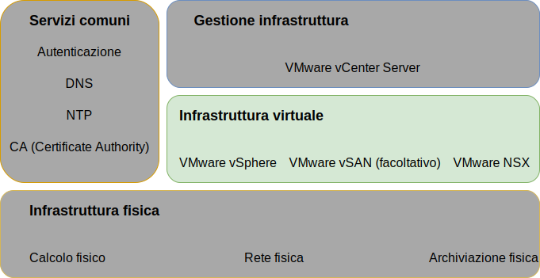
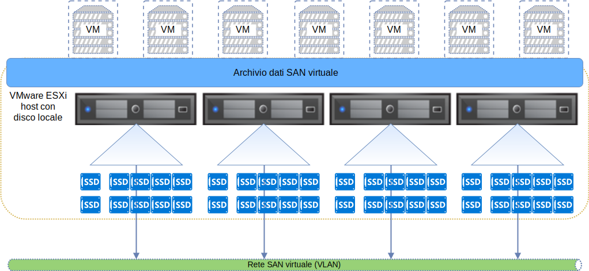
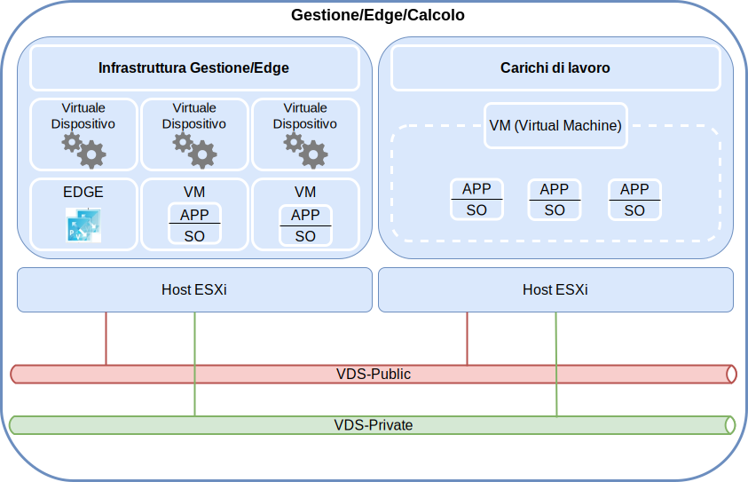

---

copyright:

  years:  2016, 2019

lastupdated: "2019-06-21"

subcollection: vmware-solutions

---

{:tip: .tip}
{:note: .note}
{:important: .important}

# Progettazione dell'infrastruttura virtuale
{: #design_virtualinfrastructure}

Il livello dell'infrastruttura virtuale include i componenti software VMware che virtualizzano le risorse di calcolo, di archiviazione e di rete fornite nel livello dell'infrastruttura fisica: VMware vSphere ESXi, VMware NSX-V o NSX-T e facoltativamente VMware vSAN.

## Progettazione di VMware vSphere
{: #design_virtualinfrastructure-vsphere-design}

La configurazione di vSphere ESXi comprende i seguenti aspetti:
* Configurazione di boot
* Sincronizzazione temporale
* Accesso host
* Accesso utente
* Configurazione DNS

La seguente tabella delinea le specifiche per ciascun aspetto. Dopo la configurazione e l'installazione di ESXi, l'host viene aggiunto a un VMware vCenter Server ed è gestito da lì.

Con questa progettazione, puoi accedere agli host virtuali tramite l'interfaccia utente della console diretta (DCUI) e il client web vSphere. SSH (Secure Shell) e ESXi Shell vengono disabilitati dopo il provisioning come procedura consigliata.

Per impostazione predefinita, gli unici utenti che possono accedere direttamente sono gli utenti _root_ e _ibmvmadmin_ per la macchina fisica dell'host. L'amministratore può aggiungere utenti dal dominio Microsoft Active Directory (MSAD) per abilitare l'accesso dell'utente all'host. Tutti gli host nella progettazione della soluzione vCenter Server sono configurati per la sincronizzazione con un server NTP centrale.

Tabella 1. Configurazione di vSphere ESXi

| Attributo              | Parametro di configurazione |
|:---------------------- |:----------------------- |
| Posizione di avvio ESXi     | Utilizza i dischi locali configurati in RAID-1 |
| Sincronizzazione temporale   | Utilizza il server NTP {{site.data.keyword.cloud}} |
| Accesso host            | Supporta DCUI. SSH e ESXi Shell sono supportati ma non abilitati per impostazione predefinita |
| Accesso utente            | Autenticazione locale e MSAD |
| Risoluzione nomi di dominio | Utilizza DNS come descritto in [Progettazione di servizi comuni](/docs/services/vmwaresolutions/archiref/solution?topic=vmware-solutions-design_commonservice). |
| Modalità EVC | Skylake (solo per “nuove” distribuzioni vSphere 6.7) |

Il cluster vSphere ospita le macchine virtuali (VM) che gestiscono l'istanza vCenter Server così come le risorse di calcolo per i carichi di lavoro dell'utente.

* Se un'istanza vCenter Server utilizza vSAN, il numero minimo di host ESXi nella distribuzione iniziale è 4.
* Se un'istanza vCenter Server utilizza l'archiviazione al livello di file o al livello di blocchi condivisa, il numero minimo di host ESXi nella distribuzione iniziale è 3.

Puoi ridimensionare fino a un massimo di 59 host ESXi durante o dopo la distribuzione iniziale.

Per supportare più carichi di lavoro dell'utente, puoi ridimensionare l'ambiente attraverso le seguenti modalità:  
* Distribuzione di ulteriori host di calcolo nei cluster esistenti
* Distribuzione di ulteriori cluster che vengono gestiti dallo stesso vCenter Server Appliance
* Distribuzione di nuove istanze vCenter Server con il relativo vCenter Server Appliance

Per ulteriori informazioni sui cluster, vedi [{{site.data.keyword.cloud_notm}} running VMware clusters solution architecture](https://www.ibm.com/cloud/garage/files/IBM-Cloud-for-VMware-Solutions-Multicluster-Architecture.pdf).

## Progettazione di VMware vSAN
{: #design_virtualinfrastructure-vsan-design}

In questa progettazione, l'archiviazione VMware vSAN viene utilizzata nelle istanze vCenter Server per fornire l'archiviazione condivisa per gli host vSphere.

Come mostrato nella seguente figura, vSAN aggrega l'archiviazione locale su più host ESXi all'interno di un cluster vSphere e gestisce l'archiviazione aggregata come un singolo archivio dati della VM. In questa progettazione, i nodi di calcolo contengono unità disco locali per il sistema operativo (SO) ESXi e l'archivio dati vSAN. Indipendentemente dal cluster a cui appartiene un nodo, in ciascun nodo sono incluse due unità SO per ospitare l'installazione ESXi.

vSAN utilizza i seguenti componenti:
* Progettazione vSAN a due gruppi di dischi; ogni gruppo di dischi con due o più dischi. Nel gruppo, un'unità SSD o NVMe dalle dimensioni più piccole funge da livello di cache e gli SSD rimanenti fungono da livello di capacità.
* Il controller RAID integrato è configurato in un array RAID-0 per ogni unità tranne che per le due unità del sistema operativo (SO).
* Un singolo archivio dati vSAN creato da tutta l'archiviazione.

Le funzioni vSAN disponibili dipendono dall'edizione della licenza che selezioni quando ordini l'istanza. Per ulteriori informazioni, vedi [Confronto delle edizioni di VMware vSAN](/docs/services/vmwaresolutions/archiref/solution?topic=vmware-solutions-solution-appendix#vmware-vsan-edition-comparison).

### Configurazione della rete virtuale per vSAN
{: #design_virtualinfrastructure-net-setup}

Per questa progettazione, il traffico vSAN attraversa gli host ESXi su una VLAN privata dedicata. I due adattatori di rete collegati allo switch di rete privata sono configurati all'interno di vSphere come vDS (vSphere Distributed Switch) con entrambi gli adattatori di rete come uplink. Un gruppo di porte kernel vSAN dedicato configurato per la VLAN vSAN risiede all'interno di vDS. I frame Jumbo (MTU 9000) sono abilitati per il vDS privato.

vSAN non bilancia il carico del traffico tra gli uplink. Di conseguenza, un adattatore è attivo mentre l'altro rimane in standby per supportare l'alta disponibilità (HA). La politica di failover della rete per vSAN è configurata come **Failover esplicito** tra le porte della rete fisica.

Per ulteriori informazioni sulle connessioni NIC fisiche, vedi [Connessioni NIC all'host fisico](/docs/services/vmwaresolutions/services?topic=vmware-solutions-design_physicalinfrastructure#design_physicalinfrastructure-host-connect).

### Progettazione della politica vSAN
{: #design_virtualinfrastructure-storage-policy}

Se vSAN viene abilitato e configurato, le politiche di archiviazione sono configurate per definire le caratteristiche di archiviazione della VM. Le caratteristiche di archiviazione specificano diversi livelli di servizio per le diverse VM.

La politica di archiviazione predefinita in questa progettazione tollera un singolo errore. La politica predefinita è configurata con la codifica di cancellazione, con il **Failure tolerance method** impostato su **RAID-5/6 (Erasure Coding) - Capacity** e **Primary level of failures** impostato su 1. La configurazione RAID 5 richiede un minimo di quattro host.

In alternativa, puoi scegliere la configurazione RAID 6 con **Failure tolerance method** impostato su **RAID-5/6 (Erasure Coding) - Capacity** e **Primary level of failures** impostato su 2. La configurazione RAID 6 richiede un minimo di sei host. Nella politica di archiviazione predefinita sono abilitate anche la **duplicazione** e **compressione**.

Se non diversamente specificato dalla console vSphere, un'istanza utilizza la politica predefinita. Se viene configurata una politica personalizzata, vSAN la garantirà quando possibile. Tuttavia, se la politica non può essere garantita, non è possibile eseguire il provisioning di una VM che utilizza la politica a meno che non sia abilitata per forzare il provisioning.

Le politiche di archiviazione devono essere riapplicate dopo l'aggiunta di nuovi host ESXi o l'applicazione di patch degli host ESXi.

### Impostazioni vSAN
{: #design_virtualinfrastructure-vsan-sett}

Le impostazioni vSAN sono configurate in base alle procedure ottimali per la distribuzione di soluzioni VMware all'interno di {{site.data.keyword.cloud_notm}}. Le impostazioni vSAN includono le impostazioni SIOC, le impostazioni di failover esplicito per il gruppo di porte e le impostazioni della cache del disco.
* Impostazioni della politica di cache SSD: No **Read Ahead**, **Write Through**, **Direct** (NRWTD)
* Impostazioni del controllo I/O di rete
   * Gestione - 20 condivisioni
   * VM (Virtual Machine) - 30 condivisioni
   * vMotion - 50 condivisioni
   * vSAN - 100 condivisioni
* Porte kernel vSAN: **Failover esplicito**

## Archiviazione collegata a NFS
{: #design_virtualinfrastructure-nfs-storage}

Quando si utilizza l'archiviazione collegata alla rete NFS, questa architettura prescrive l'uso di NFS v3 invece di NFS v4.1 poiché le migrazioni LIF del server NFS potrebbero causare una latenza eccessiva quando si utilizza NFS v4.1. Ogni host vSphere è connesso all'archiviazione NFS utilizzando il suo nome host.

Un archivio dati NFS di 2-TB è collegato ad un cluster per l'utilizzo da parte dei componenti di gestione con un livello di prestazioni di 4 IOPS/GB. Ulteriori archivi dati possono essere collegati a un cluster per l'utilizzo da parte dei carichi di lavoro, in una gamma di dimensioni e livelli di prestazioni.

Inoltre, questa architettura richiede che tutti gli host abbiano un instradamento di sottorete creato per la sottorete in cui si trova l'archiviazione NFS. Lo scopo di questo instradamento di sottorete è quello di indirizzare tutto il traffico NFS a utilizzare il gruppo di porte, la sottorete e la VLAN designati per il traffico NFS da questa progettazione. Se sono collegati più archivi dati NFS, potrebbe essere necessaria la configurazione di più instradamenti poiché questi archivi dati potrebbero trovarsi in sottoreti remote differenti.

Le macchine virtuali di gestione possono essere ubicate su un archivio dati NFS. Questo crea un problema di bootstrap poiché alcune delle macchine di gestione potrebbero essere responsabili per i servizi DNS che vengono utilizzati per risolvere il nome host NFS. Pertanto, questa architettura specifica che almeno uno degli indirizzi IP per l'archivio dati di gestione sia integrato a livello di codice in `/etc/hosts` su ciascuno degli host.

## Progettazione di VMware NSX-V
{: #design_virtualinfrastructure-nsx-design}

La virtualizzazione di rete fornisce una sovrapposizione di rete che esiste all'interno del livello virtuale. La virtualizzazione di rete offre all'architettura funzioni quali provisioning rapido, distribuzione, riconfigurazione e distruzione di reti virtuali su richiesta. Questa progettazione utilizza vDS e VMware NSX for vSphere per implementare la rete virtuale.

In questa progettazione, NSX Manager viene distribuito nel cluster iniziale. A NSX Manager viene assegnato un indirizzo IP supportato dalla VLAN dal blocco di indirizzi portatili privati, che è designato per i componenti di gestione e configurato con i server DNS e NTP presentati in [Progettazione di servizi comuni](/docs/services/vmwaresolutions/archiref/solution?topic=vmware-solutions-design_commonservice).

La seguente figura mostra il posizionamento di NSX Manager in relazione ad altri componenti nell'architettura.

Dopo la distribuzione iniziale, l'automazione di {{site.data.keyword.cloud_notm}} distribuisce tre controller NSX all'interno del cluster iniziale. A ciascun controller viene assegnato un indirizzo IP supportato dalla VLAN dalla sottorete portatile **Privata A** designata per i componenti di gestione. Inoltre, la progettazione crea regole anti-affinità VM-VM per separare i controller tra gli host nel cluster. Il cluster iniziale deve contenere almeno tre nodi per garantire l'alta disponibilità per i controller.

Oltre ai controller, l'automazione di {{site.data.keyword.cloud_notm}} prepara gli host vSphere distribuiti con NSX VIB per abilitare l'uso di una rete virtualizzata tramite i VTEP (VXLAN Tunnel Endpoint). Ai VTEP vengono assegnati indirizzi IP supportati dalla VLAN dall'intervallo di indirizzi IP della rete portatile **Privata A** specificata per i VTEP, come indicato in [VLAN](/docs/services/vmwaresolutions/services?topic=vmware-solutions-design_physicalinfrastructure#design_physicalinfrastructure-vlans). Il traffico VXLAN risiede sulla VLAN senza tag ed è assegnato al vDS privato.

Successivamente, viene assegnato un pool di ID segmento e gli host nel cluster vengono aggiunti alla zona di trasporto. Nella zona di trasporto viene utilizzato solo unicast poiché lo snooping IGMP (Internet Group Management Protocol) non è configurato all'interno di {{site.data.keyword.cloud_notm}}. Vengono configurate due porte kernel VTEP per host sulla stessa sottorete dedicata VTEP per procedura consigliata VMW.

Dopo di che, se l'istanza dispone di interfacce di rete pubbliche, vengono distribuite due coppie di Gateway dei servizi edge NSX. Una coppia gateway viene utilizzata per il traffico in uscita dai componenti di automazione che risiedono sulla rete privata. Un secondo gateway noto come edge gestito dal cliente, viene distribuito e configurato con un uplink alla rete pubblica e un'interfaccia che è assegnata alla rete privata. Per ulteriori informazioni sui gateway dei servizi edge NSX che vengono distribuiti come parte della soluzione, vedi [Architettura della soluzione NSX Edge Services Gateway](/docs/services/vmwaresolutions/services?topic=vmware-solutions-nsx_overview#nsx_overview).

Gli amministratori cloud possono configurare qualsiasi componente NSX richiesto, come ad esempio DLR (Distributed Logical Router), switch logici e firewall. Le funzioni NSX disponibili dipendono dall'edizione della licenza NSX che scegli quando ordini l'istanza. Per ulteriori informazioni, vedi [Confronto delle edizioni di VMware NSX](/docs/services/vmwaresolutions/archiref/solution?topic=vmware-solutions-solution-appendix#vmware-nsx-edition-comparison).

NSX Manager viene installato con le specifiche elencate nella seguente tabella.

Tabella 3. Requisiti NSX Manager

| Attributo       | Specifica |
|:--------------- |:------------- |
| NSX Manager     | Dispositivo virtuale |
| Numero di vCPU | 4 |
| Memoria          | 16 GB |
| Disco            | 60 GB sulla condivisione NFS di gestione |
| Tipo di disco       | Thin-provisioned |
| Rete         | **Privata A** portatile designata per i componenti di gestione |

### Progettazione di switch distribuiti
{: #design_virtualinfrastructure-distr-switch}

La progettazione utilizza un numero minimo di switch vDS. Gli host nel cluster sono connessi alle reti pubbliche e private. Gli host sono configurati con due switch virtuali distribuiti. L'utilizzo di due switch segue la procedura della rete {{site.data.keyword.cloud_notm}} che separa le reti pubbliche e private. Il seguente diagramma mostra la progettazione di vDS.

Come mostrato nella precedente figura, un vDS è configurato per la connettività alla rete pubblica (SDDC-Dswitch-Public) e l'altro vDS è configurato per la connettività alla rete privata (SDDC-Dswitch-Private). Separare i diversi tipi di traffico è necessario per ridurre il conflitto e la latenza e aumentare la sicurezza.

Le VLAN vengono utilizzate per segmentare le funzioni della rete fisica. Questa progettazione utilizza tre VLAN: due per il traffico della rete privata e una per il traffico della rete pubblica. La seguente tabella mostra la separazione del traffico.

Tabella 4. Associazione della VLAN ai tipi di traffico

| VLAN  | Designazione | Tipo di traffico |
|:----- |:----------- |:------------ |
| VLAN 1 | Privata A   | Gestione ESXi, gestione, VXLAN (VTEP) |
| VLAN 2 | Privata B   | vSAN, NFS e vMotion|
| VLAN 3 | Pubblica      | Disponibile per l'accesso a Internet |

Il traffico dai carichi di lavoro viaggerà su switch logici supportati dalla VXLAN.

Il cluster vSphere utilizza due VDS (vSphere Distributed Switch) configurati come nelle seguenti tabelle.

Tabella 5. Switch distribuiti del cluster convergente

| Nome VDS (vSphere Distributed  Switch) | Funzione | Rete Controllo I/O | Bilanciamento del carico Modalità | NIC fisica Porte | MTU |
|:------------- |:------------- |:------------- |:------------- |:------------- |:------------- |
| SDDC-Dswitch-Private | Gestione ESXi, vSAN, vSphere vMotion, VXLAN tunnel endpoint, NFS (VTEP) | Abilitato | Rotta basata sulla porta virtuale di origine con failover esplicito (vSAN, vMotion) (principale) | 2 | 9.000 (Frame Jumbo) |
| SDDC-Dswitch-Public | Traffico di gestione esterno (nord-sud) | Abilitato | Rotta basata sulla porta virtuale di origine | 2 | 1.500 (predefinito) |

I nomi, il numero e l'ordine delle NIC host possono variare in base al {{site.data.keyword.CloudDataCent_notm}} e alla tua selezione dell'hardware host.
{:note}

Tabella 6. Impostazioni di configurazione del gruppo di porte degli switch distribuiti del cluster convergente

| Parametro          | Impostazione       |
|:------------------ |:------------- |
| Bilanciamento del carico     | Rotta basata sulla porta virtuale di origine \* |
| Rilevamento failover | Solo stato del collegamento |
| Notifica switch    | Abilitato |
| Failback           | No |
| Ordine di failover     | Uplink attivi: Uplink1, Uplink2 \* |

\* Il gruppo di porte vSAN utilizza il failover esplicito con attivo o standby perché non supporta il bilanciamento del carico del traffico di archiviazione vSAN.
{:note}

Tabella 7. Gruppi di porte e VLAN degli switch virtuali del cluster convergente, switch distribuito **SDDC-Dswitch-Private**

Gruppo di porte|Teaming|Uplink|ID VLAN
---|---|---|--
SDDC-DPortGroup-Mgmt|Porta virtuale di origine|Attivo: 0, 1|VLAN 1
SDDC-DPortGroup-vMotion|Porta virtuale di origine|Attivo: 0, 1|VLAN 2
SDDC-DPortGroup-VSAN|Failover esplicito|Attivo: 0, Standby: 1|VLAN 2
SDDC-DPortGroup-NFS|Porta virtuale di origine|Attivo: 0, 1|VLAN 2
NSX generato|Porta virtuale di origine|Attivo: 0, 1|VLAN 1
SDDC-DPortGroup-External|Porta virtuale di origine|Attivo: 0, 1|VLAN 3

Tabella 8. Adattatori VMkernel del cluster convergente, switch distribuito **SDDC-Dswitch-Private**

Scopo|Gruppo di porte connesse|Servizi abilitati|MTU
--|---|---|---|--
Gestione|SDDC-DPortGroup-Mgmt|Traffico di gestione|1500 (predefinito)
vMotion|SDDC-DPortGroup-vMotion|Traffico vMotion|9000
VTEP|NSX generato|-|9000
vSAN|SDDC-DPortGroup-VSAN|vSAN|9000
NAS|SDDC-DPortGroup-NFS|NAS|9000

### Configurazione di NSX
{: #design_virtualinfrastructure-nsx-config}

Questa progettazione specifica la configurazione dei componenti NSX ma non applica alcuna configurazione dei componenti della sovrapposizione di rete. Puoi progettare la sovrapposizione di rete in base alle tue esigenze.

Gli aspetti elencati di seguito sono preconfigurati:
* I server di gestione e i controller sono installati e integrati nell'interfaccia utente web vCenter
* Gli agent ESXi sono installati e gli indirizzi IP VTEP sono configurati per ogni host ESXi
* Configurazione VTEP, configurazione dei controller e configurazione VXLAN (zona di trasporto)
* Dispositivi Gateway dei servizi edge NSX utilizzabili dai componenti di gestione
* Dispositivi Gateway dei servizi edge NSX utilizzabili dal cliente
* I carichi di lavoro del cliente che utilizzano la VXLAN NSX collegata a un DLR (distributed local router) con una VXLAN di transito tra il DLR e l'ESG del cliente.
* Lo spazio di indirizzo RFC 1918 per le VXLAN e lo spazio dell'IP portatile pubblico e privato IBM Cloud utilizzabile come rete in uscita sull'ESG del cliente.

I seguenti aspetti non sono configurati:
* Micro segmentazione
* Gestione NSX collegata ad altre istanze VMware

## Connettività di rete pubblica

Ci sono vari motivi per cui puoi aver bisogno della connettività di rete pubblica per la tua istanza. Ciò può includere l'accesso ai servizi di aggiornamento pubblici o ad altri servizi pubblici per il tuo carico di lavoro come ad esempio i database di geolocalizzazione o i dati meteo. Anche i tuoi servizi aggiuntivi e di gestione della virtualizzazione possono richiedere o beneficiare della connettività pubblica. Ad esempio, vCenter può aggiornare il suo database HCL e ottenere aggiornamenti [VMware Update Manager (VUM)](/docs/services/vmwaresolutions/archiref/vum?topic=vmware-solutions-vum-intro) sulla rete pubblica. Zerto, Veeam, VMware HCX, F5 BIG-IP e FortiGate-VM utilizzano tutti la connettività di rete pubblica per alcune parti della loro licenza del prodotto, attivazione o creazione di report sull'utilizzo. In aggiunta a ciò, potresti utilizzare i tunnel sulla rete pubblica per la connettività ai tuoi data center in loco a scopo di replica.

Di norma, queste comunicazioni vengono instradate in modo selettivo e associate tramite NAT alla rete pubblica attraverso il Gateway dei servizi edge (ESG) di gestione o del cliente. Tuttavia, potresti avere ulteriori requisiti di sicurezza o preferire l'utilizzo di un proxy per semplificare il percorso della comunicazione. Inoltre, se hai distribuito la tua istanza con le interfacce pubbliche disabilitate, non sarai in grado di utilizzare gli ESG per l'instradamento alla rete pubblica.

Questa architettura consente le seguenti opzioni per instradare il tuo traffico alla rete pubblica o per utilizzare un proxy per eseguire tale operazione:

Metodo|Descrizione|Limitazioni
--|--|--
Gateway virtualizzato|Distribuisce un gateway virtualizzato (ad esempio, NSX ESG, F5 BIG-IP, FortiGate-VM o un dispositivo virtuale di tua scelta) attraverso la rete privata e pubblica. Configura l'instradamento sul sistema di origine (ad esempio, vCenter, Zerto, il tuo carico di lavoro) per indirizzare solo il traffico di rete pubblico al gateway e per configurare il gateway a seconda delle tue esigenze.|Applicabile solo alle istanze con interfacce pubbliche abilitate. Questa configurazione è consentita sia per i modelli di traffico in uscita che in entrata.
Gateway virtualizzato con proxy|Distribuisce un gateway virtualizzato come detto sopra. Dietro questo gateway, [distribuisce un server proxy](/docs/services/vmwaresolutions/archiref/vum?topic=vmware-solutions-vum-init-config#vum-init-config) e configura i tuoi servizi e le tue applicazioni per connettersi alla rete pubblica tramite questo proxy.|Applicabile solo alle istanze con interfacce pubbliche abilitate. I modelli di traffico in uscita possono utilizzare il proxy ma quelli in entrata devono essere gestiti nel gateway.
Gateway hardware|Distribuisce un [dispositivo gateway hardware](https://cloud.ibm.com/catalog/infrastructure/gateway-appliance) nella tua VLAN di gestione. Configura il gateway per NAT in uscita sulla rete pubblica in base alle tue esigenze.|Applicabile a tutte le istanze, con o senza interfacce pubbliche abilitate. Questa configurazione è consentita sia per i modelli di traffico in uscita che in entrata.
Gateway hardware con proxy|Distribuisce un dispositivo gateway come detto sopra. Dietro questo gateway, [distribuisce un server proxy](/docs/services/vmwaresolutions/archiref/vum?topic=vmware-solutions-vum-init-config#vum-init-config) e configura i tuoi servizi e le tue applicazioni per connettersi alla rete pubblica tramite questo proxy.|Applicabile a tutte le istanze, con o senza interfacce pubbliche abilitate. I modelli di traffico in uscita possono utilizzare il proxy ma quelli in entrata devono essere gestiti dal gateway.
Programma di bilanciamento del carico|IBM Cloud offre diversi [servizi del programma di bilanciamento del carico](https://cloud.ibm.com/catalog/infrastructure/load-balancer-group) che puoi utilizzare per fornire l'accesso di rete in entrata alle tue applicazioni.|Applicabile a tutte le istanze, ma limitato ai modelli di traffico in entrata.

## Link correlati
{: #design_virtualinfrastructure-related}

* [{{site.data.keyword.cloud_notm}} running VMware clusters solution architecture](https://www.ibm.com/cloud/garage/files/IBM-Cloud-for-VMware-Solutions-Multicluster-Architecture.pdf)
* [Architettura della soluzione NSX Edge Services Gateway](/docs/services/vmwaresolutions/services?topic=vmware-solutions-nsx_overview#nsx_overview)
