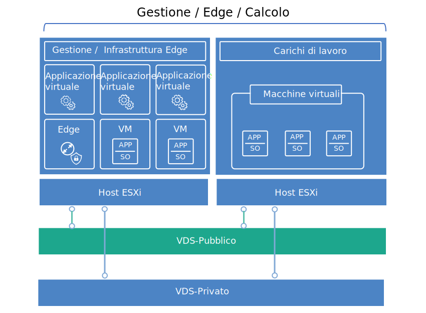

---

copyright:

  years:  2016, 2019

lastupdated: "2019-02-15"

---

{:tip: .tip}
{:note: .note}
{:important: .important}

# Progettazione dell'infrastruttura virtuale
{: #design_virtualinfrastructure}

Il livello dell'infrastruttura virtuale include i componenti software VMware che virtualizzano le risorse di calcolo, di archiviazione e di rete fornite nel livello dell'infrastruttura fisica: VMware vSphere ESXi, VMware NSX e facoltativamente VMware vSAN.

## Progettazione di VMware vSphere
{: #design_virtualinfrastructure-vsphere-design}

La configurazione di vSphere ESXi comprende i seguenti aspetti:
* Configurazione di boot
* Sincronizzazione temporale
* Accesso host
* Accesso utente
* Configurazione DNS

La Tabella 1 delinea le specifiche per ciascun aspetto. Dopo la configurazione e l'installazione di ESXi, l'host viene aggiunto a un VMware vCenter Server ed è gestito da lì.

Con questa progettazione, puoi accedere agli host virtuali tramite l'interfaccia utente della console diretta (DCUI), la shell ESXi e SSH (Secure Shell).

Per impostazione predefinita, gli unici utenti che possono accedere direttamente sono gli utenti _root_ e _ibmvmadmin_ per la macchina fisica dell'host. L'amministratore può aggiungere utenti dal dominio Microsoft Active Directory (MSAD) per abilitare l'accesso dell'utente all'host. Tutti gli host nella progettazione della soluzione vCenter Server sono configurati per la sincronizzazione con un server NTP centrale.

Tabella 1. Configurazione di vSphere ESXi

| Attributo              | Parametro di configurazione |
|:---------------------- |:----------------------- |
| Posizione di avvio ESXi     | Utilizza i dischi locali configurati in RAID-1 |
| Sincronizzazione temporale   | Utilizza il server NTP {{site.data.keyword.cloud}} |
| Accesso host            | Supporta DCUI, Shell ESXi o SSH |
| Accesso utente            | Autenticazione locale e MSAD |
| Risoluzione nomi di dominio | Utilizza DNS come descritto in [Progettazione di servizi comuni](/docs/services/vmwaresolutions/archiref/solution?topic=vmware-solutions-design_commonservice). |

Il cluster vSphere ospita le VM (Virtual Machine) che gestiscono il cloud centrale e le risorse di calcolo per i carichi di lavoro dell'utente.

Per le istanze Cloud Foundation:
* Un'istanza contiene 4 host ESXi nella distribuzione iniziale.
* Puoi ridimensionare fino a un massimo di 32 host ESXi dopo la distribuzione.

Per le istanze vCenter Server:
* Se un'istanza utilizza solo NFS, il numero minimo di host ESXi nella distribuzione iniziale è 2, ma se ne consigliano 3 per l'alta disponibilità (HA). Puoi ridimensionare fino a un massimo di 59 host ESXi durante o dopo la distribuzione iniziale.
* Se un'istanza utilizza vSAN, il numero minimo di host ESXi nella distribuzione iniziale è 4. Puoi ridimensionare fino a un massimo di 59 host ESXi durante o dopo la distribuzione iniziale.

Per supportare più carichi di lavoro dell'utente, puoi ridimensionare l'ambiente attraverso le seguenti modalità:  
* Distribuzione di ulteriori host di calcolo dei cluster esistenti
* Distribuzione di ulteriori cluster che vengono gestiti dallo stesso vCenter Server Appliance
* Distribuzione di nuove istanze vCenter Server o Cloud Foundation con il relativo vCenter Server Appliance

Per ulteriori informazioni sui cluster, vedi il [documento {{site.data.keyword.cloud_notm}} running VMware clusters solution
architecture](https://www.ibm.com/cloud/garage/files/IBM-Cloud-for-VMware-Solutions-Multicluster-Architecture.pdf).

## Progettazione di VMware vSAN
{: #design_virtualinfrastructure-vsan-design}

In questa progettazione, l'archiviazione VMware vSAN viene utilizzata nelle istanze Cloud Foundation e, facoltativamente, nelle istanze vCenter Server per fornire l'archiviazione condivisa per gli host vSphere.

Come mostrato nella Figura 1, vSAN aggrega l'archiviazione locale su più host ESXi all'interno di un cluster vSphere e gestisce l'archiviazione aggregata come un singolo archivio dati della VM. In questa progettazione, i nodi di calcolo contengono unità disco locali per il sistema operativo ESXi e l'archivio dati vSAN. Indipendentemente dal cluster a cui appartiene
un nodo, in ciascun nodo sono incluse due unità SATA da 1 TB per ospitare l'installazione ESXi.

Figura 1. Concetto vSAN

vSAN utilizza i seguenti componenti:
* Progettazione vSAN a due gruppi di dischi; ogni gruppo di dischi con due o più dischi. Nel gruppo, un SSD dalle dimensioni più piccole funge da livello di cache e gli SSD rimanenti fungono da livello di capacità.
* Il controller RAID integrato è configurato per ogni unità tranne che per le due unità del sistema operativo, a livello RAID-0.
* Un singolo archivio dati vSAN creato da tutta l'archiviazione.

Le funzioni vSAN disponibili dipendono dall'edizione della licenza che selezioni quando ordini l'istanza. Per ulteriori informazioni, vedi [Confronto delle edizioni di VMware vSAN](/docs/services/vmwaresolutions/archiref/solution?topic=vmware-solutions-solution-appendix#vmware-vsan-edition-comparison).

### Configurazione della rete virtuale per vSAN
{: #design_virtualinfrastructure-net-setup}

Per questa progettazione, il traffico vSAN attraversa gli host ESXi su una VLAN privata dedicata. I due adattatori di rete collegati allo switch di rete privata sono configurati all'interno di vSphere come vDS (vSphere Distributed Switch) con entrambi gli adattatori di rete come uplink. Un gruppo di porte kernel vSAN dedicato configurato per la VLAN vSAN risiede all'interno di vDS. I frame Jumbo (MTU 9000) sono abilitati per il vDS privato.

vSAN non bilancia il carico del traffico tra gli uplink. Di conseguenza, un adattatore è attivo mentre l'altro rimane in standby per supportare l'alta disponibilità (HA). La politica di failover della rete per vSAN è configurata come **Failover esplicito** tra le porte della rete fisica.

Per ulteriori informazioni sulle connessioni NIC fisiche, vedi la Figura 2. Connessioni NIC all'host fisico in [Progettazione dell'infrastruttura fisica](/docs/services/vmwaresolutions/archiref/solution?topic=vmware-solutions-design_physicalinfrastructure).

### Progettazione della politica di archiviazione
{: #design_virtualinfrastructure-storage-policy}

Se vSAN viene abilitato e configurato, le politiche di archiviazione sono configurate per definire le caratteristiche di archiviazione della VM. Le caratteristiche di archiviazione specificano diversi livelli di servizio per le diverse VM.

La politica di archiviazione predefinita in questa progettazione tollera un singolo errore. La politica predefinita è configurata con la codifica di cancellazione RAID 5, con il **Failure tolerance method** impostato su **RAID-5/6 (Erasure Coding) - Capacity** e **Primary level of failures** impostato su 1.

La configurazione RAID 5 richiede un minimo di quattro host. In alternativa, puoi scegliere la configurazione RAID 6 con **Failure tolerance method** impostato su **RAID-5/6 (Erasure Coding) - Capacity** e **Primary level of failures** impostato su 2.

La configurazione RAID 6 richiede un minimo di sei host. Nella politica di archiviazione predefinita sono abilitate anche la **duplicazione** e **compressione**.

Se non diversamente specificato dalla console vSphere, un'istanza utilizza la politica predefinita. Se viene configurata una politica personalizzata, vSAN la garantirà quando possibile. Tuttavia, se la politica non può essere garantita, non è possibile eseguire il provisioning di una VM che utilizza la politica a meno che non sia abilitata per forzare il provisioning.

Le politiche di archiviazione devono essere riapplicate dopo l'aggiunta di nuovi host ESXi o l'applicazione di patch degli host ESXi.

### Impostazioni vSAN
{: #design_virtualinfrastructure-vsan-sett}

Le impostazioni vSAN sono impostate in base alle procedure ottimali per la distribuzione di soluzioni VMware all'interno di {{site.data.keyword.cloud_notm}}. Le impostazioni vSAN includono le impostazioni SIOC, le impostazioni di failover esplicito per il gruppo di porte e le impostazioni della cache del disco.
* Impostazioni della politica di cache SSD: No **Read Ahead**, **Write Through**, **Direct** (NRWTD)
* Impostazioni del controllo I/O di rete
   * Gestione - 20 condivisioni
   * VM (Virtual Machine) - 30 condivisioni
   * vMotion - 50 condivisioni
   * vSAN - 100 condivisioni
* Porte kernel vSAN: **Failover esplicito**

## Progettazione di VMware NSX
{: #design_virtualinfrastructure-nsx-design}

La virtualizzazione di rete fornisce una sovrapposizione di rete che esiste all'interno del livello virtuale. La virtualizzazione di rete offre all'architettura funzioni quali provisioning rapido, distribuzione, riconfigurazione e distruzione di reti virtuali su richiesta. Questa progettazione utilizza vDS e VMware NSX for vSphere per implementare la rete virtuale.

In questa progettazione, NSX Manager viene distribuito nel cluster iniziale. A NSX Manager viene assegnato un indirizzo IP supportato dalla VLAN dal blocco di indirizzi portatili privati, che è designato per i componenti di gestione e configurato con i server DNS e NTP presentati in [Progettazione di servizi comuni](/docs/services/vmwaresolutions/archiref/solution?topic=vmware-solutions-design_commonservice). NSX Manager viene installato con le specifiche elencate nella Tabella 2.

Tabella 2. Attributi di NSX Manager

| Attributo       | Specifica |
|:--------------- |:------------- |
| NSX Manager     | Dispositivo virtuale |
| Numero di vCPU | 4 |
| Memoria          | 16 GB |
| Disco            | 60 GB sulla condivisione NFS di gestione |
| Tipo di disco       | Thin-provisioned |
| Rete         | **Privata A** portatile designata per i componenti di gestione |

La seguente figura mostra il posizionamento di NSX Manager in relazione ad altri componenti nell'architettura.

Figura 2. Panoramica della rete di NSX Manager

Dopo la distribuzione iniziale, l'automazione di {{site.data.keyword.cloud_notm}} distribuisce tre controller NSX all'interno del cluster iniziale. A ciascun controller viene assegnato un indirizzo IP supportato dalla VLAN dalla sottorete portatile **Privata A** designata per i componenti di gestione. Inoltre, la progettazione crea regole anti-affinità VM-VM per separare i controller tra gli host nel cluster. Il cluster iniziale deve contenere almeno tre nodi per garantire l'alta disponibilità per i controller.

Oltre ai controller, l'automazione di {{site.data.keyword.cloud_notm}} prepara gli host vSphere distribuiti con NSX VIB per abilitare l'uso di una rete virtualizzata tramite i VTEP (VXLAN Tunnel Endpoint). Ai VTEP viene assegnato un indirizzo IP supportato dalla VLAN dall'intervallo di indirizzi IP della sottorete portatile **Privata A** specificato per i VTEP, come indicato nella *Tabella 1. Riepilogo VLAN e sottorete* della [Progettazione dell'infrastruttura fisica](/docs/services/vmwaresolutions/archiref/solution?topic=vmware-solutions-design_physicalinfrastructure). Il traffico VXLAN risiede sulla VLAN senza tag ed è assegnato al vDS privato.

Successivamente, viene assegnato un pool di ID segmento e gli host nel cluster vengono aggiunti alla zona di trasporto. Nella zona di trasporto viene utilizzato solo unicast poiché lo snooping IGMP (Internet Group Management Protocol) non è configurato all'interno di {{site.data.keyword.cloud_notm}}.

Dopo di che, vengono distribuite le coppie di gateway dei servizi edge NSX. In tutti i casi, una coppia di gateway viene utilizzata per il traffico in uscita dai componenti di automazione che risiedono nella rete privata. Per vCenter Server, un secondo gateway noto come edge gestito dal cliente, viene distribuito e configurato con un uplink alla rete pubblica e un'interfaccia che è assegnata alla rete privata. Per ulteriori informazioni sui gateway dei servizi edge NSX che vengono distribuiti come parte della soluzione, vedi [NSX Edge on 	{{site.data.keyword.cloud_notm}} solution architecture](https://www.ibm.com/cloud/garage/files/IBM_Cloud_for_VMware_Solutions_NSX_Edge_Services_Gateway.pdf).

Gli amministratori cloud possono configurare qualsiasi componente NSX richiesto, come ad esempio DLR (Distributed Logical Router), switch logici e firewall. Le funzioni NSX disponibili dipendono dall'edizione della licenza NSX che scegli quando ordini l'istanza. Per ulteriori informazioni, vedi [Confronto delle edizioni di VMware NSX](/docs/services/vmwaresolutions/archiref/solution?topic=vmware-solutions-solution-appendix#vmware-nsx-edition-comparison). Per le istanze vCenter Server, l'automazione di {{site.data.keyword.cloud_notm}} aggiunge vCenter Server Appliance e PSC (Platform Services Controller) all'elenco di esclusione del firewall distribuito di NSX Manager.

### Progettazione di switch distribuiti
{: #design_virtualinfrastructure-distr-switch}

La progettazione utilizza un numero minimo di switch vDS. Gli host nel cluster sono connessi alle reti pubbliche e private. Gli host sono configurati con due switch virtuali distribuiti. L'utilizzo di due switch segue la procedura della rete {{site.data.keyword.cloud_notm}} che separa le reti pubbliche e private. Il seguente diagramma mostra la progettazione di vDS.

Figura 3. Progettazione di switch distribuiti

Come mostrato nella figura, un vDS è configurato per la connettività alla rete pubblica (SDDC-Dswitch-Public) e l'altro vDS è configurato per la connettività alla rete privata (SDDC-Dswitch-Private).

Separare i diversi tipi di traffico è necessario per ridurre il conflitto e la latenza e aumentare la sicurezza. Le VLAN vengono utilizzate per segmentare le funzioni della rete fisica.

Questa progettazione utilizza tre VLAN: due per il traffico della rete privata e una per il traffico della rete pubblica. La seguente tabella mostra la separazione del traffico.

Tabella 3. Associazione della VLAN ai tipi di traffico

| VLAN  | Designazione | Tipo di traffico |
|:----- |:----------- |:------------ |
| VLAN1 | Pubblica      | Disponibile per l'accesso a Internet |
| VLAN2 | Privata A   | Gestione ESXi, gestione, VXLAN (VTEP) |
| VLAN3 | Privata B   | vSAN, NFS, vMotion |

Il traffico dai carichi di lavoro viaggerà su switch logici supportati dalla VXLAN.

Il cluster vSphere utilizza due VDS (vSphere Distributed Switch) configurati come nelle seguenti tabelle.

Tabella 4. Switch distribuiti del cluster convergente

| Nome VDS (vSphere Distributed  Switch) | Funzione | Rete Controllo I/O | Bilanciamento del carico Modalità | Porte NIC  fisiche | MTU |
|:------------- |:------------- |:------------- |:------------- |:------------- |:------------- |
| SDDC-Dswitch-Private | Gestione ESXi, vSAN, vSphere vMotion, VXLAN tunnel endpoint, NFS (VTEP) | Abilitato | Rotta basata sulla porta virtuale di origine con failover esplicito (vSAN, vMotion) (principale) | 2 | 9.000 (Frame Jumbo) |
| SDDC-Dswitch-Public | Traffico di gestione esterno (nord-sud) | Abilitato | Rotta basata sulla porta virtuale di origine | 2 | 1.500 (predefinito) |

I nomi, il numero e l'ordine delle NIC host possono variare in base al {{site.data.keyword.CloudDataCent_notm}} e alla tua selezione dell'hardware host.
{:note}

Tabella 5. Impostazioni di configurazione del gruppo di porte degli switch distribuiti del cluster convergente

| Parametro          | Impostazione       |
|:------------------ |:------------- |
| Bilanciamento del carico     | Rotta basata sulla porta virtuale di origine \* |
| Rilevamento failover | Solo stato del collegamento |
| Notifica switch    | Abilitato |
| Failback           | No |
| Ordine di failover     | Uplink attivi: Uplink1, Uplink2 \* |

\* Il gruppo di porte vSAN utilizza il failover esplicito con attivo o standby perché non supporta il bilanciamento del carico del traffico di archiviazione vSAN.
{:note}

Tabella 6. Gruppi di porte e VLAN degli switch virtuali del cluster convergente

| vDS (vSphere Distributed Switch) | Nome gruppo di porte | Teaming | Uplink | ID VLAN |
|:------------- |:------------- |:------------- |:------------- |:---------- |
| SDDC-Dswitch-Private | SDDC-DPortGroup-Mgmt | Porta virtuale di origine | Attivo: 0, 1 | VLAN1 |
| SDDC-Dswitch-Private | SDDC-DPortGroup-vMotion | Porta virtuale di origine | Attivo: 0, 1 | VLAN2 |
| SDDC-Dswitch-Private | SDDC-DPortGroup-VSAN | Failover esplicito | Attivo: 0 Standby: 1 | VLAN2 |
| SDDC-Dswitch-Private | SDDC-DPortGroup-NFS | Porta virtuale di origine | Attivo: 0, 1 | VLAN2 |
| SDDC-Dswitch-Private | Generato automaticamente da NSX | Porta virtuale di origine | Attivo: 0, 1 | VLAN1 |
| SDDC-Dswitch-Public | SDDC-DPortGroup-External | Porta virtuale di origine | Attivo: 0, 1 | VLAN3 |

Tabella 7. Adattatori del kernel di VM del cluster convergente

| vDS (vSphere Distributed Switch) | Scopo | Gruppo di porte connesse | Servizi abilitati | MTU |
|:-------------------------- |:------- |:-------------------- |:---------------- |:--- |
| SDDC-Dswitch-Private | Gestione | SDDC-DPortGroup-Mgmt | Traffico di gestione | 1.500 (predefinito) |
| SDDC-Dswitch-Private | vMotion | SDDC-DPortGroup-vMotion | Traffico vMotion | 9.000 |
| SDDC-Dswitch-Private | VTEP | *Generato automaticamente da NSX* | \- | 9.000 |
| SDDC-Dswitch-Private | VSAN | SDDC-DPortGroup-VSAN | vSAN | 9.000 |
| SDDC-Dswitch-Private | NAS | SDDC-DPortGroup-NFS | \-  | 9.000 |

### Configurazione di NSX
{: #design_virtualinfrastructure-nsx-config}

Questa progettazione specifica la configurazione dei componenti NSX ma non applica alcuna configurazione dei componenti della sovrapposizione di rete. Puoi progettare la sovrapposizione di rete in base alle tue esigenze. Gli aspetti elencati di seguito sono preconfigurati:

* I server di gestione e i controller sono installati e integrati nell'interfaccia utente web vCenter
* Gli agent ESXi sono installati e gli indirizzi IP VTEP sono configurati per ogni host ESXi
* Configurazione VTEP, configurazione dei controller e configurazione VXLAN (zona di trasporto)
* Dispositivi Gateway dei servizi edge NSX utilizzabili dai componenti di gestione
* Solo per le istanze vCenter Server: dispositivi Gateway dei servizi edge NSX per l'utilizzo da parte dei clienti

I seguenti aspetti non sono configurati:
* Router distribuiti virtuali
* Micro segmentazione
* VXLAN
* Gestione NSX collegata ad altre istanze VMware

## Link correlati
{: #design_virtualinfrastructure-related}

* [{{site.data.keyword.cloud_notm}} running VMware clusters solution architecture](https://www.ibm.com/cloud/garage/files/IBM-Cloud-for-VMware-Solutions-Multicluster-Architecture.pdf)
* [NSX Edge on {{site.data.keyword.cloud_notm}} solution architecture](https://www.ibm.com/cloud/garage/files/IBM_Cloud_for_VMware_Solutions_NSX_Edge_Services_Gateway.pdf)
