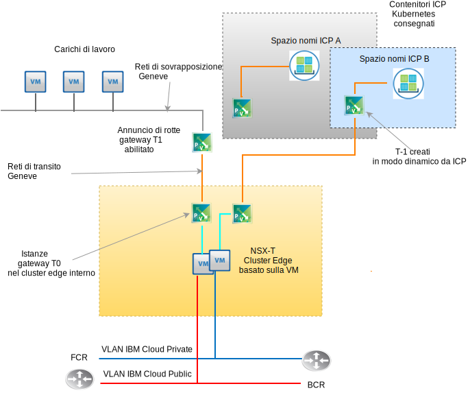

---

copyright:

  years:  2016, 2019

lastupdated: "2019-03-19"

subcollection: vmware-solutions

---

# Progettazione di VMware NSX-T
{: #nsx-t-design}

A differenza di NSX-V (NSX on vSphere), VMware NSX-T è progettato per i framework applicativi e le architetture che hanno endpoint eterogenei e stack tecnologici. Oltre a vSphere, questi ambienti possono includere altri hypervisor, KVM, contenitori e bare metal. NSX è progettato per suddividere un'infrastruttura di sicurezza e una rete definita dal software tra le piattaforme invece che solo su vSphere. Mentre è possibile distribuire i componenti di NSX-T senza il bisogno di vSphere, questa progettazione si focalizza su NSX-T e la sua integrazione principalmente all'interno di una distribuzione automatizzata di vCenter Server vSphere.

Esistono molte funzioni avanzate all'interno di NSX-T come le politiche del firewall, l'inclusione di guest introspection nelle politiche del firewall e il tracciamento del flusso di rete avanzato. La descrizione di queste funzioni esula dallo scopo di questo documento. Vedi la documentazione di VMware per NSX-T. In questa progettazione, l'infrastruttura di gestione NSX-T viene distribuita durante la distribuzione del cluster vCenter Server iniziale al posto di NSX-V.

## NSX-T rispetto a NSX-V
{: #nsx-t-design-nsx-t-nsx-v}

Per vSphere native NSX (NSX-V), esamina i seguenti oggetti NSX-T meglio conosciuti con funzioni simili alle rispettive controparti NSX-V. Vengono anche trattate anche le limitazioni e le differenze all'interno di un ambiente vSphere. Questa è una tabella di funzioni normalmente utilizzate tra T e V che corrispondono.

Tabella 1. Terminologia da NSX-V a NSX-T

NSX-V o vSphere native | NSX-T
--|:---|:--
**Switch distribuito virtuale** | Switch distribuito virtuale di rete (N-VDS)
**NSX Transport zone** | Zona di trasporto (overlay o backend della VLAN)
**Gruppo di porte (vDS)** | Switch logico
**VXLAN (incapsulamento L2)** | GENEVE (incapsulamento L2)
**Gateway edge** | Gateway T0 (modificato con v2.4)
**Router logico distribuito** | Gateway T1 (modificato con v2.4)
**Server ESXi (vTEP)** | Nodo di trasporto (ESXi, KVM, Gateway T0 Bare metal)

Esistono alcuni concetti chiave di NSX-T che non hanno corrispondenze con delle funzioni NSX-V che devono essere compresi per l'implementazione di questa progettazione di NSX-T.

Come segue:
- Un cluster edge è formato da una o più VM o macchine fisiche che fanno parte di un fabric virtuale NSX-T. Sono endpoint per le zone di trasporto della rete di sovrapposizione e di backend della VLAN. Un cluster edge può supportare più istanze gateway T-0.
- Un gateway T-0 è un'istanza router virtuale, ma non una VM. Più istanze gateway T-0 possono essere eseguite all'interno di cluster edge, ognuna delle quali con le proprie funzioni e tabella di instradamento. Questo significa che un cluster edge deve esistere prima di poter creare un'istanza router T-0.
- Una zona di trasporto può suddividere gli endpoint tra piattaforme diverse e più istanze vSphere vCenter. Non è necessario alcun cross vCenter collegato a NSX. Le zone di trasporto possono essere escluse da endpoint specifici. Un N-VDS viene correlato direttamente a una zona di trasporto e viene creato quando viene creata la zona di trasporto.
- L'ordine di failover dell'uplink viene creato per essere indipendente da uno switch logico in particolare perché viene creato in profili come “Profili di uplink” e applicato a uno switch logico in particolare basato sulla VLAN. Poiché potrebbe essere necessario avere degli ordini di failover e del bilanciamento del carico di uplink fisici diversi per la stessa VLAN, il profilo di uplink per una particolare VLAN può contenere più voci per “Teaming” con ordine di failover e bilanciamento del carico diversi. Quando assegni il profilo di uplink a uno switch logico, viene scelto il profilo di teaming specifico.

- A partire da NSX-T 2.4, le funzioni VM manager e VM controller vengono combinate. Di conseguenza vengono distribuite tre VM manager-controller. Se sono sulla stessa rete, utilizzano un programma di bilanciamento del carico della rete interno. Se sono in più sottoreti, è necessario un programma di bilanciamento del carico esterno.

## Requisiti della risorsa
{: #nsx-t-design-resource-req}

In questa progettazione, la VM manager-controller NSX-T viene distribuita sul cluster iniziale. Inoltre, a ogni manager-controller viene assegnato un indirizzo IP di backend della VLAN dal blocco di indirizzi portatili privato progettato per i componenti di gestione e configurato con i server DNS e NTP di cui si è trattato nella sezione 0. Un riepilogo dell'installazione di NSX Manager viene mostrato nella seguente tabella.

Tabella 2. Specifiche NSX-T Manager - controller

Attributo | Specifica
--|--
**NSX Manager / Controller** | 3 dispositivi virtuali
**Numero di CPU virtuali** | 4
**Memoria** |  16 GB
**Disco** | 60 GB
**Tipo di disco** | Thin provisioned
**NetworkPrivate A** | Privata A

La seguente figura mostra il posizionamento di NSX Manager-controller in relazione agli altri componenti in questa architettura.

Figura 1. Panoramica della rete NSX-T Manager

## Considerazioni sulla distribuzione
{: #nsx-t-design-deployment}

Con NSX-T on vSphere, l'N-VDS deve essere assegnato agli adattatori fisici all'interno degli host. Poiché un N-VDS può essere configurato solo all'interno di un NSX-T Manager, questo implica che se deve essere mantenuta la ridondanza, nessun adattatore fisico è disponibile per lo switch locale nativo o l'assegnazione vDS in un cluster che ospita sia i componenti NSX-T che i componenti della rete di sovrapposizione associati.

Per questo motivo, durante l'installazione di NSX-T e della relativa configurazione, una porta NIC fisica su un adattatore deve rimanere assegnata a un vSwitch locale o a un vDS (virtual distributed switch) vSphere. Dopo la distribuzione NSX-T, tutte le porte kernel ESX devono essere migrate a un N-VDS e trasferite da qualsiasi vSwitch locale o VDS. Dopo che sono state rimosse le porte kernel, le porte NIC fisiche rimanenti possono essere assegnate come un uplink N-VDS per il raggiungimento della ridondanza di N-VDS.

Dopo la distribuzione iniziale, l'automazione di {{site.data.keyword.cloud_notm}} distribuisce tre dispositivi virtuali NSX-T Manager/Controller all'interno del cluster iniziale. Ai controller viene assegnato un indirizzo IP di backend della VLAN dalla sottorete portatile Privata A progettato per i componenti di gestione. Inoltre, le regole di anti–affinità VM–VM vengono create in modo che i controller siano separati tra gli host nel cluster.

Devi distribuire il cluster iniziale con un minimo di tre nodi per garantire l'alta disponibilità per i Manager / Controller. Oltre ai manager / controller, l'automazione di {{site.data.keyword.cloud_notm}} prepara gli host vSphere distribuiti come nodi di trasporto NSX-T. Ai nodi di trasporto ESXi viene assegnato un indirizzo IP di backend della VLAN dall'intervallo di indirizzi IP portatili della rete Privata A che viene specificato da un intervallo di pool di IP NSX calcolato dalla VLAN e dal riepilogo della sottorete. Il traffico del nodo di trasporto risiede sulla VLAN senza tag ed è assegnato al N-VDS (NSX-T virtual distributed switch) privato.

A seconda della topologia NSX-T scelta dal cliente per la distribuzione, un cluster edge NSX-T viene distribuito come una coppia di VM o come un software distribuito sui nodi cluster bare metal. Indipendentemente se la coppia di cluster è virtuale o fisica, gli uplink vengono configurati per gli switch N-VDS per le reti privata e pubblica di {{site.data.keyword.cloud_notm}}.

La seguente tabella riepiloga i requisiti per un ambiente di medie dimensioni.

Tabella 3. Specifica del componente NSX-T

 Risorse | Manager controller x3 | Cluster edge x2 | Edge Bare Metal
-----------|:---------|:-------|:---------
**Dimensione media** | Dispositivo virtuale | Dispositivo virtuale | Server fisico
**Numero di CPU virtuali** | 4 | 4 | 8
**Memoria** | 16 GB | 8 GB | 32 GB
**Disco** | 120 GB VSAN/management NFS | 120 GB VSAN/management NFS | 200 GB
**Tipo di disco** | Thin provisioned | Thin provisioned | Fisico
**Rete** | Privata A | Privata A | Privata A

## Zone di trasporto e N-VDS
{: #nsx-t-design-transport-zones}

Le zone di trasporto indicano quali host e VM possono partecipare all'utilizzo di una rete particolare. Una zona di trasporto fa ciò limitando gli host che possono "vedere" uno switch logico e di conseguenza, quali VM possono essere collegate allo switch logico. Una zona di trasporto può suddividere uno o più cluster host. Questa progettazione richiede che le zone di trasporto vengano create nel seguente modo:

Tabella 4. Zone di trasporto NSX-T e N-VDS

Nome della zona di trasporto | VLAN/VXLAN | Nome N-VDS | Politica di teaming uplink
--|:-------|:------|:-----
**Private-Overlay** | VXLAN | SDDC-Overlay | Predefinita
**Public-VLAN** | VLAN | SDDC-Public | Predefinita
**Private-VLAN** | VLAN | SDDC-Private | NFS,vSAN,iSCSI-A&B predefinita

## Nodi di trasporto
{: #nsx-t-design-transport-nodes}

I nodi di trasporto definiscono le VM o gli oggetti server fisici che partecipano al fabric della rete virtuale. Rivedi la seguente tabella per comprendere la progettazione.

Tabella 5. Nodi di trasporto NSX-T

Tipo di nodo di trasporto | N-VDS | Profilo di uplink | Assegnazione IP | NIC fisiche
--|:--------|:--------|:---
**ESXi** | SDDC-Private | SDDC-Private-uplink | Pool IP | vmnic0, vmnic2
**Cluster edge** | SDDC-Overlay | SDDC-Overlay-uplink | Pool IP | N/A
**Edge fisico** | SDDC-Private | SDDC-Private-uplink | Pool IP | eth0, eth2

## Profili di uplink
{: #nsx-t-design-uplink-profiles}

Un profilo di uplink definisce le politiche per i link dagli host hypervisor agli switch logici NSX-T o dai nodi edge NSX agli switch top-of-rack.

Tabella 6. Profili di uplink NSX-T

Nome profilo di uplink | VLAN | Teaming inclusi | MTU
--|:-----|:---|:---
**SDDC-Private-Uplink** | predefinita | Predefinito, Gestione | 9000
**SDDC-Public-Uplink** | predefinita| Predefinito | 1500
**SDDC-Storage-Uplink** | VLAN di archiviazione | vSAN, iSCSI-A&B,NFS | 9000

## Teaming
{: #nsx-t-design-teaming}

Tabella 7. Specifiche teaming porta NIC NSX-T

Nome teaming | Failover o bilanciamento carico | NIC attiva | NIC standby
--|:----|:---|:---
**Valore predefinito** | Origine bilanciamento carico | Uplink 1, 2 | N/A
**Gestione** | Failover| Uplink 1 | Uplink 2
**TEP** | Failover| Uplink 1 | Uplink 1
**vSAN** | Failover| Uplink 2 | Uplink 1
**iSCSI-A** | Failover| Uplink 1 | N/A
**iSCSI-B** | Failover| Uplink 2 | N/A
**NFS** | Origine bilanciamento carico | Uplink 1, 2 | Uplink 1
**vMotion** | Failover| Uplink 2 | Uplink 1

## Pool VNI
{: #nsx-t-design-vni-pools}

I VNI (Virtual Network Identifier) sono simili alle VLAN su una rete fisica. Vengono automaticamente creati quando viene creato uno switch logico da un pool o un intervallo di ID. Questa progettazione utilizza il pool VNI predefinito distribuito con NSX-T.

## Switch logici
{: #nsx-t-design-logical-switches}

Uno switch logico NSX-T riproduce le funzioni di switch, il traffico broadcast, unicast sconosciuto, multicast (BUM), in un ambiente virtuale completamente disaccoppiato dall'hardware sottostante.

Tabella 8. Switch logici NSX-T

Nome switch logico | VLAN |Zona di trasporto | Politica di teaming uplink
--|:---|:----|:---
**SDDC-LS-Mgmt** | predefinita | Private-VLAN | Gestione
**SDDC-LS-NFS** | predefinita | Private-VLAN | NFS
**SDDC-LS-vMotion** | predefinita | Private-VLAN | vMotion
**SDDC-LS-VSAN** | VLAN di archiviazione con tag | Private-VLAN | vSAN
**SDDC-LS-iSCSI-A** | VLAN di archiviazione con tag | Private-VLAN| iSCSI-A
**SDDC-LS-iSCSi-B** | VLAN di archiviazione con tag | Private-VLAN| iSCSi-B
**SDDC-LS-TEP** | predefinita | Private-VLAN| TEP
**SDDC-LS-External** | Predefinita | Public-VLAN | Predefinita

### Cluster Edge
{: #nsx-t-design-edge-cluster}

All'interno di questa progettazione viene eseguito il provisioning di un solo cluster edge virtuale da utilizzare per la gestione e i carichi di lavoro del cliente. Il cluster edge virtuale può ospitare più istanze dei gateway T0. Come descritto precedentemente, più istanze gateway edge T0 possono essere istanziate su un singolo cluster edge, ognuna con le proprie tabelle di instradamento. Vedi la seguente figura con i diagrammi e i componenti funzionali di un cluster edge NSX-T.

Figura 2. Esempio di cluster edge NSX-T di ridimensionamento da T0 a T1

Figura 3. Gestione del gateway T0 

#### Gateway logico Tier 0
{: #nsx-t-design-tier-0}

Un router logico NSX-T Tier-0 fornisce un servizio gateway di attivazione e disattivazione tra le reti fisica e logica. Per questa progettazione, vengono distribuiti più gateway T-0 per scopi di gestione, componenti aggiuntivi e facoltativamente per le topologie scelte dal cliente.

#### Gateway logico Tier 1
{: #nsx-t-design-tier-1}

Un gateway logico NSX-T Tier-1 ha porte di downlink per la connessione agli switch logici del data center NSX-T e porte di uplink per la connessione solo ai router logici Tier-0 del data center NSX-T. Vengono eseguiti al livello kernel dell'hypervisor per cui sono configurati e non come una macchina virtuale o fisica. Per questa progettazione, vengono creati uno o più gateway logici T-1 per le esigenze delle topologie scelte dal cliente.

#### Annuncio di rotte da Tier 1 a Tier 0
{: #nsx-t-design-tier-1-tier-0}

Per fornire la connettività a tre livelli tra le VM connesse agli switch logici collegate a gateway logici tier-1 diversi, è necessario abilitare l'annuncio di rotte tier-1 verso le tier-0. Non è necessario configurare un protocollo di instradamento o delle rotte statiche tra i router logici tier-1 e tier-0. NSX-T crea le rotte statiche automaticamente quando abiliti l'annuncio di rotte. Per questa progettazione, l'annuncio di rotte è sempre abilitato per tutti i gateway T-1 creati dall'automazione IC4V.

### Topologie preconfigurate
{: #nsx-t-design-preconfig-topo}

Carico di lavoro dal gateway T1 al T0 – Cluster edge virtuale

Figura 4. Gateway edge T0 virtuale della topologia distribuita NSX-T

La topologia 1 distribuita da IC4V è essenzialmente la stessa topologia distribuita con i gateway Edge e DLR NSX-V. Con NSX-T, non è presente alcuna configurazione del protocollo di instradamento dinamico tra T1 e T0. Viene utilizzato lo spazio di indirizzi IP RFC-1891 per la rete di sovrapposizione del carico di lavoro e di transito. Viene assegnato uno spazio dell'IP portatile pubblico e privato per l'utilizzo da parte del cliente. Viene assegnato uno spazio dell'IP portatile pubblico e privato {{site.data.keyword.cloud_notm}} designato al T0 per l'utilizzo da parte del cliente.

A partire da questa progettazione, hai l'opzione di non eliminare questi intervalli di IP se l'istanza vCenter Server viene disattivata ed eliminata.

Carico di lavoro dal gateway T1 al T0 – Cluster edge fisico:

Figura 5. Gateway edge T0 fisico della topologia distribuita NSX-T

La topologia 2 distribuita è simile all'eccezione che sostituisce il cluster edge basato sulla VM con una coppia di server bare metal che eseguono il server Red Hat. Viene assegnato uno spazio dell'IP portatile pubblico e privato {{site.data.keyword.cloud_notm}} designato al T0 per l'utilizzo da parte del cliente. A partire da questa progettazione, hai l'opzione di non eliminare questi intervalli di IP se l'istanza vCenter Server viene disattivata ed eliminata.

Vedi il documento o il link separato per la distinta base delle specifiche hardware e SO.

Carico di lavoro con ICP al gateway T0 – Cluster edge virtuale:

Figura 6. Topologia distribuita NSX-T con integrazione ICP NSX-T e gateway edge T0 virtuale

La topologia 3 distribuita contiene la topologia 1 con l'aggiunta di una distribuzione ICP che include l'integrazione NSX-T al posto di Calico, che è uno stack di rete predefinito all'interno di una distribuzione ICP. Il cliente può eseguire il provisioning di ulteriori spazi di nomi del contenitore all'interno di ICP, che automatizza la creazione di switch logici, sottorete di IP e istanze gateway T1 per ogni spazio dei nomi.

Per una descrizione completa di come ICP funziona su vCenter Server, vedi la documentazione dell'architettura di ICP su vCenter Server. Viene assegnato uno spazio dell'IP portatile pubblico e privato {{site.data.keyword.cloud_notm}} designato ad ogni T0 per l'utilizzo da parte del cliente.

A partire da questa progettazione, hai l'opzione di non eliminare questi intervalli di IP se l'istanza vCenter Server viene disattivata ed eliminata.

## Link correlati
{: #nsx-t-design-related}

* [Panoramica di vCenter Server on {{site.data.keyword.cloud_notm}} with Hybridity Bundle](/docs/services/vmwaresolutions/archiref/vcs?topic=vmware-solutions-vcs-hybridity-intro)
