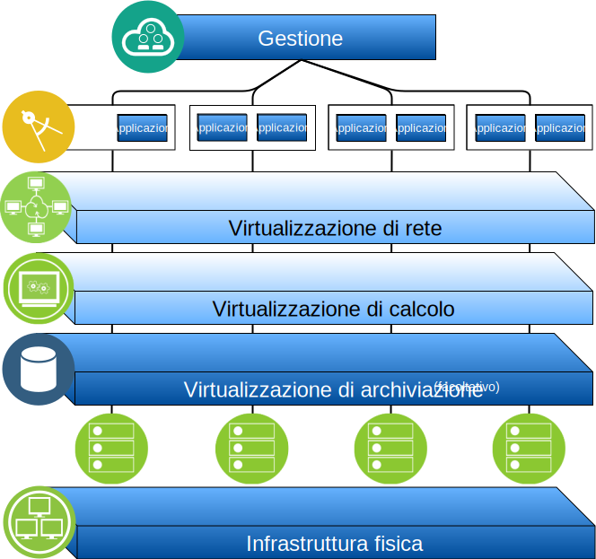

---

copyright:

  years:  2016, 2019

lastupdated: "2019-03-15"

subcollection: vmwaresolutions

---

# Panoramica su IBM Cloud for VMware Solutions
{: #solution_overview}

Le offerte {{site.data.keyword.vmwaresolutions_full}} ti consentono di estendere il tuo data center virtualizzato VMware esistente in {{site.data.keyword.cloud_notm}} o di ospitare le applicazioni native cloud.

La soluzione supporta casi di utilizzo come l'espansione della capacità nel cloud (e la contrazione quando non necessaria), la migrazione al cloud e il ripristino di emergenza e backup nel cloud. Con la soluzione, puoi creare un ambiente cloud dedicato per sviluppo, test, formazione, laboratorio o produzione.

Esamina queste informazioni per la progettazione di {{site.data.keyword.vmwaresolutions_short}} vCenter Server, i cui carichi di lavoro di destinazione richiedono elevati livelli di disponibilità e scalabilità.

Questa progettazione funge da architettura di base che fornisce le fondamenta per l'aggiunta di altri componenti interni o specifici del fornitore per casi di utilizzo particolari.

Figura 1. Panoramica di VMware on {{site.data.keyword.cloud_notm}}

## Vantaggi principali di IBM Cloud for VMware Solutions
{: #solution_overview-benefits}

VMware vCenter Server on {{site.data.keyword.cloud_notm}} fornisce gli elementi costitutivi fondamentali, tra cui VMware vSphere, vCenter Server, NSX e le opzioni di archiviazione condivisa, come ad esempio vSAN. Questi componenti sono necessari per progettare in modo flessibile una soluzione di data center definito dal software VMware che meglio si adatta ai tuoi carichi di lavoro.

Applicando l'automazione avanzata e l'infrastruttura bare metal a singolo tenant, puoi distribuire rapidamente l'intero ambiente VMware su {{site.data.keyword.cloud_notm}} in poche ore. Puoi quindi accedere e gestire l'ambiente ospitato da IBM tramite client VMware nativi, CLI (Command Line Interface), script esistenti o altri strumenti compatibili con l'API vSphere.

Dopo la distribuzione, puoi aggiungere ai (o rimuovere dai) server ESXi un'istanza, aggiungere e rimuovere i cluster, unire ulteriori istanze vCenter Server a un'istanza esistente e aggiungere prodotti e servizi utilizzando la console {{site.data.keyword.vmwaresolutions_short}}. È tua responsabilità monitorare e gestire le istanze di vCenter Server.

La tua responsabilità include backup, installazione di patch, configurazione e monitoraggio del software VMware e dell'hardware hypervisor sottostante. {{site.data.keyword.vmwaresolutions_short}} offre soluzioni automatizzate per aiutarti con il monitoraggio e la gestione in corso dell'istanza vCenter Server.

Inoltre, i servizi professionali e i servizi gestiti da {{site.data.keyword.cloud_notm}} sono disponibili per accelerare il tuo viaggio verso il cloud con offerte come i servizi di migrazione, implementazione e incorporazione.

A differenza dell'offerta del servizio gestito, vCenter Server ti fornisce l'accesso completo a tutti i componenti che permettono una maggiore flessibilità rispetto a quella offerta dal servizio gestito. Tuttavia, esistono alcuni vincoli da applicare per consentire il funzionamento di IBM Cloud for VMware Solutions, dopo la distribuzione di vCenter Server.

Le offerte VMware on {{site.data.keyword.cloud_notm}} forniscono i seguenti vantaggi:

* **Accelerazione della fornitura** di progetti IT per sviluppatori e linee di business riducendo il tempo necessario per approvvigionamento, architettura, implementazione e distribuzione di risorse da settimane, o anche mesi, ad alcune ore.
* **Miglioramento della sicurezza** con server Bare Metal dedicati in un cloud privato ospitato, inclusa la crittografia dei dati inattivi. Per l'archiviazione vSAN, la crittografia dei dati inattivi è facoltativa utilizzando la crittografia vSAN o vSphere. Per l'archiviazione al livello di file o al livello di blocchi condivisa, la crittografia gestita dal provider del servizio dei dati inattivi è disponibile per impostazione predefinita in data center selezionati oppure è facoltativa utilizzando la crittografia vSphere. Devi gestire le chiavi di crittografia necessarie.
* **Abilitazione di una gestione e una governance coerenti** del cloud ibrido distribuito fornendo un accesso amministrativo completo alla gestione della virtualizzazione, preservando così gli strumenti, gli script e gli investimenti VMware esistenti nella formazione.
* **Utilizza le competenze VMware su scala globale** con i servizi professionali e gestiti di IBM disponibili in più di 30 {{site.data.keyword.CloudDataCents_notm}} in tutto il mondo.

## Link correlati
{: #solution_overview-related}

* [Panoramica della progettazione](/docs/services/vmwaresolutions/archiref/solution?topic=vmware-solutions-design_overview)
* [Ridimensionamento della capacità](/docs/services/vmwaresolutions/archiref/solution?topic=vmware-solutions-solution_scaling)
* [Backup dei componenti](/docs/services/vmwaresolutions/archiref/solution?topic=vmware-solutions-solution_backingup)
