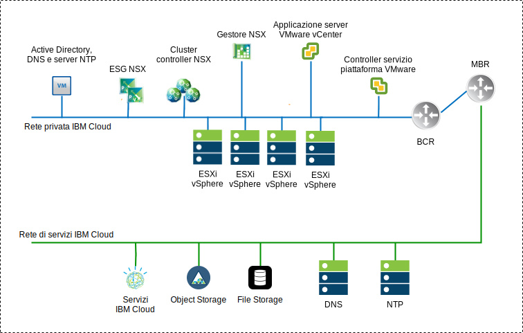
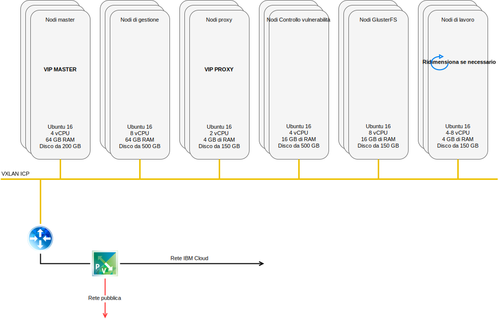
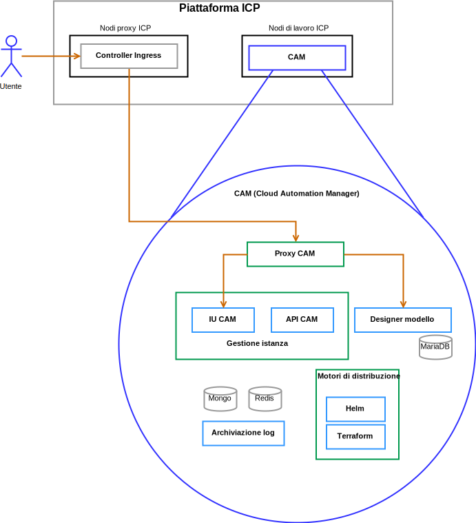

---

copyright:

  years:  2016, 2019

lastupdated: "2019-03-04"

---

# Componenti della soluzione
{: #vcscar-arch-overview-solution}

## Componenti di VMware vCenter Server on IBM Cloud
{: #vcscar-arch-overview-solution-vcs-comp}

Figura 1. Diagramma dell'ambiente vCenter Server

### Controller servizio piattaforma
{: #vcscar-arch-overview-solution-psc}

La distribuzione vCenter Server utilizza un solo controller di servizi della piattaforma esterno installato su una sottorete portatile nella VLAN privata associata alle VM (Virtual Machine) di gestione. Il suo gateway predefinito è impostato sul BCR (backend customer router).

### vCenter Server
{: #vcscar-arch-overview-solution-vcs}

Come il controller dei servizi della piattaforma, il vCenter Server viene distribuito come un'applicazione. Inoltre, vCenter Server viene installato su una sottorete portatile nella VLAN privata associata alle VM (Virtual Machine) di gestione. Il suo gateway predefinito è impostato sull'indirizzo IP assegnato sul BCR per quella particolare sottorete.

### NSX Manager
{: #vcscar-arch-overview-solution-nsx-manager}

NSX Manager viene distribuito sul cluster iniziale. Inoltre, a NSX Manager viene assegnato un indirizzo IP di backend della VLAN dal blocco di indirizzi portatile privato progettato per i componenti di gestione e configurato con i server DNS e NTP

### Controller NSX
{: #vcscar-arch-overview-solution-nsx-controllers}

L'automazione di {{site.data.keyword.cloud}} distribuisce tre controller NSX all'interno del cluster iniziale. Ai controller viene assegnato un indirizzo IP di backend della VLAN dalla sottorete portatile privata progettato per i componenti di gestione.

### Edge NSX e Distributed Logical Router
{: #vcscar-arch-overview-solution-nsx-edge}

Vengono distribuite coppie di gateway dei servizi edge (ESG) NSX. In tutti i casi, una coppia di gateway viene utilizzata per il traffico in uscita dai componenti di automazione che risiedono sulla rete privata. Per vCenter Server e {{site.data.keyword.icpfull_notm}}, un secondo gateway noto come edge gestito da ICP, viene distribuito e configurato con un uplink alla rete pubblica e un'interfaccia che è assegnata alla rete privata. L'amministratore può configurare qualsiasi componente NSX richiesto, come ad esempio DLR (Distributed Logical Router), switch logici e firewall.

Per ulteriori informazioni sulla progettazione della rete, vedi [Architettura di riferimento della rete di vCenter Server](/docs/services/vmwaresolutions/archiref/vcsnsxt?topic=vmware-solutions-vcsnsxt-intro).

La seguente tabella riepiloga le specifiche ESG e DLR {{site.data.keyword.icpfull_notm}}.

Tabella 1. Specifiche ESG {{site.data.keyword.icpfull_notm}}

Attributo | Specifica
--|--
Gateway servizio edge | Dispositivo virtuale
Dimensione Edge    Large | Numero di vCPUs	2
Memoria    | 1 GB
Disco    | 1000 GB sul datastore locale

Tabella 2. Specifiche DLR {{site.data.keyword.icpfull_notm}}

Attributo | Specifica
--|--|
Router logico distribuito |     Dispositivo virtuale
Dimensione Edge    Compact | Numero di vCPUs	1
Memoria    | 512 MB
Disco    | 1000 GB sul datastore locale

## Componenti IBM Cloud Private
{: #vcscar-arch-overview-solution-icp-comp}

{{site.data.keyword.icpfull_notm}} è una piattaforma dell'applicazione per lo sviluppo e la gestione di applicazioni
inserite nei contenitori in loco. {{site.data.keyword.icpfull_notm}} è un ambiente integrato per la gestione
dei contenitori che include l'orchestrazione del contenitore Kubernetes, un
repository di immagini privato, una console di gestione e i
framework di monitoraggio.

Figura 2. Distribuzione {{site.data.keyword.icpfull_notm}} virtuale con vCenter Server

### Nodo di avvio
{: #vcscar-arch-overview-solution-boot-node}

Un nodo di avvio o bootstrap (facoltativo) viene utilizzato per l'esecuzione dell'installazione, della configurazione, della scalabilità del nodo e degli aggiornamenti del cluster. Per ogni cluster è necessario un solo nodo di avvio. Utilizza un solo nodo sia per il master che per l'avvio.

### Nodo master
{: #vcscar-arch-overview-solution-master-node}

Un nodo master fornisce servizi di gestione e controlla i nodi di lavoro in un cluster. I nodi master ospitano i processi che sono responsabili dell'allocazione delle risorse, della manutenzione dello stato, della pianificazione e del monitoraggio.

Poiché un ambiente ad elevata disponibilità (HA) presenta più di un singolo nodo master, se il nodo master principale ha un malfunzionamento, la logica di failover promuove automaticamente un nodo differente al ruolo master. Gli host che possono funzionare come master sono detti candidati master.

### Nodo di lavoro
{: #vcscar-arch-overview-solution-worker-node}

Un nodo di lavoro è un nodo che fornisce un ambiente contenitore per l'esecuzione delle attività. Man mano che la domanda aumenta, è possibile aggiungere più nodi di lavoro al cluster in modo da migliorare le prestazioni e l'efficienza. Un cluster può avere un qualsiasi numero di nodi di lavoro, ma ne è necessario almeno uno.

### Nodo proxy
{: #vcscar-arch-overview-solution-proxy-node}

Un nodo proxy è un nodo che trasmette una richiesta esterna ai servizi creati all'interno del proprio cluster. Poiché un ambiente ad elevata disponibilità (HA) presenta più di un singolo nodo proxy, se il nodo proxy principale ha un malfunzionamento, la logica di failover promuove automaticamente un nodo differente al ruolo proxy.

Sebbene tu possa utilizzare un singolo nodo sia come master e che come proxy, è meglio utilizzare dei nodi proxy dedicati per ridurre il carico sul nodo master. Un cluster deve avere almeno un nodo proxy se al suo interno è necessario il bilanciamento del carico.

### Nodo di gestione
{: #vcscar-arch-overview-solution-mgmt-node}

Un nodo di gestione è un nodo facoltativo che ospita i servizi di gestione come il monitoraggio, la misurazione e la registrazione. Configurando i nodi di gestione dedicati, puoi evitare che il nodo master diventi sovraccaricato. Puoi abilitare il nodo di gestione solo durante l'installazione di {{site.data.keyword.icpfull_notm}}.

### Nodo Controllo vulnerabilità
{: #vcscar-arch-overview-solution-va-node}

Un nodo Controllo vulnerabilità (o VA, Vulnerability Advisor) è un nodo facoltativo utilizzato per l'esecuzione dei servizi del Controllo vulnerabilità. I servizi del Controllo vulnerabilità sono intensivi per le risorse. Se utilizzi il servizio Controllo vulnerabilità, specifica un nodo VA dedicato.

La seguente tabella fornisce le specifiche VM richieste per un'istanza {{site.data.keyword.icpfull_notm}} ad elevata
disponibilità

Tabella 3. Specifiche VM {{site.data.keyword.icpfull_notm}}

Nodo |     Istanze    | IP    | CPU    | RAM (GB)    | DISK (GB)
:-----|------------:|:----|----:|----------:|----------:|
Master|    3    | IP (x3) VIP (x1)    | 4    | 64    | 200
Gestione    |3    | IP (x3)    |8    |64    |500
Proxy    | 3    | IP (x3)VIP (x1)    |2    |4    |150
Controllo vulnerabilità    |3    | IP (x3)    | 4    | 16    |500
GlusterFS    | 3    | IP (x3)    |8    |16    |150
Di lavoro    | 3-6    | IP (x3)    |4-8    |4    |150

CAM richiede che i nodi di lavoro abbiano una configurazione di vCPU e memoria superiore.

Tabella 4. Specifiche VM {{site.data.keyword.icpfull_notm}}

Nodo |     Istanze    | IP    | CPU    | RAM (GB)    | DISK (GB)
:-----|------------:|:----|----:|----------:|----------:|
Di lavoro  |  3 | IP (x3)  |  4-8 |16-20   |  150

## Componenti di IBM Cloud Automation Manager
{: #vcscar-arch-overview-solution-icam-comp}

CAM ({{site.data.keyword.cloud_notm}} Automation Manager) è una piattaforma di gestione self-service multicloud
che viene eseguita su {{site.data.keyword.icpfull_notm}} che aiuta gli sviluppatori
e gli amministratori a soddisfare le richieste di business.

Figura 3. Riferimento del componente CAM

### Proxy CAM
{: #vcscar-arch-overview-solution-cam-proxy}

Fornisce un accesso proxy nginx in CAM.

### Interfaccia utente CAM
{: #vcscar-arch-overview-solution-cam-ui}

I componenti dell'interfaccia utente CAM sono suddivisi su più di un singolo contenitore: interfaccia utente connessioni cloud, interfaccia utente libreria di modelli e interfaccia utente istanze distribuite.

### API CAM
{: #vcscar-arch-overview-solution-cam-api}

Le API CAM sono suddivise su più di un singolo contenitore.

### Helm
{: #vcscar-arch-overview-solution-helm}

Un contenitore con i file binari richiesti per distribuire i grafici helm nei cluster Kubernetes.

### Terraform
{: #vcscar-arch-overview-solution-terra}

Un contenitore con i file binari richiesti per distribuire le risorse Terraform su più di un singolo cloud.

### Log
{: #vcscar-arch-overview-solution-logs}

L'ubicazione dei log del contenitore.

### Database Mongo
{: #vcscar-arch-overview-solution-mongo-db}

Il database Core per l'applicazione CAM.

### Redis
{: #vcscar-arch-overview-solution-redis}

Il database Redis viene utilizzato per archiviare la memorizzazione nella cache delle sessioni e i blocchi all'interno di CAM.

### Designer modello
{: #vcscar-arch-overview-solution-templ-designer}

Una GUI (graphical user interface) per creare modelli Terraform, con una funzione per trascinare i moduli Terraform.

### Database Maria
{: #vcscar-arch-overview-solution-maria-db}

Il database per l'applicazione designer del modello.

## Link correlati
{: #vcscar-arch-overview-solution-related}

* [Panoramica di vCenter Server on {{site.data.keyword.cloud_notm}} with Hybridity Bundle
](/docs/services/vmwaresolutions/archiref/vcs?topic=vmware-solutions-vcs-hybridity-intro)
