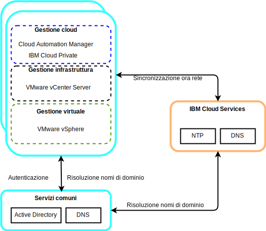

---

copyright:

  years:  2016, 2019

lastupdated: "2019-05-07"

subcollection: vmware-solutions

---

# Servizi comuni per i componenti di VMware e Skate Advisor Concept Car
{: #vcscar-commonservices}

I servizi comuni forniscono i servizi che vengono utilizzati da altri servizi nella piattaforma di gestione cloud. I servizi comuni includono i servizi di identità e di accesso, i servizi di nome dominio e i servizi NTP.

## Servizi di identità e accesso
{: #vcscar-commonservices-identity}

Come parte dell'automazione di VMware vCenter Server on {{site.data.keyword.cloud_notm}}, per la gestione delle identità viene utilizzato un Microsoft AD (Active Directory). Viene distribuita una singola VSI (Virtual Server Instance) AD. Il vCenter è configurato per utilizzare l'autenticazione AD e puoi configurare anche {{site.data.keyword.icpfull_notm}} per l'autenticazione LDAP.

## DNS (Domain Name Service)
{: #vcscar-commonservices-dns}

La distribuzione utilizza le VSI AD distribuite come server DNS (Domain Name System) per l'istanza. Tutti i componenti distribuiti sono configurati per puntare all'AD come loro DNS predefinito. Degli esempi di componenti distribuiti includono host ESXi, vCenter, PSC e NSX.

## Servizi Network Time Protocol
{: #vcscar-commonservices-ntp}

La distribuzione di vCenter Server utilizza i server NTP (Network Time Protocol) dell'infrastruttura {{site.data.keyword.cloud_notm}}. Tutti i componenti distribuiti sono configurati per utilizzare questi server NTP. Per il corretto funzionamento dei certificati e dell'autenticazione di AD, è fondamentale che tutti i componenti utilizzino gli stessi server NTP.

## Link correlati
{: #vcscar-commonservices-related}

* [Panoramica di vCenter Server on {{site.data.keyword.cloud_notm}} with Hybridity Bundle](/docs/services/vmwaresolutions/archiref/vcs?topic=vmware-solutions-vcs-hybridity-intro)
