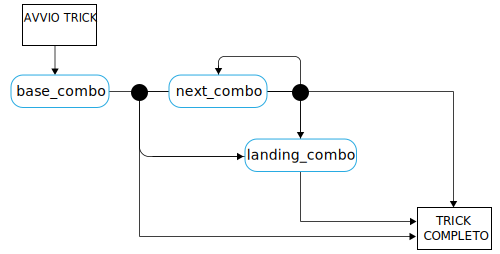

---

copyright:

  years:  2016, 2019

lastupdated: "2019-02-15"

subcollection: vmware-solutions


---

# Concetti del linguaggio di skateboarding
{: #vcscar-concepts}

## Linguaggio skater
{: #vcscar-concepts-skater}

Un aspetto chiave di Skate Advisor è la possibile conversazione con il chatbot controllato da Watson. La seguente sezione descrive le regole di conversazione che definiscono un'interazione umana con il chatbot di Skate Advisor.

Il linguaggio skater è il fulcro del sistema ed è utilizzato nel seguente modo:
* Riconoscimento dei trick: utilizzato da Watson Discovery per acquisire materiale da origini online per riconoscere trick esistenti e associarli al materiale di origine.
* Conversazioni sullo skate: utilizzate dal chatbot per avere conversazioni significative con l'utente del sistema.
* Classificazione dei trick: memorizzare e classificare un trick in base alla sua descrizione testuale. I trick classificati in questo modo possono avere dei metadati associati come i riferimenti di posizione e video.

## Elementi del linguaggio
{: #vcscar-concepts-lang-elem}

### Elementi principali
{: #vcscar-concepts-core-elem}

Di seguito sono riportati gli elementi principali del linguaggio per la costruzione di un trick.

Tabella 1. Elementi principali del linguaggio

Tipo di elemento | Testo del linguaggio
---|---|---
Direzione | fakie<br>nollie<br>switch
Rotazione | halfcab<br>cab<br>180<br>360<br>540
Base | kickflip<br>heelflip<br>hardflip<br>bigspin<br>shuvit<br>impossibile
atterraggio | manual (2 ruote indietro)<br>nosemanual (2 ruote avanti)<br>5-0 (grind)<br>nosegrind<br>tailslide<br>noseslide<br>crooked grind<br>smithgrind<br>boardslide<br>lipslide<br>

### Modificatori di elemento
{: #vcscar-concepts-elem-modifiers}

I modificatori di elemento sono elementi di linguaggio speciali che forniscono il contesto ad alcuni aspetti del linguaggio.

Tabella 2. Modificatori del linguaggio

Tipo di elemento | Testo del linguaggio |Avvisi
---|---|---
Turn Prefix | Frontside<br>backside | Il Turn Prefix si riferisce alla direzione di una curva
Varial | Verso l'interno<br>verso l'esterno |

## Regole del linguaggio
{: #vcscar-concepts-lang-rules}

La seguente serie di regole costruisce il linguaggio. I trick sono divisi in una o più combinazioni di elementi denominate “Combo”. Esiste una differenza tra la prima Combo e le Combo successive nel senso che si presume che la direzione sia la stessa della Combo di base a meno che non sia specificato diversamente.

Per le seguenti regole, vedi Elementi principali e Modificatori di elemento come riferimento al loro utilizzo per costruire il linguaggio.

### Serie di regole dei trick
{: #vcscar-concepts-trick-ruleset}

```
base_combo = 'direction \+ \[varial | turn_prefix\] \+ \[rotation\] \+ \[base_trick\]'
next_combo = ''\[varial | turn_prefix\] \+ \[rotation\] \+ \[base_trick\]'
landing_combo = ''\[varial | turn_prefix\] \+ landing'
trick = 'combo \+ \[“to” + combo\] \+ \[“to” \+ landing_combo\]'
```

### Motore di regole dei trick
{: #vcscar-concepts-trick-rule-engine}

Il seguente diagramma è un riepilogo visivo del motore di regole.

Figura 1. Panoramica del linguaggio di skate


## Linguaggio di trick di esempio
{: #vcscar-concepts-sample-trick}

Di seguito è riportato un elenco di trick di esempio:

```
fakie-kickflip
fakie-kickflip to fakie-5-0 to fronside-halfcab (out)
fakie-heeflip
fakie-heeflip to fakie-maual to fakie-hardflip
fakie-inward (varial) heeflip to fakie-backside tailslide to fakie
switch-heeflip to fakie-maual to fakie-hardflip
switch-hardflip to fakie-manual
fakie-hardflp to fakie-nosegrind
nollie-hardflip-to-tailslide
nollie-inward-heelflip to frontside noseslide
kickflip-frontside to crooked grind
halfcab-heelflip to crooked grind
frontside-shuvit to nosegrind to nollie-flip (out)
kickflip to nosegrind to nollie-impossilbe (out)
nollie-kickflip to noseslide to nollieflip
nollie-kickflip to frontside-lipslide
nollie-impossible to manual
nollie-impossible to 5-0
nollie-kickflip to crooked grind
nollie-kickflip to crooked grind to nollie-halfcab-kickflip (out)
frontside-nollie-halfcab-heelflip to fakie-nosegrind
backside-nollie-halfcab-kickflip to backside-tailslide to backside-180-out
frontside-nollie-cab-kicflip halfcab to backside-smithgrind
halfcab to backside-smithgrind to backside-180-bigspin (out)
kickflip-backside-tailslide to backside-180-kickflip
kickflip-backside-tailslide to backside-backside-bigspin
360-kicflip to nosemanual to nollie-360-kickflip
360-kicflip to frontside-lipslide
harflip to backside-lipslide
kicflip to frontside-boardslidev
nollie-heelflip to frontside-boardslide
```

## Rilevanza
{: #vcscar-concepts-relevance}

Il linguaggio di trick è il costrutto chiave utilizzato per addestrare Watson a riconoscere e acquisire supporti multimediali e documenti di skating e costituisce inoltre la base delle conversazioni con l'utente.

## Link correlati
{: #vcscar-concepts-related}

* [Panoramica di vCenter Server on {{site.data.keyword.cloud}} with Hybridity Bundle
](/docs/services/vmwaresolutions/archiref/vcs?topic=vmware-solutions-vcs-hybridity-intro)
