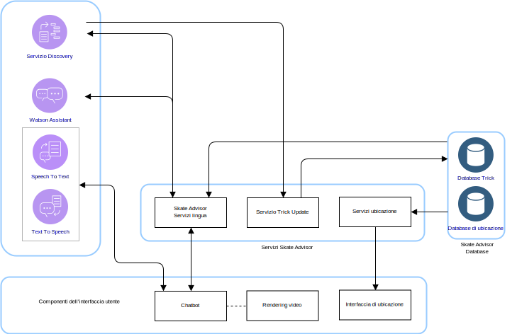
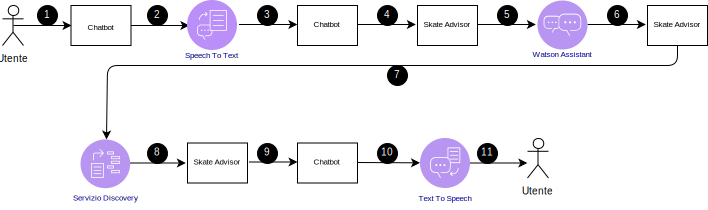
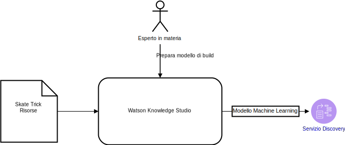

---

copyright:

  years:  2016, 2019

lastupdated: "2019-08-05"

subcollection: vmware-solutions

---

# Progettazione logica di Skate Advisor
{: #vcscar-logical}

Le seguenti informazioni descrivono gli elementi dell'applicazione che formano la progettazione logica del sistema.

## Componenti di sistema
{: #vcscar-logical-sys-comp}

Skate Advisor è costituito principalmente da un chatbot che può accettare il riconoscimento testuale o vocale per interagire con il sistema in modo strutturato.

## Trick
{: #vcscar-logical-tricks}

L'elemento dati principale di Skate Advisor è il trick. Il linguaggio di trick definisce univocamente un trick. Questo linguaggio può essere utilizzato per svolgere le seguenti attività:
- Conversare con il chatbot in merito ai trick.
- Cercare i trick utilizzando Watson Discovery.
- Identificare e classificare i trick durante la formazione di Watson Discovery dagli articoli di origine.
- Identificare un trick per scopi di visualizzazione di posizioni e supporti multimediali.

### Definizione di trick
{: #vcscar-logical-trick-def}

Un trick è definito in modo univoco dai costrutti del linguaggio che lo descrivono. Per una definizione completa, vedi Motore di regole dei trick.

### Elenco di trick
{: #vcscar-logical-list-tricks}

Un elenco di trick viene restituito da una query del trick di base o dell'atterraggio definito negli elementi del linguaggio.

### Dati di trick
{: #vcscar-logical-trick-data}

Una volta restituiti, i trick possono avere le seguenti informazioni:
- Descrizione del trick
- Una o più risorse di supporto multimediale
- Informazioni sulla posizione

## Flussi di conversazione
{: #vcscar-logical-conv-streams}

Il chatbot ha un numero predefinito e limitato di possibili conversazioni. Le conversazioni sono definite dalle seguenti informazioni:
- Ricerca trick: trova una serie di trick validi in base a un parametro di query che rappresenta il trick di base o l'atterraggio.
- Ricerca posizione: trova una posizione vicina per un trick.
- Visualizzazione supporto multimediale: visualizza un elemento multimediale, ad esempio un video online da cui è stato classificato e trovato un trick.

Tabella 1. Conversazione

Conversazione | Struttura | Risultato
---|---|---
Ricerca trick | Descrivi un trick |Un elenco di trick
Ricerca posizione | Dove devo eseguire questo trick? | Elenco di posizioni per uno specifico trick
Visualizzazione supporto multimediale | Visualizza un video dei trick |Un elenco di risultati dei supporti multimediali

## Componenti dell'interfaccia utente
{: #vcscar-logical-ui-comp}

### Chatbot
{: #vcscar-logical-chatbot}

Il chatbot è un componente web che conversa con l'utente. Il chatbot può accettare testo o voce. I risultati come gli elenchi sono resi in testo con una possibile voce di accompagnamento per rappresentare i risultati.

I chatbot interagiscono con il sistema nel seguente modo:

Tabella 2. Interazioni del chatbot

Passo | Descrizione
---|---
1 | Inizia una conversazione valida, vedi la sezione sui flussi di conversazione
2 | Il chatbot invia la voce la servizio Speech to Text.
3 | Il servizio Speech to Text invia il testo al chatbot.
4 | Il chatbot invia la query di testo a Skate Advisor.
5 | Skate Advisor valuta la richiesta e la invia a Watson Assistant.
6 | Watson Assistant classifica la richiesta e risponde a Skate Advisor con l'azione da intraprendere.
7 | Skate Advisor richiede una serie di dati dal Discovery Service.
8 | Il Discovery Service valuta la query e invia la risposta.
9 |Skate Advisor forma una risposta e la invia al chatbot in testo.
10 | Il chatbot invia la risposta di testo al servizio Text to Speech.
11 | Il risultato viene inviato all'utente tramite il chatbot.

### Rendering video
{: #vcscar-logical-video-render}

Il componente di rendering video riproduce un video o visualizza un documento. Queste risorse rappresentano la risorsa di origine da cui è stato rilevato il trick.

Il componente di rendering video è un widget incorporato nell'interfaccia web che visualizza un video. I video vengono visualizzati nel chatbot come risultato di una query eseguita dall'utente di sistema. Il link al video risultante, una volta selezionato, attiva il rendering video.

### Interfaccia di posizione
{: #vcscar-logical-location-interface}

Skate Advisor include un'interfaccia che consente agli utenti del sistema di registrare la posizione di un trick specifico. Il componente dell'interfaccia web ha due elementi principali:
1. Accettare una posizione dall'utente del sistema come il luogo migliore per eseguire un trick specifico.
2. Visualizzare una o più posizioni consigliate per un trick specifico.

## Componenti Watson
{: #vcscar-logical-watson-comp}

In questa architettura sono inclusi i seguenti componenti Watson.
* Knowledge Studio - Watson Studio è uno strumento con cui possiamo progettare il linguaggio di skate per il sistema e utilizzare questo linguaggio per riconoscere i documenti provenienti dal web che implementano il linguaggio di skate. Knowledge Studio fornisce un modello da utilizzare con Watson Discovery.
* Speech to Text - Trascrive la voce in testo. Questo componente accetta l'audio da un dispositivo su cui è in esecuzione il chatbot e lo converte in testo per l'elaborazione da parte di Watson.
* Text to Speech - Sintetizza il testo in voce. Questo componente accetta il testo dall'applicazione Skate Advisor e lo converte in voce che verrà riprodotta dal dispositivo su cui è in esecuzione il chatbot.
* Discovery Service - Il servizio Watson Discovery viene utilizzato dal sistema per richiamare il contenuto relativo allo skate che corrisponde ai parametri richiesti. Un esempio potrebbe essere: “Elenca tutti i record per il trick Casper”. Watson Discovery utilizza tecniche di machine learning avanzate per segnalare i passaggi più rilevanti dal contenuto acquisito.
* Watson Assistant - Watson Assistant è uno strumento utilizzato per progettare le interazioni tra gli utenti e la macchina (chatbot). Deve essere formato con un linguaggio specifico per il dominio, ad esempio skateboarding, sotto forma di una serie di grammatiche per le quali l'Assistant riconosce e crea le risposte appropriate.

## Servizi Skate Advisor
{: #vcscar-logical-skate-advisor-services}

Il servizio Skate Advisor è un componente dell'applicazione che fornisce una serie di servizi API per il rendering delle richieste. I servizi esposti hanno una correlazione diretta con i flussi di conversazione descritti in precedenza. L'API
esposta ha le seguenti categorie generali:
* get_tricks - Restituisce un elenco di trick in base a una <query\> in linguaggio naturale, che viene presentato al Discovery Service.
* show_tricks - Restituisce un elenco di supporti multimediali per uno specifico trick.
* find_trick - Restituisce uno specifico trick.
* accept_command - Accetta un comando testuale dal chatbot e assiste la richiesta.

## Formazione del Discovery Service
{: #vcscar-logical-disc-service-training}

Watson Discovery deve essere formato tramite un modello di machine learning, che viene creato in modo iterativo da un esperto in materia utilizzando Watson Knowledge Studio.

Per Skate Advisor, il modello è costituito dalla relazione tra i tipi di entità con una combinazione di formazione basata su regole e formazione basata sul dizionario per creare un modello. Questo modello consente al Discovery Service di riconoscere e classificare i trick che vengono acquisiti da articoli e descrizioni video utilizzati come set di formazione.

Dopo la formazione, il Discovery Service può rispondere a query come:
- Mostrami tutti i trick con il trick di base heelflip.
- Mostrami tutti i trick.
- Mostrami tutti i trick con più combo.
