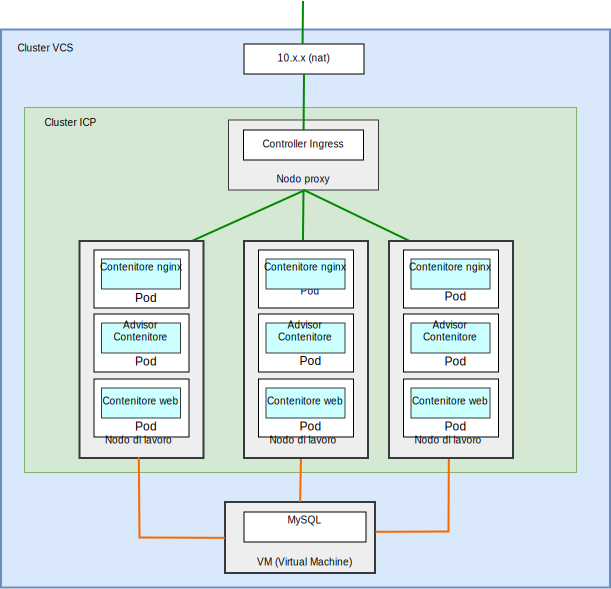
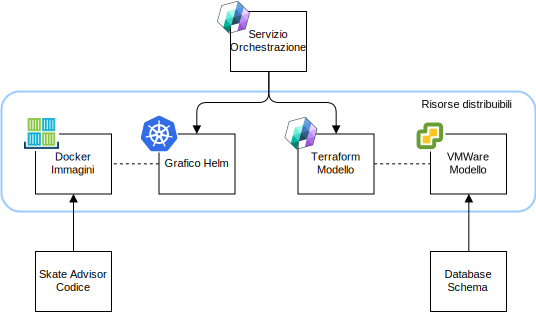
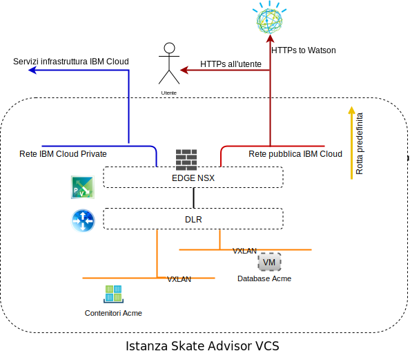
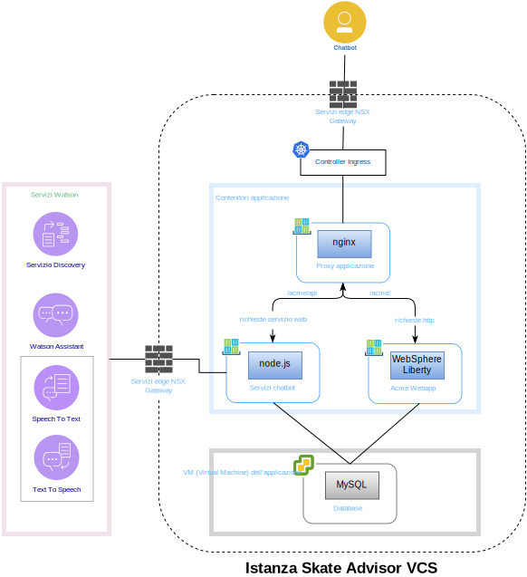
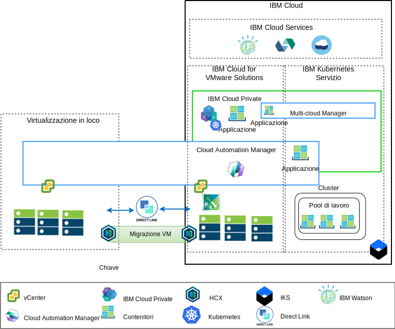

---

copyright:

  years:  2016, 2019

lastupdated: "2019-05-07"

subcollection: vmware-solutions

---

# Componenti di Skate Advisor
{: #vcscar-physical}

{{site.data.keyword.vmwaresolutions_full}} fornisce l'automazione per distribuire
i componenti con tecnologia VMware nei {{site.data.keyword.CloudDataCents_notm}} in tutto il mondo. L'architettura
consiste in una singola regione cloud e supporta la capacità di estensione
in più regioni cloud che si trovano in una delle seguenti opzioni:

1. Un'altra area geografica.
2. Un altro pod {{site.data.keyword.cloud_notm}} all'interno dello stesso data center.
3. Un'altra area geografica e un altro pod {{site.data.keyword.cloud_notm}} all'interno dello stesso data center.

I prodotti {{site.data.keyword.icpfull_notm}} e CAM (Cloud Automation Manager)
possono essere distribuiti manualmente nella tua piattaforma di virtualizzazione in loco,
abilitando la gestione cloud dalle ubicazioni in loco. In alternativa, {{site.data.keyword.icpfull_notm}}
e CAM vengono offerti come estensioni di servizio a una distribuzione VMware
vCenter Server on {{site.data.keyword.cloud_notm}} nuova o esistente, tramite l'automazione, abilitando
la gestione cloud da {{site.data.keyword.cloud_notm}}.

{{site.data.keyword.icpfull_notm}} è una piattaforma dell'applicazione per lo sviluppo e la gestione di applicazioni
inserite nei contenitori in loco. È un ambiente integrato per la gestione
dei contenitori che include l'orchestrazione del contenitore Kubernetes, un
repository di immagini privato, una console di gestione e i
framework di monitoraggio.

IBM Multi-Cluster Manager fornisce visibilità utente, gestione incentrata
sull'applicazione (politica, distribuzioni, integrità, operazioni) e conformità
basata sulle politiche tra i cloud e i cluster. Con IBM Multi-Cluster Manager,
hai il controllo dei tuoi cluster Kubernetes. Puoi garantire che i tuoi
cluster siano sicuri, che funzionino in modo efficiente e che forniscano i livelli
di servizio previsti dalle applicazioni.

{{site.data.keyword.cloud_notm}} Automation Manager è una piattaforma di gestione self service multi-cloud
eseguita su {{site.data.keyword.cloud_notm}} Private che consente agli sviluppatori e
agli amministratori di soddisfare le richieste di business. Cloud Automation Manager
Service Composer ti consente di esporre i servizi cloud ibridi nel catalogo {{site.data.keyword.icpfull_notm}}.

## Componenti fisici di Skate Advisor
{: #vcscar-physical-skate-comp}

Il seguente diagramma descrive l'implementazione di riferimento dell'applicazione Acme
Skate Advisor in un'implementazione dell'infrastruttura di modernizzazione
dell'applicazione.

L'applicazione Skate Advisor estende l'applicazione web Acme esistente
con un componente basato sui microservizi che interagisce con Watson e con
un contenitore nginx per inoltrare tramite proxy le richieste al contenitore web e dei
microservizi.

L'applicazione Skate Advisor sfrutta la piattaforma di modernizzazione
dell'applicazione che fornisce l'infrastruttura di hosting
necessaria.

### Assemblaggio e distribuzione dell'applicazione
{: #vcscar-physical-app-pack-depl}

L'applicazione viene distribuita come orchestrazione CAM che contiene
i seguenti elementi:
* Orchestrazione del servizio - Un'orchestrazione del servizio CAM è una risorsa
del flusso di lavoro che descrive i modelli Terraform e i grafici Helm da distribuire
come facet di un servizio. Un servizio può essere pubblicato ed è
la risorsa di controllo da cui viene orchestrata l'intera distribuzione.
* Grafico Helm - Il grafico Helm si trova nel repository {{site.data.keyword.icpfull_notm}}
locale e distribuisce contenitori e altre risorse a {{site.data.keyword.icpfull_notm}}. Un grafico Helm
è una descrizione delle risorse Kubernetes che includono:
  - Distribuzioni del contenitore
  - Servizi
  - Ingress
  - Regole
  - Endpoint

* Immagini Docker - Le immagini Docker contengono il sistema operativo (ubuntu),
il middleware (WebSphere Liberty, nginx) e il codice di Skate Advisor e
Skate Store. Le immagini Docker sono oggetti statici che vengono distribuiti
in contenitori in esecuzione.
* Modello Terraform - Un modello Terraform è un file che descrive
le risorse cloud da distribuire. Per Skate Advisor, viene descritto un modello di ubuntu,
che è preinstallato con mysql e lo schema del
database.
* Modello VMWare - Il modello VMWare è un modello di Ubuntu con mysql
e lo schema del database preinstallati.

### Bilanciamento del carico e proxy
{: #vcscar-physical-load-balance-proxy}

Il bilanciamento del carico e il proxy vengono implementati attraverso il componente
del controller Ingress {{site.data.keyword.icpfull_notm}}. Questo componente gestisce il ridimensionamento e il failover
del contenitore in modo continuo.

Il proxy dell'applicazione è fornito dal contenitore nginx che bilancia
il carico nel seguente modo.

Tabella 1. Regole del proxy inverso di Skate Advisor

URL	|Endpoint
---|---
/acme	|Acme Web Container Service
/acme/api	|Skate Advisor Service
/acme/api/explorer	|Skate Advisor Service

I contenitori hanno indirizzi IP imprevedibili che possono ridimensionarsi in modo decrementale o
incrementale secondo quanto richiesto dal sistema. Per superare questo problema, i servizi {{site.data.keyword.icpfull_notm}} vengono utilizzati per
eseguire la risoluzione degli indirizzi IP in tempo reale all'interno del sistema.

### Applicazione web Acme Skate
{: #vcscar-physical-acme-skate-web-app}

L'applicazione web Acme Skate è un'applicazione Java EE (Java Platform, Enterprise Edition) basata su Spring
Framework. L'applicazione viene distribuita su un contenitore WebSphere Liberty.

### Applicazione Acme Skate Advisor
{: #vcscar-physical-acme-skate-advisor-app}

L'applicazione Acme Skate Advisor è un'applicazione basata sui microservizi che viene distribuita su un contenitore WebSphere Liberty. Un server web nginx fornisce
un frontend ai microservizi.

### Database Acme Skate
{: #vcscar-physical-acme-skate-db}

Il database Acme Skate è un database MySQL che viene distribuito su
una VM (Virtual Machine) gestita da vSphere.

### Panoramica delle comunicazioni
{: #vcscar-physical-comm-overview}

Skate Advisor richiede le seguenti comunicazioni:
-	Dal contenitore web all'utente del sistema.
-	Dal contenitore Advisor e web ai servizi Watson.
-	Tra il contenitore e gli aspetti della VM (Virtual Machine)
dell'implementazione.

Per raggiungere questo obiettivo, la piattaforma di modernizzazione dell'applicazione è
progettata con i seguenti componenti.

{{site.data.keyword.cloud_notm}} ha due reti. La rete pubblica consente ai server di essere
raggiunti da Internet e la rete privata consente ai server di
comunicare tra loro su un backbone ad alta velocità in tutti i {{site.data.keyword.CloudDataCents_notm}}.

Il VRA (Virtual Routing Appliance) consente ai clienti di instradare il traffico
della rete privata e pubblica associando le VLAN al dispositivo.
Sia l'Edge NSX che l'infrastruttura {{site.data.keyword.containerlong_notm}} di vCenter Server sono configurati
con una rotta predefinita alla rete pubblica e con una rotta
10.0.0.0/8 standard alla rete privata.

Sull'infrastruttura {{site.data.keyword.containerlong_notm}} è richiesta una rotta statica al dispositivo VRA
per qualsiasi VXLAN NSX definita. Dall'Edge NSX, configuriamo il
peering BGP con il VRA sulla rete privata, abilitando l'annuncio
di rotte (route advertisement) e l'interiezione delle VXLAN NSX. Questo peering consente alla
rete di sovrapposizione VXLAN NSX di comunicare con il backbone di {{site.data.keyword.cloud_notm}} e
viceversa.

### Associazione dei componenti software
{: #vcscar-physical-soft-comp-mapping}

L'applicazione Skate Advisor utilizza i seguenti componenti
software.

Vengono utilizzati i seguenti componenti software:

* nginx	- Fornisce servizi di proxy inverso all'applicazione.
Le richieste dei microservizi e dell'applicazione vengono distribuite agli
endpoint del contenitore corretti.
* WebSphere Liberty - Ospita l'applicazione Acme, che è un'applicazione
Java EE (Java Platform, Enterprise Edition) basata su Spring.
* Node.js - Fornisce il framework dei microservizi al chatbot. Questa
applicazione utilizza i servizi forniti da Watson.
* mysql - Il database di applicazioni è fornito da Oracle Mysql.
* JavaScript - Il chatbot è un'applicazione basata su JavaScript
che è ospitata nel browser del client. Il chatbot
comunica con Watson tramite i microservizi basati su Node.js.

## Panoramica della gestione
{: #vcscar-physical-mgmt-ovw}

Acme Skate Advisor risiede su {{site.data.keyword.cloud_notm}} e, per questo motivo,
è un aspetto critico dell'architettura. {{site.data.keyword.cloud_notm}} ha la seguente
architettura.

Questo diagramma rappresenta {{site.data.keyword.icpfull_notm}} e CAM distribuiti su un'istanza vCenter
Server, con connessioni al vCenter in loco e al servizio
{{site.data.keyword.containerlong_notm}}. Utilizzando CAM, gli amministratori di sistema e gli sviluppatori possono
distribuire VM (Virtual Machine) in loco o nell'istanza vCenter Server
e contenitori nei cluster {{site.data.keyword.icpfull_notm}} e {{site.data.keyword.containerlong_notm}}.

Nel diagramma, CAM crea in modo logico connessioni cloud ai vCenter,
ai provider cloud e agli ambienti {{site.data.keyword.icpfull_notm}} e {{site.data.keyword.containerlong_notm}}. I cluster {{site.data.keyword.icpfull_notm}} vengono
distribuiti in ciascun data center/ambiente cloud, con MCM che fornisce il
meccanismo per connettere i cluster {{site.data.keyword.icpfull_notm}} in un'unica vista di gestione.

## Link correlati
{: #vcscar-physical-related}

* [Panoramica di vCenter Server on {{site.data.keyword.cloud_notm}} with Hybridity Bundle](/docs/services/vmwaresolutions/archiref/vcs?topic=vmware-solutions-vcs-hybridity-intro)
