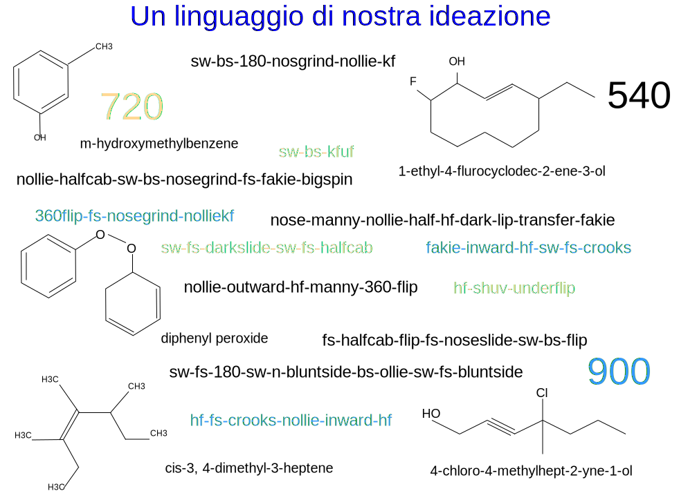

---

copyright:

  years:  2016, 2019

lastupdated: "2019-02-15"

---

# Prefazione
{: #vcscar-preface}

Figura 1. Un linguaggio di nostra invenzione

## Introduzione al linguaggio di skateboarding
{: #vcscar-preface-intro}

Il modo in cui gli skateboarder combinano movimenti e submovimenti in trick
impone una sorta di grammatica o di sintassi, che si basano sulla fisica di ciò che sta
accadendo; la nomenclatura chimica si è evoluta per ragioni simili. Oggi, uno skater su un lato del pianeta può
inviare un messaggio con il nome di un trick a un altro skater che sta sull'altro lato e i suoi
movimenti complessi vengono compresi.

La ricchezza del linguaggio è alimentata dalla complessità dello skateboarding
in sé. I movimenti della tavola sono intricati, dando luogo a dozzine di
trick di base che possono essere eseguiti in più modi, ripetuti su più
variabili, per produrre un numero enorme di combinazioni. Una
struttura di prefisso-radice-suffisso per ogni componente determina il modo
in cui si concatena ogni elemento o movimento, che corrisponde alla serie di momenti reali
della tavola e del suo rider. L'orientamento fisico e la meccanica delle
forze determinano cosa combacia e cosa non combacia, che è
ciò che impone quella sintassi.

I trick possono essere eseguiti dalla coda della tavola o dal naso, *Ollie* o
*Nollie*, che corrispondono al piede anteriore o posteriore dei rider. La tavola
salta, ruota e cade in combinazioni che vengono ripetute su tre assi, in
entrambe le direzioni, in senso orario o antiorario. Il
rider quindi accoppia i movimenti con i movimenti della tavola, che aggiunge più
dimensioni alle iterazioni in base alla direzione, rotazione,
“posizione” e se gira verso o contro il salto della
tavola.

Queste ultime due variabili meritano un po' più di spiegazione. Innanzitutto, la
*posizione* è facilmente confusa con la direzionalità lineare. Gli skater hanno tutti
una posizione nativa, con piede sinistro o destro in avanti; quindi, eseguire un trick
*switch* (posizione switch) significa fare l'immagine speculare di questa posizione, simile a un
battitore ambidestro nel baseball. La direzione all'indietro è incidentale; la
distinzione principale è la tendenza a utilizzare in modo naturale il piede destro o sinistro.  Quindi, qualsiasi
trick eseguito in *switch* merita più credito non perché sia all'indietro,
ma perché tutte le funzioni motorie sono invertite sul lato più debole o sul piede
“sbagliato”. Per fare un trick all'indietro o “fakie” si mette semplicemente un
segno meno sulla direzione e coinvolge tutte le stesse funzioni motorie,
che sono solo marginalmente più difficili.

La seconda sottigliezza che è così importante per gli skater di alto livello
si applica a un salto *verso l'interno* o *verso l'esterno*, a seconda di come
salta e ruota la tavola (2 assi), rispetto al corpo stesso. I flip trick
si eseguono da entrambi i lati del piede dal bordo della tavola:
i *kickflip* possono ruotare in senso orario dall'avampiede, mentre gli *heelflip* fanno
esattamente l'opposto, saltando verso o contro il flusso naturale del
movimento. Quindi, i salti verso l'interno sono così innaturali che assumono
un meritato termine separato, chiamato *hard-flip*. Pertanto, un
*nollie-inward-kickflip* è identico a un *nollie-hardflip*,
che richiedono più precisione perché sono nel senso opposto.

Pertanto, ogni componente di questa struttura di prefisso-radice-suffisso può essere suddivisa
in altri tre elementi binari di rotazione, direzione e
posizione; alcuni trick richiedono di specificare se il salto
è verso l'interno o verso l'esterno. Lo skating sarebbe un gioco
da ragazzi se non fosse per la possibilità di combinare i trick, che
aumenta a dismisura il numero di interazioni. Più trick di base possono essere
raggruppati in singolo cluster composti da due, tre o anche fino a
cinque o sei trick per i migliori professionisti.

Finora, il numero di iterazioni pratiche ci porta ben oltre le
centinaia, il che è solo l'inizio; la vera complessità si vede
nel *streetskating*, che fa esplodere il numero di combinazioni in
migliaia.

Nei primi anni 90, gli skater presero i primi trick flat-ground, ovvero eseguiti al
suolo, e li proiettarono nell'ambiente “organico” circostante: scale,
cornicioni, corrimano, banchine, tetti spioventi, barre piatte, tavoli da picnic, fioriere; tutto
questo ha aperto la dimensionalità di ciò che li ha definiti. Gli infiniti
modi in cui potevano combinare trick e suolo in accoppiamenti yin-yang
hanno tenuto gli skater occupati per anni. Questo vale anche per il *vert-skating*,
esemplificato da Tony Hawk in rampe e piscine.

Mentre la maggior parte dei trick di base sono stati stabiliti nel corso degli anni, è
la capacità di combinarli e adattarli che spesso supera la capacità nativa dei
professionisti stessi. Questo è ancora un altro motivo per cui lo skating sia
più un'arte che uno sport. L'espressione individuale mantiene sempre il primato
sulle semplici prestazioni. È anche il motore fondamentale che alimenta gli
artisti che hanno creato il franchising di video game di successo di Activision,
*Tony Hawk Pro Skater*, che è andato avanti per quasi un decennio, dando origine anche
ai giochi concorrenti di *Electronic Arts*.

Con la formazione di Watson Assistant per imitare il processo di pensiero dei professionisti di alto
livello, possiamo fornire uno strumento potente per far progredire il pensiero creativo
di ogni skater, specialmente ai livelli di élite. Sebbene il resto degli
sport da tavola sia molto meno complesso, è una testimonianza dell'influenza
sproporzionata che ha lo skateboarding, in quanto adottano
anche le nostre convenzioni. Pertanto, Watson Assistant ha il potenziale non
solo di aiutare, o trasformare, l'espressione creativa di questo
sport olimpico appena adottato, ma di influenzare anche altri sforzi
artistici.

## Codificazione del linguaggio
{: #vcscar-preface-codification}

Come con qualsiasi linguaggio, il nostro è stato sviluppato nel tempo, raccogliendo nuove parole
e utilizzi, rendendo occasionali ridondanze ed eccezioni lungo
il cammino. Detto questo, questa nomenclatura è straordinariamente coerente, duratura e
specifica. Sono questo rigore denotativo e questa coerenza che convertono
il problema, apparentemente insormontabile, della conversione del filmato in testo mediante il
machine learning. Per gli skater, ogni sfumatura del movimento complesso è
incorporata nella nomenclatura stessa. In effetti, questo linguaggio è così solido
che è stato adottato non solo dagli snowboarder, ma anche dai surfisti.

Tuttavia, nonostante tutta questa complessità e potenza, la codificazione del linguaggio
è semplice e concisa. Ogni *trick di base* ha un componente *direzionale* e
*rotazionale*, insieme a un *atterraggio*, che determina se
e come si concatena con il successivo trick di base per formare delle combinazioni;
questi sono i quattro *elementi fondamentali*. Vengono aggiunti altri due *modificatori*:
un *turn prefix* per orientare la rotazione del rider (in senso orario o
antiorario) e un altro componente *varial* per specificare come
ruota la tavola, rispetto al corpo (verso l'interno o verso l'esterno). Utilizzando questa
codificazione, è possibile applicare in modo ricorsivo una serie di regole concisa per consentire
combinazioni di qualsiasi lunghezza.

## Ulteriori variabili di ambiente
{: #vcscar-preface-env-var}

Spesso i professionisti di oggi dedicano il massimo sforzo alla ricerca di posti
in cui praticare i trick. In effetti, parte di ciò che distingue ogni skater è la capacità creativa di adattare i trick a modi nuovi e fantasiosi, che spesso portano lo skater in tutto il mondo. Mentre esistono applicazioni di skate
che catalogano i posti, alimentate dalla community, non c'è mai
stata l'idea o la tecnologia per creare un'applicazione che abbia la capacità
di aiutare qualsiasi skater, soprattutto i professionisti, in questo processo creativo.

Questa architettura di riferimento dimostra come Watson e il cloud
utilizzano l'enorme presenza online di skater su YouTube, Google
Immagini, riviste online (Thrasher, Transworld), forum di skater e videogiochi
e, soprattutto, l'infinito flusso di trick giornaliero
sui social media con i più recenti trick da tutto il mondo, in particolare su
Instagram. Oltre a ciò, non ci sono problemi di traduzione; questo è un
linguaggio internazionale, simile a un linguaggio informatico o matematico,
in cui gli stessi nomi e convenzioni sono usati senza problemi, in tutto il
mondo.

Watson Knowledge Studio aggiorna il Discovery Service con descrizioni dei trick,
risorse multimediali, informazioni sulle posizioni (posti) e altro,
in base alle query di uno specifico skater. Il chatbot ha un numero finito di
conversazioni che derivano da qualsiasi trick, basate su linee di ragionamento
sia creative che pragmatiche di skater professionisti. Quindi,
l'Assistant può rispondere con il posto (posizione) più vicino o migliore per eseguire uno
specifico trick o rispondere con una gamma più ampia di territori non solo per quel
trick, ma anche per gli altri eseguiti con la stessa radice (cioè, le variazioni).

Ad esempio, un skater può chiedere a Watson Assistant di elencare tutte le variazioni
possibili di un *hardflip-to-backside-5-0*. Questa richiesta viene convertita
da voce a testo nel Discovery Service, che risponde non solo con le variazioni di
*hardflip-to-grind*, ma anche con un elenco dei vari territori catturati
dalle variazioni, portando così ad altro, come un elenco di
corrimano da raggruppare in base al codice postale locale, alle dimensioni o persino
alla disponibilità, ad esempio in un cortile di una scuola o in un'azienda. I sistemi si trovano all'interno dei dati delle applicazioni esistenti che valutano il rischio di essere fermati
per violazione di proprietà. Tale assistenza ha un impatto enorme sulle
conseguenze a cascata di variabili come queste, che aiutano la
vita creativa di tutti gli skater professionisti.

## La piattaforma cloud
{: #vcscar-preface-cloud-platform}

La stratificazione creativa dei sistemi IT per generare nuove combinazioni parla
al cuore dello skateboarding. Ha il potere di incastrarsi nella vita
dei creativi per ispirare l'innovazione, in tutto il mondo, ovunque andiamo.
Niente di tutto ciò potrebbe essere ottenuto senza {{site.data.keyword.cloud}}.

## Link correlati
{: #vcscar-preface-related}

* [Panoramica di vCenter Server on {{site.data.keyword.cloud_notm}} with Hybridity Bundle
](/docs/services/vmwaresolutions/archiref/vcs?topic=vmware-solutions-vcs-hybridity-intro)
