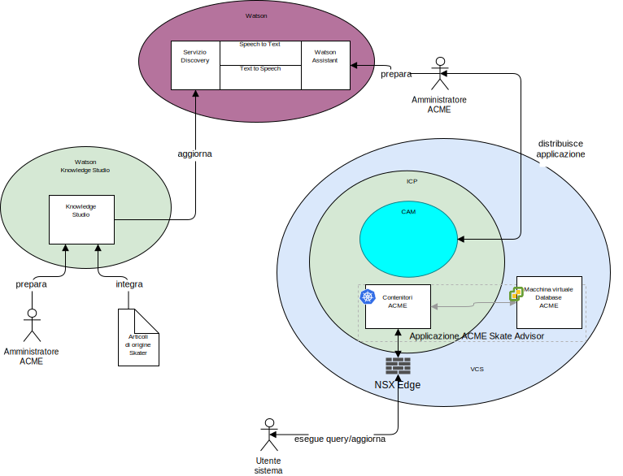

---

copyright:

  years:  2016, 2019

lastupdated: "2019-01-23"

---

## Contesto di sistema
Il seguente diagramma mostra il contesto di sistema per questa architettura
di riferimento. Un diagramma del contesto di sistema è un diagramma che definisce gli elementi
chiave di un sistema, il limite del sistema, le entità che
interagiscono con esso insieme all'interazione. È un diagramma di alto livello
che fornisce al lettore una vista iniziale del sistema.

Figura 1. Contesto di sistema

Di seguito sono riportati i componenti principali del contesto di sistema:
-	vCenter Server – VMware vCenter Server on {{site.data.keyword.cloud_notm}} è un'istanza {{site.data.keyword.cloud_notm}} for VMware
Services che rappresenta la destinazione per le macchine virtuali (VM) migrate dall'ambiente
in loco. Insieme alla virtualizzazione in loco, è
un ambiente ibrido e consente alle VM di spostarsi da un ambiente
all'altro.
-	{{site.data.keyword.icpfull_notm}} - {{site.data.keyword.icpfull_notm}} è una piattaforma dell'applicazione per
lo sviluppo e la gestione delle applicazioni inserite nei contenitori. L'ambiente {{site.data.keyword.icpfull_notm}} è un ambiente
integrato che include l'orchestrazione del contenitore Kubernetes, un
repository di immagini privato, una console di gestione, i framework di monitoraggio
e un'interfaccia utente grafica che fornisce una posizione centralizzata
da cui puoi distribuire, gestire, monitorare e ridimensionare le applicazioni.
-	{{site.data.keyword.cloud_notm}} Automation Manager – CAM è una piattaforma IaC (Infrastructure as Code)
pronta per le aziende che fornisce un unico pannello di controllo per
il provisioning dei carichi di lavoro basati su VM insieme ai carichi di lavoro basati su Kubernetes e
per l'automazione del provisioning dei carichi di lavoro per VM o contenitori e
i relativi prerequisiti dell'infrastruttura.
-	Watson – Watson è la piattaforma delle soluzioni di intelligenza artificiale e cognitiva di IBM.
-	Watson Knowledge Studio - Watson Knowledge Studio fornisce un modello da utilizzare con
Watson Discovery.

### Attori
Il diagramma del contesto di sistema identifica i seguenti attori:

* Amministratore Acme - L'amministratore è responsabile della
distribuzione e manutenzione continua dell'applicazione, incluse le
seguenti attività in corso:
 - Formare il chatbot
 - Formare il discovery service.
* Utente di sistema - L'utente di sistema è l'utente del
sistema. L'utente comunica con il sistema tramite un browser di
dispositivo abilitato al browser.

### Sistemi
Il diagramma del contesto di sistema identifica i seguenti sistemi:
* Knowledge Studio - Watson Studio è uno strumento utilizzato per progettare
il linguaggio di skate per il sistema e utilizzare questo linguaggio per riconoscere
i documenti provenienti dal web che implementano il linguaggio di skate.
* Speech to Text - Trascrive la voce in testo. Questo componente accetta
l'audio da un dispositivo su cui è in esecuzione il chatbot e lo converte in testo
per l'elaborazione da parte di Watson.
* Text to Speech - Sintetizza il testo in voce. Questo componente
accetta il testo dall'applicazione Skate Advisor e lo converte in
voce che verrà riprodotta dal dispositivo su cui è in esecuzione il chatbot.
* Discovery Service - Il servizio Watson Discovery viene utilizzato dal
sistema per richiamare i record di skate che corrispondono ai parametri richiesti. Un
esempio potrebbe essere: “Elenca tutti i record per il trick Casper”.\ Watson
Assistant - Il servizio Watson Discovery viene utilizzato dal sistema per
richiamare il contenuto relativo allo skate che corrisponde ai parametri richiesti. Un
esempio potrebbe essere: “Elenca tutti i record per il trick Casper”. Watson
Discovery utilizza tecniche di machine learning avanzate per segnalare i passaggi
più rilevanti dal contenuto acquisito.  
* Database - Il database Acme Skate Advisor è ospitato su una macchina
virtuale gestita da vCenter Server.
* Contenitori di applicazioni - Le applicazioni che hanno attraversato il percorso di modernizzazione dell'applicazione e che ora sono in esecuzione come contenitori. Per questa architettura di riferimento e in questo esempio per Acme Skateboards, una delle applicazioni inserite nei contenitori è un server web che fa parte del carico di lavoro di presenza online. I contenitori ACME ospitano l'applicazione web Acme e l'applicazione Acme Skate Advisor.
* Edge NSX - Gli edge NSX sono dispositivi virtuali che gestiscono il traffico nord-sud in entrata e in uscita dell'istanza vCenter Server.

## Link correlati

* [Panoramica di vCenter Server on {{site.data.keyword.cloud_notm}} with Hybridity Bundle
](/docs/services/vmwaresolutions/archiref/vcs/vcs-hybridity-intro.html)
