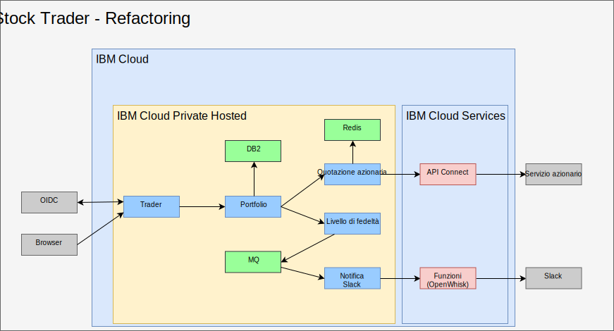
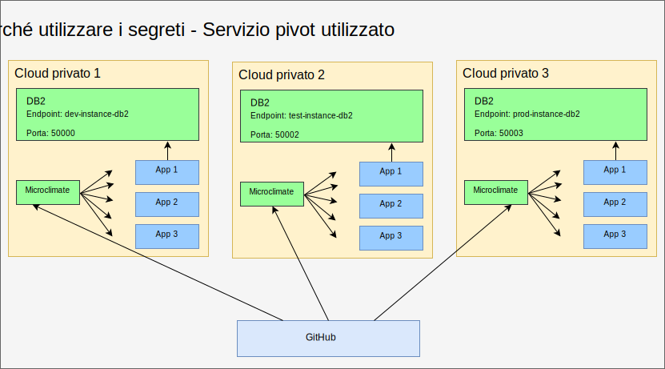
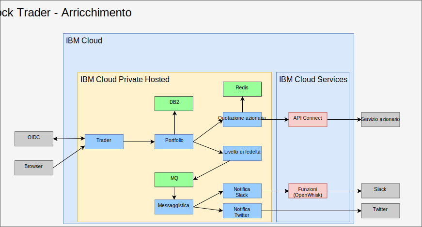

---

copyright:

  years:  2016, 2019

lastupdated: "2019-06-27"

subcollection: vmware-solutions

---

# Refactoring e aggiunta del middleware in IBM Cloud Private
{: #vcscontent-addmidware}

Ora che Stock Trader è in un contenitore e Jane è soddisfatta
degli attuali microservizi, lei e Todd lavorano su come migliorare
l'applicazione con funzionalità aggiuntive. Eseguendo il refactoring dei microservizi di Stock Trader
per gestire una maggiore attività e scalabilità, entrambi vedono la
necessità di aggiungere il middleware in {{site.data.keyword.cloud}} Private. Alcuni dei
middleware esistevano nel loro data center, quindi diventa più di un
esercizio di trasformazione con qualche nuovo middleware aggiunto.

Questo refactoring della soluzione porta una piattaforma comune per eseguire l'applicazione
e i servizi richiesti, introducendo un piano di gestione
più semplice.

## Scelte dei contenuti
{: #vcscontent-addmidware-content-choices}

{{site.data.keyword.cloud_notm}} Private ha una vasta selezione di contenuti e sia Todd che Jane devono decidere quali si adattano meglio alle loro esigenze. Come Todd vede nel
catalogo {{site.data.keyword.cloud_notm}} Private, la maggior parte dei contenuti è disponibile per la prova,
ma alcuni contenuti richiedono l'acquisto e il download da Passport Advantage.

* Toolchain e runtime
  - UrbanCode Deploy
  - Microclimate
  - Jenkins (open source)
  - IBM WebSphere Liberty (MicroProfile, Web Profile, Java Platform, Enterprise Edition Profile)
  - Open Liberty (open source)
  - Runtime Node.js (open source)
  - Runtime Swift (open source)
  - nginx (open source)
  - IBM WebSphere Application Server for {{site.data.keyword.cloud_notm}} Private VM Quickstarter Community Edition.

* Integrazione
  -	IBM Integration Bus
  -	IBM Integration Bus for Developers
  -	IBM DataPower Gateway Virtual Edition
  -	IBM DataPower Gateway for Developers
  -	IBM API Connect Professional
  -	IBM API Connect Enterprise
  -	IBM App Connect Enterprise Developer Edition
  -	IBM App Connect Enterprise 11.0.0

* Data science e business analytics
  -	IBM Data Science Experience Local
  -	IBM Data Science Experience Developer Edition
  -	IBM Watson Explorer Deep Analytics Edition
  -	IBM PowerAI (Con licenza ILAN, offerta di supporto disponibile)
  - IBM PowerAI Vision

* Governance dei dati e integrazione
  -	IBM InfoSphere Information Server for evaluation
  Mobile
  -	IBM Mobile Foundation

* Connettività
  -	IBM Voice Gateway Developer Trial

* Strumenti di modernizzazione dell'applicazione
  -	IBM Transformation Advisor

* Messaggistica
  -	IBM MQ Advanced
  -	IBM MQ Advanced for Developers
  -	Rabbit MQ (open source)
  -	Anteprima della tecnologia di IBM Event Streams (basato su Apache Kafka)

* Automazione del business digitale
  -	IBM Operational Decision Manager
  -	IBM Operational Decision Manager for Developers
  -	IBM FileNet Content Manager 5.5
  -	IBM Content Foundation 5.5

* Servizi di dati
  -	IBM DB2 Direct Advanced Edition / AESE con Data Server Manager
  -	IBM Db2 Dev-C
  -	IBM Data Server Manager (per Db2 Dev-C)
  -	IBM Db2 Warehouse Enterprise
  - IBM Db2 Warehouse Dev-C
  -	IBM Cloudant Developer Edition
  -	MongoDB (open source)
  -	PostgreSQL (open source)
  -	MariaDB (open source)
  -	Cluster Galera con MariaDB (open source)
  -	Redis (open source)

* HPC / HPDA
  -	IBM Spectrum LSF Community Edition
  -	IBM Spectrum Symphony Community Edition
  -	Anteprima della tecnologia di IBM Spectrum Conductor

* Gestione multi-cloud
  -	{{site.data.keyword.cloud_notm}} Automation Manager

* Watson
  -	IBM Watson Compare & Comply: Element Classification
  -	Compliance Assist

* Gestione
  -	IBM Netcool - integrazione (Analisi per i servizi {{site.data.keyword.icpfull_notm}} – Eventi di registrazione e
avvisi di monitoraggio)
  - {{site.data.keyword.cloud_notm}} App Management 2018.2.0
  -	IBM Netcool - integrazione (Analisi per gestire eventi {{site.data.keyword.icpfull_notm}}. Venduto con il prodotto IBM
Netcool Insights)
  - {{site.data.keyword.cloud_notm}} Event Management for IBM
Cloud Private (Con licenza ILAN per rilevamento e prova dal catalogo)
  - IBM Operations Analytics Predictive Insights Mediation Pack (Gestisci
le metriche di monitoraggio {{site.data.keyword.icpfull_notm}}. Con licenza ILAN per rilevamento e prova dal
catalogo)  -	IBM Operations Analytics Predictive Insights Mediation Pack
(Venduto con il prodotto Predictive Insights)

* Rete
  -	Controller F5 BIGIP (open source)
  -	BGP-Peer Calico (open source)
  -	VPN IPSec strongSwan (open source)

* Archiviazione
  -	IBM PowerVC FlexVolume Driver (open source e supportato dal
prodotto PowerVC)
  - Cluster di archiviazione GlusterFS con gestione del ciclo di vita Heketi (open
source)
  -	NFS di esempio di CSI (Container Storage Interface)
  -	Driver (open source)
  -	Rook Ceph Cluster (open source)

* Strumenti
  -	Terminale web (open source)
  -	Skydive – analizzatore di rete (open source)

Per Stock Trader, basato sull'architettura della soluzione di Jane, Todd inizierà con [Db2](https://cloud.ibm.com/catalog/services/db2-hosted), [MQ](https://cloud.ibm.com/catalog/services/mq) e [Redis](https://cloud.ibm.com/catalog/services/databases-for-redis).

## Aggiunta del middleware
{: #vcscontent-addmidware-add-middleware}

Per aggiungere il middleware in {{site.data.keyword.cloud_notm}} Private, trova il [grafico Helm](https://github.com/IBM/charts/blob/master/stable/ibm-microclimate/README.md) nel catalogo, leggi il file readme e quindi procedi con l'installazione.

Per Stock Trader, Todd ha deciso di aggiungere tutto il middleware. Le seguenti informazioni riassumono ciò che Todd ha dovuto eseguire per ogni middleware che voleva che Jane usasse.

### Db2
{: #vcscontent-addmidware-db2}

Todd inizia con Db2 perché lo stanno già utilizzando e possono
dedicare un Db2 basato su contenitore per ogni soluzione.

Dal momento che Todd ha preparato {{site.data.keyword.icpfull_notm}}, ha già definito la sua politica di sicurezza pod. Todd può concentrarsi sulla creazione di un segreto di pull dell'immagine docker:

`kubectl create secret docker-registry db2dockerregistry
--docker-username=dockeruser
--docker-password=XXXXXXXX-XXXX-XXXX-XXXX-XXXXXXXXX
--docker-email=dockeruser@email.com --namespace=default`

Infine, poiché Todd ha deciso di utilizzare NFS, ha creato volumi NFS in base ai
requisiti del file readme:

Vai al dashboard {{site.data.keyword.icpfull_notm}} e crea il volume persistente. Quanto deve essere grande? Consulta il file
readme per scoprirlo:

`capacity=20Gi
RWO
type=NFS
server = nfs.server.ip.address
path = /shared/db2trader1`

Nell'interfaccia utente del catalogo, cerca “Db2” e fai clic su ibm-db2oldp-dev. Controlla il file readme e fai clic su Configure.

Nella sezione Configure, c'è una sezione Quick Start e una sezione All
Parameters. Apri la sezione All Parameters poiché Todd deve inserire
ulteriore configurazione:

*	Nome release = db2trader1
*	spazio dei nomi = default
*	accetta i termini di licenza
*	nome database = trader
*	nome segreto = db2dockerregistry
*	nome servizio = db2trader1-ibm-db2oltp-dev
*	tipo di servizio = NodePort
*	Porta = 50000
*	nome istanza db2 = db2inst1
*	pw per nome istanza db2 = xxxxxx
*	Sì (selezionare) Abilita la persistenza per questa distribuzione

Una volta che Db2 è in esecuzione, Todd o Jane devono creare le tabelle
utilizzate dalla soluzione Stock Trader.

### MQ
{: #vcscontent-addmidware-mq}

Todd e Jane hanno bisogno di un software di messaggistica e, dato che usano già MQ,
questa è un'ottima opzione. Inoltre, può essere eseguito in dimensioni ridotte e
la versione di sviluppo può essere avviata per ogni sviluppatore, risparmiando prezioso
traffico di produzione. L'installazione di MQ è abbastanza semplice. Todd crea
l'archiviazione proprio come ha fatto con Db2 e quindi installa il grafico Helm.

Dashboard {{site.data.keyword.icpfull_notm}} > Catalogo > inizia a digitare in MQ > seleziona
ibm-mqadvanced-server-dev Controlla il file readme e fai clic su Configure
Fornisci o verifica i seguenti valori di input:

`release name = mqtrader1
target namespace = stock-trader
accept license
enable persistence
data PVC size = 2Gi
Service type = NodePort
Queue manager name = stocktrader
Admin pw = mq1pw
App password = LEAVE BLANK`

Inizialmente Todd seleziona NodePort per accedere
al middleware dall'interfaccia utente. Alla fine, Todd può utilizzare ClusterIP in modo
che solo i pod all'interno del cluster possano accedere al middleware.

Per configurare MQ per l'utilizzo di Stock Trader, Todd apre l'interfaccia utente MQ Management,
che è esattamente la stessa della versione VM.

### Redis
{: #vcscontent-addmidware-redis}

Anche se Stock Trader è in esecuzione su {{site.data.keyword.cloud_notm}} Private Hosted, sono
ancora preoccupati per la latenza del servizio di quotazione azionaria quando
tutto quello che gli interessa davvero è il termine dell'azione del giorno precedente per la maggior parte del loro
lavoro. Per migliorare le prestazioni, aggiungono una cache Redis.

Questa distribuzione utilizza il grafico ibm-redis-ha-dev da ibm-charts.

Per impostazione predefinita, questo grafico installa sei pod: uno master, due secondari e tre sentinella. Questo è un grande esempio di resilienza in Kubernetes in cui
più di un pod lavorano insieme su più nodi di lavoro, anche quando i
nodi di lavoro si trovano in più di una sottorete.

La configurazione è semplice, quindi Todd immette uno spazio dei nomi
per installarlo e inizia l'installazione.

## Refactoring di Stock Trader
{: #vcscontent-addmidware-refactor-stock-trader}

Il refactoring Stock Trader è un passo importante per Jane. Mentre Todd era impegnato ad aggiungere il
middleware in {{site.data.keyword.cloud_notm}} Private, Jane ha eseguito il refactoring della sua soluzione
per ottimizzarla per Kubernetes e i funzionamenti cloud.

Ad esempio, quando Jane ha trasformato Stock Trader, ha preso i file .war
e li ha aggiunti uno ciascuno in un contenitore Liberty, ma ha utilizzato la configurazione di WebSphere Application Server Network Deployment
per puntare all'origine dati. È stato un buon
inizio e l'applicazione di Jane ottiene immediatamente il valore dalla pianificazione
e dall'orchestrazione di Kubernetes.

Esistono molti altri vantaggi dall'ottimizzazione dei microservizi di Jane (ricodifica
e creazione) per il mondo di Kubernetes.

Per ottimizzare, Jane ha compiuto i seguenti passi:
-	Ha aggiornato il suo codice nel suo repository di codice (Jane ha utilizzato GitHub Enterprise)
-	Ha aggiunto una pipeline (Jane ha usato Jenkins)
-	Ha creato utilizzando Maven

Il seguente esempio mostra il [repository di codice](https://github.com/IBMStockTrader/) di Jane, insieme al file Jenkins, server.xml, e altro. Con questa disposizione, Jane può codificare liberamente
funzionalità aggiuntive tramite segreti per accedere ai servizi come ODM e
Watson, insieme ad altri microservizi come singoli repository
in GitHub.

### Aggiunta dei segreti
{: #vcscontent-addmidware-add-secrets}

Ora che Jane ha eseguito il refactoring dei microservizi di Stock Trader, ha bisogno di un modo
per astrarre i nomi, gli ID utente e le password del servizio, in modo che la sua applicazione possa raccogliere dettagli univoci sul servizio quando viene distribuito
senza codificare in modo permanente specifici nomi e ricreare l'applicazione.

Utilizzando i segreti Kubernetes, Jane configura un nome segreto ben definito
e i parametri all'interno di ciascun segreto per garantire che quando il microservizio viene
distribuito raccolga il nome host univoco, l'ID utente, la password o
qualsiasi altra credenziale sensibile, rendendo la sua applicazione portatile.

Jane vuole una codebase unificata, anche quando Stock Trader può essere eseguito su
più di un cloud. Il DB2 di segreti nella seguente figura ha diversi
dettagli di instradamento ma nello stesso formato. Quando il microservizio del portfolio di Jane viene distribuito, cerca il parametro di endpoint del segreto DB2 per
connettersi all'istanza Db2 appropriata. All'applicazione Stock Trader non importa se è in esecuzione in una VM (Virtual Machine) VMware, in un servizio inserito in un contenitore
o come servizio gestito dal cloud.

## Risultato
{: #vcscontent-addmidware-result}

Poiché Jane si è dedicata al refactoring della sua soluzione Stock Trader e
Todd all'installazione del middleware in {{site.data.keyword.cloud_notm}} Private Hosted, tutta la soluzione
Stock Trader principale è in esecuzione in un cloud privato. Jane ora
aggiunge altri microservizi come un servizio di notifica di Twitter. Le regole
di instradamento di Istio consentono la messaggistica dinamica del livello di fedeltà tramite un
canale Slack interno o un canale Twitter pubblico.

## Link correlati
{: #vcscontent-addmidware-related}

* [Panoramica di vCenter Server on {{site.data.keyword.cloud_notm}} with Hybridity Bundle](/docs/services/vmwaresolutions/archiref/vcs?topic=vmware-solutions-vcs-hybridity-intro)
