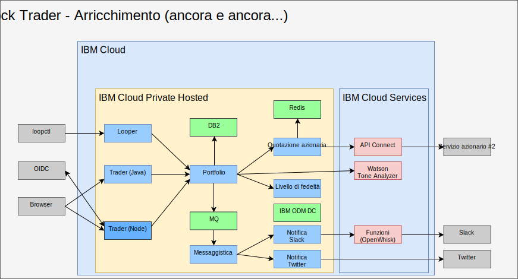

---

copyright:

  years:  2016, 2019

lastupdated: "2019-08-05"

subcollection: vmware-solutions

---

# Arricchimento con l'intelligenza artificiale, l'analisi e altri servizi di cloud pubblico
{: #vcscontent-aianalytics}

L'arricchimento di Stock Trader non è un passo da compiere solo una volta. Per Todd e Jane, si tratta di un processo iterativo. Nella seguente figura, vedi che Jane ha aggiunto il servizio Watson Tone Analyzer e una regola del livello di fedeltà utilizzando il centro decisionale ODM. I seguenti elementi evidenziano come è stato arricchito Stock Trader.

## AI Watson Tone Analyzer
{: #vcscontent-aianalytics-ai-watson}

Il seguente esempio è un modo semplice per arricchire un'applicazione, ma è ingannevolmente potente. Jane sfoglia il [catalogo {{site.data.keyword.cloud}}](https://cloud.ibm.com/catalog) per i servizi [AI](https://cloud.ibm.com/catalog?category=ai) e [Analytics](https://cloud.ibm.com/catalog?category=analytics) e trova il catalogo ricco di contenuti.

Jane seleziona [Tone Analyzer](https://cloud.ibm.com/catalog/services/tone-analyzer), optando per il piano Standard e quindi riceve le credenziali per chiamare.

Jane ha effettuato il refactoring di Stock Trader e crea solo un segreto Kubernetes per Tone Analyzer. In questo modo, anche se Jane cambia piani o regioni, non è necessario ricostruire il codice.

Grazie al refactoring, Jane ha sperimentato vari framework di interfacce utente senza interrompere l'esperienza dell'utente. Di conseguenza, la nuova interfaccia utente è disponibile per l'uso e aiuta a comprendere il tono del feedback degli utenti.

In futuro, Jane può fornire consigli su azioni predittive in base alla varietà di servizi di analisi disponibili per l'esecuzione nell'istanza del cloud privato, {{site.data.keyword.cloud_notm}} Private.

## Regola di business del livello di fedeltà
{: #vcscontent-aianalytics-loyalty-rule}

Originariamente, Jane aveva una logica nel suo codice per determinare quale importo
monetario avrebbe potuto causare un ostacolo alla fedeltà. Tuttavia, dopo ripetute richieste
da parte del direttore marketing di Stock Trader di modificare l'intervallo, Jane ha deciso
di scaricare tale decisione in una regola di business che il direttore marketing
può modificare senza il coinvolgimento di Jane.

Jane ha parlato con Todd, che ha aggiunto il
[servizio](https://cloud.ibm.com/catalog/services/decision-optimization) e quindi ha creato la decisione.

Ora, Margaret, il direttore marketing, può accedere e modificare gli intervalli del livello di fedeltà ogni volta che è in corso una campagna senza modificare alcun codice.

## Nuovo servizio azionario
{: #vcscontent-aianalytics-new-stock-service}

Potresti notare che il servizio azionario è stato modificato.
Questo può accadere quando un servizio pubblico cambia proprietario o la sua struttura
API. Per fortuna, Jane utilizzava [API Connect](https://cloud.ibm.com/catalog/services/api-connect).
Inizialmente, utilizzava API Connect per semplificare la risposta dal
servizio azionario originale poiché era un po' complicato ricevere e
formattare i dati che desiderava attraverso l'API non elaborata che le era stata fornita.

Adesso, Jane è contenta perché quando ha modificato il servizio azionario, ha semplicemente cambiato il modo in cui è associato all'API semplificata che ha creato
e non è stato nemmeno necessario riavviare il suo codice. La soluzione Stock Trader ha continuato
a richiedere dati dalla stessa API come se non fosse stata modificata. Tutte
le modifiche API sono state mascherate dietro le quinte.

Inoltre, con il monitoraggio e la misurazione in API Connect, Jane è in grado di rintracciare
chi utilizza la sua API semplificata.
