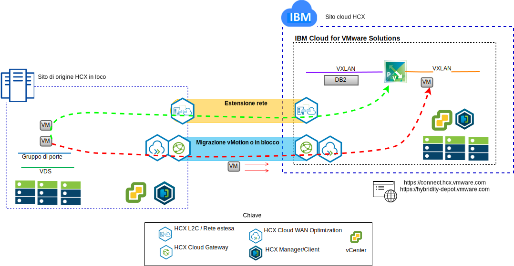

---

copyright:

  years:  2016, 2019

lastupdated: "2019-07-02"

subcollection: vmware-solutions

---

# Migrazione delle VM Stock Trader in IBM Cloud
{: #vcscontent-hcx}

Per il primo passo nel percorso di modernizzazione, Todd vuole estendere senza problemi l'istanza VMware SDDC in loco
in un'istanza VMware vCenter Server
on {{site.data.keyword.cloud}}. L'azienda deve restare operativa
e i tempi di inattività devono essere mantenuti al minimo.

VMware vCenter Server on {{site.data.keyword.cloud_notm}} with Hybridity Bundle consente la creazione di una
connessione trasparente tra le istanze vCenter Server e un
data center virtualizzato VMware installato in loco.

I componenti di vCenter Server with Hybridity Bundle, che vengono distribuiti
come macchine virtuali nel sito di destinazione {{site.data.keyword.cloud_notm}} VMware, consentono di
stabilire una connessione con i componenti HCX installati
nel sito di origine in loco del peer.

L'ibridità crea un'interconnessione debolmente accoppiata tra i siti in loco
e {{site.data.keyword.cloud_notm}} e abilita le seguenti funzionalità:

* Interconnettività semplice – le connessioni alla rete logica vengono stabilite
facilmente su qualsiasi connessione fisica che include l'Internet pubblico, la
VPN privata o direct link.
* Estensione di livello 2 – le reti in loco sono estese nel cloud e includono sottoreti locali e indirizzamento IP.
* Crittografia – il traffico di rete è crittografato in modo sicuro tra i due
siti.
* Rete ottimizzata – seleziona la connettività migliore e allarga in modo efficace
la connessione in modo che il traffico di rete venga spostato il più velocemente possibile.
* Deduplicazione dei dati – può essere raggiunta la riduzione del 50% 
del traffico di rete.
* Instradamento intelligente – quando un carico di lavoro viene spostato, l'instradamento di prossimità può
modificare il gateway di rete in modo che il traffico di rete utilizzi
il gateway del sito di destinazione e non ritorni al sito di origine.
* Migrazione senza tempo di inattività – un sistema in esecuzione può essere spostato nel (o tolto
dal) cloud utilizzando vMotion.
* Migrazione pianificata – qualsiasi numero di macchine virtuali può essere replicato
nel sito di destinazione e quindi attivato su quel sito in un momento designato,
sostituendo i sistemi in esecuzione sul sito di origine.
* Migrazione delle politiche di sicurezza – se viene utilizzato NSX in loco, tutte
le politiche di sicurezza, i firewall e altri elementi di sicurezza vengono spostati insieme al carico di lavoro.

Todd è in grado di migrare Stock Trader dal proprio
ambiente VMware in loco all'ambiente VMware on {{site.data.keyword.cloud_notm}} e soddisfa i loro requisiti di tempo di inattività minimo o inesistente
e di nessuna riconfigurazione dell'applicazione.

## Link correlati
{: #vcscontent-hcx-related}

* [Panoramica di vCenter Server on {{site.data.keyword.cloud_notm}} with Hybridity Bundle
](/docs/services/vmwaresolutions/archiref/vcs?topic=vmware-solutions-vcs-hybridity-intro)
