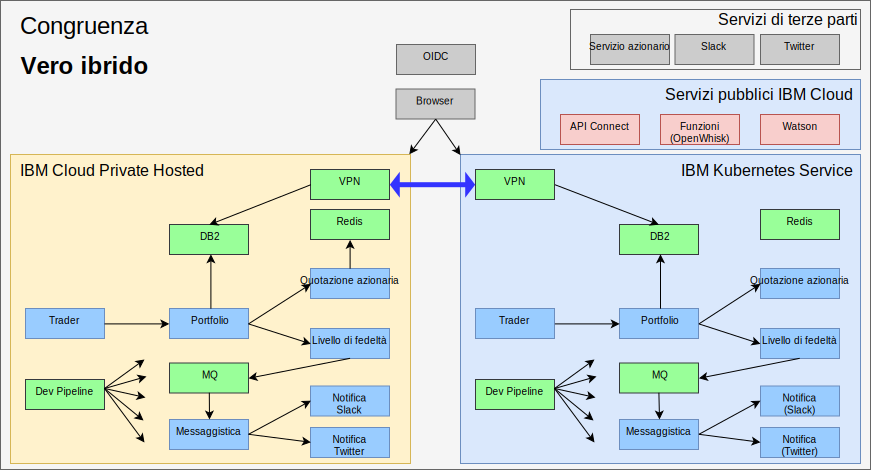

---

copyright:

  years:  2016, 2019

lastupdated: "2019-08-05"

subcollection: vmware-solutions

---

# Vero ibrido con IBM Cloud Kubernetes Service
{: #vcscontent-iks}

Poiché il team di test di Jane si espande, ha voluto fornire un ambiente di test
in cui eseguire importanti porzioni della sua applicazione e utilizzare ancora i dati che ha
nel suo ambiente. Jane vuole che il suo team di test si concentri sul test
della sua applicazione e non sulla gestione del cluster Kubernetes. Jane e Todd decidono di sostenere un'istanza [{{site.data.keyword.cloud}} Kubernetes
Service](https://www.ibm.com/cloud/container-service) e Jane
distribuisce Stock Trader, senza modifiche al codice, al suo interno.

Todd aggiunge quindi la VPN strongSwan per la connessione tra le reti
private di ciascun cluster.

