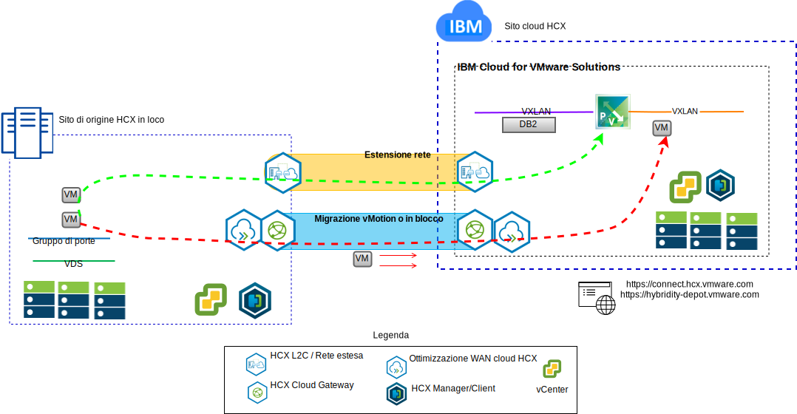

---

copyright:

  years:  2016, 2019

lastupdated: "2019-03-06"

subcollection: vmwaresolutions

---

# Introduzione a VMware Hybrid Cloud Services
{: #vcshcx-intro}

VMware HCX (Hybrid Cloud Services) consente a diverse istanze di vSphere SDDC (software defined data center) di interagire in diversi tipi di rete. Includono LAN o WAN, protette o meno sull'internet pubblico. HCX è progettato per occuparsi dei problemi di sicurezza, compatibilità, complessità e prestazioni che si potrebbero riscontrare quando si prova a ottenere una distribuzione a più istanze e a più siti di vSphere che si estende oltre i limiti dei provider in loco e nel cloud.

Figura 1. Servizi cloud ibrido VMware

HCX è il metodo preferito per l'interazione tra le offerte vSphere completamente automatizzate all'interno di {{site.data.keyword.cloud}} e qualsiasi altra istanza distribuita di vSphere. HCX è ora un'offerta completamente integrata all'interno di {{site.data.keyword.vmwaresolutions_short}}.

Questa guida è concepita per la distribuzione e il funzionamento di HCX, comprese le prassi ottimali e la risoluzione dei problemi così come attualmente accettate e comprese. Poiché HCX è sviluppato utilizzando la metodologia di sviluppo agile, non utilizzare questa guida come una fonte di fatto di versioni o piattaforme supportate.

## Link correlati
{: #vcshcx-intro-related}

* [Panoramica di vCenter Server on {{site.data.keyword.cloud_notm}} with Hybridity Bundle
](/docs/services/vmwaresolutions/archiref/vcs?topic=vmware-solutions-vcs-hybridity-intro) 
