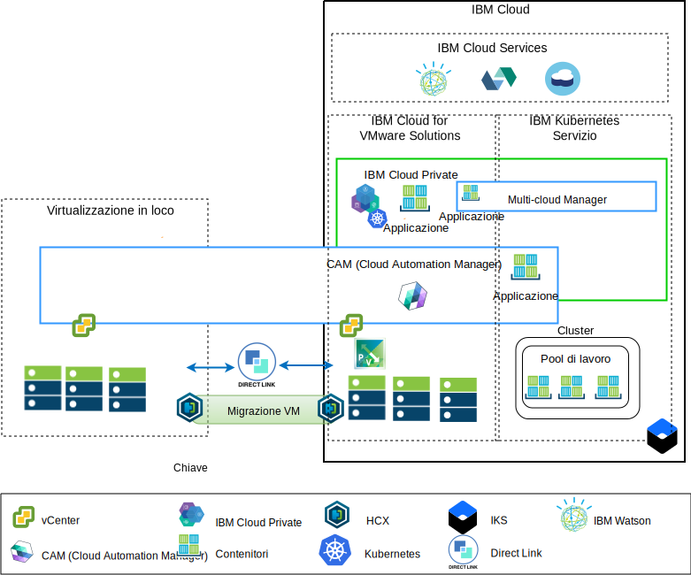

---

copyright:

  years:  2016, 2018

lastupdated: "2018-10-30"

---

# Panoramica sulla modernizzazione dell'applicazione

Il seguente diagramma mostra l'architettura di riferimento di modernizzazione dell'applicazione che Acme Skateboards distribuirà ed è descritta approfonditamente in questa serie di documenti.

Figura 1. Diagramma panoramica architettura

Questa architettura ibrida permetterà a Acme Skateboards di:
- Migrare le VM VMware in loco a IBM Cloud con poco o nessun tempo di inattività e nessuna riconfigurazione dell'applicazione.
- Abilitarle ad avviare il percorso di modernizzazione dell'applicazione permettendo loro di concentrarsi sull'inserire nel contenitore le interfacce web più semplici e middleware, consentendo ai database più complessi di rimanere VM.
- Utilizzare CAM (Cloud Automation Manager) per eseguire lo script dell'infrastruttura come codice (IaC) per creare e orchestrare i servizi creati sia dalle VM che dai contenitori con le relative toolchain DevOps e soluzioni ITSM.

L'infrastruttura di riferimento dispone dei seguenti componenti chiave:
- **Virtualizzazione in loco** - Questo è un cluster VMware che attualmente ospita le VM Acme Skateboards. Sono queste VM che attualmente ospitano le applicazioni che saranno modernizzate. Questo cluster è necessario per soddisfare i prerequisiti dell'architettura [VMware HCX on IBM Cloud Solution Architecture](https://www.ibm.com/cloud/garage/files/HCX_Architecture_Design.pdf) in modo da poter eseguire HCX. HCX estende le reti in loco in IBM Cloud consentendo ai clienti di migrare le VM nell'istanza VMware vCenter Server on IBM Cloud (VCS) in esecuzione su IBM Cloud e annullarla se necessario.

- **IBM Cloud for VMware Solutions** - L'istanza VCS fornisce i blocchi di generazione VMware fondamentali, come vSphere, vCenter Server, NSX-V e le opzioni di archiviazione che includono vSAN o IBM Cloud Endurance Storage, necessarie per distribuire automaticamente una soluzione VMware Software Defined Data Center (SDDC). Il cluster VMware è la destinazione delle VM migrate così come di alcune applicazioni modernizzate nei contenitori ospitati in ICP. I componenti chiave in VCS sono i seguenti:
    - **NSX-V** - NSX-V fornisce il livello di virtualizzazione di rete in VCS che fornisce una sovrapposizione di rete per le VM Acme Skateboards. NSX-V consente BYOIP e isola le reti del carico di lavoro dalle reti di IBM Cloud. NSX-V è programmato da HCX per creare le reti che Acme Skateboards estenderà dal locale.

    - **NSX-T** - NSX-T fornisce una serie comune di strumenti per la gestione della rete e della sicurezza nei contenitori e nelle VM. NSX-T è completamente compatibile con Kubernetes Container Networking Interface (CNI) e si integra con CNI per fornire la rete del contenitore. NSX-T fornisce la rete di sovrapposizione che utilizzano le applicazioni modernizzate e sta sostituendo Calico, che viene utilizzato in modo nativo da ICP e IKS.

- **IBM Cloud Private** - ICP è una piattaforma dell'applicazione per lo sviluppo e la gestione delle applicazioni inserite nei contenitori. ICP è un ambiente integrato che include l'orchestrazione del contenitore Kubernetes, un repository di immagini privato, una console di gestione, i framework di monitoraggio e un'interfaccia utente grafica che fornisce un'ubicazione centralizzata da cui Acme Skateboards può distribuire, gestire, monitorare e ridimensionare le proprie applicazioni. L'istanza VCS ospita i componenti ICP, i nodi master, i nodi di lavoro e così via, eseguendoli come VM. ICP ospita:
    - **IBM Cloud Automation Manager** - CAM è una piattaforma di infrastruttura pronta per le imprese come codice (IaC) che fornisce un unico pannello di controllo per il provisioning dei carichi di lavoro della VM, in loco o su VCS, insieme ai carichi di lavoro di Kubernetes, in ICP o IKS, semplicemente utilizzando i modelli. CAM è un'applicazione di Docker eseguita prima di ICP ed è strettamente integrata per l'autorizzazione, il controllo dell'accesso basato sul ruolo (RBAC) e altre funzioni.
    - Le applicazioni Acme Skateboards inserite nel contenitore che vuoi distribuire in questo ambiente.

- **IBM Kubernetes Service** - IKS consente a Acme Skateboards di distribuire le proprie applicazioni modernizzate in contenitori Docker che vengono eseguiti in cluster Kubernetes. Le modalità principali sono gestite completamente da IBM mentre i nodi di lavoro nel pool di lavoro vengono distribuiti nello stesso account di IBM Cloud dell'istanza VCS. I nodi di lavoro possono essere: istanze bare metal, pubbliche o del server virtuale dedicate. Calico viene installato e configurato automaticamente in IKS. Calico fornisce la connettività di rete sicura per i contenitori e viene configurato in IKS per utilizzare l'incapsulamento IP-in-IP per i pacchetti trasmessi attraverso le sottoreti e per utilizzare NAT per connessioni in uscita dai contenitori.

- **Direct Link** - IBM Cloud Direct Link utilizza il provider WAN di Acme Skateboards per connettere il propri data center a IBM Cloud per fornire una connessione di rete sicura, a bassa latenza e affidabile. Questa connessione fornisce:
    - Accesso alle applicazioni ospitate cloud dai tuoi utenti Enterprise.
    - Traffico VM interno tra le VM in loco e cloud.
    - Traffico tra i sistemi legacy nel data center in loco e le VM cloud.

## Vantaggi chiave di Acme Skateboards

VMware vCenter Server on IBM Cloud (VCS) fornisce i blocchi di creazione fondamentali che includono VMware vSphere, vCenter Server, NSX e le opzioni di archiviazione condivisa incluso vSAN, necessarie per la creazione flessibile di una soluzione VMware Software Defined Data Center (SDDC) che meglio si adatta ai carichi di lavoro del client.

In sintesi, l'offerta IBM Cloud for VMware:

* Accelera la consegna di progetti IT agli sviluppatori e delle linee di business riducendo il tempo necessario per approvvigionamento, architettura, implementazione e distribuzione di risorse da settimane o mesi, ad alcune ore.
* Migliora la sicurezza con server bare metal dedicati in un cloud privato ospitato, inclusa la distribuzione dell'endpoint privato ai servizi IBM Cloud, inclusi IKS e KMIP.
* Abilita la gestione e la governance coerenti del cloud ibrido distribuito fornendo un accesso amministrativo completo alla gestione della virtualizzazione, preservando così gli strumenti, gli script e gli investimenti VMware esistenti nella formazione.
* Sfrutta le competenze VMware su scala globale con i servizi professionali e gestiti di IBM disponibili in più di 30 data center IBM Cloud in tutto il mondo.

I clienti che passano a piattaforme dell'applicazione native cloud come ICP e IKS che sono incentrate sulla velocità e l'innovazione e non sempre tengono conto della rete e della sicurezza. In attesa che i team di rete o di sicurezza forniscano servizi come programmi di bilanciamento del carico, firewall, interruttori e router diminuisce il time-to-value dell'applicazione. Questa architettura di riferimento mostra come VCS, ICP e IKS passino in modo sicuro Acme Skateboards insieme al percorso di modernizzazione dell'applicazione.

## Link correlati

* [Panoramica di VCS Hybridity Bundle](../vcs/vcs-hybridity-intro.html)
