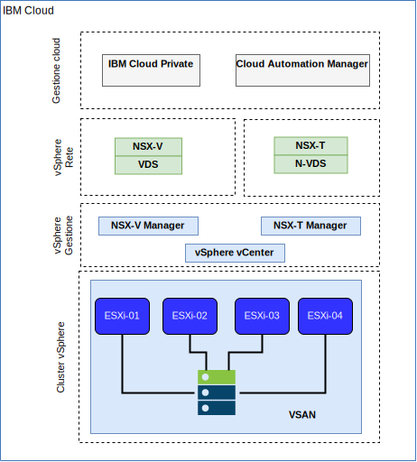

---

copyright:

  years:  2016, 2019

lastupdated: "2019-05-08"

subcollection: vmware-solutions

---

# Rete e infrastruttura di IBM Cloud
{: #vcsicp-arch-overview-infrastructure}

## VRF (Virtual Routing and Forwarding)
{: #vcsicp-arch-overview-infrastructure-vrf}

Puoi configurare gli account {{site.data.keyword.cloud}} come account VRF (Virtual Routing and Forwarding), abilitando così l'instradamento globale automatico tra i blocchi di IP della sottorete. Tutti gli account con connessioni Direct-Link devono essere convertiti o creati come account VRF.

## Direct Link
{: #vcsicp-arch-overview-infrastructure-direct-link}

{{site.data.keyword.cloud_notm}} Direct Link Connect offre l'accesso privato alla tua infrastruttura {{site.data.keyword.cloud_notm}} e a qualsiasi altro cloud collegato al Network Service Provider tramite il tuo data center IBM Cloud locale. Questa opzione è perfetta per la creazione della connettività multicloud in un unico ambiente. Una topologia di larghezza di banda condivisa viene utilizzata per connettere i clienti alla rete {{site.data.keyword.icpfull_notm}}. Come con tutti i prodotti Direct Link, puoi aggiungere l'instradamento globale, che abilita il traffico di rete privato a tutte le ubicazioni di {{site.data.keyword.cloud_notm}}.

## VPN (Virtual Private Network)
{: #vcsicp-arch-overview-infrastructure-vp-networks}

### VPN strongSwan
{: #vcsicp-arch-overview-infrastructure-strongswan}

Il servizio VPN strongSwan IPSec fornisce un canale di comunicazione end-to-end sicuro su internet che si basa sulla suite di protocolli standard del settore Internet Protocol Security (IPSec).

### Hybridity (HCX)
{: #vcsicp-arch-overview-infrastructure-hcx}

vCenter Server on {{site.data.keyword.cloud_notm}} Hybridity Bundle estende senza soluzione di continuità le reti dei data center in loco in {{site.data.keyword.cloud_notm}}, il che consente la migrazione delle VM (Virtual Machine) da e verso {{site.data.keyword.cloud_notm}} senza alcuna conversione o modifica.

## Struttura fisica
{: #vcsicp-arch-overview-infrastructure-phys-struct}

L'infrastruttura fisica richiesta per distribuire un'istanza di produzione {{site.data.keyword.icpfull_notm}} su un cluster VMware vCenter Server on {{site.data.keyword.cloud_notm}} richiede la seguente specifica minima.

Tabella 1. Specifica di vCenter Server per {{site.data.keyword.icpfull_notm}}

| Distribuzione NFS | Distribuzione vSAN |
:--|:----:|:----:
Numero di server | 3 | 4
CPU | 28 core 2,2 GHz | 28 core 2,2 GHz
Memoria | 384 GB | 384 GB
Archiviazione | Gestione 2000 GB 2IOPS/GB, Carico di lavoro 2000 GB 4IOPS/GB, {{site.data.keyword.icpfull_notm}} 4000 GB 4IOPS/GB | Min 960-GB SSD x 2

Oltre ai requisiti hardware di {{site.data.keyword.icpfull_notm}}, devi creare volumi persistenti nell'ambiente {{site.data.keyword.icpfull_notm}} per archiviare i dati database e log di CAM (Cloud Automation Manager). Mentre CAM supporta tutti i tipi di volumi persistenti supportati da {{site.data.keyword.icpfull_notm}}, le due configurazioni di archiviazione consigliate per CAM sono NFS e GlusterFS.

## Struttura virtuale
{: #vcsicp-arch-overview-infrastructure-virtual-struct}

All'interno dell'istanza vCenter Server, l'istanza {{site.data.keyword.icpfull_notm}} viene distribuita con un DLR (Distributed Logical Router) e ESG (Edge Services Gateway) NSX dedicato. L'installazione {{site.data.keyword.icpfull_notm}} viene caricata nella sottorete VXLAN definita nei componenti precedenti.

L'ESG è configurato con una regola NAT di origine (SNAT) per consentire il traffico in uscita, che abilita la connettività per scaricare i prerequisiti {{site.data.keyword.icpfull_notm}} e la connessione a GitHub e Docker. In alternativa, puoi utilizzare un proxy web per la connettività internet. L'ESG è anche configurato per fornire accesso ai servizi DNS e NTP.

L'ESG è anche configurato con una regola NAT di destinazione (DNAT) agli indirizzi IP virtuali Master/Proxy {{site.data.keyword.icpfull_notm}} dalla rete {{site.data.keyword.cloud_notm}} 10.x all'ambiente VXLAN.

## Link correlati
{: #vcsicp-arch-overview-infrastructure-related}

* [Panoramica di vCenter Server on {{site.data.keyword.cloud_notm}} with Hybridity Bundle
](/docs/services/vmwaresolutions/archiref/vcs?topic=vmware-solutions-vcs-hybridity-intro)
