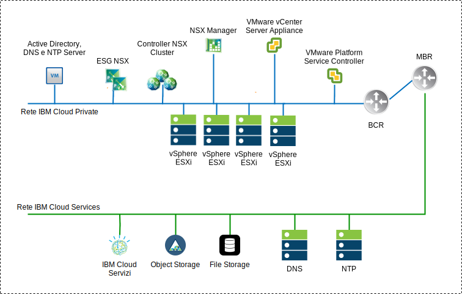
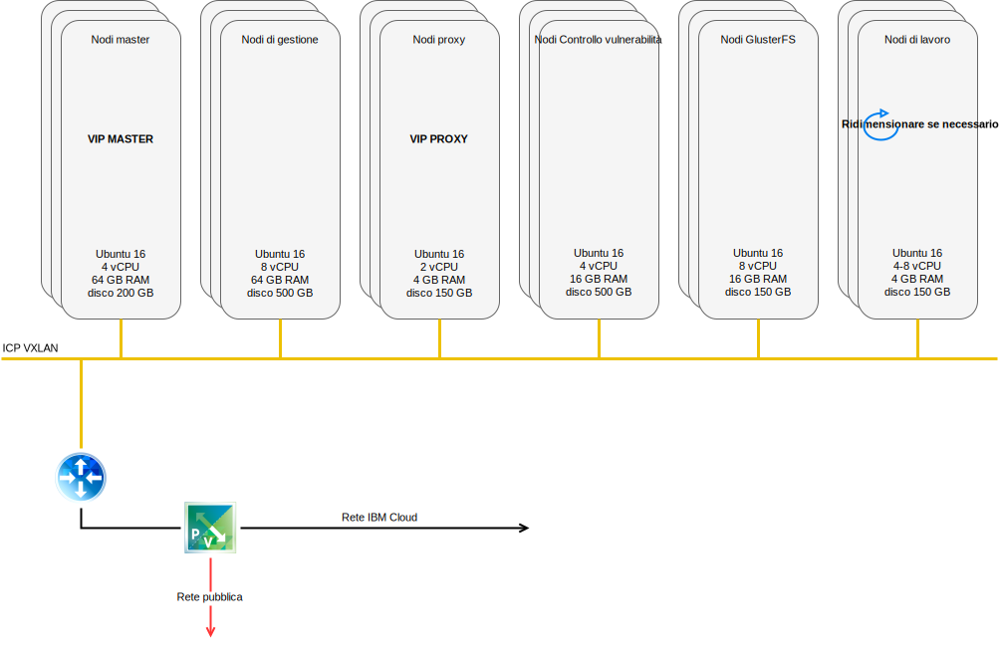
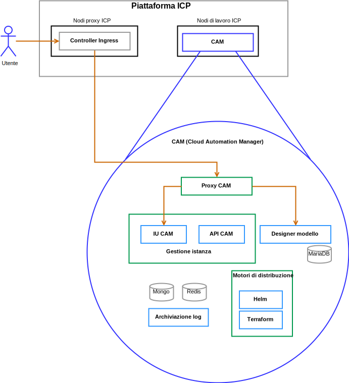

---

copyright:

  years:  2016, 2018

lastupdated: "2018-11-06"

---

# Componenti della soluzione

## Componenti VCS

Figura 1. Diagramma ambiente VCS

### Controller servizio piattaforma

La distribuzione VCS utilizza un solo controller di servizi della piattaforma esterno installato su una sottorete portatile nella VLAN privata associata alle macchine virtuali di gestione. Il suo gateway predefinito è impostato sul BCR (backend customer router).

### vCenter Server

Come il controller dei servizi della piattaforma, il vCenter Server viene distribuito come un'applicazione. Inoltre, vCenter Server viene installato su una sottorete portatile nella VLAN privata associata alle macchine virtuali di gestione. Il suo gateway predefinito è impostato sull'indirizzo IP assegnato sul BCR per quella particolare sottorete.

### NSX Manager

NSX Manager viene distribuito sul cluster iniziale. Inoltre, a NSX Manager viene assegnato un indirizzo IP di backend della VLAN dal blocco di indirizzi portatile privato progettato per i componenti di gestione e configurato con i server DNS e NTP

### Controller NSX

L'automazione di {{site.data.keyword.cloud}} distribuisce tre controller NSX all'interno del cluster iniziale. Ai controller viene assegnato un indirizzo IP di backend della VLAN dalla sottorete portatile privata progettato per i componenti di gestione.

### NSX Edge / DLR

Vengono distribuite coppie di gateway dei servizi edge (ESG) NSX. In tutti i casi, una coppia di gateway viene utilizzata per il traffico in uscita dai componenti di automazione che risiedono nella rete privata. Per vCenter Server e ICP, un secondo gateway noto come edge gestito da ICP, viene distribuito e configurato con un uplink alla rete pubblica e viene assegnata un'interfaccia alla rete privata. Tutti i componenti NSX necessari, come Distributed Logical Router (DLR), switch logici e firewall possono essere configurati dall'amministratore. La [Guida di rete di vCenter Server](../vcsnsxt/vcsnsxt-intro.html) fornisce maggiori dettagli sulla progettazione della rete.

La seguente tabella riepiloga le specifiche ICP ESG / DLR.

Tabella 1. Specifiche ESG ICP

Attributo  |  Specifica
--|--
Gateway servizio edge  |  Dispositivo virtuale
Dimensione edge	Large |   Numero di vCPUs	2
Memoria	| Disco 1-GB	| 1000 GB sul datastore locale

Tabella 2. Specifiche ICP DLR

Attributo  |  Specifica
--|--|
Router logico distribuito | 	Dispositivo virtuale
Dimensione edge	Compact | Numero di vCPUs	1
Memoria	| Disco 512-MB	| 1000 GB sul datastore locale

## Componenti ICP
{{site.data.keyword.cloud_notm}} Private è una piattaforma dell'applicazione per lo sviluppo e la gestione in loco delle applicazioni inserite nei contenitori. È un ambiente integrato per la gestione dei contenitori che include l'orchestrazione del contenitore Kubernetes, un repository di immagini privato, una console di gestione e i framework di monitoraggio.

Figura 2. Distribuzione ICP virtuale con VCS

###	Nodo di avvio

Un nodo di avvio o bootstrap (facoltativo) viene utilizzato per l'esecuzione dell'installazione, della configurazione, della scalabilità del nodo e degli aggiornamenti del cluster. Per ogni cluster è necessario un solo nodo di avvio. Puoi utilizzare un solo nodo per il master e per l'avvio.

### Nodo master

Un nodo master fornisce servizi di gestione e controlla i nodi di lavoro in un cluster. I nodi master ospitano i processi che sono responsabili dell'allocazione delle risorse, della manutenzione dello stato, della pianificazione e del monitoraggio. Poiché l'ambiente ad elevata disponibilità (HA) contiene più nodi master, se il nodo master principale ha un malfunzionamento, la logica di failover promuove automaticamente un nodo differente al ruolo master. Gli host che possono funzionare come master sono detti candidati master.

###	Nodo di lavoro

Un nodo di lavoro è un nodo che fornisce un ambiente contenitore per l'esecuzione delle attività. Man mano che la domanda aumenta, è possibile aggiungere più nodi di lavoro al cluster in modo da migliorare le prestazioni e l'efficienza. Un cluster può contenere un qualsiasi numero di nodi di lavoro, ma ne è necessario almeno uno.

### Nodo proxy

Un nodo proxy è un nodo che trasmette una richiesta esterna ai servizi creati all'interno del proprio cluster. Poiché l'ambiente ad elevata disponibilità (HA) contiene più nodi proxy, se il nodo proxy principale ha un malfunzionamento, la logica di failover promuove automaticamente un nodo differente al ruolo proxy. Mentre puoi utilizzare un solo nodo come master e proxy, è meglio utilizzare i nodi proxy dedicati per ridurre il carico sul nodo master. Un cluster deve contenere almeno un nodo proxy se è necessario il bilanciamento del carico.

### Nodo di gestione

Un nodo di gestione è un nodo facoltativo che ospita solo i servizi di gestione come il monitoraggio, la misurazione e la registrazione. Configurando i nodi di gestione dedicati, puoi evitare che il nodo master diventi sovraccaricato. Puoi abilitare il nodo di gestione solo durante l'installazione di {{site.data.keyword.cloud_notm}} Private.

###	Nodo VA

Un nodo VA (Controllo vulnerabilità) è un nodo facoltativo utilizzato per l'esecuzione dei servizi del Controllo vulnerabilità. I servizi del Controllo vulnerabilità sono intensivi per le risorse. Se utilizzi il servizio Controllo vulnerabilità, specifica un nodo VA dedicato.

Specifiche della macchina virtuale richieste per un'istanza ICP ad elevata disponibilità

Tabella 3. Specifiche macchina virtuale ICP

Nodo | 	Istanze	| IP	| CPU	| RAM (GB)	| DISK (GB)
:-----|------------:|:----|----:|----------:|----------:|
Master|	3	| IP (x3) VIP (x1)	| 4	| 64	| 200
Management	|3	| IP (x3)	|8	|64	|500
Proxy	| 3	| IP (x3)VIP (x1)	|2	|4	|150
Vulnerability Advisor	|3	| IP (x3)	| 4	| 16	|500
GlusterFS	| 3	| IP (x3)	|8	|16	|150
Worker	| 3-6	| IP (x3)	|4-8	|4	|150

CAM richiede che i nodi di lavoro abbiano una configurazione di vCPU e memoria superiore.

Tabella 4. Specifiche macchina virtuale ICP

Nodo | 	Istanze	| IP	| CPU	| RAM (GB)	| DISK (GB)
:-----|------------:|:----|----:|----------:|----------:|
worker  |  3 | IP (x3)  |  4-8 |16-20   |  150

## Componenti CAM

{{site.data.keyword.cloud_notm}} Automation Manager (CAM) è una piattaforma di gestione self-service a più cloud in esecuzione su ICP che consente agli sviluppatori e agli amministratori di soddisfare le richieste di business.

Fig 3. Riferimento del componente CAM

### Proxy CAM

Fornisce un accesso proxy nginx in CAM.

### IU CAM

I componenti IU sono suddivisi su più contenitori: IU connessioni cloud, IU libreria di modelli e IU istanze distribuite.

### API CAM

Le API CAM sono suddivise su più contenitori.

### Helm

Un contenitore con i file binari richiesti per distribuire i grafici helm nei cluster Kubernetes.

### Terraform

Un contenitore con i file binari richiesti per distribuire le risorse Terraform in più cloud.

### Log

L'ubicazione dei log del contenitore.

### Database Mongo

Il database Core per l'applicazione CAM.

### Redis

Il database Redis viene utilizzato per archiviare la memorizzazione nella cache delle sessioni e i blocchi all'interno di CAM.

### Designer modello

Una GUI (graphical user interface) per creare modelli Terraform, con capacità di trascinamento e rilascio dei moduli Terraform.

### DB Maria

Il database per l'applicazione designer del modello.

### Link correlati

* [Panoramica di VCS Hybridity Bundle](../vcs/vcs-hybridity-intro.html)
