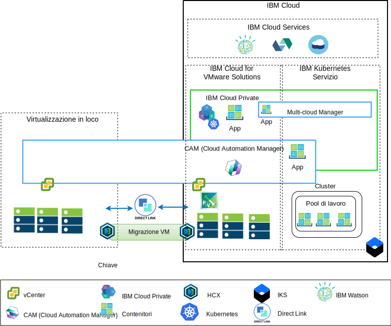
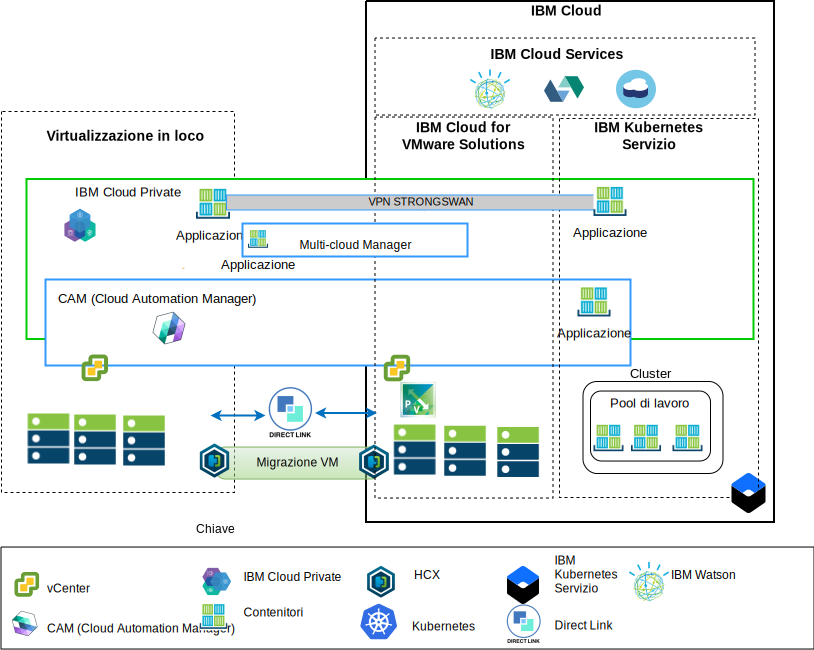

---

copyright:

  years:  2016, 2019

lastupdated: "2019-02-15"

subcollection: vmwaresolutions

---

# Panoramica sull'architettura
{: #vcsicp-arch-overview}

Le offerte {{site.data.keyword.vmwaresolutions_full}} forniscono l'automazione per distribuire i componenti di tecnologia VMware nei {{site.data.keyword.CloudDataCents_notm}} in tutto il mondo.
L'architettura consiste in una singola regione cloud e supporta la capacità di estensione in più regioni cloud che si trovano in un'altra area geografica o in un altro pod di {{site.data.keyword.cloud_notm}} all'interno dello stesso data center.

Puoi distribuire manualmente i prodotti {{site.data.keyword.cloud_notm}} Private e CAM (Cloud Automation Manager) nella tua piattaforma di virtualizzazione in loco, abilitando la gestione cloud dalle ubicazioni in loco. In alternativa, {{site.data.keyword.icpfull_notm}} e CAM vengono offerti come estensioni di servizio a una distribuzione VMware vCenter Server on {{site.data.keyword.cloud_notm}} nuova o esistente, tramite l'automazione, abilitando la gestione cloud da {{site.data.keyword.cloud_notm}}.

{{site.data.keyword.cloud_notm}} Private è una piattaforma dell'applicazione per lo sviluppo e la gestione in loco delle applicazioni inserite nei contenitori. {{site.data.keyword.cloud_notm}} Private è un ambiente integrato per la gestione dei contenitori che include l'orchestrazione del contenitore Kubernetes, un repository di immagini privato, una console di gestione e i framework di monitoraggio.

IBM Multi-Cluster Manager (MCM) fornisce la visibilità utente, la gestione incentrata sull'applicazione (politica, distribuzioni, integrità, operazioni) e conformità basata sulle politiche tra i cloud e i cluster. Con MCM, hai il controllo dei tuoi cluster Kubernetes. MCM ti aiuta ad assicurarti che i tuoi cluster siano sicuri, che funzionino in modo efficiente e che stiano fornendo una piattaforma di gestione dei servizi che viene eseguita su {{site.data.keyword.cloud_notm}} Private, che consente agli sviluppatori e agli amministratori di soddisfare le richieste di business.

Utilizza Cloud Automation Manager Service Composer per visualizzare i servizi cloud ibridi nel catalogo {{site.data.keyword.cloud_notm}} Private.

## Piattaforma di gestione cloud lato IBM Cloud
{: #vcsicp-arch-overview-ibm-cloud-side-platform}

Il seguente diagramma è un esempio di una distribuzione {{site.data.keyword.icpfull_notm}} e CAM con l'infrastruttura {{site.data.keyword.cloud_notm}}, con connessioni al vCenter in loco e {{site.data.keyword.containerlong_notm}} distribuito su {{site.data.keyword.cloud_notm}}. Gli utenti possono distribuire VM (Virtual Machine) in locale e VM in un'istanza vCenter Server e contenitori al cluster {{site.data.keyword.icpfull_notm}} e {{site.data.keyword.containerlong_notm}}.

Figura 1. Gestione cloud dal lato cloud

Nel diagramma, CAM crea in modo logico connessioni cloud ai vCenter, ai provider cloud e agli ambienti {{site.data.keyword.icpfull_notm}} e {{site.data.keyword.containerlong_notm}}. I cluster {{site.data.keyword.icpfull_notm}} devono essere distribuiti ad ogni ambiente cloud di data center, con MCM che fornisce il meccanismo per collegare i cluster {{site.data.keyword.icpfull_notm}} in una singola vista di gestione.

Puoi distribuire {{site.data.keyword.icpfull_notm}} con componenti NSX-V o NSX-T. {{site.data.keyword.icpfull_notm}} con NSX-V, consente alle VM {{site.data.keyword.icpfull_notm}} l'esecuzione sulla rete VXLAN e di utilizzare la rete interna Kubernetes Calico.

{{site.data.keyword.icpfull_notm}} con NSX-T, consente agli utenti di controllare e configurare la rete, la sottorete, le politiche dall'IU centrale (NSX-T Manager). Consulta la [Guida di rete di vCenter Server](/docs/services/vmwaresolutions/archiref/vcsnsxt?topic=vmware-solutions-vcsnsxt-intro) per le differenze tra NSX-V e NSX-T.

## Piattaforma di gestione cloud in loco
{: #vcsicp-arch-overview-on-premises-platform}

Il seguente diagramma è un esempio di una distribuzione {{site.data.keyword.icpfull_notm}} e CAM nell'infrastruttura in loco, con connessioni al vCenter e {{site.data.keyword.containerlong_notm}} distribuito su {{site.data.keyword.cloud_notm}}. Gli utenti possono distribuire VM e contenitori in loco, VM nelle istanze vCenter Server e contenitori al cluster {{site.data.keyword.containerlong_notm}}.

Figura 2. Gestione cloud dal lato locale

La VPN strongSwan viene utilizzata per stabilire la connettività con i contenitori {{site.data.keyword.containerlong_notm}} distribuiti. La VPN strongSwan potrebbe essere sostituita con la connettività Direct Link.

Nel diagramma, CAM crea in modo logico connessioni cloud ai vCenter, ai provider cloud e agli ambienti {{site.data.keyword.icpfull_notm}} e {{site.data.keyword.containerlong_notm}}. I cluster {{site.data.keyword.icpfull_notm}} devono essere distribuiti ad ogni ambiente cloud di data center, con MCM che fornisce il meccanismo per collegare i cluster {{site.data.keyword.icpfull_notm}} in una singola vista di gestione.

## Link correlati
{: #vcsicp-arch-overview-related}

* [Panoramica di vCenter Server on {{site.data.keyword.cloud_notm}} with Hybridity Bundle
](/docs/services/vmwaresolutions/archiref/vcs?topic=vmware-solutions-vcs-hybridity-intro)
