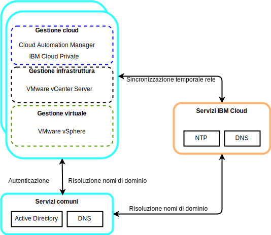
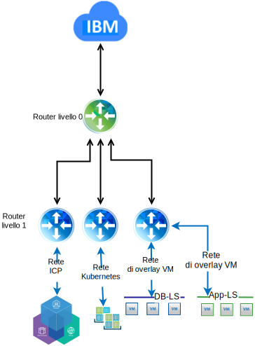

---

copyright:

  years:  2016, 2019

lastupdated: "2019-02-15"

subcollection: vmwaresolutions

---

# Progettazione dettagliata
{: #vcsicp-detail-design}

## Componenti di servizi comuni
{: #vcsicp-detail-design-common-services}

I servizi comuni forniscono i servizi che vengono utilizzati da altri servizi nella piattaforma di gestione cloud. I servizi comuni includono i servizi di identità e di accesso, i servizi di nome dominio e i servizi NTP.

Figura 1. Servizi comuni {{site.data.keyword.icpfull_notm}}

### Servizi di identità e accesso
{: #vcsicp-detail-design-identity}

Come parte dell'automazione di VMware vCenter Server on {{site.data.keyword.cloud}}, per la gestione delle identità viene utilizzato un Microsoft AD (Active Directory). Viene distribuita una singola VSI (Virtual Server Instance) AD. Il vCenter è configurato per utilizzare l'autenticazione AD e puoi configurare {{site.data.keyword.icpfull_notm}} per l'autenticazione LDAP.

###	DNS (Domain Name Service)
{: #vcsicp-detail-design-dns}

La distribuzione di vCenter Server utilizza le VSI AD distribuite come server DNS per l'istanza. Tutti i componenti distribuiti, quali gli host ESXi, vCenter, PSC e NSX, sono configurati per puntare ad AD come loro DNS predefinito.

###	Servizi NTP
{: #vcsicp-detail-design-ntp}

La distribuzione vCenter Server utilizza i server NTP dell'infrastruttura {{site.data.keyword.cloud_notm}}. Tutti i componenti distribuiti sono configurati per utilizzare questi server NTP. Per il corretto funzionamento dei certificati e dell'autenticazione AD, è fondamentale che tutti i componenti all'interno della progettazione utilizzino gli stessi server NTP.

## Rete
{: #vcsicp-detail-design-networking}

### Rete NSX-V
{: #vcsicp-detail-design-nsx-v}

NSX-V è progettata in modo che una singola piattaforma del gestore NSX-V sia collegata ad una singola istanza vCenter Server. Fornisce i servizi di rete alle applicazioni che vengono eseguite all'interno di un ambiente vSphere.

Utilizzando la rete NSX-V inclusa nella distribuzione VCS, possiamo distribuire {{site.data.keyword.icpfull_notm}} in una rete di sovrapposizione VXLAN.

{{site.data.keyword.icpfull_notm}} è distribuito con lo stack di rete Calico predefinito per Kubernetes, che fornisce l'isolamento di rete all'interno del tuo cluster.

Figura 2. {{site.data.keyword.icpfull_notm}} con rete NSX-V

Per ulteriori informazioni, vedi [Guida di rete di vCenter Server](/docs/services/vmwaresolutions/archiref/vcsnsxt?topic=vmware-solutions-vcsnsxt-intro).

### Rete NSX-T
{: #vcsicp-detail-design-nst-t}

NSX-T è progettata in modo che una singola piattaforma di rete possa connettersi a qualsiasi tipo di applicazione, basata su VM (Virtual Machine) o contenitore, in esecuzione all'interno o all'esterno di un ambiente vSphere.

{{site.data.keyword.icpfull_notm}} fornisce un'opzione per sostituire la rete di Calico con un'istanza NSX-T, fornendo una singola ubicazione per la gestione della rete e della sicurezza.

Figura 3. Rete {{site.data.keyword.icpfull_notm}} con NSX-T

## Link correlati
{: #vcsicp-detail-design-related}

* [Panoramica di vCenter Server on {{site.data.keyword.cloud_notm}} with Hybridity Bundle
](/docs/services/vmwaresolutions/archiref/vcs?topic=vmware-solutions-vcs-hybridity-intro)
