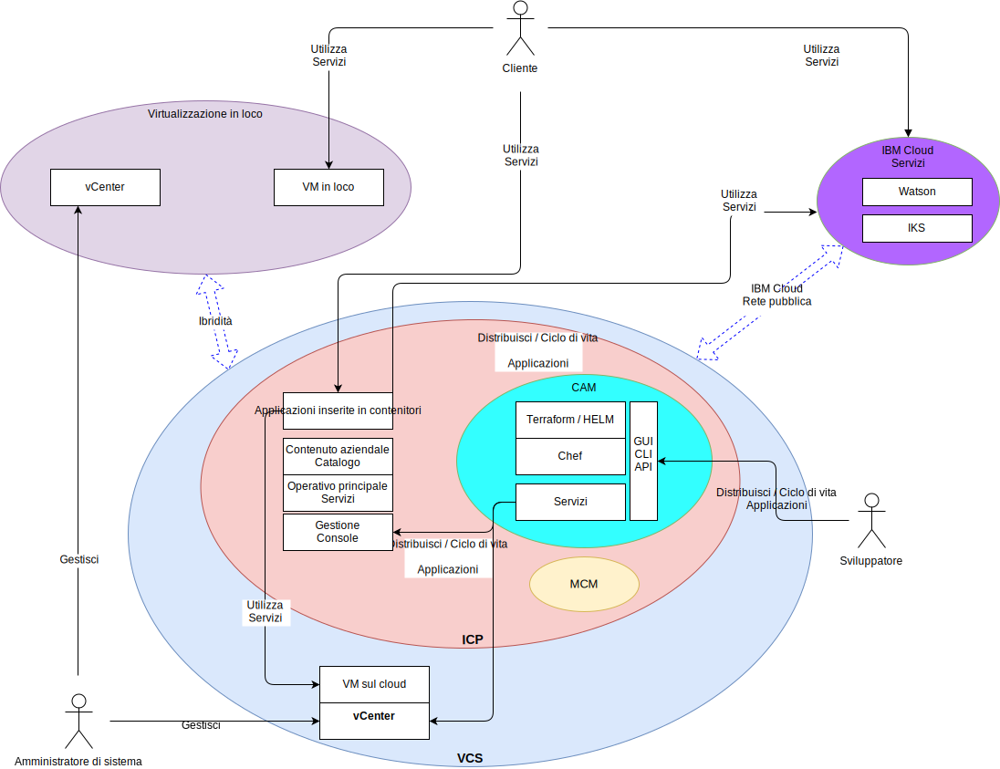

---

copyright:

  years:  2016, 2019

lastupdated: "2019-02-15"

subcollection: vmware-solutions

---

# Contesto di sistema
{: #vcsicp-systemcontext}

Figura 1. Diagramma del contesto di sistema

I seguenti sono i componenti principali:

- **Virtualizzazione in loco** - Questo componente è un ambiente VMware ospitato presso il cliente o in un'ubicazione di terze parti e al momento ospita le VM che eseguono le applicazioni da modernizzare. Virtualizzazione in loco è l'ambiente di origine per le migrazioni di VM ed è debolmente accoppiato a un'istanza di {{site.data.keyword.cloud}} mediante VMware Hybridity (HCX).
- **vCenter Server** – VMware vCenter Server on {{site.data.keyword.cloud_notm}} è un'istanza {{site.data.keyword.vmwaresolutions_short}} che è la destinazione delle VM migrate dall'ambiente in loco. Insieme all'ambiente virtualizzato in loco, forma un ambiente ibrido che consente alle VM di spostarsi da un sito all'altro.
- **{{site.data.keyword.containerlong_notm}}** - {{site.data.keyword.containerlong_notm}} utilizza Kubernetes come soluzione di orchestrazione del contenitore. IBM agisce e gestisce il nodo master Kubernetes mentre i nodi di lavoro vengono distribuiti all'infrastruttura gestita dal cliente. IBM fornisce gli strumenti di gestione per la distribuzione della patch del sistema operativo, gli aggiornamenti del motore Docker e le nuove versioni di Kubernetes. {{site.data.keyword.containerlong_notm}} fornisce una piattaforma isolata e sicura per la gestione dei contenitori che sia portatile, estensibile e riparabile automaticamente in caso di failover.
- **{{site.data.keyword.icpfull_notm}}** - {{site.data.keyword.icpfull_notm}} è una piattaforma dell'applicazione per
lo sviluppo e la gestione delle applicazioni inserite nei contenitori. {{site.data.keyword.icpfull_notm}} è un ambiente integrato che include l'orchestrazione del contenitore Kubernetes, un repository di immagini privato, una console di gestione, i framework di monitoraggio e un'interfaccia utente grafica che fornisce una posizione centralizzata da cui puoi distribuire, gestire, monitorare e ridimensionare le applicazioni.
- **{{site.data.keyword.cloud_notm}} Automation Manager** - CAM è una piattaforma IaC (Infrastructure as Code) pronta per le aziende che fornisce un unico pannello di controllo per eseguire il provisioning di carichi di lavoro basati su VMware insieme a quelli basati su Kubernetes. L'automazione del provisioning del carico di lavoro per le VM (Virtual Machine), i contenitori e i relativi prerequisiti dell'infrastruttura viene abilitata tramite CAM.
- **IBM Multi Cloud Manager** – MCM fornisce la visibilità utente, la gestione incentrata sull'applicazione (politica, distribuzioni, integrità, operazioni) e conformità basata sulle politiche tra i cloud e i cluster. Con MCM, hai il controllo dei tuoi cluster Kubernetes.
- **{{site.data.keyword.cloud_notm}} Services** - {{site.data.keyword.cloud_notm}} Services è un'ampia gamma di servizi utilizzabili disponibili, comprese le offerte di analisi, AI e IoT.

## Attori
{: #vcsicp-systemcontext-actors}

Tabella 1. Attori

Attore | Descrizione
--|--
Amministratore di sistema | La risorsa qualificata VMware vSphere che utilizza vCenter Server per gestire la virtualizzazione in loco e l'istanza vCenter Server.
Sviluppatore | La risorsa qualificata del contenitore che utilizza la console CAM per creare e gestire i contenitori. Creano i nuovi servizi come parte della modernizzazione dell'applicazione. Utilizzando CAM, lo sviluppatore esegue il provisioning dei carichi di lavoro su vCenter Server, {{site.data.keyword.icpfull_notm}} o {{site.data.keyword.containerlong_notm}}, crea e orchestra i servizi realizzati con le VM e i contenitori e integra le toolchain DevOps e le soluzioni day-2 ITSM.
Cliente | Attore esterno che consuma i servizi dall'azienda. Per Acme Skateboards, il cliente è uno skater che vuole acquistare i prodotti di skateboarding. Il cliente necessita di un accesso internet protetto al catalogo.
{{site.data.keyword.containerlong_notm}} | La risorsa IBM che gestisce il nodo master {{site.data.keyword.containerlong_notm}} per il servizio.

## Sistemi
{: #vcsicp-systemcontext-systems}

Tabella 2. Sistemi

Attore | Descrizione
--|--
vCenter Server | Interfaccia primaria che l'amministratore di sistema utilizza per gestire sia le VM in loco che quelle {{site.data.keyword.cloud_notm}} nell'istanza vCenter Server.
VM in loco| Server virtualizzati che ospitano le applicazioni indicate per la migrazione in {{site.data.keyword.cloud_notm}}. Migrate inizialmente come VM e riorganizzate da VM in contenitori per la modernizzazione dell'applicazione.
VM {{site.data.keyword.cloud_notm}} | Server virtualizzati che ospitano le applicazioni migrate dal data center in loco. Per questa architettura di riferimento e per Acme Skateboards, una delle VM {{site.data.keyword.cloud_notm}} è un server di database, che fa parte del carico di lavoro di presenza online.
Catalogo contenuto aziendale | Ubicazione centralizzata da cui puoi sfogliare e installare i pacchetti nel tuo cluster. Il catalogo presenta diversi pacchetti IBM utilizzati per creare i contenitori e accedere ai grafici Helm. Helm è uno strumento per la gestione dei grafici Kubernetes. I grafici sono pacchetti di risorse Kubernetes preconfigurate che rendono facile il controllo della versione, l'impacchettamento, la release, la distribuzione, l'eliminazione, l'aggiornamento e anche il rollback delle distribuzioni del contenitore. Helm è il sistema di gestione del pacchetto nativo Kubernetes ed è utilizzato per la gestione dell'applicazione all'interno di un cluster {{site.data.keyword.icpfull_notm}}.
Servizi operativi principali | {{site.data.keyword.icpfull_notm}} include vari strumenti per raccogliere, archiviare ed eseguire la query dei log e delle metriche. Questi strumenti forniscono un archivio centralizzato per tutti i log e le metriche e offrono prestazioni migliorate e una maggiore stabilità quando accedono a log e metriche e ne eseguono query.
Console di gestione | La console di gestione {{site.data.keyword.icpfull_notm}} gestisce, monitora e risolve i problemi delle tue applicazioni e del tuo cluster da una singola console di gestione centralizzata e sicura.
Terraform | Gestisce il provisioning delle risorse cloud e dell'infrastruttura utilizzando provider come VMware vSphere, {{site.data.keyword.cloud_notm}}, Microsoft Azure, Amazon Web Services, Google Cloud Platform e OpenStack.
HELM | Gestore del pacchetto per Kubernetes. I grafici Helm vengono utilizzati per definire le risorse di Kubernetes e distribuire le applicazioni.
Chef | Responsabile per la gestione della configurazione e l'automazione della conformità. Chef distribuisce e configura il middleware e le applicazioni dopo che Terraform ha completato il provisioning iniziale.
Servizi | Rappresenta il Service Composer, che è dove gli amministratori creano, compongono e progettano i servizi creati dalle risorse Kubernetes e da una o più VM.
Applicazioni inserite nel contenitore | Applicazioni che hanno completato il percorso di modernizzazione dell'applicazione e che ora sono in esecuzione come contenitori. Per questa architettura di riferimento e per Acme Skateboards, una delle applicazioni inserite nel contenitore è un server web, che fa parte del carico di lavoro di presenza online.
Watson | Per questa architettura di riferimento e per Acme Skateboards, Watson rappresenta il servizio AI utilizzato nell'architettura “Concept Car”.

La rete, la sicurezza e la migrazione dell'applicazione sono spesso gli aspetti più impegnativi della modernizzazione dell'applicazione. vCenter Server, VMware Hybridity, VMware NSX, {{site.data.keyword.icpfull_notm}} e {{site.data.keyword.containerlong_notm}} affrontano queste sfide e ti consentono di creare applicazioni moderne, robuste, sicure e resilienti.

## Link correlati
{: #vcsicp-systemcontext-related}

* [Panoramica di vCenter Server on {{site.data.keyword.cloud_notm}} with Hybridity Bundle
](/docs/services/vmwaresolutions/archiref/vcs?topic=vmware-solutions-vcs-hybridity-intro)
