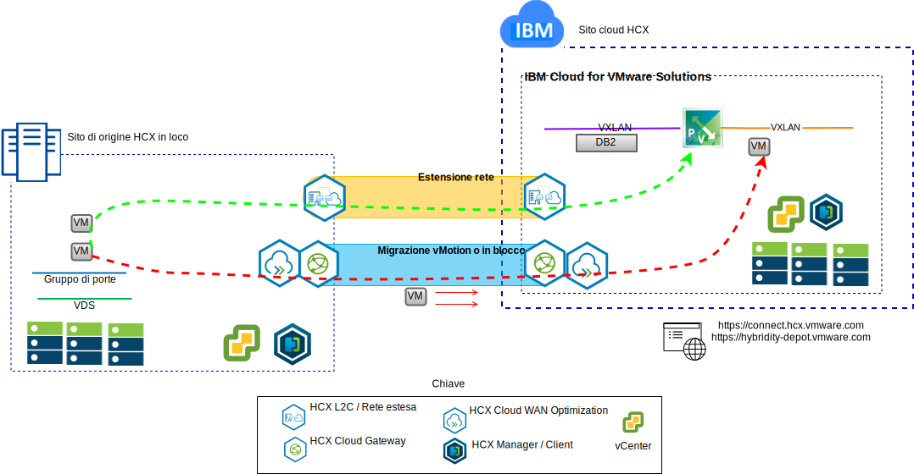
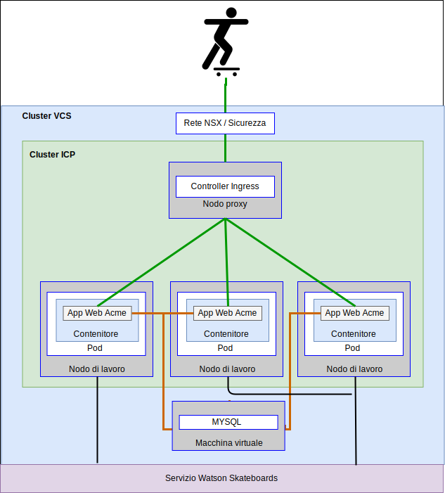

---

copyright:

  years:  2016, 2018

lastupdated: "2018-10-30"

---

# Casi di utilizzo

## Migrazione del carico di lavoro a IBM Cloud
Acme Skateboards vuole estendere facilmente i propri VMware SDDC in loco in un'istanza VCS su IBM Cloud. Devono mantenere il loro business a regime e mantenere il loro tempo di inattività al minimo. La riconfigurazione delle loro applicazioni per l'esecuzione nel cloud non è una soluzione ottimale.

Il servizio VMware Hybridity on IBM Cloud consente la creazione di connessioni senza problemi tra IBM Cloud e un data center virtualizzato VMware in loco.

L'offerta vCenter Server with Hybridity Bundle da IBM Cloud consente connessioni sicure tra il sito di origine in loco peer e il sito di destinazione IBM Cloud.

Figura 1. Servizi VMware Hybridity

Questo crea una interconnettività accoppiata approssimativamente tra il locale e IBM Cloud e abilita funzionalità come:
- **Interconnettività semplice** - le connessioni di rete logiche vengono stabilite facilmente su qualsiasi connessione fisica incluso internet pubblico, VPN privata o IBM Cloud Direct Link.
- **Estensione di livello 2** - le reti in loco sono estese nel cloud, incluse le sottoreti locali e l'indirizzamento IP.
- **Crittografia** - il traffico di rete viene codificato in modo sicuro tra i siti peer.
- **Ottimizzazione della rete** – seleziona la connettività migliore e allarga in modo efficace la connessione in modo che il traffico di rete venga spostato il più velocemente possibile.
- **Deduplicazione dei dati** - può essere raggiunta la riduzione del 50% del traffico di rete.
- **Instradamento intelligente** - quando un carico di lavoro viene spostato, l'instradamento di prossimità può modificare il percorso di rete (ossia il gateway) in modo che il traffico di rete utilizzi il gateway del sito di destinazione e non “torni” al sito di origine.
- **Migrazione senza tempo di inattività** - una macchina virtuale in esecuzione può essere spostata nel (o indietro dal) cloud utilizzando vMotion.
- **Migrazione pianificata** - qualsiasi numero di macchine virtuali può essere replicato sul sito di destinazione e poi attivato su quel sito in un momento designato per sostituire i sistemi in esecuzione sul sito di origine.
- **Migrazione delle politiche di sicurezza** - se viene utilizzato NSX in loco, tutte le politiche di sicurezza, i firewall e così via, vengono spostati insieme al carico di lavoro.

Utilizzando questa soluzione, Acme Skateboards ha migrato correttamente i propri carichi di lavoro VMware in loco a IBM Cloud soddisfacendo i propri requisiti di poco tempo di inattività e senza riconfigurare l'applicazione.

## Distribuzione architettura ibrida

Acme Skateboards vuole distribuire un'architettura ibrida su IBM Cloud costituita da VCS e ICP, per il proprio percorso di modernizzazione dell'applicazione. I loro requisiti sono quelli di eseguire i loro database su macchine virtuali, le applicazioni e i servizi web nei contenitori e utilizzare una serie comune di strumenti per la gestione della rete e della sicurezza.

Figura 2. Applicazione ibrida di Acme Skateboards

Le soluzioni IBM Cloud for VMware forniscono l'automazione per distribuire i componenti di tecnologia VMware nei data center di IBM Cloud in tutto il mondo. L'architettura è costituita da una sola regione cloud e supporta la capacità di estendersi in ulteriori regioni cloud che si trovano in un'altra area geografia e/o in un altro pod di IBM Cloud all'interno dello stesso data center.

I prodotti IBM Cloud Private (ICP) e Cloud Automation Manager (CAM) vengono distribuiti manualmente nella tua piattaforma di virtualizzazione in loco, abilitando la gestione cloud dall'ubicazione in loco. In alternativa, ICP e CAM vengono offerti come un'estensione del servizio a una distribuzione VCS nuova o esistente, tramite l'automazione, abilitando la gestione cloud da IBM Cloud.

Il diagramma riportato di seguito rappresenta ICP in esecuzione su un'istanza VCS. NSX-V viene configurato con uno switch/VXLAN dedicato, un DLR e un ESG specifico per la rete di sovrapposizione ICP, l'instradamento viene configurato tramite l'ESG per l'accesso alla rete di underlay.

Utilizzando l'automazione di IBM Cloud, Acme Skateboards può eseguire il provisioning di una soluzione ibrida che comprende VMware on IBM Cloud per eseguire le proprie VM del database e ICP su VMware on IBM Cloud per eseguire i propri servizi web di frontend e applicazioni nei contenitori. NSX fornisce loro una serie comune di strumenti di gestione per la rete e la sicurezza nella rete di sovrapposizione.

Figura 3. VCS con ICP

### Link correlati

* [Panoramica di VCS Hybridity Bundle](../vcs/vcs-hybridity-intro.html)
