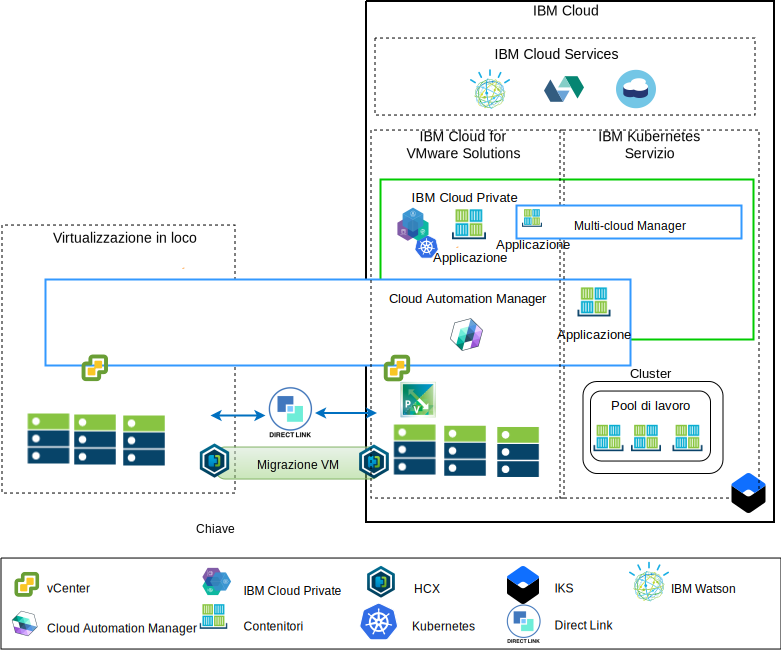

---

copyright:

  years:  2016, 2019

lastupdated: "2019-02-15"

---

# Panoramica sulla modernizzazione dell'applicazione
{: #vcsiks-appmod}

Il seguente diagramma mostra l'architettura di riferimento di modernizzazione dell'applicazione che Acme Skateboards distribuisce ed è descritta approfonditamente in questa serie di documenti.

Figura 1. Diagramma di panoramica dell'architettura

Questa architettura ibrida consente ad Acme Skateboards di:
- Migrare le macchine virtuali (VM) VMware che sono in loco a {{site.data.keyword.cloud}} con poco o nessun tempo di inattività e nessuna riconfigurazione dell'applicazione.
- Abilitarle ad avviare il percorso di modernizzazione dell'applicazione permettendo loro di concentrarsi sull'inserire nel contenitore le interfacce web più semplici e middleware, consentendo ai database più complessi di rimanere VM.
- Utilizzare CAM (Cloud Automation Manager) per gli script IaC (Infrastructure as Code) per creare e orchestrare i servizi creati sia dalle VM che dai contenitori per l'integrazione con le relative toolchain DevOps e la loro soluzione ITSM.

L'infrastruttura di riferimento dispone dei seguenti componenti chiave:
- **Virtualizzazione in loco** - La virtualizzazione in loco è un cluster VMware che attualmente ospita le VM Acme Skateboards. Queste VM stanno attualmente ospitando le applicazioni da modernizzare. Questo cluster è necessario per soddisfare i prerequisiti dell'architettura [VMware HCX on {{site.data.keyword.cloud_notm}} Solution Architecture](https://www.ibm.com/cloud/garage/files/HCX_Architecture_Design.pdf) in modo da poter eseguire HCX.

HCX estende le reti in loco in {{site.data.keyword.cloud_notm}} consentendo ai clienti di migrare le VM nell'istanza VMware vCenter Server on {{site.data.keyword.cloud_notm}} che viene eseguita su {{site.data.keyword.cloud_notm}} e nell'altro senso, se necessario.
- **{{site.data.keyword.cloud_notm}} for VWware Solutions** – L'istanza vCenter Server fornisce i blocchi di creazione di VMware fondamentali, quali vSphere, vCenter Server, NSX-V, e le opzioni di archiviazione che includono vSAN oppure l'archiviazione {{site.data.keyword.cloud_notm}} Endurance, che occorrono per distribuire automaticamente una soluzione VMware SDDC (Software Defined Data Center). Il cluster VMware è la destinazione per le VM migrate e alcune applicazioni modernizzate nei contenitori ospitati in {{site.data.keyword.icpfull_notm}}. I componenti chiave in vCenter Server sono i seguenti:
  - **NSX-V** - NSX-V fornisce il livello di virtualizzazione di rete in vCenter Server che fornisce una sovrapposizione di rete per le VM Acme Skateboards. NSX-V abilita BYOIP e isola le reti del carico di lavoro dalle reti {{site.data.keyword.cloud_notm}} NSX-V è programmato da HCX per creare le reti che Acme Skateboards estende da locale.
  - **NSX-T** - NSX-T fornisce una serie comune di strumenti per la gestione della rete e della sicurezza nei contenitori e nelle VM. NSX-T è completamente compatibile con Kubernetes CNI (Container Networking Interface) e si integra con CNI per fornire la rete del contenitore. NSX-T fornisce la rete di sovrapposizione che utilizzano le applicazioni modernizzate e sta sostituendo Calico, che viene utilizzato in modo nativo da {{site.data.keyword.icpfull_notm}} e {{site.data.keyword.containerlong_notm}}.

- **{{site.data.keyword.icpfull_notm}}** - {{site.data.keyword.icpfull_notm}} è una piattaforma dell'applicazione per lo sviluppo e la gestione delle applicazioni inserite nei contenitori. {{site.data.keyword.icpfull_notm}} è un ambiente integrato che include l'orchestrazione del contenitore Kubernetes, un repository di immagini privato, una console di gestione, i framework di monitoraggio e un'interfaccia utente grafica che fornisce un'ubicazione centralizzata da cui Acme Skateboards può distribuire, gestire, monitorare e ridimensionare le proprie applicazioni. L'istanza vCenter Server ospita i componenti {{site.data.keyword.icpfull_notm}}, i nodi master, i nodi di lavoro e così via, eseguendoli come VM. {{site.data.keyword.icpfull_notm}} ospita:
- **{{site.data.keyword.cloud_notm}} Automation Manager** – CAM è una piattaforma IaC (infrastructure as code) pronta per le aziende che fornisce un unico pannello di controllo per il provisioning dei carichi di lavoro della VM, in loco o su vCenter Server, insieme ai carichi di lavoro di Kubernetes, in {{site.data.keyword.icpfull_notm}} o {{site.data.keyword.containerlong_notm}}, utilizzando i template. CAM è un'applicazione di Docker eseguita su un'installazione {{site.data.keyword.icpfull_notm}} ed è strettamente integrata per l'autorizzazione, il controllo dell'accesso basato sul ruolo (RBAC) e altre funzioni.
    - Le applicazioni Acme Skateboards inserite nel contenitore che i clienti vogliono distribuire in questo ambiente.

- **{{site.data.keyword.containerlong_notm}}** – {{site.data.keyword.containerlong_notm}} consente a Acme Skateboards di distribuire le proprie applicazioni modernizzate in contenitori Docker che vengono eseguiti in cluster Kubernetes. Le modalità principali sono gestite completamente da IBM mentre i nodi di lavoro nel pool di lavoro vengono distribuiti nello stesso account di {{site.data.keyword.cloud_notm}} dell'istanza vCenter Server. I nodi di lavoro possono essere: istanze bare metal, pubbliche o del server virtuale dedicate. Calico viene installato e configurato automaticamente in {{site.data.keyword.containerlong_notm}}. Calico fornisce la connettività di rete sicura per i contenitori e viene configurato in {{site.data.keyword.containerlong_notm}} per utilizzare l'incapsulamento IP-in-IP per i pacchetti trasmessi attraverso le sottoreti e per utilizzare NAT per le connessioni in uscita dai contenitori.

- **Direct Link** - {{site.data.keyword.cloud_notm}} Direct Link utilizza il provider WAN di Acme Skateboards per connettere il relativo data center a {{site.data.keyword.cloud_notm}} per fornire una connessione di rete sicura, a bassa latenza e affidabile. Questa connessione fornisce:
  - Accesso alle applicazioni ospitate cloud dai tuoi utenti Enterprise.
  - Traffico VM interno tra le VM in loco e cloud.
  - Traffico tra i sistemi legacy nel data center in loco e le VM cloud.

## Vantaggi chiave di Acme Skateboards
{: #vcsiks-appmod-benefits}

vCenter Server fornisce i blocchi di creazione fondamentali che includono VMware vSphere, vCenter Server, NSX e le opzioni di archiviazione condivisa che includono vSAN, necessario per progettare una soluzione flessibile VMware SDDC (Software Defined Data Center) che meglio si adatta ai tuoi carichi di lavoro.

In sintesi, le offerte {{site.data.keyword.cloud_notm}} for VMware:
* Accelerano la fornitura di progetti IT per sviluppatori e linee di business riducendo il tempo necessario per approvvigionamento, architettura, implementazione e distribuzione di risorse da settimane, o anche mesi, ad alcune ore.
* Migliorano la sicurezza con server bare metal dedicati in un cloud privato ospitato, inclusa la distribuzione dell'endpoint privato ai servizi {{site.data.keyword.cloud_notm}}, tra cui {{site.data.keyword.containerlong_notm}} e KMIP.
* Abilitano la gestione e la governance coerenti del cloud ibrido distribuito fornendo un accesso amministrativo completo alla gestione della virtualizzazione, La gestione preserva gli investimenti in formazione, gli script e gli strumenti VMware esistenti.
* Utilizzano le competenze VMware su scala globale con i servizi professionali e gestiti di IBM disponibili in più di 30 {{site.data.keyword.CloudDataCents_notm}} in tutto il mondo.

{{site.data.keyword.containerlong_notm}} è un'offerta Kubernetes gestita per offrire dei potenti strumenti di gestione, un'esperienza utente intuitiva e sicurezza e isolamento integrati per abilitare una rapida fornitura di applicazioni, il tutto utilizzando al tempo stesso i servizi cloud, comprese le funzionalità cognitive di Watson. IBM è un membro Platinum della CNCF (Cloud Native Computing Foundation) e la nostra offerta è conforme al programma di verifica della conformità Kubernetes CNCF.

{{site.data.keyword.containerlong_notm}} fornisce funzionalità Kubernetes native come:
- La pianificazione intelligente, che massimizza l'uso delle risorse cluster
sottostanti distribuendo le applicazioni in un modo che garantisca la co-locazione di pod
con utilizzo intensivo di CPU e RAM.
- L'autocorrezione per le applicazioni inserite nel contenitore e i microservizi,
che garantisce che questi componenti vengano ridistribuiti automaticamente se qualcosa va storto.
- Scalabilità orizzontale per consentirti di configurare una politica di distribuzione, che l'agent di orchestrazione utilizza per garantire che i carichi di lavoro abbiano la capacità richiesta.
- Il rilevamento dei servizi e il bilanciamento del carico forniscono un DNS leggero all'interno del cluster Kubernetes che consente ai servizi di registrarsi ed elimina il bisogno di una codifica statica dei tuoi microservizi. Il bilanciamento del carico distribuisce le richieste in entrata al numero di istanze in esecuzione nella tua architettura.
- I rollout e i rollback automatizzati supportano i team che distribuiscono nuove funzioni e correzioni in un modo controllato. Se si verifica un problema, possiamo eseguire automaticamente il rollback a una valida versione nota precedente dell'immagine.
- Gestione di segreti e della configurazione. I segreti sono oggetti all'interno di Kubernetes che archiviano dati sensibili quali una password, un token o una chiave. Questi segreti sono crittografati per impostazione predefinita e garantiscono che l'accesso a questi dati sensibili sia controllato.

I clienti che passano a piattaforme dell'applicazione native cloud come {{site.data.keyword.icpfull_notm}} e {{site.data.keyword.containerlong_notm}} si concentrano sulla velocità e sull'innovazione e non sempre tengono conto della rete e della sicurezza. Il time-to-value dell'applicazione diminuisce se devono attendere finché i team di rete o di sicurezza potranno ordinare servizi quali i programmi di bilanciamento del carico, i firewall, gli switch e i router.

Questa architettura di riferimento mostra come VCS, {{site.data.keyword.icpfull_notm}} e {{site.data.keyword.containerlong_notm}} muovano in modo sicuro Acme Skateboards lungo il percorso di modernizzazione dell'applicazione.

## Link correlati
{: #vcsiks-appmod-related}

* [Panoramica di vCenter Server on {{site.data.keyword.cloud_notm}} with Hybridity Bundle
](/docs/services/vmwaresolutions/archiref/vcs?topic=vmware-solutions-vcs-hybridity-intro)
