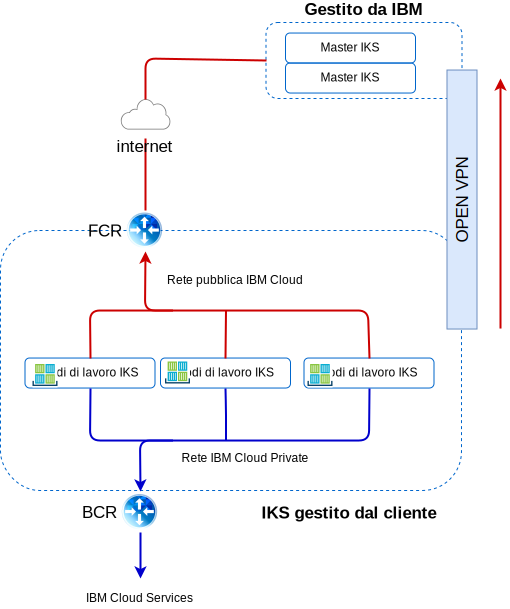

---

copyright:

  years:  2016, 2019

lastupdated: "2019-05-22"

subcollection: vmware-solutions

---

# Rete e infrastruttura di IBM Cloud
{: #vcsiks-arch-overview-infrastructure}

## VRF (Virtual Routing and Forwarding)
{: #vcsiks-arch-overview-infrastructure-vrf}

Gli account {{site.data.keyword.cloud}} possono essere configurati come account VRF (Virtual Routing and Forwarding). Gli account VRF abilitano l'instradamento globale automatico tra i blocchi IP della sottorete. Tutti gli account con connessioni Direct Link devono essere convertiti o creati come un account VRF.

## Direct Link
{: #vcsiks-arch-overview-infrastructure-direct-link}

{{site.data.keyword.cloud_notm}} Direct Link Connect offre l'accesso privato alla tua infrastruttura {{site.data.keyword.cloud_notm}} e a qualsiasi altro cloud collegato al Network Service Provider tramite il tuo {{site.data.keyword.CloudDataCent_notm}} locale. Questa opzione è perfetta per la creazione della connettività multicloud in un unico ambiente.

Connettiamo i clienti alla rete {{site.data.keyword.cloud_notm}} Private utilizzando una topologia di larghezza di banda condivisa. Come con tutti i prodotti Direct Link, puoi aggiungere l'instradamento globale, che abilita il traffico di rete privato a tutte le ubicazioni di {{site.data.keyword.cloud_notm}}.

## VPN (Virtual Private Network)
{: #vcsiks-arch-overview-infrastructure-virt-private-network}

### VPN strongSwan
{: #vcsiks-arch-overview-infrastructure-strongswan}

Il servizio VPN strongSwan IPSec fornisce un canale di comunicazione end-to-end sicuro su internet che si basa sulla suite di protocolli standard del settore Internet Protocol Security (IPSec).

### Hybridity (HCX)
{: #vcsiks-arch-overview-infrastructure-hcx}

VMware vCenter Server on {{site.data.keyword.cloud_notm}} Hybridity Bundle estende senza soluzione di continuità le reti dei data center in loco in {{site.data.keyword.cloud_notm}}, il che consente la migrazione delle VM (Virtual Machine) da e verso {{site.data.keyword.cloud_notm}} senza alcuna conversione o modifica.

## Struttura fisica
{: #vcsiks-arch-overview-infrastructure-physical-structure}

L'infrastruttura fisica richiesta per distribuire un cluster vCenter Server richiede la seguente specifica minima.

Tabella 1. Specifiche di vCenter Server

  | Distribuzione NFS | Distribuzione VSAN
---|---|---
Numero di server | 3 | 4
CPU | 28 core 2.2GHZ | 28 core 2,2GHZ
Memoria | 384 GB | 384 GB
Archiviazione|Gestione: 2 TB 2 IOPS, Carico di lavoro: 2 TB 4 IOPS|Min SSD: 960 GB(x2)   

Le opzioni di distribuzione di {{site.data.keyword.containerlong_notm}} variano in base ai tuoi requisiti del nodo di lavoro.

Tabella 2. Specifiche {{site.data.keyword.containerlong_notm}}

  | VM (Virtual Machine) | Bare Metal
--|---|--
Numero di server | 3 | 3
CPU | 2 – 56 core | 4 – 28 core
Memoria | 4 GB - 242 GB | 32 GB - 512 GB
Archiviazione | 100 GB |  SATA: 2 TB / SSD: 960 GB

## Struttura virtuale
{: #vcsiks-arch-overview-infrastructure-virtual-structure}

 e ESG (Edge Services Gateway) NSX dedicati.

L'ESG è configurato con una regola NAT di origine (SNAT) per consentire il traffico in uscita, che abilita la connettività per scaricare i prerequisiti {{site.data.keyword.icpfull_notm}} e la connessione a GitHub e Docker. In alternativa, puoi utilizzare un proxy web per la connettività internet. L'ESG è configurato per accedere ai servizi DNS e NTP mediante la rete privata. L'integrazione all'istanza {{site.data.keyword.containerlong_notm}} è disponibile mediante la rete {{site.data.keyword.cloud_notm}} tra l'istanza vCenter Server e {{site.data.keyword.containerlong_notm}}.

## Componenti di vCenter Server
{: #vcsiks-arch-overview-infrastructure-vcs-comp}

### Controller servizio piattaforma
{: #vcsiks-arch-overview-infrastructure-psc}

La distribuzione vCenter Server utilizza un singolo PSC (platform services controller)
esterno installato su una sottorete portatile nella VLAN privata associata alle VM di gestione. Il suo gateway predefinito è impostato sul BCR (backend customer router).

### vCenter Server
{: #vcsiks-arch-overview-infrastructure-vcs}

Come il PSC, vCenter Server viene distribuito come un dispositivo.
Inoltre, il vCenter viene installato su una sottorete portatile nella VLAN privata associata alle VM di gestione. Il suo
gateway predefinito è impostato sul BCR.

### NSX Manager
{: #vcsiks-arch-overview-infrastructure-nsx-manager}

NSX Manager viene distribuito sul cluster vCenter Server iniziale. Inoltre,
a NSX Manager viene assegnato un indirizzo IP dal blocco di indirizzi portatili privato designato per i componenti di gestione.

### Controller NSX
{: #vcsiks-arch-overview-infrastructure-nsx-controllers}

L'automazione di {{site.data.keyword.cloud_notm}} distribuisce tre controller NSX all'interno del cluster iniziale. Ai controller vengono assegnati degli indirizzi IP dalla sottorete portatile privata designata per i componenti di gestione.

### NSX ESG / DLR
{: #vcsiks-arch-overview-infrastructure-nsx-esg}

Vengono distribuite coppie di gateway dei servizi edge (ESG) NSX. In tutti i casi, una coppia di gateway viene utilizzata per il traffico in uscita dai componenti di automazione che risiedono sulla rete privata. Per vCenter Server e {{site.data.keyword.icpfull_notm}}, un secondo gateway noto come
edge gestito da ICP, viene distribuito e configurato con un uplink alla
rete pubblica e un'interfaccia che è assegnata alla rete privata.
Tutti i componenti NSX necessari, come Distributed Logical Router (DLR), switch logici e firewall possono essere configurati dall'amministratore. Per ulteriori informazioni sugli edge NSX distribuiti come parte della soluzione, vedi la [Guida di rete di vCenter Server](/docs/services/vmwaresolutions/archiref/vcsnsxt?topic=vmware-solutions-vcsnsxt-intro).

Le seguenti tabelle riepilogano le specifiche ESG / DLR {{site.data.keyword.icpfull_notm}}.

Tabella 3. Specifiche ESG {{site.data.keyword.icpfull_notm}}

Attributo |  Specifica
--|--
Gateway servizio edge | Dispositivo virtuale
Dimensione edge	Large | Numero di vCPUs	2
Memoria	| 1 GB
Disco	| 1000 GB sul datastore locale

Tabella 4. Specifiche DLR {{site.data.keyword.icpfull_notm}}

Attributo  |  Specifica
--|--|
Router logico distribuito |	Dispositivo virtuale
Dimensione edge	Compact | Numero di vCPUs	1
Memoria	| 512 MB
Disco	| 1000 GB sul datastore locale

## Componenti di IBM Cloud Kubernetes Service
{: #vcsiks-arch-overview-infrastructure-iks-comp}

### Master Kubernetes
{: #vcsiks-arch-overview-infrastructure-kube-master}

Il master Kubernetes è incaricato di gestire tutte le risorse di calcolo,
rete e archiviazione nel cluster. Il master Kubernetes garantisce che le tue
applicazioni e i tuoi servizi inseriti nel contenitore siano distribuiti equamente ai nodi di lavoro
nel cluster.

###	Nodo di lavoro
{: #vcsiks-arch-overview-infrastructure-worker-node}

Ogni nodo di lavoro è una macchina fisica (bare metal) oppure una VM
che viene eseguita su hardware fisico nell'ambiente cloud. Quando esegui il provisioning di
un nodo di lavoro, determini le risorse che sono disponibili nei contenitori
ospitati su tale nodo di lavoro. Come dotazione standard, i tuoi nodi di lavoro sono configurati con un
Docker Engine gestito da IBM, risorse di calcolo separate, rete e un servizio volumi. Le funzioni di sicurezza integrate forniscono isolamento, funzionalità di gestione delle risorse e conformità di sicurezza dei nodi di lavoro.

## Link correlati
{: #vcsiks-arch-overview-infrastructure-related}

* [Panoramica di vCenter Server on {{site.data.keyword.cloud_notm}} with Hybridity Bundle](/docs/services/vmwaresolutions/archiref/vcs?topic=vmware-solutions-vcs-hybridity-intro)
