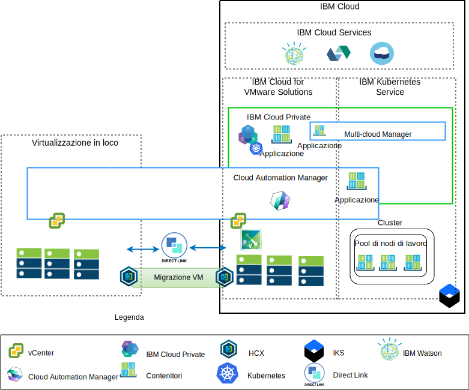

---

copyright:

  years:  2016, 2018

lastupdated: "2018-11-16"

---

# Panoramica sull'architettura
Le offerte {{site.data.keyword.vmwaresolutions_full}} forniscono l'automazione per distribuire
i componenti di tecnologia VMware nei {{site.data.keyword.CloudDataCents_notm}} in tutto il mondo. L'architettura
consiste in una singola regione cloud e supporta la capacità di estensione
in più regioni cloud che si trovano
in un'altra area geografica e/o in un altro pod di {{site.data.keyword.cloud_notm}} all'interno dello stesso data center.

Puoi distribuire manualmente i prodotti ICP ({{site.data.keyword.cloud_notm}} Private) e CAM (Cloud Automation Manager) nella tua piattaforma di virtualizzazione in loco,
abilitando la gestione cloud dalle ubicazioni in loco. In alternativa, ICP
e CAM vengono offerti come estensioni di servizio a una distribuzione VMware
vCenter Server on {{site.data.keyword.cloud_notm}} nuova o esistente, tramite l'automazione, abilitando
la gestione cloud da {{site.data.keyword.cloud_notm}}.

ICP è una piattaforma dell'applicazione per lo sviluppo e la gestione in loco delle applicazioni inserite nei contenitori. ICP è un ambiente integrato per la gestione
dei contenitori che include l'orchestrazione del contenitore Kubernetes, un
repository di immagini privato, una console di gestione e i
framework di monitoraggio.

IBM Multi-Cluster Manager fornisce visibilità utente, gestione incentrata
sull'applicazione (politica, distribuzioni, integrità, operazioni) e conformità
basata sulle politiche tra i cloud e i cluster. Con IBM Multi-Cluster Manager,
hai il controllo dei tuoi cluster Kubernetes. Puoi garantire che i tuoi
cluster siano sicuri, che funzionino in modo efficiente e che forniscano i livelli
di servizio previsti dalle applicazioni.

{{site.data.keyword.cloud_notm}} Automation Manager è una piattaforma di gestione self service multi-cloud
eseguita su {{site.data.keyword.cloud_notm}} Private che permette a sviluppatori e
amministratori di soddisfare le richieste di business. Cloud Automation Manager
Service Composer ti consente di esporre i servizi cloud ibridi nel catalogo IBM
Cloud Private.

## Piattaforma di gestione cloud lato IBM Cloud

Il seguente diagramma visualizza ICP e CAM distribuiti con l'infrastruttura {{site.data.keyword.cloud_notm}},
con connessioni al vCenter in loco e al servizio IBM
Kubernetes Service (IKS) distribuiti su {{site.data.keyword.cloud_notm}}. Gli utenti possono distribuire le macchine virtuali (VM) in loco e nelle istanze vCenter Server
e i contenitori nel cluster ICP e IKS.

Figura 1. Gestione cloud dal lato cloud

Nel diagramma, CAM crea in modo logico le connessioni cloud ai vCenter, ai provider cloud, a ICP e agli ambienti IKS. I cluster ICP devono essere
distribuiti in ciascun data center o ambiente cloud, con MCM che fornisce il
meccanismo per connettere i cluster ICP in un'unica vista di gestione.

ICP può essere distribuito con i componenti NSX-V o NSX-T. ICP con NSX-V,
consente alle VM ICP l'esecuzione sulla rete VXLAN e di utilizzare
la rete interna Kubernetes Calico.

ICP con NSX-T, consente agli utenti di controllare e configurare la rete, la sottorete, le politiche dall'IU centrale (NSX-T Manager). Per informazioni sulle differenze tra NSX-V e NSX-T, vedi [{{site.data.keyword.cloud_notm}}
VCS Networking reference architecture](../vcsnsxt/vcsnsxt-intro.html).

## Piattaforma di gestione cloud in loco

Il seguente diagramma visualizza ICP e CAM distribuiti nell'infrastruttura
in loco, con connessioni a vCenter e IKS distribuiti su {{site.data.keyword.cloud_notm}}. Gli utenti possono distribuire VM e contenitori
in loco, VM nelle istanze vCenter Server e contenitori
nel cluster IKS.

Figura 2. Gestione cloud dal lato locale

La VPN strongSwan viene utilizzata per stabilire la connettività con i contenitori
IKS distribuiti. Con il tempo, strongSwan potrebbe essere sostituito con la connettività
Direct-link.

Nel diagramma, CAM crea in modo logico le connessioni cloud ai vCenter, ai provider cloud, a ICP e agli ambienti IKS. I cluster ICP devono essere
distribuiti in ciascun data center o ambiente cloud, con MCM che fornisce il
meccanismo per connettere i cluster ICP in un'unica vista di gestione.

### Link correlati

* [Panoramica di vCenter Server on {{site.data.keyword.cloud_notm}} with Hybridity Bundle](../vcs/vcs-hybridity-intro.html)
