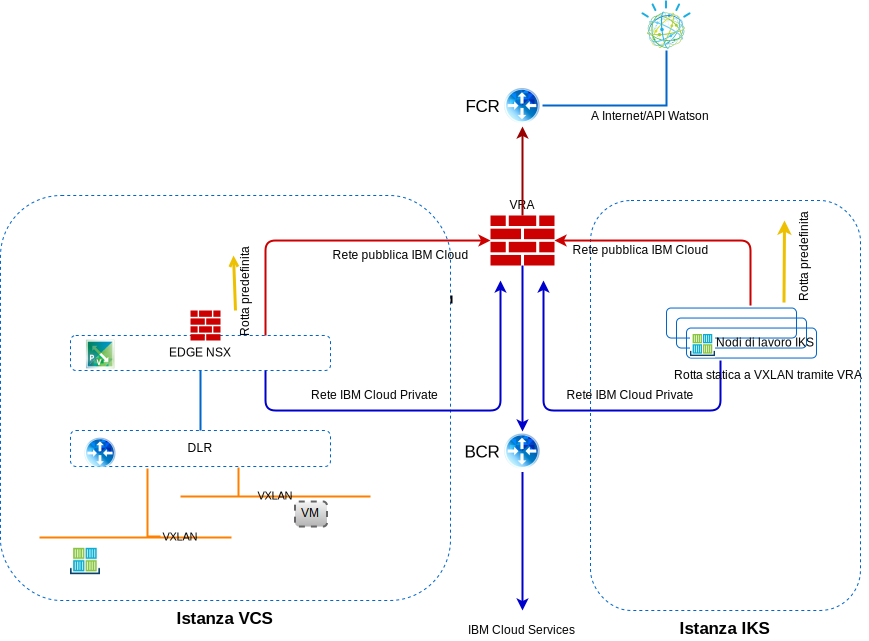

---

copyright:

  years:  2016, 2019

lastupdated: "2019-03-01"

subcollection: vmwaresolutions

---

# Rete, backup, ripristino di emergenza e scalabilità
{: #vcsiks-overview-network}

Controlla le informazioni sulle considerazioni sulla rete, il backup, il ripristino di emergenza (DR, Disaster Recovery) e la scalabilità.

## Rete
{: #vcsiks-overview-network-networking}

{{site.data.keyword.cloud}} ha due reti. La rete pubblica consente ai server di essere raggiunti da Internet e la rete privata consente ai server di comunicare tra loro su un backbone ad alta velocità in tutti i {{site.data.keyword.CloudDataCents_notm}}.

Per impostazione predefinita, {{site.data.keyword.containerlong_notm}} configura il cluster con accesso a una VLAN pubblica e a una VLAN privata.
- Un indirizzo IP pubblico per ciascun nodo di lavoro, che fornisce ai nodi di lavoro un'interfaccia di rete pubblica.
  - Tutto il traffico di rete in uscita è consentito per tutti i nodi di lavoro.
  - Il traffico di rete in entrata è bloccato, fatta eccezione per alcune porte. Queste porte sono aperte in modo che IBM possa monitorare il traffico di rete e installare automaticamente gli aggiornamenti di sicurezza per il master Kubernetes.
- Un indirizzo IP privato per ciascun nodo di lavoro, che fornisce ai nodi di lavoro un'interfaccia di rete privata
- Una connessione OpenVPN automatica e sicura tra tutti i nodi di lavoro e il nodo master

Figura 1. Rete di vCenter Server e {{site.data.keyword.containerlong_notm}}

### Integrazione di IBM Cloud Kubernetes Service e vCenter Server
{: #vcsiks-overview-network-iks-vcs-integration}

Attualmente, i seguenti scenari integrano la rete di {{site.data.keyword.containerlong_notm}} e VMware vCenter Server on {{site.data.keyword.cloud_notm}}:
- **Instradamento VRA** - Questo scenario richiede che i nodi di lavoro {{site.data.keyword.containerlong_notm}} siano distribuiti sulla stessa VLAN dell'istanza vCenter Server. Ciò consente a un ESG di essere collegato a BGP con VRA e di abilitare l'instradamento dalla rete di sovrapposizione a quella sottostante tra vCenter Server e {{site.data.keyword.containerlong_notm}}. È richiesta una rotta statica sui nodi di lavoro {{site.data.keyword.containerlong_notm}} per ogni rete VXLAN per instradare correttamente queste richieste a BCR/VRA.
- **VPN strongSwan** – Questo scenario utilizza la soluzione di connettività standard {{site.data.keyword.containerlong_notm}}-azienda. Un contenitore strongSwan fornisce un gateway VPN per il cluster che inoltra i pacchetti alle reti remote attraverso un tunnel IPSec
al gateway remoto. Questo gateway remoto è un ESG sull'istanza vCenter Server. Sui gateway, le rotte sono configurate inviando tutti gli intervalli IP del cluster e del servizio al contenitore StrongSwan e tutti gli indirizzi BYOIP di vCenter Server all'ESG. Gli indirizzi IP di destinazione per i gateway sono l'indirizzo IP portatile privato del servizio del programma di bilanciamento del carico assegnato al contenitore strongSwan e l'indirizzo IP portatile privato dell'ESG.

#### VLAN della rete IBM Cloud Kubernetes Service
{: #vcsiks-overview-network-iks-vlans}

Le seguenti informazioni si applicano alle sottoreti VLAN pubbliche:
- La sottorete pubblica primaria determina gli indirizzi IP pubblici che vengono assegnati ai nodi di lavoro durante la creazione del cluster. Più cluster sulla stessa VLAN possono condividere una sottorete pubblica primaria.
- La sottorete pubblica portatile è associata a un solo cluster e fornisce al cluster otto indirizzi IP pubblici. Tre IP sono riservati per le funzioni di rete. Un IP viene utilizzato dall'ALB Ingress pubblico predefinito e quattro IP sono utilizzati per creare servizi di rete del programma di bilanciamento del carico pubblico.
- Gli IP pubblici portatili sono indirizzi IP fissi e permanenti che vengono utilizzati per accedere ai servizi del programma di bilanciamento del carico su Internet.

Le seguenti informazioni si applicano alle sottoreti VLAN private:
- La sottorete privata primaria determina gli indirizzi IP privati che vengono assegnati ai nodi di lavoro durante la creazione del cluster. Più cluster sulla stessa VLAN possono condividere una sottorete privata primaria.
- La sottorete privata portatile è associata a un solo cluster e fornisce al cluster otto indirizzi IP privati. Tre IP sono riservati per le funzioni di rete. Un IP viene utilizzato dall'ALB Ingress privato predefinito e quattro IP sono utilizzati per creare servizi di rete del programma di bilanciamento del carico privato.
- Gli IP privati portatili sono indirizzi IP fissi e permanenti che vengono utilizzati per accedere ai servizi del programma di bilanciamento del carico su Internet.

#### Plugin di rete Calico
{: #vcsiks-overview-network-calico}

Ogni cluster Kubernetes è configurato con un plug-in di rete chiamato Calico.

Le politiche di rete predefinite sono configurate per proteggere l'interfaccia di rete pubblica di ogni nodo di lavoro in {{site.data.keyword.containerlong_notm}}. Se hai dei requisiti di sicurezza univoci o hai un cluster multizona con lo spanning della VLAN o VRF (Virtual Routing and Forwarding) abilitati, puoi utilizzare Calico e Kubernetes per creare politiche di rete per un cluster. Con le politiche di rete Kubernetes, puoi specificare il traffico di rete che vuoi consentire o bloccare da e verso un pod all'interno di un cluster.

Per impostare politiche di rete più avanzate come il blocco del traffico in entrata (ingress) ai servizi LoadBalancer, utilizza le politiche di rete Calico.

Le politiche di rete Kubernetes specificano in che modo i pod possono comunicare con altri pod e con endpoint di servizio di rete pubblica. Il traffico può inoltre essere filtrato in base alle etichette di pod e spazio dei nomi. Le politiche di rete Kubernetes vengono applicate utilizzando i comandi kubectl o le API Kubernetes. Quando queste politiche vengono applicate, vengono automaticamente convertite in politiche di rete Calico e quindi Calico applica tali politiche.

Le politiche di rete Calico per Kubernetes sono un superset delle politiche di rete Kubernetes e vengono applicate usando i comandi calicoctl.

Le politiche Calico aggiungono le seguenti funzioni:
- Consentire o bloccare il traffico di rete su interfacce di rete specifiche indipendentemente dall'indirizzo IP o dal CIDR di origine o destinazione del pod Kubernetes.
- Consentire o bloccare il traffico di rete per i pod tra gli spazi dei nomi.
- Bloccare il traffico in entrata (ingress) ai servizi LoadBalancer o NodePort di Kubernetes.

Calico applica queste politiche, incluse le politiche di rete Kubernetes convertite automaticamente in politiche Calico, configurando le regole iptables di Linux sui nodi di lavoro Kubernetes. Le regole iptables fungono da firewall per il nodo di lavoro per definire le caratteristiche che il traffico di rete deve soddisfare per essere inoltrato alla risorsa di destinazione.

### Flussi del traffico
{: #vcsiks-overview-network-traffic-flows}

#### Utente esterno su internet a un livello web ospitato in un contenitore in IBM Cloud Kubernetes Service
{: #vcsiks-overview-network-web-tier-iks}

1. L'utente esterno effettua una richiesta al livello web utilizzando l'URL.
2. Viene utilizzato DNS per determinare l'indirizzo IP. Questo indirizzo IP è un indirizzo pubblico di {{site.data.keyword.cloud_notm}} su una sottorete portatile assegnata al servizio ALB o Ingress.
3. La rete pubblica inoltra automaticamente la richiesta al nodo di lavoro che ospita il servizio ALB o Ingress.
4. Il nodo di lavoro inoltra la richiesta all'indirizzo IP del cluster interno e al numero di porta del servizio ALB o Ingress. Questo indirizzo IP del cluster interno è accessibile solo all'interno del cluster.
5. All'interno del nodo di lavoro, kube-proxy instrada la richiesta al servizio ALB o Ingress.
6. Se l'applicazione si trova sullo stesso nodo di lavoro, vengono utilizzate le iptable per determinare quale interfaccia interna viene utilizzata per inoltrare la richiesta. Se l'applicazione si trova su un nodo di lavoro differente, il vRouter Calico instrada al nodo di lavoro applicabile, utilizzando l'incapsulamento IP-in-IP solo se il nodo di lavoro si trova su una sottorete diversa.

#### Livello web ospitato in un contenitore in IBM Cloud Kubernetes Service al livello del database ospitato in una VM (Virtual Machine) in vCenter Server
{: #vcsiks-overview-network-web-tier-vm}

Vengono create risorse endpoint che descrivono i dettagli delle VM (Virtual Machine) del database esterno che includono l'indirizzo IP NAT e il numero di porta delle VM del database mysql, ad esempio:

- tipo: Endpoint
- versioneApi: v1
- metadati:
  - nome: mysqldb
- sottoinsiemi:
  - indirizzi:
      - ip: 10.x.x.x
  - porte:
      - porta: 3306

La risorsa endpoint può avere diversi indirizzi elencati e Kubernetes eseguirà il round-robin tra questi indirizzi.  

Le risorse di servizio sono utilizzate per creare un IP e un nome DNS in kube-dns per i servizi:

- tipo: Servizio
- versioneApi: v1
- metadati:
  - nome: mysqldb
- etichette:
  - nome: mysqldb
- spec:
  - porte:
    - protocollo: TCP
    - porta: 3306

#### Flusso
{: #vcsiks-overview-network-flow}

1. Il livello web in esecuzione in un contenitore in {{site.data.keyword.containerlong_notm}} effettua una richiesta al database in esecuzione su una VM nell'istanza vCenter Server richiamando mysqldb. Kubernetes risolve questo nome in un indirizzo IP e invia questa richiesta
fuori dal cluster con un indirizzo IP di destinazione dell'IP NAT del
server database (10.x/26) e un IP di origine del nodo di lavoro (10.x/26).
2. Poiché l'indirizzo IP di destinazione non si trova nella stessa sottorete del
nodo di lavoro, viene inoltrata al BCR {{site.data.keyword.cloud_notm}}.
3. Il BCR instrada e inserisce la richiesta nella sottorete dei carichi di lavoro del cliente, VLAN **Privata A**, a cui è connesso il customer-nsx-edge.

Questo edge NSX ha le seguenti regole:
- Regola del firewall che consente questa connessione.
- Regola DNAT che modifica l'indirizzo IP di destinazione
dall'indirizzo 10.x all'indirizzo 192.168 utilizzato per il server database.
4. L'ESG la inoltra al DLR.
5. Il DLR inserisce la richiesta nella VXLAN richiesta.
6. La VM del database riceve la richiesta.

## Backup e DR
{: #vcsiks-overview-network-backup-dr}

### Backup di vCenter Server
{: #vcsiks-overview-network-vcs-backup}

Come parte di {{site.data.keyword.vmwaresolutions_short}}, il software di backup Veeam
viene facoltativamente distribuito su una VSI (Virtual Server Instance) {{site.data.keyword.cloud_notm}} che utilizza
l'archiviazione Endurance di {{site.data.keyword.cloud_notm}} al di fuori del cluster VMware. Lo scopo di questo software è di eseguire il backup dei componenti di gestione in questa soluzione.

### Backup NSX
{: #vcsiks-overview-network-nsx-backup}

Un corretto backup di tutti i componenti NSX è fondamentale per ripristinare il sistema al suo stato operativo in caso di malfunzionamento. Non è sufficiente eseguire il backup delle
VM NSX. Per un backup corretto, occorre utilizzare la funzione di backup NSX
all'interno di NSX. Questo backup richiede che venga specificato un server FTP o SFTP
per il repository dei dati di backup NSX. Il backup NSX Manager contiene tutta la configurazione NSX, inclusi i controller, le entità di commutazione logica e di instradamento, la sicurezza, le regole del firewall e tutto quello che hai configurato all'interno dell'IU o dell'API NSX Manager. Il database vCenter
e gli elementi correlati come gli switch virtuali vengono sottoposti a backup
separatamente. La configurazione NSX deve essere sottoposta a backup insieme a un
backup di vCenter.

### Backup e DR per IBM Cloud Kubernetes Service
{: #vcsiks-overview-network-backup-dr-iks}

I backup del database etcd vengono forniti al cliente come parte del servizio gestito, devi eseguire il backup di tutti i dati dell'applicazione.

## Scalabilità
{: #vcsiks-overview-network-scalability}

### Scalabilità di vCenter Server
{: #vcsiks-overview-network-vcs-scalability}

Dopo la distribuzione degli host iniziali, l'utente può
ridimensionare la capacità di calcolo dall'interno del portale
{{site.data.keyword.vmwaresolutions_short}}. Questo ridimensionamento dell'ambiente segue uno di questi tre percorsi:
- Aggiunta di nuovi siti gestiti da vCenter Server separati.
- Aggiunta di nuovi cluster.
- Aggiunta di nuovi host a un cluster esistente.

#### Distribuzioni multisito
{: #vcsiks-overview-network-multi-site}

VMware on {{site.data.keyword.cloud_notm}} può utilizzare la presenza di data center IBM Cloud in tutto il mondo
e il backbone di rete integrato per consentire la distribuzione e il funzionamento di vari casi
di utilizzo di più aree geografiche in solo una frazione del tempo
che servirebbe a costruire da zero un'infrastruttura di questo tipo.

#### Ridimensionamento con il nuovo cluster
{: #vcsiks-overview-network-scale-out-new-cluster}

L'utente può anche ridimensionare la capacità di calcolo creando un nuovo
cluster dall'interno della console e ordinando i nuovi host che vengono quindi
automaticamente aggiunti al nuovo cluster. Questa opzione crea un cluster
aggiuntivo nell'ambiente e offre agli utenti la possibilità di separare fisicamente
e logicamente i carichi di lavoro di gestione dai carichi di lavoro dell'applicazione, la
possibilità di separare i carichi di lavoro in base ad altre caratteristiche (ad
esempio, il cluster di database Microsoft SQL) e la possibilità di distribuire
le applicazioni in topologie ad alta disponibilità.

#### Ridimensionamento del cluster esistente
{: #vcsiks-overview-network-scale-out-existing-cluster}

L'utente può ridimensionare un cluster esistente ordinando gli host dall'interno della console e i nuovi host che vengono aggiunti automaticamente al cluster.
Gli utenti potrebbero dover regolare la politica di prenotazione dell'alta disponibilità (HA) per il cluster
in base ai loro requisiti di prenotazione.

### Espansione di IBM Cloud Kubernetes Service
{: #vcsiks-overview-network-iks-expansion}

Gli utenti possono eseguire il provisioning di un ambiente {{site.data.keyword.containerlong_notm}} tramite il portale {{site.data.keyword.cloud_notm}} per
estendere o utilizzare un ambiente contenitore. Le distribuzioni dell'applicazione in {{site.data.keyword.containerlong_notm}}
possono essere eseguite tramite:
  - La connessione e i servizi {{site.data.keyword.containerlong_notm}} sono sviluppati in CAM e pubblicati nel
catalogo {{site.data.keyword.icpfull_notm}}.
  - Miglioramento futuro di Multi-Cloud Manager per gestire le istanze {{site.data.keyword.containerlong_notm}}.
  - Interfaccia riga di comando Helm.
  - Utilizza i cluster a più zone per incrementare l'elevata disponibilità.

La sezione [Pianificazione della tua impostazione di cluster e nodi di lavoro](/docs/containers?topic=containers-plan_clusters#plan_clusters) spiega le opzioni e il processo per progettare una soluzione che soddisfi le tue esigenze.

## Sicurezza e conformità
{: #vcsiks-overview-network-sec-compliance}

Quando si tratta di rispettare rigorose linee guida di settore, {{site.data.keyword.cloud_notm}} ha svolto il lavoro per te, promuovendo un'autentica conformità. In [Compliance on the {{site.data.keyword.cloud_notm}}](https://www.ibm.com/cloud/compliance) vengono forniti dettagli su specifiche certificazioni di conformità, regolamenti globali, allineamenti e framework per la sicurezza e la privacy. La sezione [Sicurezza per {{site.data.keyword.containerlong_notm}}](/docs/containers?topic=containers-security#security) descrive le funzioni di sicurezza di {{site.data.keyword.containerlong_notm}}.

## Link correlati
{: #vcsiks-overview-network-related}

* [Panoramica di vCenter Server on {{site.data.keyword.cloud_notm}} with Hybridity Bundle
](/docs/services/vmwaresolutions/archiref/vcs?topic=vmware-solutions-vcs-hybridity-intro)
