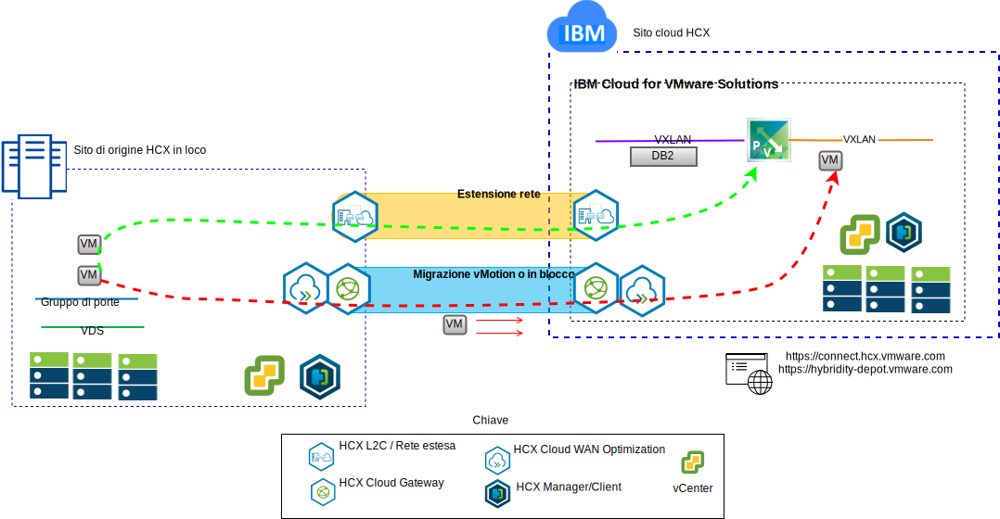

---

copyright:

  years:  2016, 2019

lastupdated: "2019-05-08"

subcollection: vmware-solutions

---

# Casi di utilizzo
{: #vcsiks-usecases}

## Migrazione del carico di lavoro a IBM Cloud
{: #vcsiks-usecases-workload-mig}

Quelli della Acme Skateboards vogliono estendere senza soluzione di continuità il loro SDDC VMware in loco in un'istanza VMware vCenter Server on {{site.data.keyword.cloud}}. Devono mantenere il loro business operativo e mantenere il loro tempo di inattività al minimo. La riconfigurazione delle loro applicazioni per l'esecuzione nel cloud non è una soluzione ottimale.

VMware vCenter Server on {{site.data.keyword.cloud_notm}} with Hybridity Bundle abilita la creazione di connessioni senza soluzione di continuità tra {{site.data.keyword.cloud_notm}} e un datacenter virtualizzato VMware in loco.

L'offerta vCenter Server with Hybridity Bundle da {{site.data.keyword.cloud_notm}} abilita connessioni sicure tra il sito di origine in loco peer e il sito di destinazione {{site.data.keyword.cloud_notm}}.

vCenter Server with Hybridity Bundle crea una connettività debolmente accoppiata tra locale e {{site.data.keyword.cloud_notm}} e abilita funzionalità quali:
- **Interconnettività semplice** - le connessioni di rete logiche vengono stabilite facilmente su qualsiasi connessione fisica che include internet pubblico, VPN privata o {{site.data.keyword.cloud_notm}} Direct Link.
- **Estensione di livello 2** – le reti in locale che includono sottoreti in locale e l'indirizzamento IP sono estese nel cloud.
- **Crittografia** - il traffico di rete viene codificato in modo sicuro tra i siti peer.
- **Ottimizzazione della rete** – seleziona la connettività migliore e allarga in modo efficace la connessione in modo che il traffico di rete venga spostato il più velocemente possibile.
- **Deduplicazione dei dati** - può essere raggiunta la riduzione del 50% del traffico di rete.
- **Instradamento intelligente** - quando un carico di lavoro viene spostato, l'instradamento di prossimità può modificare il percorso di rete, o il gateway, in modo che il traffico di rete utilizzi il gateway del sito di destinazione e non esegua l'“hairpinning” nuovamente al sito di origine.
- **Migrazione senza tempo di inattività** - una VM (Virtual Machine) in esecuzione può essere spostata nel (o indietro dal) cloud utilizzando vMotion.
- **Migrazione pianificata** - qualsiasi numero di VM (Virtual Machine) può essere replicato sul sito di destinazione e poi attivato su quel sito in un momento designato per sostituire i sistemi in esecuzione sul sito di origine.
- **Migrazione delle politiche di sicurezza** - se viene utilizzato NSX in loco, tutte le politiche di sicurezza, i firewall e così via, vengono spostati insieme al carico di lavoro.

Utilizzando questa soluzione, Acme Skateboards ha migrato correttamente i propri carichi di lavoro VMware in loco a {{site.data.keyword.cloud_notm}} soddisfacendo i propri requisiti di poco o zero tempo di inattività e senza alcuna riconfigurazione dell'applicazione.

## Distribuzione architettura ibrida
{: #vcsiks-usecases-hybrid-archi-deployment}

Quelli della Acme Skateboards vogliono distribuire un'architettura ibrida su {{site.data.keyword.cloud_notm}} costituita da vCenter Server e {{site.data.keyword.icpfull_notm}}, per il proprio percorso di modernizzazione dell'applicazione. I loro requisiti sono quelli di eseguire i loro database su VM (Virtual Machine), le applicazioni e i servizi web nei contenitori e utilizzare una serie comune di strumenti per la gestione della rete e della sicurezza.

{{site.data.keyword.vmwaresolutions_short}} fornisce l'automazione per distribuire i componenti con tecnologia VMware nei {{site.data.keyword.CloudDataCents_notm}} in tutto il mondo. L'architettura consiste in una singola regione cloud e supporta la capacità di estensione in più regioni cloud che si trovano in un'altra area geografica o in un altro pod di {{site.data.keyword.cloud_notm}} all'interno dello stesso data center.

I prodotti {{site.data.keyword.icpfull_notm}} e CAM (Cloud Automation Manager) vengono distribuiti manualmente nella tua piattaforma di virtualizzazione in loco, consentendo la gestione cloud dall'ubicazione in loco. In alternativa, {{site.data.keyword.icpfull_notm}} e CAM vengono offerti come un'estensione del servizio a una distribuzione vCenter Server nuova o esistente, tramite l'automazione, consentendo la gestione cloud da {{site.data.keyword.cloud_notm}}.

Il seguente diagramma rappresenta {{site.data.keyword.icpfull_notm}} in esecuzione su un'istanza vCenter Server. NSX-V viene configurato con uno switch/VXLAN dedicato, un DLR e un ESG specificamente per la rete di sovrapposizione {{site.data.keyword.icpfull_notm}}, l'instradamento viene configurato tramite l'ESG per l'accesso alla rete sottostante.

Utilizzando l'automazione di {{site.data.keyword.cloud_notm}}, Acme Skateboards può eseguire il provisioning di una soluzione ibrida che comprende VMware on {{site.data.keyword.cloud_notm}} per eseguire le proprie VM del database e {{site.data.keyword.icpfull_notm}} su VMware on {{site.data.keyword.cloud_notm}} per eseguire le applicazioni e i servizi web di front-end nei contenitori. NSX fornisce loro una serie comune di strumenti di gestione per la rete e la sicurezza nella rete di sovrapposizione.

## Link correlati
{: #vcsiks-usecases-related}

* [Panoramica di vCenter Server on {{site.data.keyword.cloud_notm}} with Hybridity Bundle
](/docs/services/vmwaresolutions/archiref/vcs?topic=vmware-solutions-vcs-hybridity-intro)
