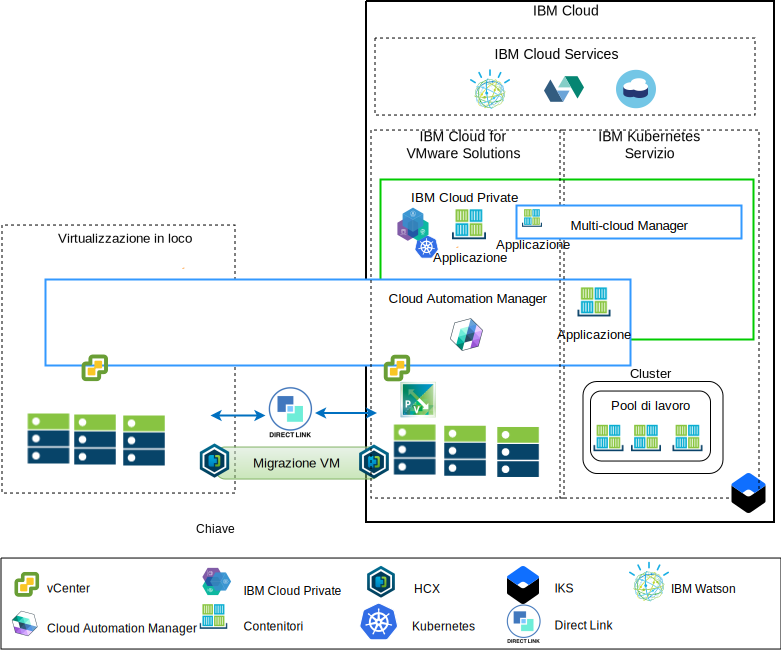

---

copyright:

  years:  2016, 2019

lastupdated: "2019-03-13"

subcollection: vmwaresolutions

---

# Panoramica sulla modernizzazione dell'applicazione
{: #vcsnsxt-appmod}

Il seguente diagramma mostra l'architettura di riferimento di modernizzazione dell'applicazione che Acme Skateboards distribuisce ed è descritta approfonditamente in questa serie di documenti.

Figura 1. Panoramica dell'architettura

Questa architettura ibrida consente ad Acme Skateboards di:
- Migrare le VM (Virtual Machine) VMware che sono in loco a {{site.data.keyword.cloud}} con poco o nessun tempo di inattività e nessuna riconfigurazione dell'applicazione.
-	Abilitare l'inizio del percorso di modernizzazione dell'applicazione permettendo loro di concentrarsi sull'inserire nel contenitore il middleware e le interfacce web più semplici, consentendo nel contempo ai database più complessi di rimanere come VM.
-	Utilizzare CAM (Cloud Automation Manager) per gli script IaC (Infrastructure as Code) per creare e orchestrare i servizi creati sia dalle VM che dai contenitori per l'integrazione con le relative toolchain DevOps e la loro soluzione ITSM.

Ponendo l'accento sull'architettura di rete, l'architettura di riferimento ha i seguenti componenti chiave:
- **Virtualizzazione in loco** – Un cluster VMware che attualmente ospita le VM Acme Skateboards. Sono queste le VM che attualmente ospitano le applicazioni che saranno modernizzate. Questo cluster è necessario per soddisfare i prerequisiti come indicato in [VMware HCX on {{site.data.keyword.cloud_notm}} solution architecture](https://test.cloud.ibm.com/docs/services/vmwaresolutions/services?topic=vmware-solutions-hcx-archi-intro#hcx-archi-intro) per consentire ai clienti di migrare le VM nell'istanza VMware vCenter Server on {{site.data.keyword.cloud_notm}} in esecuzione su {{site.data.keyword.cloud_notm}} e nell'altro senso, se necessario.
- **VMware vCenter Server on IBM Cloud** – vCenter Server fornisce i blocchi di creazione fondamentali di VMware, tra cui vSphere, vCenter Server, NSX-V e le opzioni di archiviazione che includono vSAN o l'archiviazione {{site.data.keyword.cloud_notm}} Endurance, necessari per distribuire automaticamente una soluzione VMware SDDC (Software Defined Data Center). Questo cluster VMware è la destinazione delle VM migrate e di alcune applicazioni modernizzate nei contenitori ospitati in {{site.data.keyword.icpfull_notm}}.

I componenti chiave dell'architettura sono:
- **NSX-V** - NSX-V fornisce il livello di virtualizzazione di rete in vCenter Server che fornisce una sovrapposizione di rete per le VM Acme Skateboards. NSX-V abilita BYOIP e isola le reti del carico di lavoro dalle reti {{site.data.keyword.cloud_notm}} NSX-V è programmato da HCX per creare le reti che Acme Skateboards estende da locale.
- **{{site.data.keyword.icpfull_notm}}** - {{site.data.keyword.icpfull_notm}} è una piattaforma dell'applicazione per lo sviluppo e la gestione delle applicazioni inserite nei contenitori. È un ambiente integrato che include l'orchestrazione del contenitore Kubernetes, un repository di immagini privato, una console di gestione, i framework di monitoraggio e un'interfaccia utente grafica che fornisce un'ubicazione centralizzata da cui Acme Skateboards può distribuire, gestire, monitorare e ridimensionare le proprie applicazioni. L'istanza vCenter Server ospita i componenti {{site.data.keyword.icpfull_notm}}, i nodi master, i nodi di lavoro e così via, eseguendoli come VM.
- **IBM Cloud Automation Manager** – CAM è una piattaforma IaC (Infrastructure as Code) pronta per le aziende che fornisce un unico pannello di controllo per il provisioning dei carichi di lavoro basati sulle VM (Virtual Machine) insieme ai carichi di lavoro basati su Kubernetes utilizzando dei template. CAM è un'applicazione Docker eseguita su un'installazione di {{site.data.keyword.icpfull_notm}} ed è strettamente integrata per l'autorizzazione, il controllo dell'accesso basato sul ruolo (RBAC) e altre funzioni.
- **{{site.data.keyword.containerlong_notm}}** – {{site.data.keyword.containerlong_notm}} consente a Acme Skateboards di distribuire le proprie applicazioni modernizzate in contenitori Docker che vengono eseguiti in cluster Kubernetes. Le modalità principali sono gestite completamente da IBM mentre i nodi di lavoro nel pool di lavoro vengono distribuiti nello stesso account di {{site.data.keyword.cloud_notm}} dell'istanza vCenter Server. I nodi di lavoro sono istanze bare metal, pubbliche o del server virtuale dedicate. Calico viene installato e configurato automaticamente in {{site.data.keyword.containerlong_notm}}. Calico fornisce la connettività di rete sicura per i contenitori ed è configurato {{site.data.keyword.containerlong_notm}} per utilizzare l'incapsulamento IP-in-IP per incapsulare i pacchetti trasmessi attraverso le sottoreti. Calico utilizza NAT per le connessioni in uscita dai contenitori.
- **Direct Link** - {{site.data.keyword.cloud_notm}} Direct Link utilizza il provider WAN di Acme Skateboards per connettere il relativo data center a {{site.data.keyword.cloud_notm}} fornendo una connessione di rete sicura, a bassa latenza e affidabile. Questa connessione fornisce:
  - Accesso alle applicazioni ospitate cloud dai tuoi utenti Enterprise.
  - Traffico VM interno tra le VM in loco e cloud.
  - Traffico tra i sistemi legacy nel data center in loco e le VM cloud.

## Vantaggi chiave di Acme Skateboards
{: #vcsnsxt-appmod-benefits}

- Fornitura accelerata di progetti IT per sviluppatori e linee di business riducendo il tempo necessario per approvvigionamento, architettura, implementazione e distribuzione di risorse da settimane, o anche mesi, ad alcune ore. Il time-to-value dell'applicazione diminuisce se i clienti devono attendere finché i team di rete o di sicurezza potranno ordinare servizi quali i programmi di bilanciamento del carico, i firewall, gli switch e i router.
- Sicurezza migliorata con server bare metal dedicati in un cloud privato ospitato, inclusa la distribuzione dell'endpoint del servizio di rete privata ai servizi {{site.data.keyword.cloud_notm}} come {{site.data.keyword.containerlong_notm}} e KMIP.
- Gestione e governance coerenti del cloud ibrido distribuito fornendo un accesso amministrativo completo alla gestione della virtualizzazione, preservando gli strumenti VMware esistenti, gli script e gli investimenti nella formazione.
- Competenze VMware su scala globale con i servizi professionali e gestiti di IBM disponibili in più di 30 {{site.data.keyword.CloudDataCents_notm}} in tutto il mondo.

I clienti che passano a piattaforme dell'applicazione native cloud come {{site.data.keyword.icpfull_notm}} e {{site.data.keyword.containerlong_notm}} si concentrano sulla velocità e sull'innovazione e non sempre tengono conto della rete e della sicurezza.

Questa architettura di riferimento mostra come VCS, {{site.data.keyword.icpfull_notm}} e {{site.data.keyword.containerlong_notm}} muovano in modo sicuro Acme Skateboards lungo il percorso di modernizzazione dell'applicazione.

## Link correlati
{: #vcsnsxt-appmod-related}

* [Panoramica di vCenter Server on {{site.data.keyword.cloud_notm}} with Hybridity Bundle](/docs/services/vmwaresolutions/archiref/vcs?topic=vmware-solutions-vcs-hybridity-intro)
