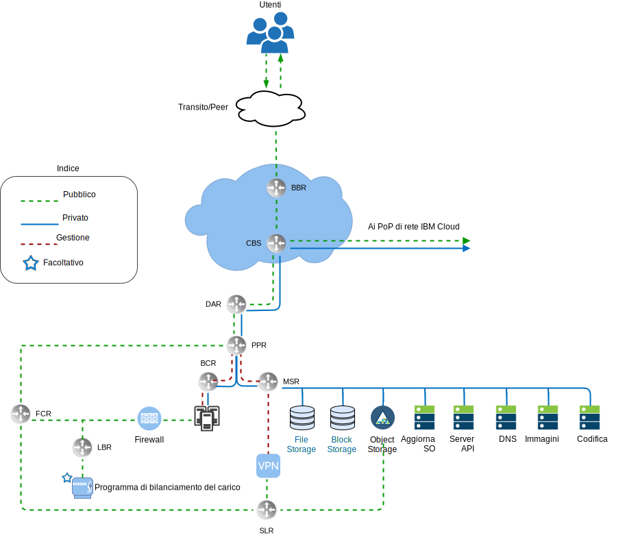
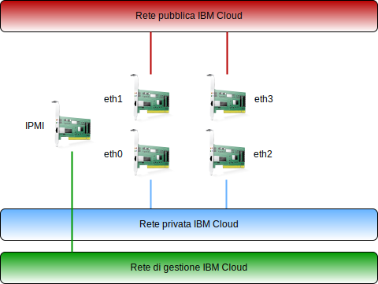

---

copyright:

  years:  2016, 2019

lastupdated: "2019-03-19"

subcollection: vmwaresolutions

---

# Panoramica della rete di IBM Cloud
{: #vcsnsxt-overview-ic4vnetwork}

{{site.data.keyword.cloud}} gestisce la rete fisica. Le seguenti informazioni descrivono la rete fisica fornita da {{site.data.keyword.cloud_notm}} e le connessioni all'host fisico (VLAN, MTU) associate agli host fisici descritti in precedenza.

La rete fisica di {{site.data.keyword.cloud_notm}} è suddivisa in tre reti distinte: pubblica, privata e di gestione.

Figura 1. Vista di rete di livello superiore di {{site.data.keyword.cloud_notm}}

## Rete pubblica
{: #vcsnsxt-overview-ic4vnetwork-public-net}

I {{site.data.keyword.CloudDataCents_notm}} e i PoP (point of presence) di rete dispongono di più di una connessione da 1 Gbps o 10 Gbps ai vettori di rete di transito e peering di livello principale. Il traffico di rete proveniente da qualsiasi parte del mondo si collega al PoP di rete più vicino e viaggia direttamente attraverso la rete verso il suo data center, riducendo al minimo il numero di hop e handoff di rete tra i provider. All'interno del data center, viene fornita una larghezza di banda di rete da 1 Gbps o 10 Gbps ai singoli server tramite una coppia di switch FCS (front-end customer switch) aggregati e collegati. Questi switch aggregati sono collegati a una coppia di router separati (ossia, gli FCR o front-end customer router) per la rete L3. Questa progettazione multilivello consente alla rete di ridimensionarsi tra rack, righe e pod all'interno di un {{site.data.keyword.CloudDataCent_notm}}.

## Rete privata
{: #vcsnsxt-overview-ic4vnetwork-private-net}

Tutti i {{site.data.keyword.CloudDataCents_notm}} e i PoP sono connessi mediante il backbone di rete privata. Questa rete privata è separata dalla rete pubblica e abilita la connettività ai servizi nei {{site.data.keyword.CloudDataCents_notm}} in tutto il mondo. Lo spostamento dei dati tra i data center avviene utilizzando più di una connessione da 10 Gbps o 40 Gbps alla rete privata. Analogamente alla rete pubblica, la rete privata è multilivello in quanto i server ed altra infrastruttura sono connessi a switch BCS (backend customer switch) aggregati. Questi switch aggregati sono collegati a una coppia di router separati (ossia, i BCR o backend customer router) per la rete L3. La rete privata supporta anche la possibilità di utilizzare i frame Jumbo (MTU 9000) per connessioni all'host fisico.

## Rete di gestione
{: #vcsnsxt-overview-ic4vnetwork-mgmt-net}

Oltre alle reti pubbliche e private, ogni server {{site.data.keyword.cloud_notm}} è connesso a una rete di gestione fuori banda. Questa rete di gestione, accessibile tramite VPN, consente l'accesso IPMI (Intelligent Platform Management Interface) al server indipendentemente dalla CPU, dal firmware e dal sistema operativo per scopi di manutenzione e amministrazione.

## Blocchi di IP primari e portatili
{: #vcsnsxt-overview-ic4vnetwork-ip-blocks}

{{site.data.keyword.cloud_notm}} assegna due tipi di indirizzi IP da utilizzare all'interno dell'infrastruttura {{site.data.keyword.cloud_notm}}:
* Gli indirizzi IP primari sono assegnati a dispositivi, server bare metal e virtuali forniti da {{site.data.keyword.cloud_notm}}. Gli utenti non devono assegnare alcun indirizzo IP in questi blocchi.
* Gli indirizzi IP portatili vengono forniti all'utente per l'assegnazione e la gestione secondo necessità.

Gli indirizzi IP primari o portatili possono essere resi instradabili a qualsiasi VLAN all'interno dell'account del cliente se l'account è configurato come un account VRF (virtual routing and forwarding).

## VRF (Virtual Routing and Forwarding)
{: #vcsnsxt-overview-ic4vnetwork-vrf}

Gli account {{site.data.keyword.cloud_notm}} possono anche essere configurati come account VRF (Virtual Routing and Forwarding). Un account VRF abilita l'instradamento globale automatico tra i blocchi IP della sottorete nell'account. Tutti gli account con connessioni Direct-Link devono essere convertiti o creati come account VRF.

## Connessioni all'host fisico
{: #vcsnsxt-overview-ic4vnetwork-host-connect}

Ogni host fisico all'interno della progettazione ha due coppie ridondanti di connessioni Ethernet da 10 Gbps in ogni switch ToR (Top of Rack) {{site.data.keyword.cloud_notm}} (pubblico e privato). Gli adattatori sono configurati come connessioni individuali (non collegate) per un totale di 4 connessioni da 10 Gbps. Ciò consente a ciascuna connessione della scheda di interfaccia di rete (NIC) di funzionare indipendentemente dalle altre.

Figura 2. Connessioni all'host fisico
 

## VLAN
{: #vcsnsxt-overview-ic4vnetwork-vlans}

Le offerte VMware on {{site.data.keyword.cloud_notm}} sono progettate con tre VLAN (una pubblica e due private) assegnate al momento della distribuzione. La VLAN pubblica è assegnata a eth1 ed eth3, mentre le connessioni private sono assegnate a eth0 ed eth2. È importante notare che la VLAN pubblica e la prima VLAN privata create e assegnate a questa progettazione sono prive di tag per impostazione predefinita. Successivamente, la VLAN privata aggiuntiva viene trascinata sulle porte dello switch fisico e contrassegnata con tag all'interno dei gruppi di porte VMware che consumano queste sottoreti.

Come specificato in precedenza, la rete privata è composta da due VLAN all'interno di questa progettazione. Alla prima di queste VLAN (indicata qui come VLAN privata A) sono assegnate tre sottoreti. La prima è un intervallo di sottoreti di IP privati primari che {{site.data.keyword.cloud_notm}} assegna agli host fisici. La seconda sottorete è utilizzata per le VM (Virtual Machine) di gestione (ad esempio, vCenter Server Appliance, Platform Services Controller). La terza è utilizzata per i VTEP (VXLAN Tunnel Endpoint) assegnati ad ogni host mediante NSX Manager.

Insieme alla VLAN Privata A, esiste una seconda VLAN privata (qui indicata come VLAN Privata B) per supportare le funzioni di VMware, come vSAN e vMotion, e per la connettività al NAS (Network Attached Storage). Pertanto, la VLAN è divisa in due o tre sottoreti portatili. La prima sottorete viene assegnata a un gruppo di porte kernel per il traffico vMotion. La sottorete o le sottoreti rimanenti vengono utilizzate per il traffico di archiviazione e, quando si utilizza vSAN, ne viene assegnata una ai gruppi di porte kernel utilizzati per il traffico vSAN. Quando si utilizza NAS una sottorete viene assegnata a un gruppo di porte dedicato al traffico NFS. Tutte le sottoreti configurate come parte di una distribuzione automatizzata di vCenter Server utilizzano intervalli gestiti da {{site.data.keyword.cloud_notm}}. Ciò serve a garantire che qualsiasi indirizzo IP possa essere instradato a qualsiasi data center all'interno dell'account {{site.data.keyword.cloud_notm}} che viene utilizzato, se necessario, attualmente o in futuro.

Tabella 1. Riepilogo VLAN e sottorete

VLAN 	|Tipo di sottorete 	|Descrizione
---|---|---
Pubblica 	|Primaria 	|Assegnata agli host fisici per l'accesso alla rete pubblica. Non utilizzata al momento della distribuzione iniziale.
Pubblica	|Portatile 	|Assegnata per l'utilizzo di uplink e NAT su customer-nsx-esg.
Pubblica	|Portatile 	|Assegnata per l'utilizzo di uplink e NAT su mgmt-nsx-esg.
Pubblica	|Portatile 	|Assegnata per l'utilizzo di uplink e NAT su hcx-mgmt-esg, se viene selezionato Hybridity Bundle.
Privata A 	|Primaria 	  |Assegnata agli host fisici assegnati da {{site.data.keyword.cloud_notm}}. Utilizzata dall'interfaccia di gestione per il traffico di gestione vSphere.
Privata A 	|Portatile 	|Assegnata alle VM (Virtual Machine) che funzionano come componenti di gestione.
Privata A 	|Portatile 	|Assegnata al VTEP NSX.
Privata A 	|Portatile 	|Assegnata a HCX per uso interno, se viene selezionato Hybridity Bundle.
Privata A 	|Portatile 	|Assegnata per l'utilizzo di uplink su customer-nsx-esg.
Privata A 	|Portatile 	|Assegnata a HCX, se viene selezionato Hybridity Bundle.
Privata B	  |Primaria	  |Non utilizzata al momento della distribuzione iniziale.
Privata B 	|Portatile 	|Assegnata per vSAN, se in uso.
Privata B 	|Portatile 	|Assegnata per NAS, se in uso.
Privata B 	|Portatile 	|Assegnata per vMotion.

Questa progettazione è implementata con host fisici e VSI (virtual system instance) sulle VLAN e configurata per puntare al BCR (router del cliente della “rete privata” di backend) {{site.data.keyword.cloud_notm}} come rotta predefinita. Le istanze vCenter Server consentono invece l'uso di reti definite dal software. Eventuali sovrapposizioni di rete create da NSX che includono l'instradamento alle sottoreti della VLAN non sono note ai router gestiti da {{site.data.keyword.cloud_notm}} e potresti dover creare rotte statiche, regole del firewall e regole NAT per gestire correttamente i flussi di rete.

Le connessioni alla rete privata sono configurate per utilizzare frame jumbo con una dimensione MTU di 9000, che migliora le prestazioni per i trasferimenti di dati di grandi dimensioni come l'archiviazione e vMotion. Questa è la MTU massima consentita in VMware e da {{site.data.keyword.cloud_notm}}. Le connessioni alla rete pubblica utilizzano una MTU Ethernet standard di 1500. Questo valore deve essere mantenuto poiché qualsiasi modifica potrebbe causare la frammentazione dei pacchetti su Internet.

## Link correlati
{: #vcsnsxt-overview-ic4vnetwork-related}

* [Panoramica di vCenter Server on {{site.data.keyword.cloud_notm}} with Hybridity Bundle
](/docs/services/vmwaresolutions/archiref/vcs?topic=vmware-solutions-vcs-hybridity-intro)
