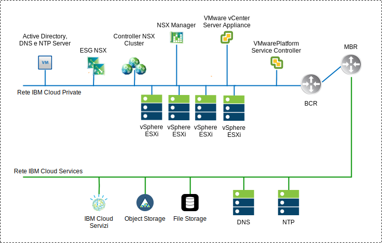
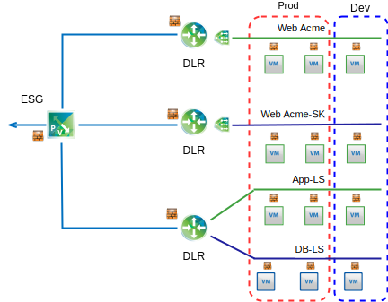

---

copyright:

  years:  2016, 2019

lastupdated: "2019-06-21"

subcollection: vmware-solutions

---

# Panoramica di NSX-V
{: #vcsnsxt-overview-ic4vnsxv}

La virtualizzazione di rete fornisce una sovrapposizione di rete che esiste all'interno del livello virtuale. NSX-V fornisce all'architettura funzioni quali provisioning rapido, distribuzione, riconfigurazione ed eliminazione di reti virtuali su richiesta. Questa progettazione utilizza il VDS (vSphere distributed switch) e VMware NSX for vSphere per implementare la rete virtuale.

In questa progettazione, NSX Manager viene distribuito sul cluster iniziale. A NSX Manager viene assegnato un indirizzo IP supportato dalla VLAN dal blocco di indirizzi portatili privati che è designato per i componenti di gestione ed è anche configurato con i server DNS e NTP descritti in precedenza.

Tabella 1. Specifiche del dispositivo virtuale NSX-V Manager

Attributo | Specifica
---|---
NSX Manager | Dispositivo virtuale
Numero di vCPU | 4
Memoria | 16 GB
Disco | 60 GB sulla condivisione NFS di gestione
Tipo di disco | Thin provisioned
Rete | **Privata A** portatile designata per i componenti di gestione

La seguente panoramica della rete NSX-V Manager mostra il posizionamento di NSX Manager in relazione agli altri componenti in questa architettura.

Dopo la distribuzione iniziale, l'automazione di {{site.data.keyword.cloud}} distribuisce tre controller NSX all'interno del cluster iniziale. Ai controller viene assegnato un indirizzo IP dalla sottorete portatile **Privata A** che è designata per i componenti di gestione. Le regole di anti–affinità VM–VM vengono create in modo che i controller siano separati tra gli host nel cluster. Il cluster iniziale deve essere distribuito con un minimo di tre nodi per garantire l'alta disponibilità per i controller.

Insieme ai controller, l'automazione di {{site.data.keyword.cloud_notm}} prepara gli host vSphere distribuiti con i VIB NSX che abilitano l'utilizzo di una rete virtualizzata (VXLAN) mediante l'uso di VTEP (VXLAN Tunnel Endpoint). Ai VTEP vengono assegnati indirizzi IP dall'intervallo di indirizzi IP della sottorete portatile **Privata A** specificata per i VTEP. Il traffico VXLAN risiede sulla VLAN senza tag ed è assegnato al vDS (virtual distributed switch) privato. Successivamente, viene assegnato un pool di ID segmento e gli host nel cluster vengono aggiunti alla zona di trasporto. Nella zona di trasporto viene utilizzato solo unicast poiché lo snooping IGMP non è configurato all'interno di {{site.data.keyword.cloud_notm}}.

Vengono quindi distribuite le coppie di ESG (Edge Services Gateway) NSX. Per tutte le distribuzioni, viene utilizzata una sola coppia di gateway per il traffico in uscita dai componenti di automazione che risiedono sulla rete privata. Le istanze VMware vCenter Server on {{site.data.keyword.cloud_notm}} includono un secondo gateway, noto come edge gestito dal cliente, che viene distribuito e configurato con un uplink alla rete pubblica e un'interfaccia che è assegnata alla rete privata. Tutti i componenti NSX necessari, come i DLR (Distributed Logical Router), gli switch logici e i firewall, possono essere configurati dall'amministratore.

## Progettazione di switch distribuiti
{: #vcsnsxt-overview-ic4vnsxv-distributed-switch}

La progettazione utilizza un numero minimo di vDS (virtual distributed switch). Gli host nel cluster sono connessi alle reti pubbliche e private. Sono configurati con due switch distribuiti virtuali. L'uso di due switch segue la separazione di rete fisica delle reti pubbliche e private implementate in {{site.data.keyword.cloud_notm}}.

Viene configurato un totale di due switch distribuiti. Il primo è per la connettività di rete pubblica (SDDC-Dswitch-Public) e il secondo è per la connettività di rete privata (SDDC-Dswitch-Private).
La separazione dei diversi tipi di traffico è necessaria per ridurre il conflitto e la latenza. Le reti separate sono necessaria anche per la protezione dell'accesso. Le VLAN vengono utilizzate per segmentare le funzioni della rete fisica. Questa progettazione utilizza tre VLAN. Una per il traffico della rete privata e una per il traffico della rete pubblica.

Tabella 2. Associazione del traffico VLAN

VLAN |Designazione |Tipo di traffico
---|---|---
VLAN1 | Pubblica | Disponibile per l'accesso a Internet
VLAN2 | Privata A | Gestione ESXi, Gestione, VXLAN (VTEP)
VLAN3 | Privata B | vSAN, NFS, vMotion

Il traffico dai carichi di lavoro transita su switch logici NSX. Il cluster vSphere utilizza due vDS (vSphere Distributed Switch) per il cluster convergente.

Tabella 3. Switch distribuiti del cluster convergente

Nome VDS (vSphere Distributed Switch) |Funzione |Controllo I/O di rete |Modalità di bilanciamento del carico |Porte NIC fisiche |MTU
---|---|---|---|---|---
SDDC-Dswitch-Private | Gestione ESXi SAN virtuale vSphere vMotion VTEP (VXLAN Tunnel Endpoint) NFS | Abilitato | Rotta basata sul failover esplicito (vSAN, vMotion). Porta virtuale di origine (tutto il resto) | 2 | 9.000 (Frame Jumbo)
SDDC-Dswitch-Public | Traffico di gestione esterno (nord–sud) | Abilitato |Rotta basata sulla porta virtuale di origine | 2 | 1.500 (valore predefinito)

Tabella 4. Impostazione di failover e teaming del gruppo di porte degli switch distribuiti

Parametro | Impostazione
---|---
Bilanciamento del carico | Rotta basata sulla porta virtuale di origine \*
Rilevamento failover | Solo stato del collegamento
Notifica switch | Abilitato
Failback | Abilitato
Ordine di failover | Uplink attivi: Uplink1, Uplink2 \*

\* Il gruppo di porte vSAN utilizza il failover esplicito con attivo o standby perché non supporta il bilanciamento del carico del traffico di archiviazione vSAN.
{:note}

Tabella 5. Politica di teaming, VLAN e gruppi di porte degli switch virtuali del cluster

vDS (vSphere Distributed Switch)	|Nome gruppo di porte	|Teaming	|Uplink	|ID VLAN
---|---|---|---|---
SDDC-Dswitch-Private	|SDDC-DPortGroup-Mgmt	|Porta virtuale di origine	|Attivo: 0, 1	|VLAN1
SDDC-Dswitch-Private	|SDDC-DPortGroup-vMotion	|Porta virtuale di origine	|Attivo: 0, 1	|VLAN2
SDDC-Dswitch-Private	|SDDC-DPortGroup-VSAN	|Failover esplicito	|Attivo: 0 Standby: 1	|VLAN2
SDDC-Dswitch-Private	|SDDC-DPortGroup-NFS	|Porta virtuale di origine	|Attivo: 0, 1	|VLAN2
SDDC-Dswitch-Private	|Generato automaticamente da NSX	|Porta virtuale di origine	|Attivo: 0, 1	|VLAN1
SDDC-Dswitch-Public	  |SDDC-DPortGroup-External	|Porta virtuale di origine	|Attivo: 0, 1	|VLAN3

## NSX-V
{: #vcsnsxt-overview-ic4vnsxv-nsx-v}

Questa progettazione specifica la configurazione dei componenti NSX ma non applica alcuna configurazione dei componenti della sovrapposizione di rete. È compito del cliente progettare la sovrapposizione di rete in base alle proprie esigenze.

Sono configurati i seguenti componenti:
- I server di gestione e i controller sono installati e integrati nell'interfaccia utente web vCenter
- Gli agent ESXi sono installati e gli indirizzi IP VTEP sono configurati per ogni host ESXi.
- Configurazione VTEP, configurazione dei controller, configurazione VXLAN (zona di trasporto).
- Dispositivi Gateway dei servizi edge (ESG) NSX che possono essere utilizzati dai componenti di gestione.
- Solo per vCenter Server, dispositivi Gateway dei servizi edge (ESG) NSX per l'utilizzo da parte dei clienti.

I seguenti componenti non sono configurati:
- Router distribuiti virtuali
- Micro segmentazione
- VXLAN
- Gestione NSX collegata ad altre istanze VMware

### Sicurezza NSX-V
{: #vcsnsxt-overview-ic4vnsxv-nsx-v-security}

NSX for vSphere abilita le organizzazioni a dividere il data center in segmenti di sicurezza distinti, fino al livello del singolo carico di lavoro indipendentemente da dove quest'ultimo è in esecuzione. I team IT possono definire le politiche per ciascun carico di lavoro in base al contesto di applicazione e utente, il che garantisce risposte immediate alle minacce internamente al data center e un'implementazione fino al livello dell'applicazione.

I seguenti sono alcuni dei componenti NSX chiave:
- Il firewall con stato distribuito NSX è integrato nel kernel hypervisor per un massimo di 20 Gbps di capacità del firewall per ogni host hypervisor. Fornisce la funzionalità firewall nord-sud mediante Edge NSX.
- NSX abilita la creazione di gruppi di sicurezza dinamici e di politiche associate a più del semplice indirizzo IP e MAC. Queste politiche includono gli oggetti vCenter e le tag, il tipo di sistema operativo e le informazioni sulle applicazioni di livello 7 per abilitare la micro-segmentazione in base al contesto dell'applicazione.
- La politica basata sull'identità, che utilizza le informazioni di accesso dall'integrazione di VM, Active Directory e Mobile Device Management, consente una sicurezza basata sull'utente che include la sicurezza al livello di sessione in ambienti desktop remoti e virtuali.
- Application Rule Manager ed Endpoint Monitoring abilitano la visualizzazione del flusso del traffico di rete end-to-end fino al livello 7, consentendo ai team dell'applicazione di identificare sia gli endpoint interni ai data center che quelli tra di loro e rispondono creando le regole di sicurezza appropriate.
- Supporto per l'integrazione di gestione, piano di controllo e piano dati con fornitori di terze parti quali i firewall di prossima generazione, IDS/IPS, antivirus senza agent, commutazione, sicurezza avanzata e altro.

Il seguente diagramma mostra un diagramma di alto livello di come puoi implementare alcune delle funzioni di micro-segmentazione di NSX-V creando gruppi di sicurezza. In questo esempio, produzione e sviluppo sono i gruppi di sicurezza e le regole di sicurezza sono assegnate in base a tali gruppi.

## Link correlati
{: #vcsnsxt-overview-ic4vnsxv-related}

* [Panoramica di vCenter Server on {{site.data.keyword.cloud_notm}} with Hybridity Bundle](/docs/services/vmwaresolutions/archiref/vcs?topic=vmware-solutions-vcs-hybridity-intro)
