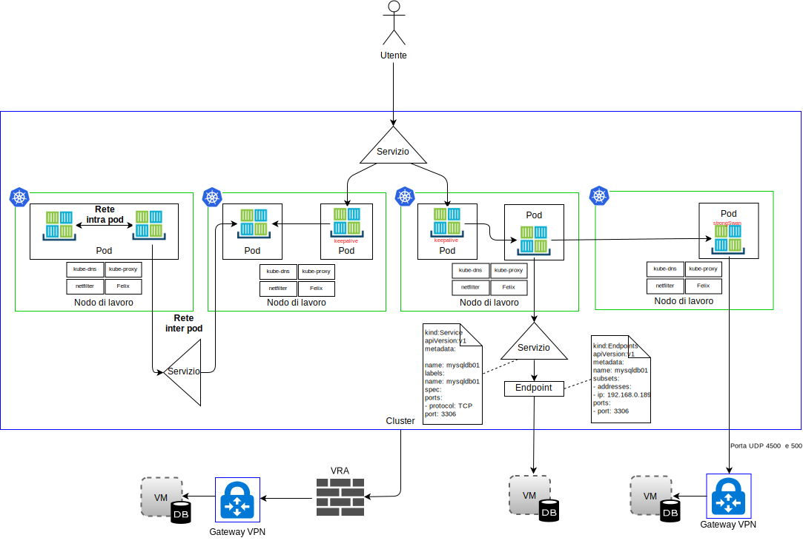
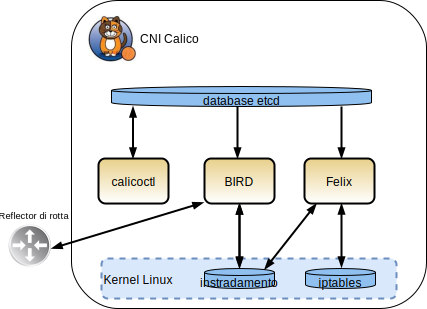

---

copyright:

  years:  2016, 2019

lastupdated: "2019-02-15"

subcollection: vmwaresolutions

---

# IBM Cloud Kubernetes Service
{: #vcsnsxt-overview-iks}

## Panoramica di IBM Cloud Kubernetes Service
{: #vcsnsxt-overview-iks-ovw}

{{site.data.keyword.containerlong_notm}} fornisce una piattaforma isolata e sicura per la gestione dei contenitori. Questa piattaforma è portatile, estensibile e riparabile automaticamente se si verifica un failover.

L'architettura è costituita dai seguenti componenti chiave:
-	**Account {{site.data.keyword.cloud}}** – I nodi di lavoro vengono distribuiti in un account {{site.data.keyword.cloud_notm}}. Il nodo master viene distribuito in un account cloud centrale gestito da IBM.
-	**Cluster** - Un cluster Kubernetes è costituito da uno o più nodi di lavoro.
-	**Nodi di lavoro** – Un nodo di lavoro è un'istanza bare metal o di server virtuale ospitata in un account IBM. Quando esegui il provisioning di un nodo di lavoro, determini le risorse che sono disponibili nei contenitori ospitati su tale nodo di lavoro. I nodi di lavoro includono un motore Docker gestito da IBM, risorse di calcolo separate, rete e un servizio di volume di archiviazione.
-	**Nodo master** - I nodi di lavoro sono gestiti da un nodo master Kubernetes che controlla e monitora centralmente tutte le risorse Kubernetes presenti nel cluster. Questo nodo master è gestito da IBM.

{{site.data.keyword.containerlong_notm}} ha i seguenti concetti:
-	**Servizio** - Un servizio è una risorsa Kubernetes che raggruppa un insieme di pod e fornisce connettività di rete a questi pod senza visualizzare l'effettivo indirizzo IP privato di ciascun pod. Puoi utilizzare un servizio per rendere disponibile la tua applicazione all'interno del tuo cluster o sull'Internet pubblico.
-	**Distribuzione** - Una distribuzione è una risorsa Kubernetes in cui puoi specificare informazioni su altre risorse o funzionalità necessarie per eseguire la tua applicazione, come servizi, archiviazione persistente o annotazioni. Puoi documentare una distribuzione in un file YAML di configurazione e quindi applicarla al cluster. Il master Kubernetes configura le risorse e distribuisce i contenitori nei pod sui nodi di lavoro con la capacità disponibile. Definisci le strategie di aggiornamento per la tua applicazione, incluso il numero di pod che vuoi aggiungere durante un aggiornamento dinamico e il numero di pod che possono essere disabilitati alla volta. Quando esegui un aggiornamento dinamico, la distribuzione controlla se l'aggiornamento funziona e interrompe il rollout quando vengono rilevati errori.
-	**Pod** - Ogni applicazione in un cluster viene distribuita, eseguita e gestita da una risorsa Kubernetes chiamata pod. I pod rappresentano piccole unità distribuibili in un cluster Kubernetes e vengono utilizzati per raggruppare i contenitori che devono essere considerati come una singola unità. Nella maggior parte dei casi, ciascun contenitore viene distribuito nel suo proprio pod. Un'applicazione potrebbe richiedere che un contenitore e altri contenitori helper vengano distribuiti in un solo pod, in modo che tali contenitori siano indirizzabili utilizzando lo stesso indirizzo IP privato.
-	**Applicazione** - Un'applicazione potrebbe fare riferimento a un'applicazione completa o a un componente di un'applicazione. Puoi distribuire i componenti di un'applicazione in pod o nodi di lavoro separati.

Kubernetes non impone una particolare soluzione di rete.

Il modello di rete Kubernetes sostiene tre requisiti fondamentali:
* I contenitori possono comunicare con tutti gli altri contenitori senza NAT
* I nodi possono comunicare con tutti i contenitori (e viceversa) senza NAT
* L'IP con cui un contenitore vede se stesso è lo stesso IP con cui lo vedono gli altri.

### Spazi dei nomi
{: #vcsnsxt-overview-iks-namespaces}

Gli spazi dei nomi sono un aspetto fondamentale della rete del contenitore. Gli spazi dei nomi sono una funzione del kernel Linux che partiziona le risorse del kernel in modo tale che una serie di processi veda una serie di risorse, mentre un'altra serie di processi ne veda una diversa. Le risorse includono punti di montaggio, ID processo, stack di rete, IPC e ID utente. Ogni spazio dei nomi ha una serie privata di indirizzi IP, una propria tabella di instradamento, un elenco socket, una tabella di tracciamento delle connessioni, firewall e altre risorse correlate alla rete.

### Container Network Interface
{: #vcsnsxt-overview-iks-container-network-interfaces}

Kubernetes utilizza il CNI (Container Network Interface) come propria soluzione di rete orientata al plug-in. È costituito da una specifica e dalle librerie per scrivere i plug-in per configurare le interfacce di rete nei contenitori Linux. La specifica CNI è leggera poiché si occupa solo della connettività di rete dei contenitori e della raccolta di dati inutili dopo che i contenitori sono stati eliminati.

Nel contesto del CNI in Kubernetes sono presenti le seguenti due definizioni centrali:
- **Pod** - Sinonimo di spazio dei nomi di una rete Linux. L'unità di pianificazione in Kubernetes è un pod, che è un insieme strettamente accoppiato di uno o più contenitori che condividono sempre l'ubicazione (programmati su un nodo come unità). Un pod non può essere diffuso su più nodi di lavoro.
- **Rete** - Un gruppo di entità univocamente indirizzabili in grado di comunicare tra loro. Queste entità potrebbero essere un singolo contenitore, una macchina o qualche altro dispositivo di rete come, ad esempio, un router.

Affinché il CNI aggiunga un contenitore a una rete, il runtime del contenitore deve prima creare un nuovo spazio dei nomi di rete per il contenitore e quindi avviare uno o più dei plug-in definiti. La configurazione di rete è in formato JSON e include campi obbligatori come nome, tipo e campi specifici per il tipo di plug-in. Si prevede che un plug-in CNI assegni un indirizzo IP all'interfaccia e ne configuri i percorsi di rete pertinenti. {{site.data.keyword.containerlong_notm}} utilizza Calico come plug-in di rete per CNI. Calico assegna un indirizzo IP a ogni carico di lavoro. In {{site.data.keyword.containerlong_notm}}, Calico utilizza il tunneling IP-in-IP in modo che gli indirizzi IP della rete del contenitore siano nascosti dalla rete di {{site.data.keyword.cloud_notm}}.

Da una prospettiva di traffico di rete, distinguiamo tra quattro tipi di traffico in {{site.data.keyword.containerlong_notm}}, come mostrato nel seguente diagramma.

Figura 1. Tipi di traffico di rete del contenitore

- **Rete interna al pod** – Noto anche come comunicazioni da contenitore a contenitore. Tutti i contenitori all'interno di un pod condividono uno spazio dei nomi di rete, lo stesso indirizzo IP e si vedono l'un l'altro sull'host locale. Il traffico per ogni applicazione è differenziato con un numero di porta diverso. Lo sviluppatore deve assicurarsi che i contenitori all'interno di un pod non siano in conflitto tra loro per le porte utilizzate. All'interno di un pod, esiste un cosiddetto contenitore dell'infrastruttura. Questo è il primo contenitore avviato da kubelet e acquisisce l'IP del pod e configura lo spazio dei nomi di rete. Quindi, tutti gli altri contenitori nel pod si uniscono alla rete e allo spazio dei nomi IPC del contenitore dell'infrastruttura. Il contenitore ha la modalità bridge di rete abilitata e tutti gli altri contenitori nel pod si uniscono a questo spazio dei nomi tramite la modalità del contenitore. Se il contenitore dell'infrastruttura si rompe, kubelet arresta tutti i contenitori nel pod e riesegue quindi il provisioning, in genere con un nuovo indirizzo IP. In questo documento non forniremo ulteriori dettagli su questo flusso di traffico.

- **Rete tra i pod** – Noto anche come comunicazioni “da pod a pod”. Di seguito vengono indicati i tre tipi di traffico est–ovest:
  - I pod possono comunicare direttamente con altri pod sulla stessa sottorete. In {{site.data.keyword.containerlong_notm}}, ogni pod ha un indirizzo IP che viene assegnato da un intervallo fornito da {{site.data.keyword.containerlong_notm}}. A ciascun nodo di lavoro viene assegnata una sottorete durante il provisioning. La comunicazione da pod a pod senza proxy, tunneling o NAT si verifica con i pod che si trovano nella stessa sottorete e nello stesso host.
  - I pod possono comunicare direttamente con altri pod su sottoreti diverse. L'incapsulamento IP-in-IP viene configurato automaticamente in {{site.data.keyword.containerlong_notm}} per incapsulare solo i pacchetti che attraversano le sottoreti. Questo incapsulamento nasconde lo spazio degli indirizzi di rete del pod dalla rete {{site.data.keyword.cloud_notm}}. L'incapsulamento utilizza l'indirizzo IP dalla sottorete privata primaria di {{site.data.keyword.cloud_notm}}.
  - I pod possono utilizzare i servizi per comunicare con altri pod, che sono noti come comunicazioni da pod a servizio. Tuttavia, i pod che possono comunicare direttamente con altri pod, come nei due punti precedenti, sono temporanei. Vengono creati e quando si rompono non vengono rigenerati. Le serie di repliche creano ed eliminano i pod in modo dinamico, ad esempio durante il ridimensionamento decrementale o incrementale. Mentre ogni pod riceve il proprio indirizzo IP, anche quegli indirizzi IP non possono essere considerati stabili nel tempo. Preferibilmente, gli sviluppatori utilizzano un costrutto di servizio per la comunicazione, dove viene utilizzato un indirizzo IP virtuale stabile che può essere rilevato tramite DNS.

- **Ingress** - Si riferisce all'instradamento del traffico da utenti o applicazioni esterni ai pod. Un servizio fornisce un indirizzo IP virtuale (vIP) stabile per un insieme di pod. Mentre i pod sono effimeri, i servizi consentono ai client di rilevare e connettersi in modo affidabile ai contenitori in esecuzione nei pod tramite il vIP. Questo vIP non è un indirizzo IP reale connesso a un'interfaccia di rete. Il suo scopo è puramente quello di fungere da endpoint stabile per inoltrare il traffico a uno o più pod. L'accesso a un pod dall'esterno del cluster è un po' più impegnativo. Kubernetes mira a fornire un bilanciamento del carico altamente disponibile e ad alte prestazioni per i servizi.
In {{site.data.keyword.containerlong_notm}} esistono tre opzioni per il traffico nord-sud:

  - **NodePort** - Il servizio NodePort è considerato adatto per i test o se hai bisogno dell'accesso pubblico o privato solo per un breve periodo di tempo. Un servizio NodePort apre una porta su un nodo di lavoro sia sull'indirizzo IP privato che su quello pubblico del nodo di lavoro. Devi utilizzare una politica di rete preDNAT Calico se vuoi bloccare l'indirizzo pubblico o privato. Gli indirizzi IP pubblici e privati del nodo di lavoro non sono permanenti.
  - **LoadBalancer** - Gli indirizzi IP pubblici e privati portatili assegnati al programma di bilanciamento del carico sono permanenti e non cambiano quando un nodo di lavoro viene ricreato nel cluster. Puoi personalizzare il tuo programma di bilanciamento del carico esponendo una qualsiasi porta richiesta dalla tua applicazione. Un servizio del programma di bilanciamento del carico con un indirizzo IP privato portatile dispone ancora di una porta del nodo pubblico aperta per i nodi di lavoro. Devi utilizzare una politica di rete preDNAT Calico per bloccare le porte del nodo pubblico su di esso.
  - **Servizi Ingress** - L'ALB utilizza un punto di ingresso pubblico o privato sicuro e univoco per instradare le richieste in entrata alle tue applicazioni. L'ALB ascolta le richieste di servizio HTTP o HTTPS, TCP o UDP in entrata. Inoltra le richieste tra i pod dell'applicazione in base alle regole che hai definito nella risorsa Ingress. Quando crei un cluster, vengono creati automaticamente un ALB (application load balancer) Ingress privato e uno pubblico. Poiché l'ALB pubblico è abilitato e l'ALB privato non è disponibile per impostazione predefinita, devi disabilitare l'ALB pubblico e abilitare l'ALB privato.

- **Egress** - Si riferisce alla chiamata di risorse esterne al di fuori dei pod come le API o al consumo di risorse dalle VM. Opzioni Egress:
    - Definisci una risorsa di servizio per un sistema in esecuzione all'esterno del cluster. Viene creata una risorsa endpoint che descrive il sistema esterno, l'indirizzo IP e il numero di porta. La risorsa endpoint può avere diversi indirizzi elencati e Kubernetes eseguirà il round-robin tra questi indirizzi come tra i pod in esecuzione all'interno del cluster. Quindi, viene utilizzata una risorsa di servizio per creare un IP cluster e un nome DNS nel componente kube-dns per il servizio.
    - Utilizza VPN IPSec strongSwan per connetterti alle applicazioni esterne al cluster. Mediante l'uso di un grafico Helm, viene distribuito e configurato un servizio VPN IPSec strongSwan all'interno di un pod Kubernetes. Quando viene stabilita la connettività VPN, le rotte vengono configurate automaticamente su tutti i nodi di lavoro nel cluster. Queste rotte consentono la connettività bidirezionale attraverso il tunnel VPN tra i pod su qualsiasi nodo di lavoro e il sistema remoto. Se il pod non funziona, il cluster lo riavvia, tuttavia, potresti riscontrare un breve periodo di inattività mentre il nuovo pod viene avviato e la connessione VPN viene ristabilita. Per il servizio VPN strongSwan viene utilizzato un indirizzo IP pubblico o privato portatile. L'impostazione local.subnet può utilizzare la sottorete del pod del cluster, la sottorete del servizio del cluster o la sottorete portatile pubblica o privata. La riassociazione delle sottoreti del cluster può essere ottenuta utilizzando l'impostazione localSubnetNAT. In alternativa, gli indirizzi IP del cluster possono essere nascosti dietro un singolo indirizzo IP impostando enableSingleSourceIP su true. Per riassociare le sottoreti di rete remota, utilizza l'impostazione remoteSubnetNAT.
    - È possibile distribuire un dispositivo {{site.data.keyword.cloud_notm}} Virtual Router Appliance (VRA) come gateway VPN per stabilire una connessione sicura a una rete esterna. Il traffico della rete pubblica o privata può essere instradato tramite il VRA. Il VRA crea un tunnel IPSec crittografato al gateway VPN remoto.

## Componenti di IBM Cloud Kubernetes Service
{: #vcsnsxt-overview-iks-components}

I nodi di lavoro sono gestiti da un nodo master Kubernetes che controlla e monitora centralmente tutte le risorse Kubernetes presenti nel cluster. Quando uno sviluppatore distribuisce le risorse per un contenitore, il nodo master decide su quale nodo di lavoro distribuire tali risorse, tenendo conto dei requisiti di distribuzione e della capacità disponibile nel cluster. I nodi master e di lavoro possono comunicare tra loro tramite certificati TLS protetti e una connessione openVPN tramite la rete pubblica {{site.data.keyword.cloud_notm}}. Gli sviluppatori accedono al kube-apiserver ospitato sul nodo master tramite Internet.

Il kubelet nel nodo di lavoro controlla il kube-apiserver nel nodo master per ricercare gli aggiornamenti e riporta lo stato. Il kubelet è un pod che viene eseguito su ogni nodo di lavoro ed è responsabile del monitoraggio dell'integrità dei pod in esecuzione sul nodo di lavoro e del controllo degli eventi inviati dal server API Kubernetes. In base agli eventi, kubelet crea o rimuove i pod, emette analisi di attività e di disponibilità e riporta lo stato dei pod al server API Kubernetes.

Da una prospettiva di rete, sul nodo di lavoro vengono distribuiti i seguenti componenti:

-	**openvpn-client** - Il client OpenVPN lavora con il server OpenVPN per connettere in modo sicuro il master al nodo di lavoro. Questo componente opera nello spazio dei nomi kube-system.
-	**Nodo Calico** - Il nodo Calico è un contenitore che riunisce i vari componenti necessari per i contenitori di rete con Calico. Questo componente opera nello spazio dei nomi kube-system.
-	**Controller delle politiche Calico** - Il controller delle politiche Calico controlla il traffico di rete in entrata e in uscita per la conformità con le politiche di rete impostate. Se il traffico non è consentito nel cluster, l'accesso al cluster viene bloccato. Il controller delle politiche Calico viene inoltre utilizzato per creare e impostare le politiche di rete per un cluster. Questo componente opera nello spazio dei nomi kube-system.
-	**CNI Calico** - Il CNI (Container Network Interface) Calico gestisce la connettività di rete dei contenitori e rimuove le risorse assegnate quando un contenitore viene eliminato.
-	**IPAM Calico** - L'IPAM Calico gestisce l'assegnazione degli indirizzi IP per i contenitori.
-	**kube proxy** - Il proxy di rete Kubernetes è un daemon che viene eseguito su ogni nodo di lavoro e che inoltra o che bilancia il carico del traffico di rete TCP e UDP per i servizi eseguiti nel cluster. Questo componente opera nello spazio dei nomi kube-system.
-	**kube DNS**  - Il DNS Kubernetes pianifica un pod e un servizio DNS sul cluster. I contenitori utilizzano automaticamente l'IP del servizio DNS per risolvere i nomi DNS nelle loro ricerche di altri pod e servizi. Questo componente opera nello spazio dei nomi kube-system.
-	**ALB Ingress** - Ingress è un servizio Kubernetes che puoi utilizzare per bilanciare i carichi di lavoro del traffico di rete nel tuo cluster inoltrando le richieste pubbliche o private a più applicazioni nel tuo cluster. Per esporre le tue applicazioni sulla rete pubblica o privata, devi creare una risorsa Ingress per registrare le applicazioni con l'ALB (application load balancer) Ingress. È quindi possibile accedere a più applicazioni utilizzando un singolo URL o indirizzo IP. Questo componente opera nello spazio dei nomi ibm-system.
-	**Programma di bilanciamento del carico** - Un programma di bilanciamento del carico è un servizio Kubernetes che può essere utilizzato per bilanciare i carichi di lavoro del traffico di rete nel tuo cluster inoltrando richieste pubbliche o private a un'applicazione. Questo componente opera nello spazio dei nomi ibm-system.

### Calico
{: #vcsnsxt-overview-iks-calico}

{{site.data.keyword.containerlong_notm}} utilizza Calico come proprio provider di rete. Calico utilizza un approccio di livello 3 anziché le reti di sovrapposizione. Attraverso i plug-in CNI, Calico si integra con Kubernetes per fornire agli utenti una rete che utilizza un approccio basato sull'uso di una rete IP pura combinata con il Border Gateway Protocol per la distribuzione delle rotte.

Calico fornisce una soluzione strutturale L3 e, invece di un vSwitch, Calico utilizza una funzione vRouter in ogni nodo di calcolo. Il vRouter sfrutta le funzionalità di inoltro L3 esistenti del kernel Linux. Calico collega ogni carico di lavoro tramite il vRouter direttamente alla rete dell'infrastruttura. La funzione vRouter utilizza BGP per annunciare le rotte ai pod ospitati in ciascun nodo di lavoro. Ogni vRouter annuncia tutti gli endpoint a cui è collegato a tutti gli altri vRouter che utilizzano BGP.

In Calico, i pacchetti IP da e verso un pod vengono instradati e protetti da firewall mediante la tabella di instradamento Linux e l'infrastruttura iptables sul nodo di lavoro.

-	Per un carico di lavoro che invia i pacchetti, Calico garantisce che il nodo di lavoro venga sempre restituito come indirizzo MAC dell'hop successivo indipendentemente da quale instradamento venga configurato dal carico di lavoro stesso.
-	Per i pacchetti indirizzati a un carico di lavoro, l'ultimo hop IP è quello dal nodo di lavoro del carico di lavoro di destinazione al carico di lavoro stesso.

Figura 2. CNI Calico

Il diagramma precedente mostra i seguenti componenti Calico:
-	**calicoctl** - interfaccia riga di comando.
-	**Plug-in CNI**
-	**Archivio chiave/valore** - contiene lo stato di configurazione di rete e delle politiche Calico. Calico utilizza etcd per fornire la comunicazione tra i componenti e come archivio dati coerente, che garantisce a Calico di creare sempre una rete accurata. Il componente etcd è distribuito attraverso l'intera distribuzione. È diviso in due gruppi di macchine: il cluster principale e i proxy.
-	**calico/nodo** - Un contenitore “helper” che riunisce i vari componenti necessari per la rete:
 -	**Felix** - l'agent Calico primario eseguito su ogni macchina che ospita gli endpoint. È responsabile della programmazione di rotte e ACL e di qualsiasi altra cosa richiesta sull'host, per fornire la connettività desiderata per gli endpoint su quell'host.
 - **BIRD** - BIRD è un client BGP open source utilizzato per lo scambio di informazioni di instradamento tra gli host. Quando Felix inserisce le rotte nel FIB del kernel Linux, il client BGP le preleva e le distribuisce agli altri nodi nella distribuzione. Ciò garantisce che il traffico sia instradato in modo efficiente in tutta la distribuzione.
 - **Confd** - Il motore di templating confd monitora l'archivio dati etcd per eventuali modifiche alla configurazione BGP e ad alcune configurazioni predefinite globali di livello superiore come il numero AS, i livelli di registrazione e le informazioni IPAM. Genera quindi dinamicamente i file di configurazione BIRD in base ai dati contenuti in etcd, attivato automaticamente dagli aggiornamenti ai dati. Quando il file di configurazione cambia, confd attiva BIRD per caricare i nuovi file.

Poiché la rete {{site.data.keyword.cloud_notm}} Private inoltra solo gli schemi di indirizzamento IP di {{site.data.keyword.cloud_notm}}, a Calico è richiesto di utilizzare l'incapsulamento IP-in-IP del traffico tra carichi di lavoro in {{site.data.keyword.containerlong_notm}} per nascondere gli indirizzi IP della rete pod. {{site.data.keyword.containerlong_notm}} utilizza la modalità di sottorete incrociata IP-in-IP.

### Calico in IBM Cloud Kubernetes Service
{: #vcsnsxt-overview-iks-calico-iks}

Calico viene installato e configurato automaticamente in {{site.data.keyword.containerlong_notm}}. Le politiche predefinite vengono create per proteggere il cluster Kubernetes, con la possibilità di creare le tue proprie politiche per proteggere specifici servizi. L'incapsulamento IP-in-IP viene configurato automaticamente per incapsulare solo i pacchetti che attraversano le sottoreti e utilizza NAT per le connessioni in uscita dai tuoi contenitori. Anche il traffico dal carico di lavoro a WAN viene abilitato automaticamente in {{site.data.keyword.containerlong_notm}}, quindi non è necessaria alcuna ulteriore configurazione di Calico.

#### Scalabilità di rete con Calico
{: #vcsnsxt-overview-iks-net-scalability-calico}

Calico si basa su un'architettura a scalabilità distribuita che gli consente di scalare agevolmente da un singolo notebook dello sviluppatore a distribuzioni aziendali di grandi dimensioni e utilizza il piano dati Linux standard per offrire prestazioni bare metal per i carichi di lavoro virtuali.

#### Sicurezza con Calico
{: #vcsnsxt-overview-iks-sec-calico}

Calico utilizza una serie di politiche che controllano ogni componente del sistema; queste politiche possono essere configurate per consentire a servizi e istanze del contenitore di comunicare tra loro solo quando necessario. Utilizza gli indirizzi IP per identificare le istanze del contenitore e crea le politiche in base a questi indirizzi. L'integrazione di Kubernetes con Calico è consapevole dell'infrastruttura e può ridimensionare le politiche di sicurezza in base alle modifiche con l'infrastruttura.

#### Integrazione con Calico
{: #vcsnsxt-overview-iks-integration-calico}

Calico fornisce una soluzione di rete e politiche di rete altamente scalabile per la connessione di pod Kubernetes basata sugli stessi principi di rete IP dell'Internet. Può essere distribuito senza incapsulamento o sovrapposizioni per fornire reti di data center ad alte prestazioni e su vasta scala. Calico fornisce una politica di sicurezza di rete dettagliata e basata sugli intenti per i pod Kubernetes tramite il suo firewall distribuito. Calico può anche essere eseguito in modalità di applicazione delle politiche insieme ad altre soluzioni di rete come Flannel, noto anche come Canal o rete GCE nativa.

## Rete di IBM Cloud Kubernetes Service
{: #vcsnsxt-overview-iks-networking}

Per impostazione predefinita, {{site.data.keyword.containerlong_notm}} configura il cluster con accesso a una VLAN pubblica e a una VLAN privata con quanto segue.
- Un indirizzo IP pubblico per ciascun nodo di lavoro, che fornisce ai nodi di lavoro un'interfaccia di rete pubblica. Per impostazione predefinita:
  -	Tutto il traffico di rete in uscita è consentito per tutti i nodi di lavoro.
  -	Il traffico di rete in entrata è bloccato, fatta eccezione per alcune porte. Queste porte sono aperte in modo che IBM possa monitorare il traffico di rete e installare automaticamente gli aggiornamenti di sicurezza per il master Kubernetes.
-	Un indirizzo IP privato per ciascun nodo di lavoro, che fornisce ai nodi di lavoro un'interfaccia di rete privata.
-	Una connessione OpenVPN automatica e sicura tra tutti i nodi di lavoro e il nodo master.

La prima volta che viene creato un cluster in una zona, per te viene fornita automaticamente una VLAN pubblica e una VLAN privata in tale zona nell'account dell'infrastruttura {{site.data.keyword.cloud_notm}}. Per ogni cluster successivo creato in quella zona, puoi riutilizzare la stessa VLAN pubblica e privata perché più cluster possono condividere le VLAN.

I nodi di lavoro possono essere collegati sia a una VLAN pubblica che alla VLAN privata o solo alla VLAN privata. Se vuoi collegare i tuoi nodi di lavoro solo a una VLAN privata, puoi utilizzare l'ID di una VLAN privata esistente o creare una VLAN privata e utilizzare l'ID durante la creazione del cluster.

Anche le sottoreti IP per i nodi di lavoro e i pod vengono fornite automaticamente sulle VLAN. Le sottoreti forniscono connettività di rete ai componenti del cluster assegnando loro degli indirizzi IP. Le seguenti sottoreti vengono fornite automaticamente sulle VLAN pubbliche e private predefinite:
-	**Sottoreti VLAN pubbliche:**
    - La sottorete pubblica primaria determina gli indirizzi IP pubblici che vengono assegnati ai nodi di lavoro durante la creazione del cluster. Più cluster sulla stessa VLAN possono condividere una sottorete pubblica primaria.
    - La sottorete pubblica portatile è associata a un solo cluster e fornisce al cluster 8 indirizzi IP pubblici. 3 IP sono riservati per le funzioni di rete. 1 IP viene utilizzato dall'ALB Ingress pubblico predefinito e 4 IP possono essere utilizzati per creare servizi di rete del programma di bilanciamento del carico pubblico. Gli IP pubblici portatili sono indirizzi IP fissi e permanenti che possono essere utilizzati per accedere ai servizi del programma di bilanciamento del carico su Internet.
-	**Sottoreti VLAN private:**
    - La sottorete privata primaria determina gli indirizzi IP privati che vengono assegnati ai nodi di lavoro durante la creazione del cluster. Più cluster sulla stessa VLAN possono condividere una sottorete privata primaria.
    - La sottorete privata portatile è associata a un solo cluster e fornisce al cluster 8 indirizzi IP privati. 3 IP sono riservati per le funzioni di rete. 1 IP viene utilizzato dall'ALB Ingress privato predefinito e 4 IP possono essere utilizzati per creare servizi di rete del programma di bilanciamento del carico privato. Gli IP privati portatili sono indirizzi IP fissi e permanenti che possono essere utilizzati per accedere ai servizi del programma di bilanciamento del carico su Internet.

## Link correlati
{: #vcsnsxt-overview-iks-links}

* [Panoramica di vCenter Server on {{site.data.keyword.cloud_notm}} with Hybridity Bundle
](/docs/services/vmwaresolutions/archiref/vcs?topic=vmware-solutions-vcs-hybridity-intro)
