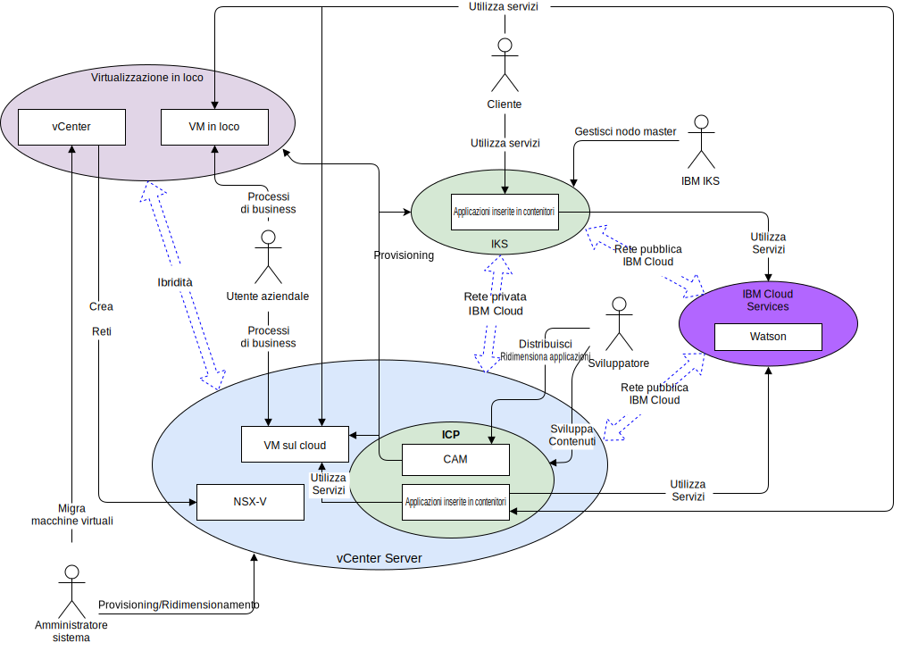

---

copyright:

  years:  2016, 2018

lastupdated: "2018-11-01"

---

# Contesto di sistema
Il diagramma del contesto di sistema definisce gli elementi chiave di un sistema, il limite del sistema e le entità che interagiscono con esso insieme alle interazioni. È un diagramma di alto livello che fornisce al lettore una vista iniziale del sistema.

Figura 1. Contesto di sistema

I quattro componenti principali, da una prospettiva di rete, sono i seguenti:
- **Virtualizzazione in loco** - Un ambiente VMware ospitato presso il cliente o presso una terza parte e al momento ospita le VM che eseguono le applicazioni da modernizzare. È l'ambiente di origine per le migrazioni di VM ed è debolmente accoppiato a un {{site.data.keyword.cloud}} mediante VMware HCX.
- **vCenter Server** – una istanza {{site.data.keyword.vmwaresolutions_short}} che è la destinazione delle VM migrate dall'ambiente in loco. Insieme alla virtualizzazione in loco forma un ambiente ibrido che consente alle VM di spostarsi senza soluzione di continuità da un ambiente all'altro.
- **IBM Cloud Kubernetes Service** - utilizza Kubernetes come soluzione di orchestrazione del contenitore. IBM agisce e gestisce il nodo master Kubernetes mentre i nodi di lavoro vengono distribuiti all'infrastruttura gestita dal cliente. IBM fornisce gli strumenti di gestione per la distribuzione della patch del sistema operativo, gli aggiornamenti del motore Docker e le nuove versioni di Kubernetes. IBM Kubernetes Service fornisce una piattaforma isolata e sicura per la gestione dei contenitori che sia portatile, estensibile e riparabile automaticamente in caso di failover.
- **IBM Cloud Private** - una piattaforma dell'applicazione per lo sviluppo e la gestione delle applicazioni inserite nei contenitori. È un ambiente integrato che include l'orchestrazione del contenitore Kubernetes, un repository di immagini privato, una console di gestione, i framework di monitoraggio e un'interfaccia utente grafica che fornisce un'ubicazione centralizzata da cui puoi distribuire, gestire, monitorare e ridimensionare le applicazioni.
-	**IBM Cloud Services** - un'ampia gamma di servizi disponibili da {{site.data.keyword.cloud_notm}} che sono utilizzabili. Le opzioni di servizio includono, come esempi, analisi, AI e IoT.

## Attori

Il diagramma del contesto di sistema identifica i seguenti attori.

Tabella 1. Attori

Attore  | Descrizione
---|---
Amministratore di sistema |Gli amministratori di sistema sono le risorse VMware aziendali che utilizzano vCenter e il plug-in HCX. Identificano i candidati per la migrazione, estendono le reti, migrano le VM e gestiscono NSX-V. Utilizzano la console {{site.data.keyword.cloud_notm}} per eseguire il provisioning delle istanze VCS e per ridimensionare la capacità.
Sviluppatore	| Gli sviluppatori sono le risorse del contenitore con competenze aziendali che utilizzano le console IKS/ICP/CAM e le API per creare e gestire contenitori. Creano i nuovi servizi come parte della modernizzazione dell'applicazione. 
Utente aziendale | Questa risorsa aziendale richiede l'accesso di rete alle applicazioni per eseguire processi aziendali quali l'aggiornamento di contenuto.
Cliente | Il cliente è un attore esterno che vuole consumare servizi dall'azienda. Nel caso di Acme Skateboards, è uno skater che vuole acquistare i prodotti di skating. Il cliente necessita di un accesso Internet protetto al catalogo.
IBM IKS | Questa è una risorsa IBM che gestisce il nodo master IKS del servizio.

## Sistemi

Il diagramma di contesto del sistema identifica i seguenti sistemi.

Tabella 2. Sistemi

Attore | Descrizione
---|---
vCenter | Il vCenter è l'interfaccia primaria per l'amministratore di sistema per gestire le VM in loco e accedere al plug-in HCX per estendere le reti e migrare le VM. Con vCenter Server with Hybridity Bundle, l'amministratore di sistema può integrare senza soluzione di continuità le reti vSphere in loco nell'istanza VCD in esecuzione su {{site.data.keyword.cloud_notm}}. La rete ibrida estende le reti in loco in {{site.data.keyword.cloud_notm}} consentendo ai clienti di migrare le loro applicazioni in un'istanza VCS in esecuzione su {{site.data.keyword.cloud_notm}} e nell'altro senso, se necessario. Per ulteriori dettagli su vCenter Server with Hybridity Bundle, fai riferimento al documento [VMware HCX on {{site.data.keyword.cloud_notm}} Solution Architecture](https://www.ibm.com/cloud/garage/files/HCX_Architecture_Design.pdf).
VM in loco| Le VM in loco ospitano le applicazioni che migrano al cloud. Inizialmente, vengono migrate come VM e poi, attraverso il percorso di modernizzazione dell'applicazione, migrate da VM a contenitori.
VM sul cloud | Le VM cloud ospitano le applicazioni che erano state migrate da locale. Comunicazioni con le applicazioni in loco tramite la rete L2 estesa. Nel caso di questa architettura di riferimento e in questo esempio per Acme Skateboards, una delle VM sul cloud è un server di database, che fa parte del carico di lavoro di presenza online.
NSX-V | NSX-V su VCS fornisce la rete di sovrapposizione definita dal software che è gestita dall'amministratore di sistema. La rete di sovrapposizione è la destinazione per le reti estese HCX come gestisce il traffico dalle VM per ICP. NSX-V fornisce l'architettura di riferimento con funzioni quali la distribuzione, la riconfigurazione e la distruzione di reti virtuali on--demand e servizi di micro-segmentazione in VMware utilizzando vDS (vSphere Distributed Switch). Per ulteriori informazioni, vedi la [Panoramica di NSX–V](vcsnsxt-overview-ic4vnsxv.html).
CAM | CAM ({{site.data.keyword.cloud_notm}} Automation Manager) viene eseguito su ICP e fornisce un singolo pannello di controllo per eseguire il provisioning di carichi di lavoro basati su VM insieme a carichi di lavoro basati su Kubernetes semplicemente utilizzando dei template. CAM consente allo sviluppatore di:   - Eseguire il provisioning di carichi di lavoro su VCS, ICP o IKS.  - Comporre e orchestrare servizi realizzati sia con le VM che con i contenitori.   - Integrare le loro toolchain DevOps e la soluzione di day-2 ITSM.
Applicazioni inserite nel contenitore | Sono le applicazioni che sono state sottoposte al percorso di modernizzazione dell'applicazione e che ora sono in esecuzione come contenitori. Nel caso di questa architettura di riferimento e in questo esempio per Acme Skateboards, una delle applicazioni inserite nel contenitore è un server web, che fa parte del carico di lavoro di presenza online.
Watson | Nel caso di questa architettura di riferimento e in questo esempio per Acme Skateboards, Watson rappresenta il servizio AI utilizzato nell'architettura “Concept Car”.

### Link correlati 

* [Panoramica di VCS Hybridity Bundle](../vcs/vcs-hybridity-intro.html)
