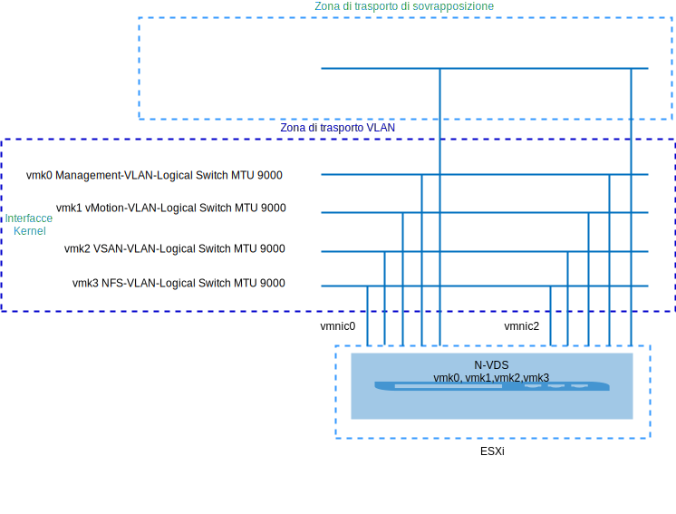
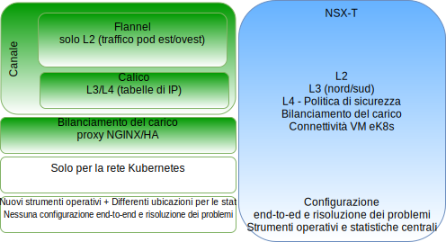
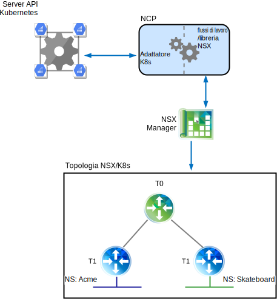
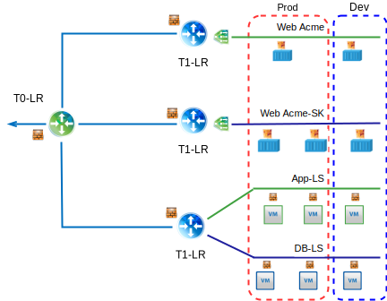
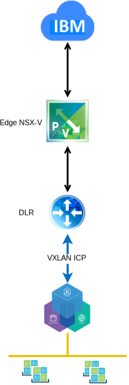
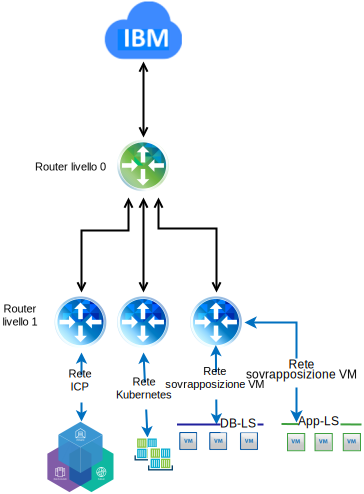

---

copyright:

  years:  2016, 2018

lastupdated: "2018-11-06"

---

# Anteprima tecnica di VMware NSX-T on VCS

## Panoramica di NSX–T

VMware NSX-T è progettato per i framework applicativi e le architetture che hanno endpoint eterogenei e stack tecnologici. Oltre a vSphere, questi ambienti possono includere altri hypervisor, KVM, contenitori e bare metal. NSX-T consente ai team IT e di sviluppo di scegliere le tecnologie più adatte alle loro applicazioni. NSX-T è inoltre progettato per la gestione, le operazioni e il consumo da parte delle organizzazioni di sviluppo, oltre all'utilizzo da parte dell'IT.

In questa progettazione, l'infrastruttura di gestione NSX-T viene distribuita sul cluster VCS iniziale o viene distribuita su un cluster esistente.

A NSX-T Manager viene assegnato un indirizzo IP dal blocco di indirizzi portatili privati che è designato per i componenti di gestione e configurato per l'utilizzo dei server DNS e NTP comuni.

Un cluster supplementare viene distribuito e utilizzato come nodi di trasporto hypervisor, insieme all'archiviazione vSAN o NFS utilizzata come archivio dati del carico di lavoro. La tabella 1 riepiloga i requisiti per un ambiente di medie dimensioni.

Tabella 1. Specifiche dei componenti NSX-T

Risorse	|NSX-T Manager	|Controller x 3	|Edge x 2	|Bare Metal Edge*
---|---|---|---|---
Dimensioni medie	|Dispositivo virtuale	|Dispositivo virtuale	|Dispositivo virtuale	|Server fisico*
 Numero di vCPU |4	|4	|4	| 8 
Memoria	| 16 GB | 16 GB |8 GB	|32 GB
Disco	|vSAN da 140 GB o la condivisione NFS di gestione.	|vSAN da 120 GB o la condivisione NFS di gestione.	|vSAN da 120 GB o la condivisione NFS di gestione.	|200 GB
 Tipo di disco       | Thin provisioned                    | Thin provisioned                    | Thin provisioned                    |Fisico
Rete	|Privata A portatile designata per i componenti di gestione.	|Privata A portatile designata per i componenti di gestione.	|Privata A portatile designata per i componenti di gestione.	|Privata A portatile designata per i componenti di gestione.

\* **Nota**: consulta l'elenco di compatibilità per i requisiti specifici.

Figura 1. Layout dei componenti di gestione NSX-V e T

### Configurazione iniziale

Distribuisci NSX-T Manager, un cluster di controller costituito da tre controller e un cluster edge all'interno del cluster VCS iniziale. Assegna gli indirizzi IP a tutti i componenti dalla sottorete portatile **Privata A**.

Crea regole di anti-affinità VM–VM in modo che i controller siano separati tra gli host nel cluster. Nota che il cluster iniziale viene distribuito con un minimo di tre nodi per garantire l'alta disponibilità per i controller.

Distribuisci altri due host vSphere per NSX-T Manager e installa su di essi il software NSX-T (VIB). Crea i profili di uplink host ed edge, il profilo NIOC e definisci il pool di IP utilizzato per la comunicazione TEP (Tunnel Endpoint). Per ulteriori informazioni, vedi la tabella di definizione del profilo di uplink e la tabella di definizione del profilo NIOC.

Gli indirizzi IP definiti nei pool provengono dall'intervallo di indirizzi IP della sottorete portatile **Privata A**. Vengono create le zone di trasporto VLAN e di sovrapposizione e i due host ESXi aggiuntivi vengono configurati come nodi di trasporto per entrambe le zone. Attualmente, vengono assegnati i profili di uplink equivalenti. Crea uno switch N-VDS sugli host ESXi che viene assegnato ad uplink1 e uplink2.

Al momento, sono richieste due VLAN aggiuntive per soddisfare le politiche di teaming, failover e uplink per la migrazione della porta vmkernel dal gruppo di porte vDS agli switch VLAN logici NSX-T. Gli switch VLAN logici vengono creati con gli ID VLAN appropriati e le porte vmkernel vengono migrate.

NSX-T crea vmk10, che viene utilizzato per l'interfaccia di incapsulamento, e vmk50, che viene utilizzato per le sottoreti di transito nel Tier0 e di transito nei Tier0-Tier1 sugli host ESXi. Per impostazione predefinita, la sottorete 169.254.0.0/28 è utilizzata per il transito nel Tier0 e la sottorete 100.64.0.0/16 per il transito nei Tier0-Tier1.

Tabella 2. Definizione del profilo di uplink

Profilo di uplink |  Specifica
---|---
LAG	|Nessuno definito al momento.
Teaming	|Failover: Attivo = Uplink1 = vmnic0, Standby= Uplink2 = vmnic2
VLAN di trasporto	| 0 
MTU	|9000

Tabella 3. Definizione del profilo NIOC

Tipo di traffico/Nome traffico	|Limite (%)	|Condivisioni	|Prenotazione (%)
---|---|---|---
 Traffico di gestione |Illimitato	|20	| 0 
Traffico macchine virtuali	|Illimitato	|30	| 0 
Traffico a tolleranza di errore	|Illimitato	|50	| 0 
Traffico di replica vSphere	|Illimitato	|50	| 0 
Traffico iSCSI	|Illimitato	|50	| 0 
Traffico di backup vSphere Data Protection	|Illimitato	|50	| 0 
 Traffico vMotion |Illimitato	|50	| 0 
Traffico NFS	|Illimitato	|100	| 0 
Traffico vSAN	|Illimitato	|100	| 0 

Figura 2. Switch VLAN logico all'interfaccia vmkernel

## NSX-T

Questa progettazione specifica la configurazione dei componenti NSX-T, le zone di trasporto VLAN e di sovrapposizione, ma non applica alcuna configurazione dei componenti di rete di sovrapposizione. La progettazione della sovrapposizione di rete in base alle sue esigenze è lasciata al cliente.

Viene configurato quanto segue:
-	I server di gestione e i controller vengono installati.
-	Gli agent ESXi vengono installati e un pool di indirizzi IP TEP viene configurato per i nodi di trasporto.
-	I nodi di trasporto vengono configurati per le zone di trasporto VLAN e di sovrapposizione.
-	N-VDS viene creato sui nodi di trasporto ESXi.
-	Le porte VMkernel vengono migrate da VSS/VDS a N-VDS.
-	Router di livello 0 per l'utilizzo da parte dei componenti di gestione.

Cosa NON è configurato:
-	Switch logici di sovrapposizione.
-	Micro-segmentazione.
-	Gestione NSX collegata ad altre istanze VMware.

### VCS con NSX-V e NSX-T

Il cluster VCS originale contiene tutti i componenti di gestione per NSX-V e NSX-T insieme ai dispositivi vCenter Server. Gli host in questo cluster sono preparati per NSX-V come descritto in [Panoramica di NSX-V](vcsnsxt-overview-ic4vnsxv.html). Gli host nel secondo cluster sono preparati per NSX-T e configurati come nodi di trasporto. Questa configurazione offre ai clienti la possibilità di migrare da NSX-V a NSX-T, nel caso in cui scelgano di farlo.

### NSX-T rispetto a NSX-V

Questa sezione evidenzia la principale differenza tra i prodotti VMware SDN, NSX-V e NSX-T. Entrambe le soluzioni forniscono micro-segmentazione all'interno di un ambiente VMware, NSX-T si spinge un po' più oltre come descritto di seguito.

Per le differenze architetturali dettagliate, vedi [VMware NSX-T Reference Design Guide](https://communities.vmware.com/servlet/JiveServlet/download/37591-3-195840/VMware%20NSX-T%20Reference%20Design%20Guide.pdf) (download del PDF).

#### NSX per vSphere

NSX-V è progettato solo per le distribuzioni vSphere ed è architettato in modo tale che un singolo NSX-V Manager sia associato a una singola istanza di VMware vCenter Server. Fondamentalmente, se hai bisogno della virtualizzazione di rete all'interno del tuo ambiente VMware, NSX-V è la soluzione appropriata.

Elementi di rilievo di NSX-V:
-	Incentrato su VMware.
-	Progettato per SDN all'interno di vSphere (singolo pannello di controllo per la virtualizzazione di rete nell'interfaccia utente vSphere).
-	Utilizza il protocollo di incapsulamento VXLAN (supportato dalla maggior parte dei fornitori di terze parti).
-	Le NIC fisiche non sono di proprietà di NSX-V, sono assegnate agli switch distribuiti virtuali (vDS) SDDC-Dswitch-Private e SDDC-Dswitch-Public.
-	La terminologia differenzia il DLR (Distributed Logical Router) per il traffico est-ovest e l'ESG (Edge Service Gateway) per il traffico nord-sud.

#### NSX Transformer

NSX-T è una soluzione autonoma per gli ambienti vCenter e vSphere, ma supporta anche KVM, cloud pubblico, contenitori e può essere integrata in framework come IKS e ICP, Redhat OpenShift, Pivotal e altri. Questo ti dà la possibilità di gestire il tuo SDN su più hypervisor, contenitori e cloud.

Elementi di rilievo di NSX-T:
-	Prodotto autonomo. vCenter non è necessario.
-	Supporto multi-hypervisor:
    - I controller possono essere distribuiti su KVM o ESXi.
    - Gli edge possono essere distribuiti come virtuali o bare metal.
-	Integrazione contenitore (plug-in CNI NSX-T).
-	Supporto OpenSwitch (OvS).
- Instradamento ottimizzato multilivello:
    - Annuncio di rotte al router di livello 1.
    - Redistribuzione di rotte al router di livello 0.
-	Utilizza il protocollo di incapsulamento Geneve.
-	Le NIC fisiche appartengono al nodo di trasporto NSX-T e sono assegnate a N-VDS.
-	La terminologia differenzia il router logico di livello 1 per il traffico est-ovest e il router logico di livello 0 per il traffico nord-sud.

## Calico

Calico si basa su un'architettura a scalabilità distribuita che consente di scalare agevolmente da un singolo notebook dello sviluppatore a distribuzioni aziendali di grandi dimensioni e utilizza il piano dati Linux standard per offrire prestazioni bare metal per i carichi di lavoro virtuali. Calico è composto da diversi componenti interdipendenti:
-	Felix, un daemon che viene eseguito su ogni nodo che ospita un endpoint, un contenitore o una VM. Felix è responsabile della gestione delle interfacce, della programmazione di rotte e acl, dell'instradamento all'endpoint, della convalida del traffico tra endpoint e della creazione di report di stato, fondamentalmente dell'integrità della rete per l'host che gestisce.
- Il plug-in Orchestrator, che associa il plug-in di orchestratore a Calico, in questo caso i plug-in Kubernetes, fornisce la conversione API da Kubernetes a Calico e il feedback da Calico a Kubernetes in caso di configurazione di rete non riuscita degli endpoint.
-	etcd, fornisce la comunicazione tra i componenti ed è memorizzato in un archivio dati coerente, che garantisce a Calico di creare sempre una rete accurata.
-	BIRD, fornisce funzioni client BGP su ogni nodo che ospita anche Felix. Quando Felix inserisce una rotta nel kernel Linux, il client BGP preleva le rotte e le distribuisce ad altri nodi nella distribuzione. In ambienti di grandi dimensioni, viene distribuito anche un reflector di rotta BGP che funge da punto centrale per la connessione dei client BGP. Ciò evita a ciascun client di dover comunicare con tutti gli altri client e di distribuire le rotte agli altri nodi nella distribuzione.

Figura 3. Panoramica di Calico

### NSX-T e Calico

#### Dettagli dei componenti NSX-T

L'architettura NSX-T ha una separazione integrata tra piano dati, piano di controllo e piano di gestione. Questa separazione offre molteplici vantaggi, tra cui scalabilità, prestazioni, resilienza ed eterogeneità. Gli elementi di rilievo principali dell'architettura includono quanto segue:
-	Piano di gestione: il piano di gestione NSX-T è stato progettato da zero con la tecnologia di clustering avanzata, che consente alla piattaforma di elaborare richieste API simultanee su larga scala.
-	Piano di controllo: NSX-T tiene traccia della rete virtuale in tempo reale e dello stato di sicurezza del sistema. Il piano di controllo NSX-T separa il piano di controllo in un piano di controllo a cluster centrale (CCP) e un piano di controllo locale (LCP). Ciò semplifica notevolmente il lavoro del CCP e consente alla piattaforma di estendere e scalare endpoint eterogenei.
-	Piano dati: il piano dati NSX-T introduce uno switch host (anziché affidarsi al vSwitch), che lo disaccoppia dal gestore di calcolo e normalizza la connettività di rete. Tutte le operazioni di creazione, lettura, aggiornamento ed eliminazione (CRUD) vengono eseguite tramite NSX-T Manager.

#### Differenze tra Calico e NSX

Calico è un progetto open source Tigera ed è gestito principalmente dal team Tigera. Viene fornito come un CNI che abilita la rete e la sicurezza per i sistemi di orchestrazione come Kubernetes, utilizzati sia da ICP che da IKS.

Calico crea e gestisce una semplice rete di livello 3, assegnando a ogni carico di lavoro un indirizzo IP completamente instradabile. I carichi di lavoro possono comunicare senza incapsulamento IP o NAT (Network Address Translation) per prestazioni bare metal, risoluzione dei problemi semplificata e migliore interoperabilità. Negli ambienti che richiedono una sovrapposizione, Calico utilizza il tunneling IP-in-IP o può lavorare con altre reti di sovrapposizione come Flannel. Esiste un progetto open source chiamato Canel, che rappresenta uno sforzo per fornire contemporaneamente l'installazione di Calico e Flannel e fornire la rete VXLAN preconfigurata, consentendoti allo stesso tempo di sfruttare l'isolamento delle politiche con le politiche Calico.

Calico è composto da diversi componenti interdipendenti che forniscono comunicazione endpoint, sicurezza, instradamento e integrazione di plug-in con Kubernetes. Tutto questo viene realizzato attraverso la riga di comando e il file di configurazione, rendendo così difficile fornire politiche di sicurezza e di rete coerenti in un ambiente ibrido. Per ulteriori dettagli sui componenti di Calico, vedi la documentazione [Project Calico](https://www.projectcalico.org/).

NSX-T è una soluzione autonoma per gli ambienti vCenter e vSphere che supporta anche KVM, cloud pubblico, contenitori e può essere integrata in framework come IKS e ICP, Redhat OpenShift, Pivotal e altri. Questo ti dà la possibilità di gestire il tuo SDN su più hypervisor, contenitori e cloud. NSX-T opera ai livelli 2, 3 e 4 e fornisce funzionalità ad ogni livello.

NSX-T consente la gestione delle politiche di sicurezza e di rete in un ambiente VM e contenitore in un'interfaccia web di facile comprensione.

Figura 4. Confronto ad alto livello tra i componenti NSX-T e Calico

## NSX-T e Kubernetes

Il componente principale che fornisce l'integrazione tra Kubernetes ed NSX Manager è l'NCP (NSX Container Plugin). L'NCP viene eseguito come contenitore all'interno di un pod Kubernetes, monitora e osserva le modifiche degli oggetti pertinenti sul server API Kubernetes come gli spazi dei nomi e i pod. Gli sviluppatori eseguono le attività sul lato Kubernetes e quindi NCP vede tali modifiche e reagisce creando oggetti NSX correlati come switch logici, router logici e oggetti firewall utilizzando una raccolta di chiamate API verso NSX Manager.

Di seguito sono forniti due spazi dei nomi Kubernetes, Acme e Skateboard, e per ogni spazio dei nomi abbiamo uno switch logico dedicato, un router Tier-1 e un segmento IP che lo collega a un router logico T0.

Figura 5. NCP Kubernetes

### Gestore politiche di sicurezza NSX

Oltre a fornire la virtualizzazione di rete, NSX-T funge anche da piattaforma di sicurezza avanzata, offrendo una ricca serie di funzioni per semplificare la distribuzione di soluzioni di sicurezza. Questa sezione descrive le funzionalità di micro-segmentazione che possono essere applicate su più piattaforme.

Concetti chiave per l'esame includono:
-	Firewall distribuito NSX-T, che fornisce una protezione stateful del carico di lavoro a livello di vNIC. L'applicazione DFW si verifica nel kernel dell'hypervisor, contribuendo a fornire la micro-segmentazione.
-	Modello di politica di sicurezza uniforme per la distribuzione in loco e su cloud, che supporta più hypervisor (ovvero ESXi e KVM) e più carichi di lavoro, con un livello di granularità fino agli attributi di VM e contenitore.
-	Gestione di calcolo agnostico, che supporta gli hypervisor gestiti da diversi gestori di calcolo consentendo al contempo di applicare qualsiasi politica di micro-segmentazione definita tra gli hypervisor che si estendono su più ambienti vCenter.
-	Il firewall Edge NSX-T funge da servizio firewall stateful centralizzato per il traffico N-S. Il firewall Edge è implementato per ogni router logico ed è supportato sia a livello 0 che a livello 1. Il firewall Edge è indipendente dal DFW NSX-T dal punto di vista della configurazione delle politiche e dell'applicazione.
-	Raggruppamento dinamico di oggetti in costrutti logici chiamati NSGroup in base a vari criteri tra cui tag, nome macchina virtuale, sottorete e switch logico.
-	L'ambito di applicazione delle politiche può essere selettivo, con granularità a livello di applicazione o carico di lavoro.
-	DNE (Distributed Network Encryption) fornisce riservatezza e integrità dei dati che transitano attraverso la rete.
-	Il meccanismo di rilevamento IP identifica in modo dinamico l'indirizzamento del carico di lavoro.
-	SpoofGuard blocca lo spoofing di IP a livello di vNIC.
-	La sicurezza dello switch fornisce storm control e sicurezza contro il traffico non autorizzato.

Figura 6. Micro-segmentazione NSX-T

### Differenze tra NSX–T e NSX-V

NSX per vSphere (NSX-V) è progettato solo per le distribuzioni vSphere ed è architettato in modo tale che una singola piattaforma NSX-V Manager sia associata a una singola istanza di VMware vCenter Server. Fondamentalmente, se hai bisogno della virtualizzazione di rete all'interno del tuo ambiente VMware, NSX-V è probabilmente la soluzione appropriata.

NSX Transformer (NSX-T) è una soluzione autonoma che può supportare più ambienti vCenter e vSphere, supporta anche KVM, cloud pubblico, contenitori e può essere integrata in framework come IBM IKS e ICP, Redhat OpenShift, Pivotal e altri. Questo ti dà la possibilità di gestire il tuo SDN su più hypervisor, contenitori e cloud con una serie comune di strumenti.

#### Scalabilità di rete con NSX–V

VMware NSX-V è progettato per i framework applicativi e le architetture che hanno migliaia di endpoint e stack tecnologici che gli consentono di estendersi da un singolo cluster vSphere con tre host a una distribuzione Cross-vCenter con oltre un migliaio di host e migliaia di macchine virtuali.

#### Scalabilità di rete con NSX-T

VMware NSX-T è progettato per i framework applicativi e le architetture che hanno endpoint eterogenei e stack tecnologici che gli consentono di estendersi da qualsiasi sito, qualsiasi cloud o qualsiasi dispositivo endpoint. Ciò gli permette di scalare da un piccolo data center a un ambiente multicloud.

#### Sicurezza con NSX-V

VMware NSX-V ti consente di definire le politiche di sicurezza che vengono definite in modo coerente nell'intero ambiente, indipendentemente dal tipo di applicazione o dalla posizione in cui è stata distribuita all'interno della tua infrastruttura VMware. Man mano che i nuovi carichi di lavoro vengono distribuiti, ereditano automaticamente le politiche di sicurezza e rimangono con quei carichi di lavoro per tutto il loro ciclo di vita, a prescindere da dove siano stati forniti o spostati. NSX disaccoppia la politica di sicurezza dagli attributi di rete statici come indirizzo IP, porta e protocollo e consente la definizione di politiche basate su una comprensione contestuale dell'applicazione e dell'infrastruttura. NSX consente inoltre l'inserimento di servizi di sicurezza avanzati di terze parti in un determinato micro-segmento anziché instradare tutto il traffico di rete attraverso un'unità fisica o un dispositivo virtuale. In questo modo, i servizi di sicurezza avanzati possono essere inseriti nei posti giusti e al momento giusto, massimizzando l'efficienza del traffico di rete e aumentando l'efficacia dei servizi di sicurezza stessi.

#### Sicurezza con NSX-T

VMware NSX-T fornisce le stesse funzionalità di NSX-V in un ambiente VMware vSphere. Inoltre, NSX-T offre una sicurezza di micro-segmentazione coerente e scalabile per l'esecuzione di applicazioni in ambienti cloud pubblici e privati come {{site.data.keyword.cloud}} Private e IBM Kubernetes Services insieme ad altre offerte cloud.

#### Integrazione con NSX-V

Per l'integrazione di NSX-V con Kubernetes, l'automazione di {{site.data.keyword.cloud_notm}} installa ICP su un'istanza VCS. Uno switch/VXLAN, DLR ed ESG dedicati vengono creati appositamente per la rete Kubernetes. La rete di sovrapposizione Day 1 per ICP è una sottorete 192.168.20.0/24 con una configurazione di instradamento tramite l'ESG per l'accesso alla rete sottostante.

Figura 7. NSX-V e Kubernetes

#### Integrazione con NSX-T

L'integrazione di NSX-T con Kubernetes avviene tramite l'NCP (NSX-T Container Plug-in). NCP viene eseguito su ciascun nodo Kubernetes e comunica con NSX Manager e il piano di controllo di Kubernetes. Il plug-in NSX-T crea automaticamente una topologia logica per il cluster Kubernetes, crea reti logiche separate per ogni spazio dei nomi, collega i pod Kubernetes alle reti logiche e assegna indirizzi IP e MAC.

Il firewall distribuito NSX-T consente la creazione di politiche di rete, che vengono implementate per il cluster Kubernetes. Inoltre, supporta politiche di ingresso ed uscita, etichette e politiche di corrispondenza delle espressioni e dispone di funzionalità di bilanciamento del carico, che possono essere applicate tutte all'infrastruttura di Kubernetes.

Figura 8. NSX-T e Kubernetes

### Ulteriori risorse
* [VMware NSX-T reference design guide](https://communities.vmware.com/servlet/JiveServlet/download/37591-3-195840/VMware%20NSX-T%20Reference%20Design%20Guide.pdf) (download del PDF)
* [Route to Cloud NSX-T](https://www.routetocloud.com/category/nsx-t/)
* [VMware containers and container networking for network engineers](https://www.vmware.com/content/dam/digitalmarketing/vmware/en/pdf/products/nsx/vmware-containers-and-container-networking-whitepaper.pdf)
