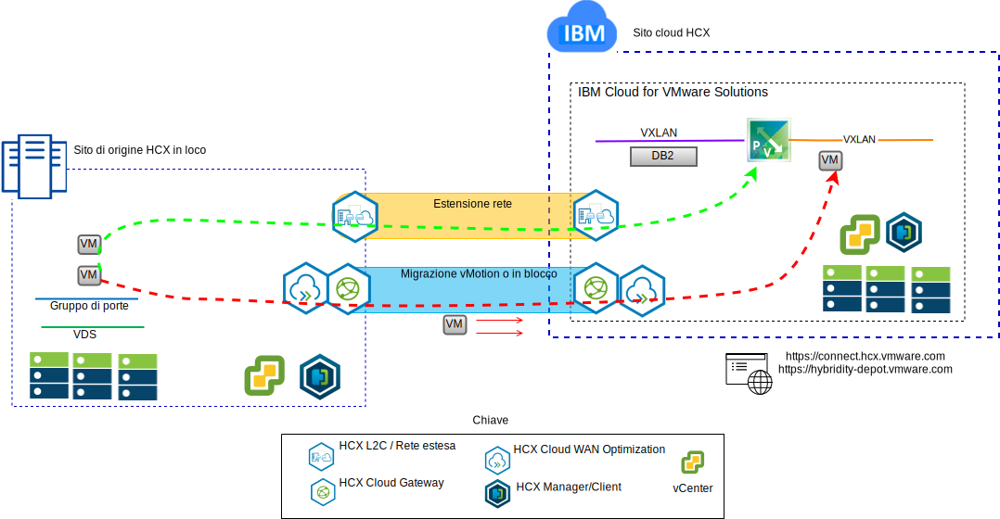
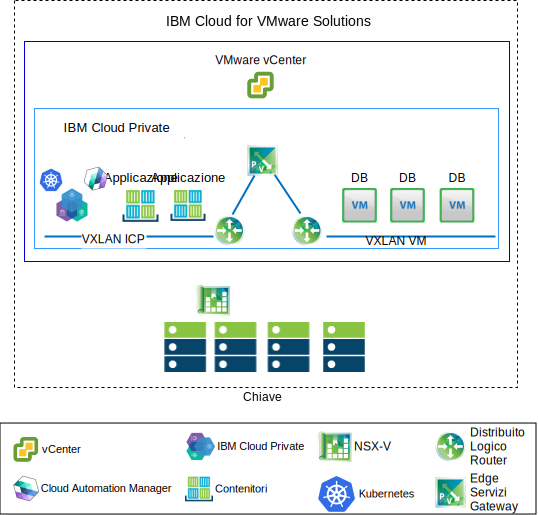

---

copyright:

  years:  2016, 2019

lastupdated: "2019-05-08"

subcollection: vmware-solutions

---

# Casi di utilizzo
{: #vcsnsxt-usecases}

## Migrazione del carico di lavoro VMware a IBM Cloud
{: #vcsnsxt-usecases-wkld-mig}

Quelli della Acme Skateboards vogliono estendere senza soluzione di continuità la loro istanza VMware SDDC in loco in un'istanza VMware vCenter Server on {{site.data.keyword.cloud}}. Devono mantenere il loro business operativo e ridurre al minimo il loro tempo di inattività. La riconfigurazione delle loro applicazioni per l'esecuzione nel cloud non è una soluzione ottimale.

VMware vCenter Server on {{site.data.keyword.cloud_notm}} with Hybridity Bundle consente la creazione di una
connessione trasparente tra le istanze vCenter Server e un
data center virtualizzato VMware installato in loco.

I componenti VMware HCX, che vengono distribuiti come VM (Virtual Machine) nel sito di destinazione vCenter Server, consentono di stabilire una connessione con i componenti VMware HCX installati nel sito di origine in loco del peer.

L'interconnettività debolmente accoppiata tra locale e {{site.data.keyword.cloud_notm}} abilita funzionalità quali:
- **Interconnettività semplice** – le connessioni di rete logiche vengono stabilite facilmente su qualsiasi connessione fisica che include Internet pubblico, VPN privata o direct link.
- **Estensione di livello 2** - le reti in loco sono estese nel cloud che include le sottoreti locali e l'indirizzamento IP.
- **Crittografia** - il traffico di rete viene crittografato in modo sicuro tra i due siti.
- **Rete ottimizzata** – seleziona la connessione migliore e riempie in modo efficace la connessione in modo che il traffico di rete venga spostato il più velocemente possibile.
- **Deduplicazione dei dati** - può essere raggiunta la riduzione del 50% del traffico di rete.
- **Instradamento intelligente** – quando un carico di lavoro viene spostato, l'instradamento di prossimità può modificare il percorso di rete (ossia il gateway) in modo che il traffico di rete utilizzi il gateway del sito di destinazione e non “torni” al sito di origine.
- **Migrazione senza tempo di inattività** - un sistema in esecuzione può essere spostato nel (o indietro dal) cloud utilizzando vMotion.
- **Migrazione pianificata** – qualsiasi numero di VM può essere replicato sul sito di destinazione e quindi attivato su tale sito in un momento designato, sostituendo i sistemi eseguiti sul sito di origine.
- **Migrazione delle politiche di sicurezza** - se viene utilizzato NSX in loco, tutte le politiche di sicurezza, i firewall e così via, vengono spostati insieme al carico di lavoro.

## Distribuzione architettura ibrida
{: #vcsnsxt-usecases-hybrid-archi-deployment}

Acme Skateboards vuole distribuire un'architettura ibrida su {{site.data.keyword.cloud_notm}} costituita da vCenter Server with Hybridity Bundle e {{site.data.keyword.icpfull_notm}} per il suo percorso verso la modernizzazione dell'applicazione. I suoi requisiti sono quelli di gestire i suoi database sulle VM, le applicazioni e le interfacce web in contenitori e possibilmente utilizzare una serie comune di strumenti per la gestione della rete e della sicurezza.

{{site.data.keyword.vmwaresolutions_short}} fornisce l'automazione per distribuire i componenti con tecnologia VMware nei {{site.data.keyword.CloudDataCents_notm}} in tutto il mondo. L'architettura consiste in una singola regione cloud e supporta la capacità di estensione in più regioni cloud che si trovano in un'altra area geografica o in un altro pod di {{site.data.keyword.cloud_notm}} all'interno dello stesso data center.

I prodotti {{site.data.keyword.icpfull_notm}} e CAM (Cloud Automation Manager) possono essere distribuiti manualmente nella tua piattaforma di virtualizzazione in loco, consentendo la gestione cloud dall'ubicazione in loco. In alternativa, {{site.data.keyword.icpfull_notm}} e CAM vengono offerti come un'estensione del servizio a una distribuzione vCenter Server nuova o esistente, consentendo la gestione cloud da {{site.data.keyword.cloud_notm}}.

Il seguente diagramma rappresenta {{site.data.keyword.icpfull_notm}} in esecuzione su un'istanza vCenter Server. NSX-V viene configurato con uno switch/VXLAN dedicato, un DLR (Distributed Logical Router) e un ESG (Edge Services Gateway) specificamente per la rete di sovrapposizione {{site.data.keyword.icpfull_notm}}. L'instradamento viene configurato tramite l'ESG per l'accesso alla rete sottostante.

Utilizzando l'automazione di {{site.data.keyword.cloud_notm}}, Acme Skateboards può eseguire il provisioning di una soluzione ibrida che comprende vCenter Server per eseguire le sue VM del database e {{site.data.keyword.icpfull_notm}} su vCenter Server per eseguire le sue applicazioni e i suoi servizi di web front-end nei contenitori. NSX fornisce loro una serie comune di strumenti di gestione per la rete e la sicurezza nella rete di sovrapposizione.

Per ulteriori informazioni su NSX-V, vedi [Panoramica di NSX-V](/docs/services/vmwaresolutions/archiref/vcsnsxt?topic=vmware-solutions-vcsnsxt-overview-ic4vnsxv). Per ulteriori informazioni sull'offerta vCenter Server e {{site.data.keyword.icpfull_notm}}, vedi [vCenter Server e {{site.data.keyword.cloud_notm}} Private](/docs/services/vmwaresolutions/archiref/vcsicp?topic=vmware-solutions-vcsicp-intro).

Questo crea una interconnettività debolmente accoppiata tra il locale e {{site.data.keyword.cloud_notm}} e abilita funzionalità come:
-	**Interconnettività semplice** – le connessioni di rete logiche vengono stabilite facilmente su qualsiasi connessione fisica, tra cui Internet pubblico, VPN privata o direct link.
-	**Estensione di livello 2** - le reti in loco sono estese nel cloud, incluse le sottoreti locali e l'indirizzamento IP.
-	**Crittografia** - il traffico di rete viene crittografato in modo sicuro tra i due siti.
-	**Rete ottimizzata** – seleziona la connessione migliore e riempie in modo efficace la connessione in modo che il traffico di rete venga spostato il più velocemente possibile.
-	**Deduplicazione dei dati** - può essere raggiunta la riduzione del 50% del traffico di rete.
-	**Instradamento intelligente** - quando un carico di lavoro viene spostato, l'instradamento di prossimità può modificare il percorso di rete (ossia il gateway) in modo che il traffico di rete utilizzi il gateway del sito di destinazione e non “torni” al sito di origine.
-	**Migrazione senza tempo di inattività** - un sistema in esecuzione può essere spostato nel (o indietro dal) cloud utilizzando vMotion.
-	**Migrazione pianificata** - qualsiasi numero di VM può essere replicato sul sito di destinazione e poi attivato su quel sito in un momento designato sostituendo i sistemi in esecuzione sul sito di origine.
-	**Migrazione delle politiche di sicurezza** - se viene utilizzato NSX in loco, tutte le politiche di sicurezza, i firewall e così via, vengono spostati insieme al carico di lavoro.

Utilizzando questa soluzione, Acme Skateboards è stato in grado di migrare correttamente i suoi carichi di lavoro VMware in loco a {{site.data.keyword.cloud_notm}} soddisfacendo i suoi requisiti di poco o zero tempo di inattività e senza alcuna riconfigurazione dell'applicazione. Per ulteriori informazioni su vCenter Server with Hybridity Bundle, vedi [Architettura della soluzione VMware HCX on {{site.data.keyword.cloud_notm}}](/docs/services/vmwaresolutions/services?topic=vmware-solutions-hcx-archi-intro#hcx-archi-intro).

## Link correlati
{: #vcsnsxt-usecases-related}

* [Panoramica di vCenter Server on {{site.data.keyword.cloud_notm}} with Hybridity Bundle](/docs/services/vmwaresolutions/archiref/vcs?topic=vmware-solutions-vcs-hybridity-intro)
