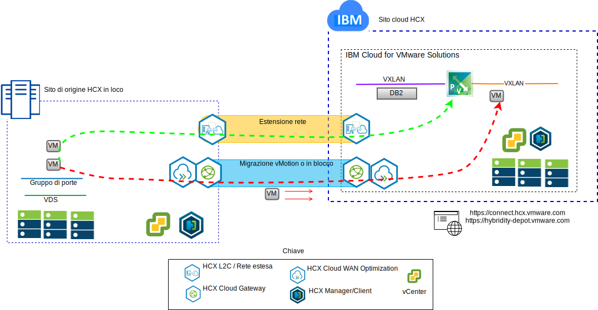
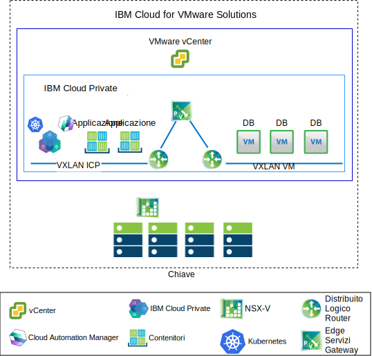

---

copyright:

  years:  2016, 2018

lastupdated: "2018-11-01"

---

# Casi di utilizzo

## Migrazione del carico di lavoro VMware a IBM Cloud

Quelli della Acme Skateboards vogliono estendere senza soluzione di continuità la loro istanza VMware SDDC in loco in una istanza VCS su {{site.data.keyword.cloud}}. Devono mantenere il loro business operativo e ridurre al minimo il loro tempo di inattività. La riconfigurazione delle loro applicazioni per l'esecuzione nel cloud non è una soluzione ottimale.

{{site.data.keyword.cloud_notm}} vCenter Server con Hybridity Bundle consente la creazione di una connessione senza soluzione di continuità tra le istanze VCS e un datacenter virtualizzato VMware in loco.

I componenti VMware HCX, che vengono distribuiti come macchine virtuali (VM, virtual machine), nel sito di destinazione VCS abilitano lo stabilimento di una connessione con i componenti VMware HCX installati nel sito di origine in loco peer.

Figura 1. Servizio VMware Hybrid Cloud Extension

L'interconnettività debolmente accoppiata tra locale e {{site.data.keyword.cloud_notm}} abilita funzionalità quali:
-	**Interconnettività semplice** – le connessioni di rete logiche vengono stabilite facilmente su qualsiasi connessione fisica, tra cui Internet pubblica, VPN privata o collegamento diretto.
-	**Estensione di livello 2** - le reti in loco sono estese nel cloud, incluse le sottoreti locali e l'indirizzamento IP.
-	**Crittografia** - il traffico di rete viene crittografato in modo sicuro tra i due siti.
-	**Rete ottimizzata** – seleziona la connessione migliore e riempie in modo efficace la connessione in modo che il traffico di rete venga spostato il più velocemente possibile.
-	**Deduplicazione dei dati** - può essere raggiunta la riduzione del 50% del traffico di rete.
-	**Instradamento intelligente** - quando un carico di lavoro viene spostato, l'instradamento di prossimità può modificare il percorso di rete (ossia il gateway) in modo che il traffico di rete utilizzi il gateway del sito di destinazione e non “torni” al sito di origine.
-	**Migrazione senza tempo di inattività** - un sistema in esecuzione può essere spostato nel (o indietro dal) cloud utilizzando vMotion.
-	**Migrazione pianificata** - qualsiasi numero di VM può essere replicato sul sito di destinazione e poi attivato su quel sito in un momento designato sostituendo i sistemi in esecuzione sul sito di origine.
-	**Migrazione delle politiche di sicurezza** - se viene utilizzato NSX in loco, tutte le politiche di sicurezza, i firewall e così via, vengono spostati insieme al carico di lavoro.

## Distribuzione architettura ibrida

Acme Skateboards vuole distribuire un'architettura ibrida su {{site.data.keyword.cloud_notm}} costituita da VCS (vCenter Server) with Hybridity Bundle e ICP ({{site.data.keyword.cloud_notm}} Private) per il suo percorso verso la modernizzazione dell'applicazione. I suoi requisiti sono quelli di gestire i suoi database sulle VM, le applicazioni e le interfacce web in contenitori e possibilmente utilizzare una serie comune di strumenti per la gestione della rete e della sicurezza.

{{site.data.keyword.vmwaresolutions_short}} fornisce l'automazione per distribuire i componenti con tecnologia VMware nei {{site.data.keyword.CloudDataCents_notm}} in tutto il mondo.L'architettura consiste in una singola regione cloud e supporta la capacità di estensione in più regioni cloud che si trovano in un'altra area geografica e/o in un altro pod di {{site.data.keyword.cloud_notm}} all'interno dello stesso data center.

I prodotti ICP e CAM (Cloud Automation Manager) possono essere distribuiti manualmente nella tua piattaforma di virtualizzazione in loco, abilitando la gestione cloud dall'ubicazione in loco. In alternativa, ICP e CAM vengono offerti come un'estensione del servizio a una distribuzione VCS nuova o esistente, abilitando la gestione cloud da {{site.data.keyword.cloud_notm}}.

Il seguente diagramma rappresenta ICP in esecuzione su un'istanza VCS. NSX-V è configurato con uno switch/VXLAN dedicato, DLR (Distributed Logical Router) e un ESG (Edge Services Gateway) specificamente per la rete di sovrapposizione ICP. L'instradamento viene configurato tramite l'ESG per l'accesso alla rete sottostante.

Utilizzando l'automazione di {{site.data.keyword.cloud_notm}}, Acme Skateboards può eseguire il provisioning di una soluzione ibrida che comprende VCS per eseguire le sue VM del database e ICP su VCS per eseguire le sue applicazioni e i suoi servizi web front-end in contenitori. NSX fornisce loro una serie comune di strumenti di gestione per la rete e la sicurezza nella rete di sovrapposizione.

Per ulteriori informazioni su NSX-V, vedi [Panoramica di NSX-V](vcsnsxt-overview-ic4vnsxv.html). Per ulteriori informazioni sull'offerta VCS e ICP, vedi [vCenter Server e {{site.data.keyword.cloud_notm}} Private](../vcsicp/vcsicp-intro.html).

Figura 2. VCS con ICP

Questo crea una interconnettività debolmente accoppiata tra il locale e {{site.data.keyword.cloud_notm}} e abilita funzionalità come:
-	**Interconnettività semplice** – le connessioni di rete logiche vengono stabilite facilmente su qualsiasi connessione fisica, tra cui Internet pubblica, VPN privata o collegamento diretto.
-	**Estensione di livello 2** - le reti in loco sono estese nel cloud, incluse le sottoreti locali e l'indirizzamento IP.
-	**Crittografia** - il traffico di rete viene crittografato in modo sicuro tra i due siti.
-	**Rete ottimizzata** – seleziona la connessione migliore e riempie in modo efficace la connessione in modo che il traffico di rete venga spostato il più velocemente possibile.
-	**Deduplicazione dei dati** - può essere raggiunta la riduzione del 50% del traffico di rete.
-	**Instradamento intelligente** - quando un carico di lavoro viene spostato, l'instradamento di prossimità può modificare il percorso di rete (ossia il gateway) in modo che il traffico di rete utilizzi il gateway del sito di destinazione e non “torni” al sito di origine.
-	**Migrazione senza tempo di inattività** - un sistema in esecuzione può essere spostato nel (o indietro dal) cloud utilizzando vMotion.
-	**Migrazione pianificata** - qualsiasi numero di VM può essere replicato sul sito di destinazione e poi attivato su quel sito in un momento designato sostituendo i sistemi in esecuzione sul sito di origine.
-	**Migrazione delle politiche di sicurezza** - se viene utilizzato NSX in loco, tutte le politiche di sicurezza, i firewall e così via, vengono spostati insieme al carico di lavoro.

Utilizzando questa soluzione, Acme Skateboards è stato in grado di migrare correttamente i suoi carichi di lavoro VMware in loco a {{site.data.keyword.cloud_notm}} soddisfacendo i suoi requisiti di poco o zero tempo di inattività e senza alcuna riconfigurazione dell'applicazione. Per ulteriori informazioni su vCenter Server with Hybridity Bundle, vedi [Architettura della soluzione VMware HCX on {{site.data.keyword.cloud_notm}}](https://www.ibm.com/cloud/garage/files/HCX_Architecture_Design.pdf).

### Link correlati 

* [Panoramica di VCS Hybridity Bundle](../vcs/vcs-hybridity-intro.html)
