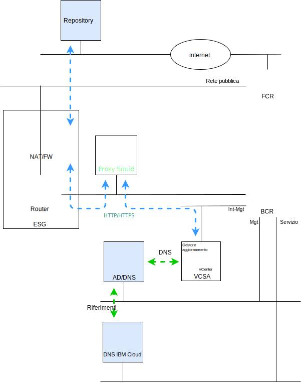

---

copyright:

  years:  2016, 2018

lastupdated: "2018-11-07"

---

# Introduzione a VMware Update Manager

Lo scopo di questo documento è quello di fornirti, in qualità di amministratore dell'istanza vCenter Server di {{site.data.keyword.vmwaresolutions_full}}, le istruzioni su come configurare VMware Update Manager (VUM) per mantenere la conformità del tuo ambiente vCenter Server.

VUM consente la gestione centralizzata e automatizzata delle patch e delle versioni per VMware vSphere e ti consente di effettuare le seguenti attività nel tuo ambiente Mware vCenter Server on {{site.data.keyword.cloud_notm}}:
* Aggiornare e applicare patch agli host vSphere ESXi.
* Installare e aggiornare software di terze parti sugli host.
* Aggiornare l'hardware delle macchine virtuali, i VMware Tools e i dispositivi virtuali.

Questo documento descrive anche i processi per conservare i seguenti componenti della tua istanza vCenter Server:
* vCenter Server Appliance
* NSX
* vSAN

Questo documento descrive l'utilizzo di un'implementazione del server proxy, basata su CentOS e Squid, per consentire a VUM di accedere ai repository VMware. Quando VUM richiede una risorsa dal server di aggiornamento su VMware, la richiesta viene prima inviata al server proxy e il server proxy invia quindi la richiesta al server di aggiornamento tramite il gateway dei servizi esterno (ESG). Una volta che il server proxy ottiene la risorsa, la invia a VUM.

Figura 1. Diagramma della panoramica

vCenter Server attualmente distribuisce vSphere 6.5, il che significa che VUM è ora integrato all'interno di vCenter Server Appliance (VCSA) e, poiché il componente client VUM è un plug-in che viene eseguito sul client web vSphere, viene automaticamente abilitato dopo la distribuzione di VCSA. Tuttavia, VUM non avrà accesso a internet per accedere ai repository VMware.

Questa configurazione documentata utilizza il modello di distribuzione VUM connesso a Internet “all-in-one”, che utilizza la rete pubblica di {{site.data.keyword.cloud_notm}} per fornire l'accesso a internet per scaricare aggiornamenti e patch.

I client che richiedono l'uso di connessioni internet alternative devono esaminare il servizio di download VMware vSphere Update Manager (UMDS), che va oltre l'ambito di questa pubblicazione.

Anche se VUM può essere configurato per importare gli aggiornamenti da un repository condiviso o per importare patch ed estensioni manualmente da un file .zip, tali argomenti non vengono discussi in questo documento.

Pertanto, nota che in vSphere 6.5 non è più supportato registrare VUM su un VCSA durante l'installazione del server VUM su una macchina Windows separata e non puoi distribuire VUM in una VM all'interno dell'ambiente vCenter Server.

Questo documento è suddiviso nelle seguenti sezioni:
* [Panoramica di VMware Update Manager](vum-overview.html) - Questa sezione descrive il processo VUM e introduce i termini chiave necessari per comprendere le operazioni e l'interfaccia utente dello strumento.
* **Installazione, configurazione e utilizzo** - Questa sezione descrive i passi necessari per far funzionare VUM in un'istanza vCenter Server:
  - [Configurazione iniziale](vum-init-config.html) - Un'attività unica per:
      - Configurare la rete NSX per consentire al server proxy di accedere a internet
      - Installare e configurare un server proxy per l'accesso a internet per VUM.
      - La configurazione iniziale di VUM per utilizzare il server proxy.
  - [Raccolta di metadati](vum-metadata.html) - VUM scarica i metadati relativi ad aggiornamenti, patch o estensioni tramite un processo automatico predefinito che puoi modificare. A intervalli regolari configurabili, VUM contatta VMware o fonti di terze parti per raccogliere i metadati più recenti relativi ad aggiornamenti, patch o estensioni disponibili.
  - [Creazione di baseline](vum-baselines.html) - Utilizza le baseline e i gruppi di baseline predefiniti o crea quelli personalizzati. Le baseline e i gruppi di baseline vengono quindi collegati agli oggetti di inventario.
  - [Scansione e revisione](vum-scanning.html) - Gli oggetti di inventario vengono sottoposti a scansione e i risultati vengono esaminati per determinare la loro conformità alle baseline e ai gruppi di baseline. I risultati della scansione possono essere filtrati mediante ricerca di testo, selezione del gruppo, selezione della baseline e selezione dello stato di conformità.
  - [Preparazione e correzione](vum-staging.html) - Le patch e le estensioni possono essere facoltativamente preparate prima della correzione per garantire che vengano scaricate sull'host. Durante la correzione, VUM applica le patch, le estensioni e gli aggiornamenti agli oggetti di inventario.

In questo documento si presuppone che tu abbia distribuito un'istanza vCenter Server primaria o una serie di istanze vCenter Server primarie separate. Se hai distribuito istanze vCenter Server primarie e secondarie e utilizzi quindi SSO (Single Sign On), vedi [vCenter collegati a SSO](vum-updating-vcsa.html).

Se hai distribuito un vCenter Server che utilizza vSAN, vedi prima [Aggiornamento dei cluster vSAN](vum-updating-vsan.html).

Se vuoi aggiornare l'automazione della gestione dell'infrastruttura {{site.data.keyword.cloud_notm}}, utilizza la console {{site.data.keyword.vmwaresolutions_short}}.

La [Console {{site.data.keyword.vmwaresolutions_short}}](https://console.bluemix.net/infrastructure/vmware-solutions/console) ti consente di portare a termine le seguenti azioni:
*	Aggiornare le licenze, ad esempio aggiornare NSX Base a un'altra versione
*	Avviare gli aggiornamenti alla piattaforma vCenter Server, ad esempio, passare alla versione 2.5
*	Visualizzare lo stato degli aggiornamenti
*	Visualizzare gli aggiornamenti installati

Questa funzione consente l'aggiornamento automatizzato solo per i componenti di gestione delle istanze vCenter Server. Gli aggiornamenti dei prodotti VMware devono essere applicati utilizzando le procedure descritte in questo documento.

### Link correlati

* [VMware HCX on {{site.data.keyword.cloud_notm}} Solution Architecture](https://www.ibm.com/cloud/garage/files/HCX_Architecture_Design.pdf)
* [VMware Solutions on {{site.data.keyword.cloud_notm}} Digital Technical Engagement](https://ibm-dte.mybluemix.net/ibm-vmware) (Demo)
